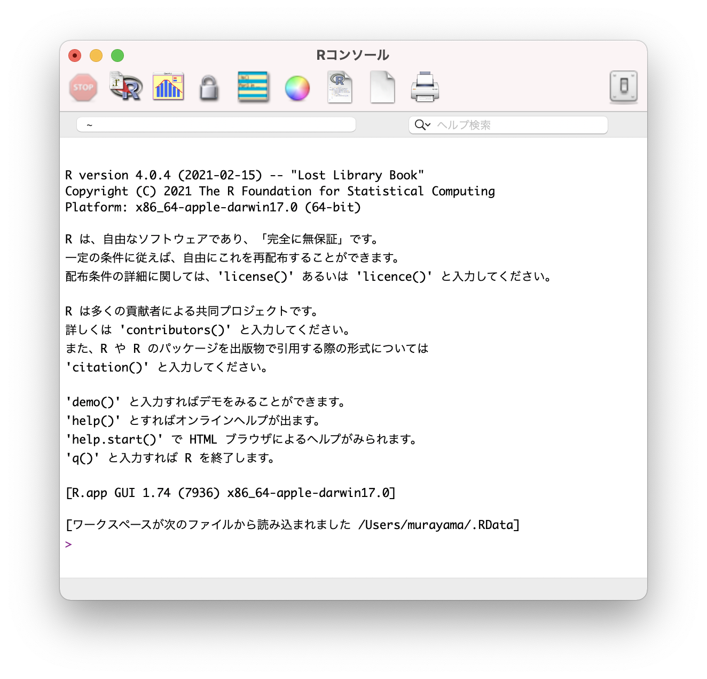
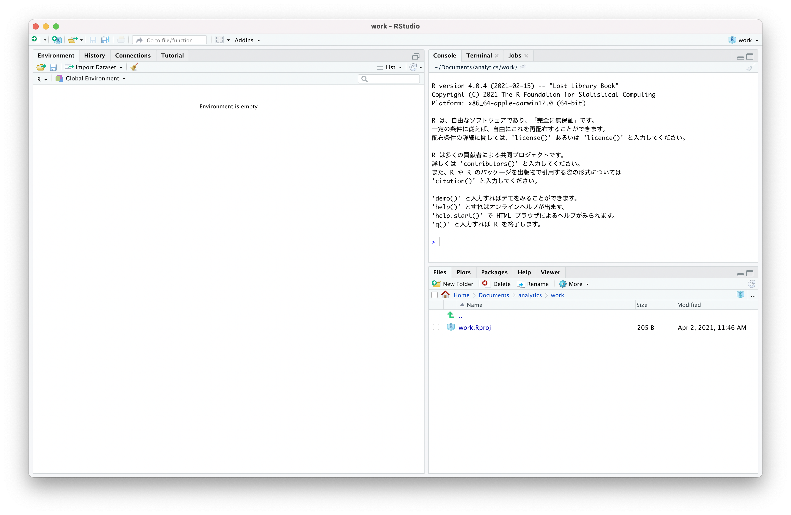

# Rプログラミング

## R

https://www.r-project.org/

* 統計計算とグラフィックスのためのソフトウェア環境
* UNIX、Windows、Macなど様々なプラットフォームで動作する
* 2021-04現在、Rバージョン4.1.3がリリースされている

> Rのインストールが完了するとRコンソールを起動してプログラミングできます。

## RStudio

https://www.rstudio.com/products/rstudio/

* Rの統合開発環境（IDE：Integdated Development Environment）
* コンソールに加えて、実行可能なエディター、グラフの描画、履歴管理、デバッグ、ワークスペース等の機能がある
* オープンソース版と商用版がある

> RStudio Cloud というクラウド上でのRStudioの実行環境も開発されています。 https://rstudio.cloud/

## CRAN

https://cran.r-project.org/mirrors.html

* The Comprehensive R Archive Network（包括的なRアーカイブネットワーク）
* Rやパッケージ（ライブラリ）の配布ネットワーク
* 世界中にミラーサイトがある
