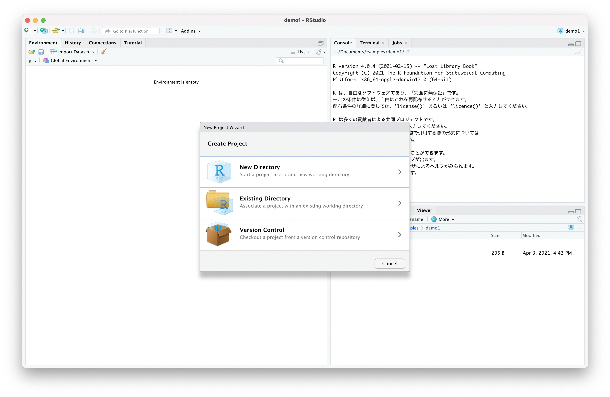
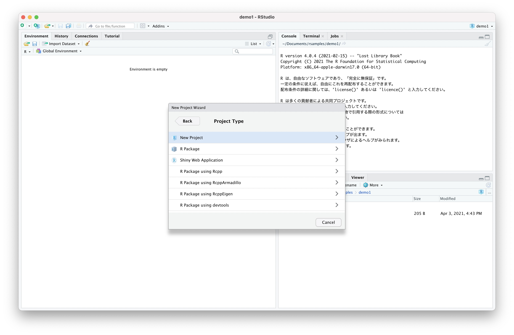
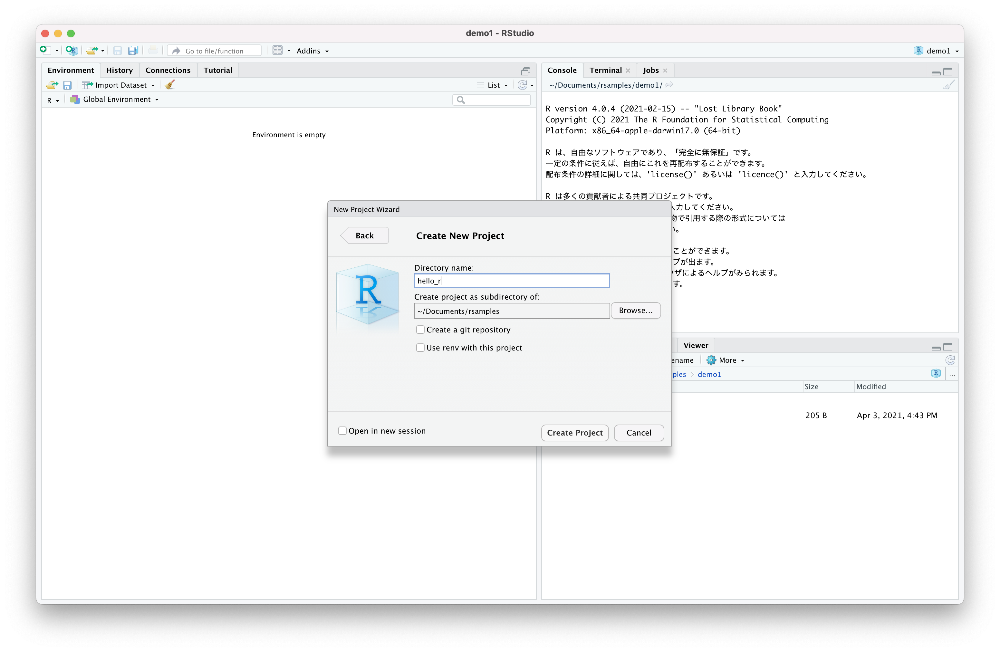
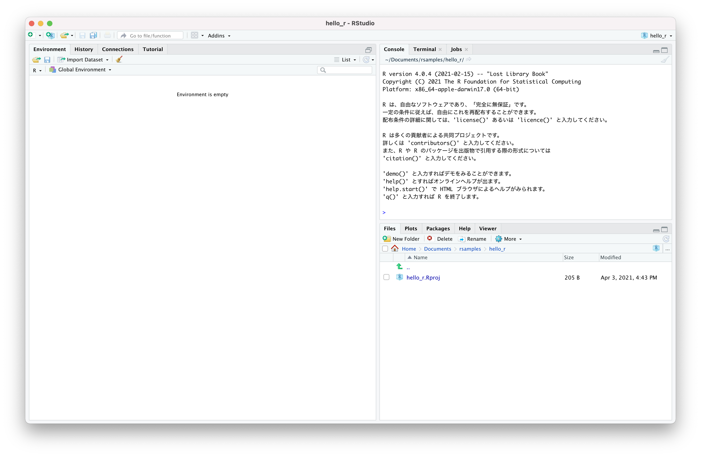
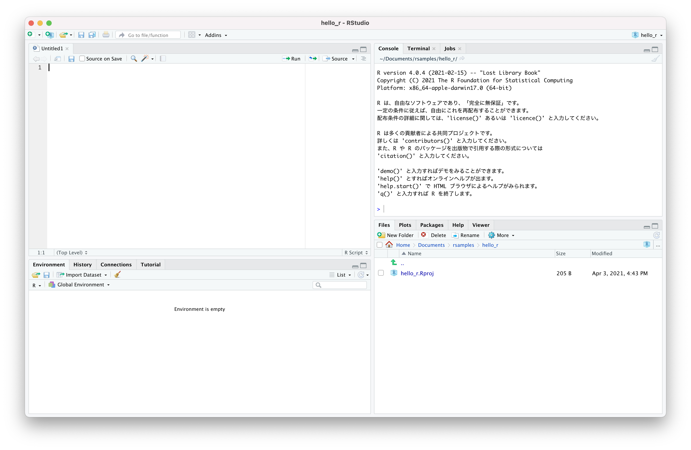
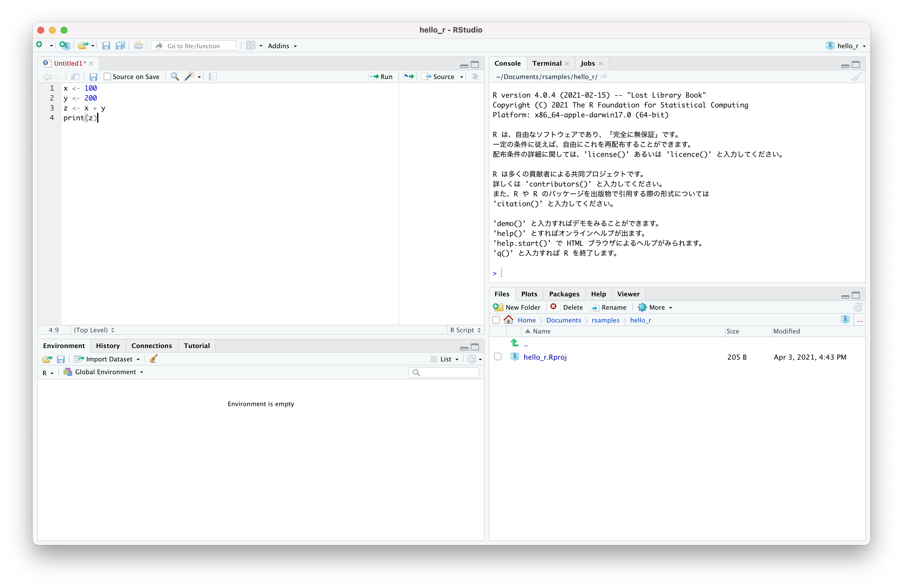
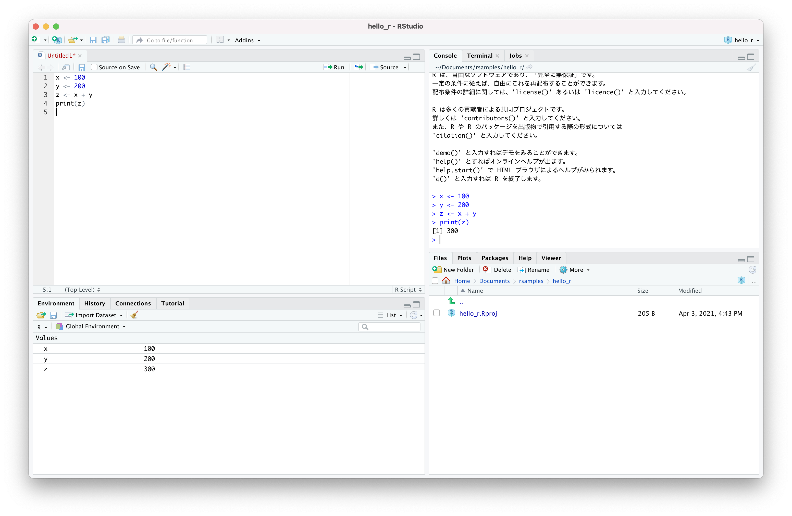

# RStudio

## プロジェクトの作成とRスクリプトの実行

RStudion上でRスクリプトを実行するには以下の手順で作業する。

1. プロジェクトの作成
2. Rスクリプトファイルの作成
3. Rスクリプトの実行


### 1. プロジェクトの作成

+ メニューの「File」から「New Project」を選択すると「New Project Wizard」画面が表示されるので「New Directory」を選択する



+ 「Project Type」画面が表示されるので「New Project」を選択する



+ 「Create New Project」画面が表示されるので「Directory name」を入力して「Create Project」ボタンをクリックする



+ RStudionが再起動される




### 2. Rスクリプトファイルの作成

+ メニューの「File」から「New File」、「R Script」を選択するとRStudioにエディタが表示される



> ファイルは保存されていないのでファイル名は"Untitled1" となっています。

+ エディタにRプログラムを記述する

```r
x <- 100
y <- 200
z <- x + y
print(z)
```



### 3. Rスクリプトの実行

+ エディタの1行目にカーソルを移動する
+ ctrl + enter キーを押して該当行のRプログラムを実行する
+ カーソルが1行進むので、繰り返しctrl + enter キーを押して該当行のRプログラムを実行する



> RStudioの画面右上にある「Console」ビューに実行結果が表示されます。また、RStudionの画面左下にある「Environment」ビューに変数の内容が表示されます。