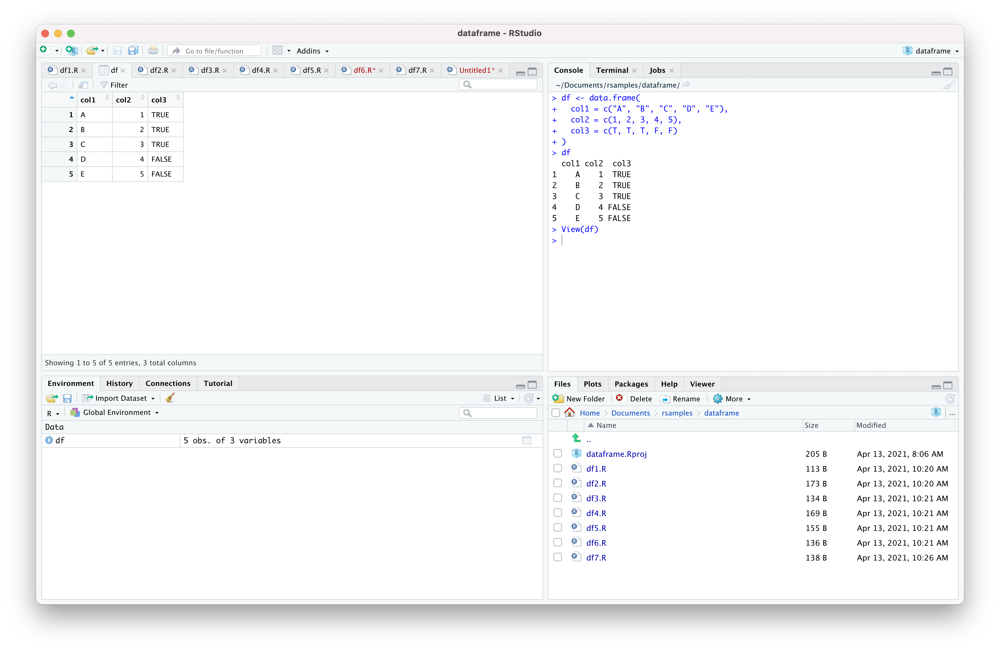

# データフレームの操作

## データフレーム（data.frame）の生成

* データフレームは行列のような2次元のデータ構造
* 行列（Matrix）とは異なり、列ごとに個別のデータ型を利用できる
* RStudio上でデータフレームをExcelのように可視化できる

### `df1.R`

``` r
df <- data.frame(
  col1 = c("A", "B", "C", "D", "E"),
  col2 = c(1, 2, 3, 4, 5),
  col3 = c(T, T, T, F, F)
)
df
```

### 実行結果

``` r
> df <- data.frame(
+   col1 = c("A", "B", "C", "D", "E"),
+   col2 = c(1, 2, 3, 4, 5),
+   col3 = c(T, T, T, F, F)
+ )
> df
  col1 col2  col3
1    A    1  TRUE
2    B    2  TRUE
3    C    3  TRUE
4    D    4 FALSE
5    E    5 FALSE
```

### 参考：データフレームの表示



> RStudioのEnvironmentビューからデータフレームの変数（この場合 `df`）をクリックするとデータフレームのビューワが表示されます。

---

## データフレームの操作

* データフレームも行列と同様に行番号、列番号で必要なデータにアクセスできる

### `df2.R`

``` r
df <- data.frame(
  col1 = c("A", "B", "C", "D", "E"),
  col2 = c(1, 2, 3, 4, 5),
  col3 = c(T, T, T, F, F)
)
df[1, 1]
df[1, ]
df[1:3, ]
df[-2, ]
df[, 1]
df[, 1:3]
df[, -2]
```

### 実行結果

``` r
> df <- data.frame(
+   col1 = c("A", "B", "C", "D", "E"),
+   col2 = c(1, 2, 3, 4, 5),
+   col3 = c(T, T, T, F, F)
+ )
> df[1, 1]
[1] "A"
> df[1, ]
  col1 col2 col3
1    A    1 TRUE
> df[1:3, ]
  col1 col2 col3
1    A    1 TRUE
2    B    2 TRUE
3    C    3 TRUE
> df[-2, ]
  col1 col2  col3
1    A    1  TRUE
3    C    3  TRUE
4    D    4 FALSE
5    E    5 FALSE
> df[, 1]
[1] "A" "B" "C" "D" "E"
> df[, 1:3]
  col1 col2  col3
1    A    1  TRUE
2    B    2  TRUE
3    C    3  TRUE
4    D    4 FALSE
5    E    5 FALSE
> df[, -2]
  col1  col3
1    A  TRUE
2    B  TRUE
3    C  TRUE
4    D FALSE
5    E FALSE
```

---

## データフレームの操作 - 列名による指定

* データフレームを格納している変数名に `$` 記号を付与して列名を指定できる

### `df3.R`

``` r
df <- data.frame(
  col1 = c("A", "B", "C", "D", "E"),
  col2 = c(1, 2, 3, 4, 5),
  col3 = c(T, T, T, F, F)
)
df$col1
df$col2
df$col3
```

### 実行結果

``` r
> df <- data.frame(
+   col1 = c("A", "B", "C", "D", "E"),
+   col2 = c(1, 2, 3, 4, 5),
+   col3 = c(T, T, T, F, F)
+ )
> df$col1
[1] "A" "B" "C" "D" "E"
> df$col2
[1] 1 2 3 4 5
> df$col3
[1]  TRUE  TRUE  TRUE FALSE FALSE
```

---

## データフレームの操作 - 列名による検索

* データフレームの列名を使ってデータの検索ができる

### `df4.R`

``` r
df <- data.frame(
  col1 = c("A", "B", "C", "D", "E"),
  col2 = c(1, 2, 3, 4, 5),
  col3 = c(T, T, T, F, F)
)
df[df$col1 == "A", ]
df[df$col2 >= 3, ]
df[df$col3 == F, ]
```

### 実行結果

``` r
> df <- data.frame(
+   col1 = c("A", "B", "C", "D", "E"),
+   col2 = c(1, 2, 3, 4, 5),
+   col3 = c(T, T, T, F, F)
+ )
> df[df$col1 == "A", ]
  col1 col2 col3
1    A    1 TRUE
> df[df$col2 >= 3, ]
  col1 col2  col3
3    C    3  TRUE
4    D    4 FALSE
5    E    5 FALSE
> df[df$col3 == F, ]
  col1 col2  col3
4    D    4 FALSE
5    E    5 FALSE
```

> `&` や `|` のような論理演算子を使って条件式を定義することもできます。

---

## データフレームの定義情報の取得

* `nrow` 関数や `ncol` 関数によってデータフレームの行数、列数を取得できる
* `dim` 関数でデータフレームの行数と列数を取得できる
* `str` 関数はデータフレームの定義情報を取得できる

### `df5.R`

``` r
df <- data.frame(
  col1 = c("A", "B", "C", "D", "E"),
  col2 = c(1, 2, 3, 4, 5),
  col3 = c(T, T, T, F, F)
)
nrow(df)
ncol(df)
dim(df)
str(df)
```

### 実行結果

``` r
> df <- data.frame(
+   col1 = c("A", "B", "C", "D", "E"),
+   col2 = c(1, 2, 3, 4, 5),
+   col3 = c(T, T, T, F, F)
+ )
> nrow(df)
[1] 5
> ncol(df)
[1] 3
> dim(df)
[1] 5 3
> str(df)
'data.frame':	5 obs. of  3 variables:
 $ col1: chr  "A" "B" "C" "D" ...
 $ col2: num  1 2 3 4 5
 $ col3: logi  TRUE TRUE TRUE FALSE FALSE
```

> `str` 関数はオブジェクトの構造（structure）を出力します。

---

## データフレームのラベル付け

* 行列と同様にデータフレームにもラベルを定義できる
* `rownames` 関数で行ラベルを付与できる
* `colnames` 関数で列ラベルを付与できる

### `df6.R`

``` r
df <- data.frame(
  col1 = c("A", "B", "C", "D", "E"),
  col2 = c(1, 2, 3, 4, 5),
  col3 = c(T, T, T, F, F)
)
rownames(df) <- c("r1", "r2", "r3", "r4", "r5")
colnames(df) <- c("c1", "c2", "c3")
df
```

### 実行結果

``` r
> df <- data.frame(
+   col1 = c("A", "B", "C", "D", "E"),
+   col2 = c(1, 2, 3, 4, 5),
+   col3 = c(T, T, T, F, F)
+ )
> rownames(df) <- c("r1", "r2", "r3", "r4", "r5")
> colnames(df) <- c("c1", "c2", "c3")
> df
   c1 c2    c3
r1  A  1  TRUE
r2  B  2  TRUE
r3  C  3  TRUE
r4  D  4 FALSE
r5  E  5 FALSE
```

---

## データフレームの連結

* `rbind` 関数で2つのデータフレームを行方向（横）に連結できる
* `cbind` 関数で2つのデータフレームを列方向（縦）に連結できる

### `df7.R`

``` r
df <- data.frame(
  col1 = c("A", "B", "C", "D", "E"),
  col2 = c(1, 2, 3, 4, 5),
  col3 = c(T, T, T, F, F)
)
rbind(df, df)
cbind(df, df)
```

### 実行結果

``` r
> df <- data.frame(
+   col1 = c("A", "B", "C", "D", "E"),
+   col2 = c(1, 2, 3, 4, 5),
+   col3 = c(T, T, T, F, F)
+ )
> rbind(df, df)
   col1 col2  col3
1     A    1  TRUE
2     B    2  TRUE
3     C    3  TRUE
4     D    4 FALSE
5     E    5 FALSE
6     A    1  TRUE
7     B    2  TRUE
8     C    3  TRUE
9     D    4 FALSE
10    E    5 FALSE
> cbind(df, df)
  col1 col2  col3 col1 col2  col3
1    A    1  TRUE    A    1  TRUE
2    B    2  TRUE    B    2  TRUE
3    C    3  TRUE    C    3  TRUE
4    D    4 FALSE    D    4 FALSE
5    E    5 FALSE    E    5 FALSE
```

---

## CSVファイルへの書き込み

* データフレームからCSVファイルを生成するには `write.csv` 関数を使う
* `write.csv` 関数は `row.names` 引数によって行名の出力を制御できる
* `write.csv` 関数は `quote` 引数によってダブルクォーテーションを出力を制御できる

### `df8.R`

``` r
df <- data.frame(
  col1 = c("A", "B", "C", "D", "E"),
  col2 = c(1, 2, 3, 4, 5),
  col3 = c(T, T, T, F, F)
)
write.csv(df, "sample.csv", row.names = F)
```

### 実行結果

``` r
> df <- data.frame(
+   col1 = c("A", "B", "C", "D", "E"),
+   col2 = c(1, 2, 3, 4, 5),
+   col3 = c(T, T, T, F, F)
+ )
> write.csv(df, "sample.csv", row.names = F)
```

> `sample.csv` ファイルが生成されます。

#### sample.csv

```csv
"col1","col2","col3"
"A",1,TRUE
"B",2,TRUE
"C",3,TRUE
"D",4,FALSE
"E",5,FALSE
```

---

## CSVファイルの読み込み

* CSVファイルからデータフレームを生成するには `read.csv` 関数を使う

### `sample.csv`

``` csv
"col1","col2","col3"
"A",1,TRUE
"B",2,TRUE
"C",3,TRUE
"D",4,FALSE
"E",5,FALSE
```

> 上記の `sample.csv` ファイルが作業フォルダ（RStudioで参照しているフォルダ）に存在するものとします。

### `df9.R`

``` r
df <- read.csv("sample.csv")
df
```

### 実行結果

``` r
> df <- read.csv("sample.csv")
> df
  col1 col2  col3
1    A    1  TRUE
2    B    2  TRUE
3    C    3  TRUE
4    D    4 FALSE
5    E    5 FALSE
```

---

