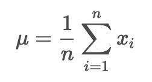

# 1変数データの要約 - 平均値、中央値、最頻値

* データ（1つの変数）を要約するにはグラフ化する方法と代表値（統計量）で表す方法の2つがある
* 代表値には平均値、中央値、最頻値などを用いることができる
* 後述する分散や標準偏差、四分位範囲といったデータのばらつきを表す量を散布度と呼ぶ

> データをグラフ化する方法は後述します。ここでは平均値、中央値、最頻値について学習します。

---

## 平均値 - mean

* データの合計を個数で割ったもの



> `μ`はミューと読みます。`Σ` はシグマと読みます。

## 中央値 - median

* データを小さいもの（大きいもの）から順に並べたときの中央の値
* データの個数が偶数の場合は、中央値が2つになるため、2つの値の平均値を使う

> 平均値は外れ値の影響を受けます。そのような場合は中央値を確認してみると良いでしょう。

## 最頻値 - mode

* データの出現回数の最も多いもの

> 一般的に質的データは平均値を求めることができません。そのため最頻値や出現回数（度数）、割合（相対度数）をデータの要約として利用します。

---

## （例） 20人の中間テスト結果 - 平均値、中央値、最頻値

``` 
84, 72, 86, 76, 68, 68, 72, 66, 78, 84, 74, 60, 86, 76, 74, 76, 70, 82, 76, 78
```

### 平均値

```
1506 / 20
75.3
```

### 中央値

```
60 66 68 68 70 72 72 74 74 76 76 76 76 78 78 82 84 84 86 86
                             ↑
76
```

### 最頻値

```
60 66 68 70 72 74 76 78 82 84 86 
 1  1  2  1  2  2  4  2  1  2  2 
                   ↑
76
```


---

## Rプログラミング

### `sum` 関数 - st1.R

* ベクトルの合計を求める 

```r
score <- c(84, 72, 86, 76, 68, 68, 72, 66, 78, 84, 74, 60, 86, 76, 74, 76, 70, 82, 76, 78)
sum(score)
```

#### 実行結果

```r
> score <- c(84, 72, 86, 76, 68, 68, 72, 66, 78, 84, 74, 60, 86, 76, 74, 76, 70, 82, 76, 78)
> sum(score)
[1] 1506
```

### `length` 関数 - st2.R

* ベクトルの要素数を求める 

```r
score <- c(84, 72, 86, 76, 68, 68, 72, 66, 78, 84, 74, 60, 86, 76, 74, 76, 70, 82, 76, 78)
length(score)
```

#### 実行結果

```r
> score <- c(84, 72, 86, 76, 68, 68, 72, 66, 78, 84, 74, 60, 86, 76, 74, 76, 70, 82, 76, 78)
> length(score)
[1] 20
```

### `mean` 関数 - st3.R

* ベクトルの平均を求める 

```r
score <- c(84, 72, 86, 76, 68, 68, 72, 66, 78, 84, 74, 60, 86, 76, 74, 76, 70, 82, 76, 78)
mean(score)
# sum(score) / length(score)
```

#### 実行結果

```r
> score <- c(84, 72, 86, 76, 68, 68, 72, 66, 78, 84, 74, 60, 86, 76, 74, 76, 70, 82, 76, 78)
> mean(score)
[1] 75.3
```

### `sort` 関数 - st4.R

* ベクトルの要素をソートする

```r
score <- c(84, 72, 86, 76, 68, 68, 72, 66, 78, 84, 74, 60, 86, 76, 74, 76, 70, 82, 76, 78)
sort(score)
# sort(score, decreasing = T)
```

> `decreasing` 引数に `TRUE` を指定すると降順にソートできます。

#### 実行結果

```r
> score <- c(84, 72, 86, 76, 68, 68, 72, 66, 78, 84, 74, 60, 86, 76, 74, 76, 70, 82, 76, 78)
> sort(score)
 [1] 60 66 68 68 70 72 72 74 74 76 76 76 76 78 78 82 84 84 86 86
```


### `median` 関数 - st5.R

* ベクトルの中央値を求める

```r
score <- c(84, 72, 86, 76, 68, 68, 72, 66, 78, 84, 74, 60, 86, 76, 74, 76, 70, 82, 76, 78)
median(score)
```

#### 実行結果

```r
> score <- c(84, 72, 86, 76, 68, 68, 72, 66, 78, 84, 74, 60, 86, 76, 74, 76, 70, 82, 76, 78)
> median(score)
[1] 76
```

### `table` 関数 - st6.R

* クロス集計を行う
* データの出現回数をカウントできる

> クロス集計とは2つのカテゴリーのデータで度数を表したものです。詳細は後述します。

```r
score <- c(84, 72, 86, 76, 68, 68, 72, 66, 78, 84, 74, 60, 86, 76, 74, 76, 70, 82, 76, 78)
table(score)
```

#### 実行結果

```r
> table(score)
score
60 66 68 70 72 74 76 78 82 84 86 
 1  1  2  1  2  2  4  2  1  2  2 
 ```

### `which.max` 関数 - st7.R

* ベクトルの最大値のインデックス（要素番号）を返す

```r
score <- c(84, 72, 86, 76, 68, 68, 72, 66, 78, 84, 74, 60, 86, 76, 74, 76, 70, 82, 76, 78)
which.max(table(score))
# names(which.max(table(score)))
```

> `names` 関数でテーブルのラベルのみを表示すれば最頻値となります。

#### 実行結果

```r
> score <- c(84, 72, 86, 76, 68, 68, 72, 66, 78, 84, 74, 60, 86, 76, 74, 76, 70, 82, 76, 78)
> which.max(table(score))
76 
 7 
```

---

## エクササイズ

1. 以下の学籍データをcsvファイル（student.csv）に変換してください。

| 学籍番号 | 年齢 | 中間レポート | 期末レポート | 中間テスト | 期末テスト |
|:--:|:--:|:--:|:--:|:--:|:--:|
| AI001 | 20 | A | A | 84 | 78 |
| AI002 | 21 | C | B | 72 | 76 |
| AI003 | 23 | A | A | 86 | 80 |
| AI004 | 20 | B | D | 76 | 50 |
| AI005 | 20 | C | B | 68 | 76 |
| AI006 | 21 | D | C | 68 | 70 |
| AI007 | 20 | C | D | 72 | 62 |
| AI008 | 22 | B | B | 66 | 80 |
| AI009 | 21 | A | B | 78 | 84 |
| AI010 | 22 | B | A | 84 | 88 |
| AI011 | 20 | B | B | 74 | 78 |
| AI012 | 20 | C | B | 60 | 78 |
| AI013 | 21 | B | A | 86 | 90 |
| AI014 | 22 | C | C | 76 | 72 |
| AI015 | 20 | D | C | 74 | 68 |
| AI016 | 21 | C | D | 76 | 66 |
| AI017 | 20 | C | D | 70 | 74 |
| AI018 | 24 | A | B | 82 | 86 |
| AI019 | 20 | A | A | 76 | 90 |
| AI020 | 22 | C | B | 78 | 72 |


2. 学籍データの各項目（年齢〜期末テスト）について代表値を求めてください。
