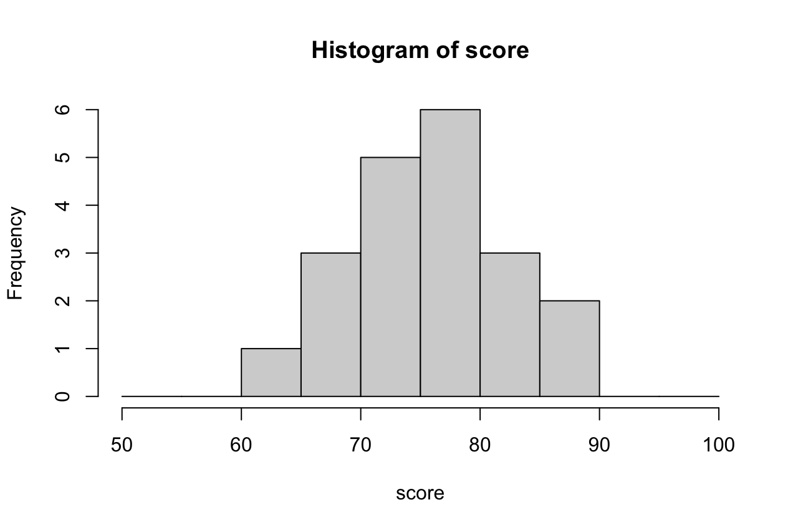
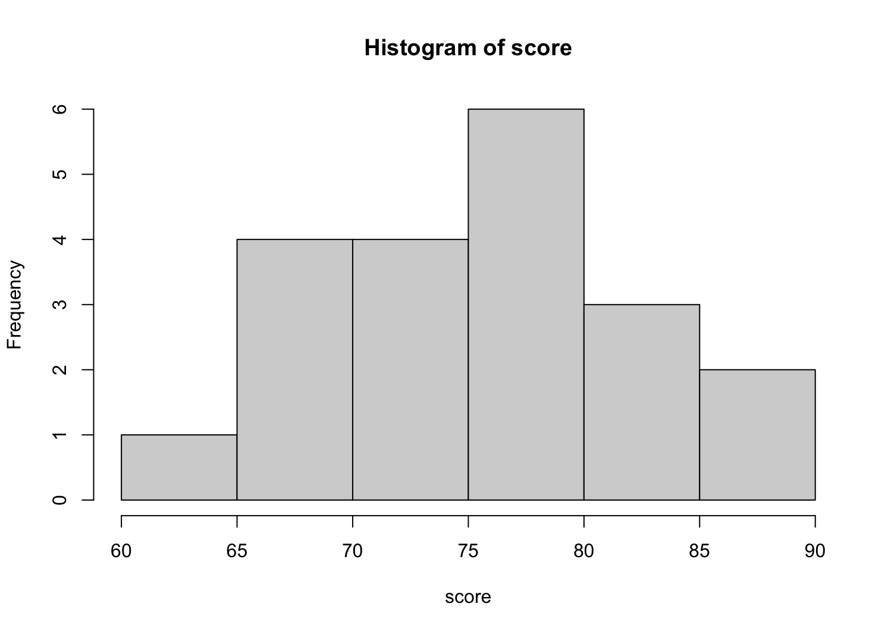
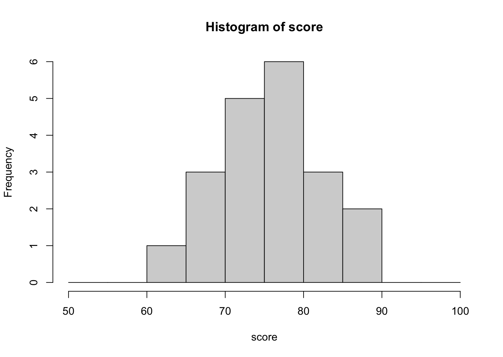

# 1変数データの要約 - 度数分布表とヒストグラム

* データ（1つの変数）を要約するにはグラフ化する方法と代表値（統計量）で表す方法の2つがある
* 1変数のデータをグラフ化する方法の1つにヒストグラムがある
* ヒストグラムは度数分布表をもとに作成できる

> ここでは度数分布表を作成してヒストグラムを表示する方法を学習します。

---

## （例） 20人の中間テスト結果

``` 
84, 72, 86, 76, 68, 68, 72, 66, 78, 84, 74, 60, 86, 76, 74, 76, 70, 82, 76, 78
```

---

## 度数分布表

* データを階級に分けて表に整理したもの
* 階級とはデータの区間を表すもの
* 度数とはデータの出現回数のこと

### 20人の中間テスト結果 - 度数分布表

|階級|階級値|度数|相対度数|
|:--:|:--:|:--:|:--:|
|60 - 64|62|1|0.05|
|65 - 69|67|3|0.15|
|70 - 74|72|5|0.25|
|75 - 79|77|6|0.30|
|80 - 84|82|3|0.15|
|85 - 89|87|2|0.10|

#### 度数分布表の作り方

1. データの最小値と最大値を見つける
2. 階級を分ける
3. 階級値を求める（一般的には階級の中央値を使う）
4. 階級ごとの度数を記録する
5. 相対度数（度数の割合）を求める（相対度数の合計は1となる）

### 詳細な度数分布表 - 20人のテスト結果

* 度数分布表には累積度数や累積相対度数を表示するケースもある
* 累積度数とは度数を累積（以前の度数を加算）したもの
* 累積相対度数とは全体に対する累積度数の割合を表すもの

|階級|階級値|度数|累積度数|相対度数|累積相対度数|
|:--:|:--:|:--:|:--:|:--:|:--:|
|60 - 64|62|1|1|0.05|0.05|
|65 - 69|67|3|4|0.15|0.20|
|70 - 74|72|5|9|0.25|0.45|
|75 - 79|77|6|15|0.30|0.75|
|80 - 84|82|3|18|0.15|0.90|
|85 - 89|87|2|20|0.10|1.00|


<!-- 
60, 
66, 68, 68, 
72, 72, 74, 74, 70, 
76, 78, 76, 76, 76, 78
84, 84, 82, 
86, 86, 
-->

---

## ヒストグラム

* 度数分布表を棒グラフで表現したもの
* x軸に階級、y軸に度数を表示する
* 1変数のデータの分布を可視化できる



> ヒストグラムからデータの分布を確認します。分布が1つの山形になっているものを単峰性 (unimodal)、2つの山形になっているものを二峰性 (bimodal)などと呼びます。

---

## Rプログラミング

### `cut` 関数 - hist1.R

* データを指定した範囲で分割する

> 度数分布表の階級データの作成に利用できます。

```r
score <- c(84, 72, 86, 76, 68, 68, 72, 66, 78, 84, 74, 60, 86, 76, 74, 76, 70, 82, 76, 78)
cut(score, breaks=seq(50, 100, 5))
# cut(score, breaks=seq(50, 100, 5), right = F, include.lowest = T)
```

#### 実行結果

```r
> score <- c(84, 72, 86, 76, 68, 68, 72, 66, 78, 84, 74, 60, 86, 76, 74, 76, 70, 82, 76, 78)
> cut(score, breaks=seq(50, 100, 5))
 [1] (80,85] (70,75] (85,90] (75,80] (65,70] (65,70] (70,75] (65,70] (75,80]
[10] (80,85] (70,75] (55,60] (85,90] (75,80] (70,75] (75,80] (65,70] (80,85]
[19] (75,80] (75,80]
10 Levels: (50,55] (55,60] (60,65] (65,70] (70,75] (75,80] ... (95,100]
```

> `(80,85]` という表記は80より大きく85以下（81〜85）を意味します。80以上85未満とする場合はcut関数の引数に `right = F` を追加します。また最後の項目を95以上100以下とするためにはcut関数の引数に  `include.lowest = T` を追加します。

### 各階級の度数のカウント - hist2.R

* `cut` 関数と `table` 関数を併用すると階級ごとの度数をカウントできる

```r
score <- c(84, 72, 86, 76, 68, 68, 72, 66, 78, 84, 74, 60, 86, 76, 74, 76, 70, 82, 76, 78)
cut_score <- cut(score, breaks=seq(50, 100, 5), right = F, include.lowest = T)
table(cut_score)
```

#### 実行結果

```r
> score <- c(84, 72, 86, 76, 68, 68, 72, 66, 78, 84, 74, 60, 86, 76, 74, 76, 70, 82, 76, 78)
> cut_score <- cut(score, breaks=seq(50, 100, 5), right = F, include.lowest = T)
> table(cut_score)
cut_score
 [50,55)  [55,60)  [60,65)  [65,70)  [70,75)  [75,80)  [80,85)  [85,90)  [90,95) [95,100] 
       0        0        1        3        5        6        3        2        0        0 
```

### `cumsum` 関数 - hist3.R

* 累積合計を求める

```r
score <- c(84, 72, 86, 76, 68, 68, 72, 66, 78, 84, 74, 60, 86, 76, 74, 76, 70, 82, 76, 78)
cumsum(score)
```

#### 実行結果

```r
> score <- c(84, 72, 86, 76, 68, 68, 72, 66, 78, 84, 74, 60, 86, 76, 74, 76, 70, 82, 76, 78)
> cumsum(score)
 [1]   84  156  242  318  386  454  526  592  670  754  828  888  974 1050 1124 1200 1270 1352
[19] 1428 1506
```

### 度数分布表の表示 - hist4.R

```r
score <- c(84, 72, 86, 76, 68, 68, 72, 66, 78, 84, 74, 60, 86, 76, 74, 76, 70, 82, 76, 78)
cut_score <- cut(score, breaks=seq(50, 100, 5), right = F, include.lowest = T)
cut_score_table <- table(cut_score)
score_df <- cbind(cut_score_table, 
                  cumsum(cut_score_table),
                  cut_score_table / length(score), 
                  cumsum(cut_score_table / length(score)))
colnames(score_df) <- c("Freq", "CumFreq", "RelFreq", "CumRelFreq")
score_df
```

#### 実行結果

```r
> score <- c(84, 72, 86, 76, 68, 68, 72, 66, 78, 84, 74, 60, 86, 76, 74, 76, 70, 82, 76, 78)
> cut_score <- cut(score, breaks=seq(50, 100, 5), right = F, include.lowest = T)
> cut_score_table <- table(cut_score)
> score_df <- cbind(cut_score_table, 
+                   cumsum(cut_score_table),
+                   cut_score_table / length(score), 
+                   cumsum(cut_score_table / length(score)))
> colnames(score_df) <- c("Freq", "CumFreq", "RelFreq", "CumRelFreq")
> score_df
         Freq CumFreq RelFreq CumRelFreq
[50,55)     0       0    0.00       0.00
[55,60)     0       0    0.00       0.00
[60,65)     1       1    0.05       0.05
[65,70)     3       4    0.15       0.20
[70,75)     5       9    0.25       0.45
[75,80)     6      15    0.30       0.75
[80,85)     3      18    0.15       0.90
[85,90)     2      20    0.10       1.00
[90,95)     0      20    0.00       1.00
[95,100]    0      20    0.00       1.00
```

### `hist` 関数 - hist5.R

* ヒストグラムを表示する

```r
score <- c(84, 72, 86, 76, 68, 68, 72, 66, 78, 84, 74, 60, 86, 76, 74, 76, 70, 82, 76, 78)
hist(score)
```



#### 実行結果

```r
> score <- c(84, 72, 86, 76, 68, 68, 72, 66, 78, 84, 74, 60, 86, 76, 74, 76, 70, 82, 76, 78)
> hist(score)
```

> よく見ると度数分布表の結果と一致していないことがわかります。これは階級のとり方の違いによるものです。

### ヒストグラムの表示 - hist6.R

* `hist` 関数の `breaks` 引数で階級を指定できる
* `cut` 関数と同様に `right` 引数 `include.lowest` 引数を指定できる

```r
score <- c(84, 72, 86, 76, 68, 68, 72, 66, 78, 84, 74, 60, 86, 76, 74, 76, 70, 82, 76, 78)
hist(score, breaks=seq(50,100, by=5), right = F, include.lowest = T)
```

#### 実行結果

```r
> score <- c(84, 72, 86, 76, 68, 68, 72, 66, 78, 84, 74, 60, 86, 76, 74, 76, 70, 82, 76, 78)
> hist(score, breaks=seq(50,100, by=5), right = F, include.lowest = T)
```



---

## エクササイズ

1. 学籍データの各項目について度数分布表やヒストグラムを作成して分析してください。

| 学籍番号 | 年齢 | 中間レポート | 期末レポート | 中間テスト | 期末テスト |
|:--:|:--:|:--:|:--:|:--:|:--:|
| AI001 | 20 | A | A | 84 | 78 |
| AI002 | 21 | C | B | 72 | 76 |
| AI003 | 23 | A | A | 86 | 80 |
| AI004 | 20 | B | D | 76 | 50 |
| AI005 | 20 | C | B | 68 | 76 |
| AI006 | 21 | D | C | 68 | 70 |
| AI007 | 20 | C | D | 72 | 62 |
| AI008 | 22 | B | B | 66 | 80 |
| AI009 | 21 | A | B | 78 | 84 |
| AI010 | 22 | B | A | 84 | 88 |
| AI011 | 20 | B | B | 74 | 78 |
| AI012 | 20 | C | B | 60 | 78 |
| AI013 | 21 | B | A | 86 | 90 |
| AI014 | 22 | C | C | 76 | 72 |
| AI015 | 20 | D | C | 74 | 68 |
| AI016 | 21 | C | D | 76 | 66 |
| AI017 | 20 | C | D | 70 | 74 |
| AI018 | 24 | A | B | 82 | 86 |
| AI019 | 20 | A | A | 76 | 90 |
| AI020 | 22 | C | B | 78 | 72 |

> 以前に作成したCSVファイル（student.csv）を利用してください。

<!-- 

student_df <- read.csv("student.csv")
report <- student_df$report1
table(report)
barplot(table(report))

-->