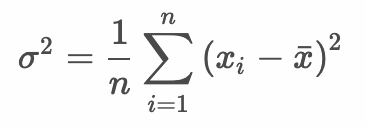
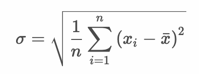

# 1変数データの要約 - 分散と標準偏差

* データの代表値だけでは、データのばらつきを説明できない
* データのばらつき表す量を散布度と呼ぶ
* 一般的によく使う散布度に分散と標準偏差がある

> ここでは標準偏差を算出する流れを解説します。

---

## （例） 20人の中間テスト結果

``` 
84, 72, 86, 76, 68, 68, 72, 66, 78, 84, 74, 60, 86, 76, 74, 76, 70, 82, 76, 78
```

### 平均

```
75.3
```

---

## 偏差

* データと平均の差

|中間テスト | 偏差<br>（データ - 平均） |
|:--:|:--:|
| 84 |  8.7 |
| 72 | -3.3 |
| 86 | 10.7 |
| 76 |  0.7 |
| 68 | -7.3 |
| 68 | -7.3 |
| 72 | -3.3 |
| 66 | -9.3 |
| 78 |  2.7 |
| 84 |  8.7 |
| 74 | -1.3 |
| 60 | -15.3 |
| 86 | 10.7 |
| 76 |  0.7 |
| 74 | -1.3 |
| 76 |  0.7 |
| 70 | -5.3 |
| 82 |  6.7 |
| 76 |  0.7 |
| 78 |  2.7 |

> 20人のデータのばらつきを求めるために、偏差の総和を求めると0になってしまいます。そこで偏差の2乗を計算することで次の偏差平方和を求めます。

## 偏差平方和

* 偏差の平方（2乗した値）の和

|中間テスト | 偏差<br>（データ - 平均） |偏差平方<br>（偏差の2乗） |
|:--:|:--:|:--:|
|84 |  8.7 |  75.69 |
|72 | -3.3 |  10.89 |
|86 | 10.7 | 114.49 |
|76 |  0.7 |   0.49 |
|68 | -7.3 |  53.29 |
|68 | -7.3 |  53.29 |
|72 | -3.3 |  10.89 |
|66 | -9.3 |  86.49 |
|78 |  2.7 |   7.29 |
|84 |  8.7 |  75.69 |
|74 | -1.3 |   1.69 |
|60 |-15.3 | 234.09 |
|86 | 10.7 | 114.49 |
|76 |  0.7 |   0.49 |
|74 | -1.3 |   1.69 |
|76 |  0.7 |   0.49 |
|70 | -5.3 |  28.09 |
|82 |  6.7 |  44.89 |
|76 |  0.7 |   0.49 |
|78 |  2.7 |   7.29 |

### 20人の中間テスト結果 - 偏差平方和

```
922.2
```

## 分散（Variance）

* データの散らばり具合（ばらつき）を表すもの
* 偏差平方和 を データの個数(n)で割ったもの
* 分散は以下の数式で表す



> 分散には標本分散、不偏分散という考え方があります。ここで示しているのは標本分散です。不偏分散については後の推測統計の中で解説します。

### 20人の中間テスト結果 - 分散

```
# 922.2 / 20
46.11
```

## 標準偏差（standard deviation）

* データの散らばり具合（ばらつき）を表すもの
* 分散の平方根
* 標準偏差は以下の数式で表す



> 分散は偏差平方和（偏差を2乗した値の合計）によって算出しているので、元のデータに比べて大きな値になります。標準偏差は分散の平方根をとることで、元のデータと比較しやすい値になります。

### 20人の中間テスト結果 - 標準偏差

```
# 46.11 ** 0.5
6.790434
```

#### （参考）データが正規分布している場合の標準偏差の意味

* 平均から標準偏差1つ分の範囲（±1σ）である68.50957〜82.09043にデータの約68%が存在する
* 平均から標準偏差2つ分の範囲（±2σ）である61.71913〜88.88087にデータの約95%が存在する
* 平均から標準偏差3つ分の範囲（±3σ）である54.9287〜95.6713にデータの約99%が存在する


## 変動係数（coefficient of variance）

* 平均値に対するデータのばらつき度合いを表すもの
* 単位の異なるデータのばらつきを比較できる
* `標準偏差 / 平均値` で算出できる

### 20人の中間テスト結果 - 変動係数

```
# 6.790434 / 75.3
0.09017841
```

---

## Rプログラミング

### 平均値、分散、標準偏差、変動係数を求める - sd1.R

* `mean` 関数でベクトルの平均を求める
* `sqrt` 関数でベクトル（要素）の平方根を求める

```r
score <- c(84, 72, 86, 76, 68, 68, 72, 66, 78, 84, 74, 60, 86, 76, 74, 76, 70, 82, 76, 78)
score_mean <- mean(score)
score_var <- sum((score - score_mean) ** 2) / length(score)
score_sd <- sqrt(score_var)
score_cv <- score_sd / score_mean
score_mean
score_var
score_sd
score_cv
```

#### 実行結果

```r
> score <- c(84, 72, 86, 76, 68, 68, 72, 66, 78, 84, 74, 60, 86, 76, 74, 76, 70, 82, 76, 78)
> score_mean <- mean(score)
> score_var <- sum((score - score_mean) ** 2) / length(score)
> score_sd <- sqrt(score_var)
> score_cv <- score_sd / score_mean
> score_mean
[1] 75.3
> score_var
[1] 46.11
> score_sd
[1] 6.790434
> score_cv
[1] 0.09017841
```

### `var` 関数 - sd2.R

* `var` 関数はベクトルの不偏分散を求める

> `var` 関数の戻り値は不偏分散です。そのため結果が標本分散と異なる点に注意します。不偏分散は偏差平方和を "データの個数 - 1" で割り算した結果です。

```r
score <- c(84, 72, 86, 76, 68, 68, 72, 66, 78, 84, 74, 60, 86, 76, 74, 76, 70, 82, 76, 78)
score_var_s <- var(score) 
score_var_s
```

#### 実行結果

```r
> score <- c(84, 72, 86, 76, 68, 68, 72, 66, 78, 84, 74, 60, 86, 76, 74, 76, 70, 82, 76, 78)
> score_var_s <- var(score) 
> score_var_s
[1] 48.53684
```

> `score_var_s * (length(score) - 1) / length(score)` のように計算することで不偏分散から標本分散を算出できます。

### `sd` 関数 - sd3.R

* `sd` 関数は標準偏差（ベクトルの不偏分散の平方根）を求める

> `sd` 関数も `var` 関数と同様に不偏分散を扱うものになります。

```r
score <- c(84, 72, 86, 76, 68, 68, 72, 66, 78, 84, 74, 60, 86, 76, 74, 76, 70, 82, 76, 78)
score_sd_s <- sd(score) 
score_sd_s
```

#### 実行結果

```r
> score <- c(84, 72, 86, 76, 68, 68, 72, 66, 78, 84, 74, 60, 86, 76, 74, 76, 70, 82, 76, 78)
> score_sd_s <- sd(score) 
> score_sd_s
[1] 6.966839
```

> Excelの場合は不偏分散を求める `var.s` 関数、標本分散を求める `var.p` 関数が用意されています。

---

## エクササイズ

1. 学籍データの期末テストについて平均点、分散、標準偏差、変動係数を調べてください。

| 学籍番号 | 年齢 | 中間レポート | 期末レポート | 中間テスト | 期末テスト |
|:--:|:--:|:--:|:--:|:--:|:--:|
| AI001 | 20 | A | A | 84 | 78 |
| AI002 | 21 | C | B | 72 | 76 |
| AI003 | 23 | A | A | 86 | 80 |
| AI004 | 20 | B | D | 76 | 50 |
| AI005 | 20 | C | B | 68 | 76 |
| AI006 | 21 | D | C | 68 | 70 |
| AI007 | 20 | C | D | 72 | 62 |
| AI008 | 22 | B | B | 66 | 80 |
| AI009 | 21 | A | B | 78 | 84 |
| AI010 | 22 | B | A | 84 | 88 |
| AI011 | 20 | B | B | 74 | 78 |
| AI012 | 20 | C | B | 60 | 78 |
| AI013 | 21 | B | A | 86 | 90 |
| AI014 | 22 | C | C | 76 | 72 |
| AI015 | 20 | D | C | 74 | 68 |
| AI016 | 21 | C | D | 76 | 66 |
| AI017 | 20 | C | D | 70 | 74 |
| AI018 | 24 | A | B | 82 | 86 |
| AI019 | 20 | A | A | 76 | 90 |
| AI020 | 22 | C | B | 78 | 72 |

> 以前に作成したCSVファイル（student.csv）を利用してください。

2. 中間テストと期末テストの結果を比較して分析してください。

3. 年齢の±2σの範囲を求めてください。
