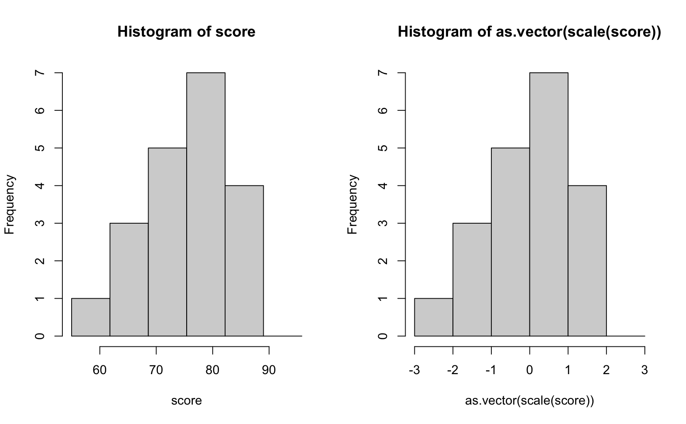

# 1変数データの要約 - 標準化

* 標準化（standardization）とはデータの平均と標準偏差をある特定の値に変換すること
* 変換された値を標準得点と呼ぶ
* データの標準化を行うことで異なる単位のデータ（たとえば、身長と体重など）を比較できる

> ここでは標準化の一般的な手法であるz得点（zスコア）を求める方法を学習します。

---

## （例） 20人の中間テスト結果

``` 
84, 72, 86, 76, 68, 68, 72, 66, 78, 84, 74, 60, 86, 76, 74, 76, 70, 82, 76, 78
```

### 平均

```
75.3
```

### 分散

```
46.11
```

### 標準偏差

```
6.790434
```

---

## z得点（z-score）

* データの平均と標準偏差をある特定の値に変換すること
* 平均：0、標準偏差：1に変換した標準得点をz得点（z-score）と呼ぶ
* zスコアの算出方法は以下のとおり


### 20人の中間テスト結果 - zスコア

|中間テスト | 偏差<br>（データ - 平均） |zスコア|
|:--:|:--:|:--:|
|84 |  8.7 |  1.2812140 |
|72 | -3.3 |  -0.4859777 |
|86 | 10.7 |  1.5757460 |
|76 |  0.7 |  0.1030862 |
|68 | -7.3 |  -1.0750417 |
|68 | -7.3 |  -1.0750417 |
|72 | -3.3 |  -0.4859777 |
|66 | -9.3 |  -1.3695736 |
|78 |  2.7 |  0.3976182 |
|84 |  8.7 |  1.2812140 |
|74 | -1.3 |  -0.1914458 |
|60 |-15.3 |  -2.2531695 |
|86 | 10.7 |  1.5757460 |
|76 |  0.7 |  0.1030862 |
|74 | -1.3 |  -0.1914458 |
|76 |  0.7 |  0.1030862 |
|70 | -5.3 |  -0.7805097 |
|82 |  6.7 |  0.9866821 |
|76 |  0.7 |  0.1030862 |
|78 |  2.7 |  0.3976182 |

> zスコアは元のデータを平均：0、標準偏差：1に置き換えたものです。

## 参考：偏差値

* テストの点数などの比較に用いる偏差値も標準化の一つ
* テストの点数の平均点：50、標準偏差：10に置き換えたもの
* zスコアに10倍して50を加算することで偏差値を求めることができる

### 20人の中間テスト結果 - 偏差値の表示

|中間テスト | 偏差<br>（データ - 平均） |zスコア| 偏差値 |
|:--:|:--:|:--:|:--:|
|84 |  8.7 |  1.2812140 | 62.81214 |
|72 | -3.3 |  -0.4859777 | 45.14022 |
|86 | 10.7 |  1.5757460 | 65.75746 |
|76 |  0.7 |  0.1030862 | 51.03086 |
|68 | -7.3 |  -1.0750417 | 39.24958 |
|68 | -7.3 |  -1.0750417 | 39.24958 |
|72 | -3.3 |  -0.4859777 | 45.14022 |
|66 | -9.3 |  -1.3695736 | 36.30426 |
|78 |  2.7 |  0.3976182 | 53.97618 |
|84 |  8.7 |  1.2812140 | 62.81214 |
|74 | -1.3 |  -0.1914458 | 48.08554 |
|60 |-15.3 |  -2.2531695 | 27.46830 |
|86 | 10.7 |  1.5757460 | 65.75746 |
|76 |  0.7 |  0.1030862 | 51.03086 |
|74 | -1.3 |  -0.1914458 | 48.08554 |
|76 |  0.7 |  0.1030862 | 51.03086 |
|70 | -5.3 |  -0.7805097 | 42.19490 |
|82 |  6.7 |  0.9866821 | 59.86682 |
|76 |  0.7 |  0.1030862 | 51.03086 |
|78 |  2.7 |  0.3976182 | 53.97618 |

---


## Rプログラミング

### 標準化得点（z-score）の算出 - norm1.R

* `（データ - 平均値） / 標準偏差` によってzスコアを算出する

```r
score <- c(84, 72, 86, 76, 68, 68, 72, 66, 78, 84, 74, 60, 86, 76, 74, 76, 70, 82, 76, 78)
score_mean <- mean(score)
score_var <- sum((score - score_mean) ** 2) / length(score)
score_sd <- sqrt(score_var)
(score - score_mean) / score_sd
```

#### 実行結果

```r
> score <- c(84, 72, 86, 76, 68, 68, 72, 66, 78, 84, 74, 60, 86, 76, 74, 76, 70, 82, 76, 78)
> score_mean <- mean(score)
> score_var <- sum((score - score_mean) ** 2) / length(score)
> score_sd <- sqrt(score_var)
> (score - score_mean) / score_sd
 [1]  1.2812140 -0.4859777  1.5757460  0.1030862 -1.0750417 -1.0750417 -0.4859777
 [8] -1.3695736  0.3976182  1.2812140 -0.1914458 -2.2531695  1.5757460  0.1030862
[15] -0.1914458  0.1030862 -0.7805097  0.9866821  0.1030862  0.3976182
```

> zスコアは後の `scale` 関数で変換することもできます。

### 偏差値の算出 - norm2.R

* zスコアを10倍して50を加算すると偏差値を算出できる

```r
score <- c(84, 72, 86, 76, 68, 68, 72, 66, 78, 84, 74, 60, 86, 76, 74, 76, 70, 82, 76, 78)
score_mean <- mean(score)
score_var <- sum((score - score_mean) ** 2) / length(score)
score_sd <- sqrt(score_var)
score_z <- (score - score_mean) / score_sd
score_z * 10 + 50
```

#### 実行結果

```r
> score <- c(84, 72, 86, 76, 68, 68, 72, 66, 78, 84, 74, 60, 86, 76, 74, 76, 70, 82, 76, 78)
> score_mean <- mean(score)
> score_var <- sum((score - score_mean) ** 2) / length(score)
> score_sd <- sqrt(score_var)
> score_z <- (score - score_mean) / score_sd
> score_z * 10 + 50
 [1] 62.81214 45.14022 65.75746 51.03086 39.24958 39.24958 45.14022 36.30426
 [9] 53.97618 62.81214 48.08554 27.46830 65.75746 51.03086 48.08554 51.03086
[17] 42.19490 59.86682 51.03086 53.97618
```

### `scale` 関数 - norm3.R

* `scale` 関数でzスコアを算出できる
* 戻り値は `matrix` 型となるのでベクトルで表示するには `as.vector` 関数で変換する

```r
score <- c(84, 72, 86, 76, 68, 68, 72, 66, 78, 84, 74, 60, 86, 76, 74, 76, 70, 82, 76, 78)
as.vector(scale(score))
```

#### 実行結果

```r
> score <- c(84, 72, 86, 76, 68, 68, 72, 66, 78, 84, 74, 60, 86, 76, 74, 76, 70, 82, 76, 78)
> as.vector(scale(score))
 [1]  1.2487730 -0.4736725  1.5358472  0.1004760 -1.0478210 -1.0478210 -0.4736725
 [8] -1.3348953  0.3875502  1.2487730 -0.1865983 -2.1961180  1.5358472  0.1004760
[15] -0.1865983  0.1004760 -0.7607468  0.9616987  0.1004760  0.3875502
```

> `scale` 関数はzスコアの算出に不偏分散の平方根を標準偏差として利用します。そのため `norm1.R` の結果と出力が少し異なります。

### zスコアの分析 - norm4.R

* zスコアの平均は0、標準偏差は1になることを確認する
* 元のデータとzスコアのヒストグラムを比較する

```r
score <- c(84, 72, 86, 76, 68, 68, 72, 66, 78, 84, 74, 60, 86, 76, 74, 76, 70, 82, 76, 78)
score_z <- as.vector(scale(score))
mean(score_z)
sd(score_z)
par(mfrow=c(1,2))
hist(score, breaks=seq(55, 100, 6.8))
hist(as.vector(scale(score)), breaks=-3:3)
```

#### 実行結果

```r
> score <- c(84, 72, 86, 76, 68, 68, 72, 66, 78, 84, 74, 60, 86, 76, 74, 76, 70, 82, 76, 78)
> score_z <- as.vector(scale(score))
> mean(score_z)
[1] 4.302114e-16
> sd(score_z)
[1] 1
> par(mfrow=c(1,2))
> hist(score, breaks=seq(55, 100, 6.8))
> hist(as.vector(scale(score)), breaks=-3:3)
```



> zスコアのヒストグラムは0を中心に表示されている点を確認してください。

---

## エクササイズ

1. 学籍データの期末テストについてzスコア、標準偏差を求めてください。

| 学籍番号 | 年齢 | 中間レポート | 期末レポート | 中間テスト | 期末テスト |
|:--:|:--:|:--:|:--:|:--:|:--:|
| AI001 | 20 | A | A | 84 | 78 |
| AI002 | 21 | C | B | 72 | 76 |
| AI003 | 23 | A | A | 86 | 80 |
| AI004 | 20 | B | D | 76 | 50 |
| AI005 | 20 | C | B | 68 | 76 |
| AI006 | 21 | D | C | 68 | 70 |
| AI007 | 20 | C | D | 72 | 62 |
| AI008 | 22 | B | B | 66 | 80 |
| AI009 | 21 | A | B | 78 | 84 |
| AI010 | 22 | B | A | 84 | 88 |
| AI011 | 20 | B | B | 74 | 78 |
| AI012 | 20 | C | B | 60 | 78 |
| AI013 | 21 | B | A | 86 | 90 |
| AI014 | 22 | C | C | 76 | 72 |
| AI015 | 20 | D | C | 74 | 68 |
| AI016 | 21 | C | D | 76 | 66 |
| AI017 | 20 | C | D | 70 | 74 |
| AI018 | 24 | A | B | 82 | 86 |
| AI019 | 20 | A | A | 76 | 90 |
| AI020 | 22 | C | B | 78 | 72 |

> 以前に作成したCSVファイル（student.csv）を利用してください。

2. 中間テストで90点をとった場合と、期末テストで90点をとった場合の意味（どちらが良い得点と言えるか）を分析してください。

