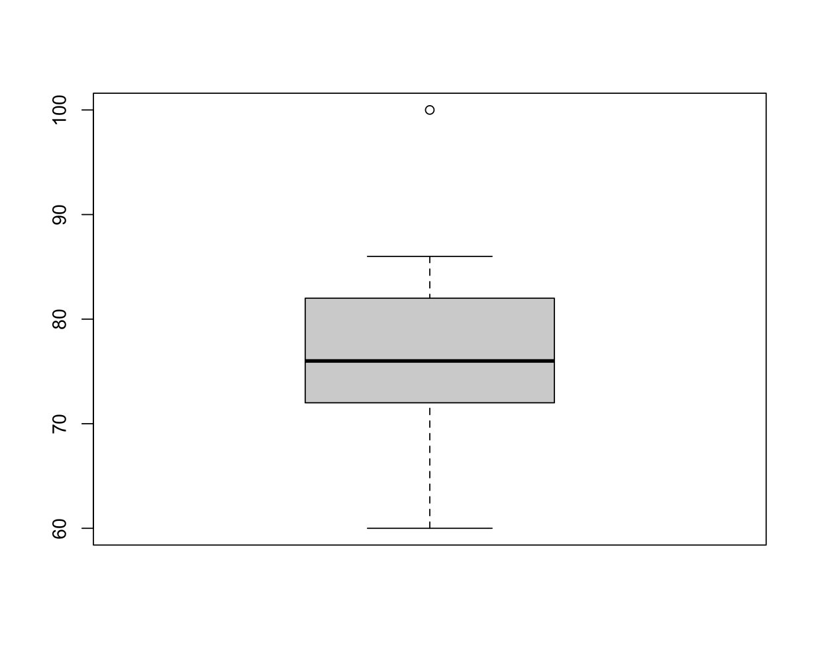

# 1変数データの要約 - 四分位数と箱ひげ図

* データを要約するためには代表値や散布度を中心に扱う
* 量的変数を要約する方法には他にも四分位数や四分位範囲という考え方がある
* 四分位数（四分位範囲）から箱ひげ図を作成できる

---

### （例） 20人の中間テスト結果 - ソート済み

```
60, 66, 68, 68, 70, 72, 72, 74, 74, 76, 76, 76, 76, 78, 78, 82, 84, 84, 86, 86
```

---

## 四分位数

* データを四等分した境界にあたるものを四分位数と呼ぶ
* 0%点、25%点、50%点、75%点、100%点を求めることでデータのばらつき具合を確認できる
* 25%点を第一四分位数、50%点を中央値、75%点を第三四分位数と呼ぶ

> %点をパーセンタイルを呼ぶこともあります。

### 0〜20までのデータ - 四分位数

```
0, 1, 2, 3, 4, 5, 6, 7, 8, 9, 10, 11, 12, 13, 14, 15, 16, 17, 18, 19, 20
               ^              ^                   ^
```

### 20人の中間テスト結果 - 四分位数

```
  0%  25%  50%  75% 100% 
60.0 71.5 76.0 79.0 86.0
```

### （参考）四分位数の詳細な求め方

```
60, 66, 68, 68, 70, 72, 72, 74, 74, 76, 76, 76, 76, 78, 78, 82, 84, 84, 86, 86
1   2   3   4   5   6   7   8   9   10  11  12  13  14  15  16  17  18  19  20
                   ^                   ^                  ^
```

> 25%点は `(70 + 72) / 2` の結果である `71` を予想したかもしれませんが実際は `71.5` となります。これは25%点のインデックスが `5.5` ではなく、`5.75` となるためです。データの個数を `n` としたとき、四分位数を表すベクトルのインデックスは以下の計算式で求めることができます。

* 25%点は `1 + 1 * (n - 1) / 4 = (n + 3) / 4`
* 50%点は `1 + 2 * (n - 1) / 4 = (n + 1) / 2`
* 75%点は `1 + 3 * (n - 1) / 4 = (3n + 1) / 4`


## 四分位範囲

* 25%点（第一四分位数）と75%点（第三四分位数）の範囲を四分位範囲と呼ぶ
* 四分位範囲によってデータのばらつき具合を表現できる
* データの50%点付近（中央値付近）の範囲の広さを知ることができる


### 20人のテスト結果の四分位範囲

```
7.5（71.5 〜 79.0）
```

> 四分位範囲をIQRと呼ぶこともあります。IQR とは Inter Quartile Range の略です。

---

## 箱ひげ図 - boxplot

* 四分位数（四分位範囲）を可視化したグラフ
* 25%点、50%点、75%点を使って箱を描画する
* 0%点、100%点を使ってひげを描画する（ただし外れ値を考慮することもある）


> 箱ひげ図は以下の四分位数をグラフ化したものと考えると良いでしょう。

```
  0%  25%  50%  75% 100% 
60.0 71.5 76.0 79.0 86.0
```


### 外れ値が存在する場合



```
  0%  25%  50%  75% 100% 
  60   72   76   82  100 
```

* 25%点（75%点）から四分位範囲の1.5倍を超える値を外れ値とするケースが多い
    1. 四分位範囲は10（72〜82）
    2. 四分位範囲は1.5倍は15
    3. 75%点は82であるため、97を越えると外れ値となる


---

## Rプログラミング

### データのソート - quantile1.R

* `sort` 関数によってデータの並び順を変更できる（デフォルトは昇順）

```r
score <- c(60, 66, 68, 68, 70, 72, 72, 74, 74, 76, 76, 76, 76, 78, 78, 82, 84, 84, 86, 86)
score_sort <- sort(score)
score_sort
```

#### 実行結果

```r
> score <- c(60, 66, 68, 68, 70, 72, 72, 74, 74, 76, 76, 76, 76, 78, 78, 82, 84, 84, 86, 86)
> score_sort <- sort(score)
> score_sort
 [1] 60 66 68 68 70 72 72 74 74 76 76 76 76 78 78 82 84 84 86 86
```

> `sort` 関数の引数に `decreasing = T` を追加すると並び順を降順に変更できます。

---

### 四分位数の表示 - quantile2.R

* `quantile` 関数でデータの四分位数および最小値、最大値を表示できる

```r
score <- c(60, 66, 68, 68, 70, 72, 72, 74, 74, 76, 76, 76, 76, 78, 78, 82, 84, 84, 86, 86)
quantile(score)
```

#### 実行結果

```r
> score <- c(60, 66, 68, 68, 70, 72, 72, 74, 74, 76, 76, 76, 76, 78, 78, 82, 84, 84, 86, 86)
> quantile(score)
  0%  25%  50%  75% 100% 
60.0 71.5 76.0 79.0 86.0 
```

> `quantile` 関数の引数はソートされていなベクトルでも動作します。また同様の関数に `summary` 関数があります。

---

### 四分位範囲の表示 - quantile3.R

* `IQR` 関数でデータの四分位数範囲を表示できる

```r
score <- c(60, 66, 68, 68, 70, 72, 72, 74, 74, 76, 76, 76, 76, 78, 78, 82, 84, 84, 86, 86)
IQR(score)
```

#### 実行結果

```r
> score <- c(60, 66, 68, 68, 70, 72, 72, 74, 74, 76, 76, 76, 76, 78, 78, 82, 84, 84, 86, 86)
> IQR(score)
[1] 7.5
```

> IQRは「第三四分位数（75%点） - 第一四分位数（25%点）」の範囲を意味します。IQRによってデータのばらつき具合を確認できます。


---

### 箱ひげ図の表示 - quantile4.R

* `boxplot` 関数で箱ひげ図を表示できる

```r
score <- c(60, 66, 68, 68, 70, 72, 72, 74, 74, 76, 76, 76, 76, 78, 78, 82, 84, 84, 86, 86)
boxplot(score)
```

#### 実行結果

```r
> score <- c(60, 66, 68, 68, 70, 72, 72, 74, 74, 76, 76, 76, 76, 78, 78, 82, 84, 84, 86, 86)
> boxplot(score)
```


> `score` ベクトルに `100` という要素を追加して箱ひげ図を表示してみましょう。外れ値として表示されます。

---

## エクササイズ

1. 学籍データの期末テストについて、四分位数、四分位範囲、箱ひげ図を確認してください。

| 学籍番号 | 年齢 | 中間レポート | 期末レポート | 中間テスト | 期末テスト |
|:--:|:--:|:--:|:--:|:--:|:--:|
| AI001 | 20 | A | A | 84 | 78 |
| AI002 | 21 | C | B | 72 | 76 |
| AI003 | 23 | A | A | 86 | 80 |
| AI004 | 20 | B | D | 76 | 50 |
| AI005 | 20 | C | B | 68 | 76 |
| AI006 | 21 | D | C | 68 | 70 |
| AI007 | 20 | C | D | 72 | 62 |
| AI008 | 22 | B | B | 66 | 80 |
| AI009 | 21 | A | B | 78 | 84 |
| AI010 | 22 | B | A | 84 | 88 |
| AI011 | 20 | B | B | 74 | 78 |
| AI012 | 20 | C | B | 60 | 78 |
| AI013 | 21 | B | A | 86 | 90 |
| AI014 | 22 | C | C | 76 | 72 |
| AI015 | 20 | D | C | 74 | 68 |
| AI016 | 21 | C | D | 76 | 66 |
| AI017 | 20 | C | D | 70 | 74 |
| AI018 | 24 | A | B | 82 | 86 |
| AI019 | 20 | A | A | 76 | 90 |
| AI020 | 22 | C | B | 78 | 72 |

> 以前に作成したCSVファイル（student.csv）を利用してください。

2. 中間テストの結果と期末テストの結果を比較・分析してください。

