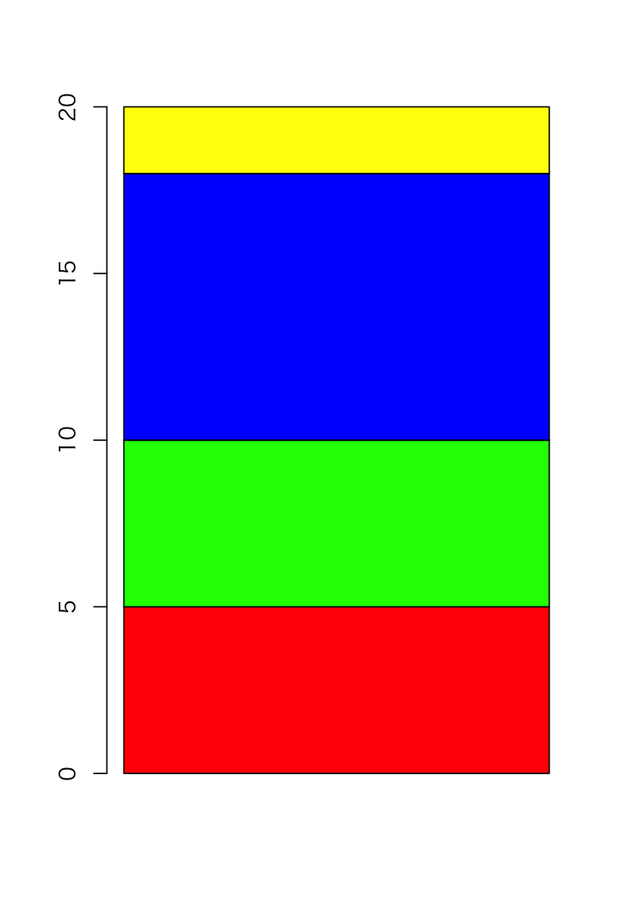

# 1変数データの要約 - 質的変数

* 平均値や標準偏差は質的データに向かない
* 質的変数はデータの出現回数（度数、頻度）を数えることが基本となる（最頻値など）
* 質的変数を要約する方法には度数分布表を作ることで、棒グラフや円グラフなどで表現できる

---

## （例1） 20人の中間レポート結果

``` 
A, C, A, B, C, D, C, B, A, B, B, C, B, C, D, C, C, A, A, C
```

---

## 度数分布表

* データの出現回数（頻度、度数）をまとめたもの

||度数|
|:--:|:--:|
|A|5|
|B|5|
|C|8|
|D|2|

> このような表を単純に集計表と呼ぶこともあります。

* 累積度数、相対度数、累積相対度数を算出することもできる

||度数|累積度数|相対度数|累積相対度数|
|:--:|:--:|:--:|:--:|:--:|
|A|5|5|0.25|0.25|
|B|5|10|0.25|0.50|
|C|8|18|0.40|0.90|
|D|2|20|0.10|1.00|

---

## 棒グラフ - barplot

* 質的変数の度数分布表を棒グラフで可視化できる
* 積み上げ棒グラフ（帯グラフ）として表現することもできる

 


---

## 円グラフ - pie

* 質的変数の集計表を円グラフで可視化できる

 

---


## Rプログラミング

### 度数分布表の作成 - chart1.R

* 質的変数は `table` 関数によってを度数分布表（集計表）作成できる

```r
report <- c("A", "C", "A", "B", "C", "D", "C", "B", "A", "B", "B", "C", "B", "C", "D", "C", "C", "A", "A", "C")
report_table <- table(report)
report_table
```

#### 実行結果

```r
> report <- c("A", "C", "A", "B", "C", "D", "C", "B", "A", "B", "B", "C", "B", "C", "D", "C", "C", "A", "A", "C")
> report_table <- table(report)
> report_table
report
A B C D 
5 5 8 2 
```

---

### 度数分布表の作成（累積度数、相対度数、累積相対度数） - chart2.R

* `cumsum` 関数、`length` 関数を使って累積度数、相対度数、累積相対度数を算出できる

```r
report <- c("A", "C", "A", "B", "C", "D", "C", "B", "A", "B", "B", "C", "B", "C", "D", "C", "C", "A", "A", "C")
report_table <- table(report)
report_table
cumsum(report_table)
report_table / length(report)
cumsum(report_table) / length(report)
```

#### 実行結果

```r
> report <- c("A", "C", "A", "B", "C", "D", "C", "B", "A", "B", "B", "C", "B", "C", "D", "C", "C", "A", "A", "C")
> report_table <- table(report)
> report_table
report
A B C D 
5 5 8 2 
> cumsum(report_table)
 A  B  C  D 
 5 10 18 20 
> report_table / length(report)
report
   A    B    C    D 
0.25 0.25 0.40 0.10 
> cumsum(report_table) / length(report)
   A    B    C    D 
0.25 0.50 0.90 1.00 
```

---

### 棒グラフ - chart3.R

+ `barplot` 関数で棒グラフを表示できる

```r
report <- c("A", "C", "A", "B", "C", "D", "C", "B", "A", "B", "B", "C", "B", "C", "D", "C", "C", "A", "A", "C")
report_table <- table(report)
barplot(report_table, col=c("red", "green", "blue", "yellow"))
```

#### 実行結果

```r
> report <- c("A", "C", "A", "B", "C", "D", "C", "B", "A", "B", "B", "C", "B", "C", "D", "C", "C", "A", "A", "C")
> report_table <- table(report)
> barplot(report_table, col=c("red", "green", "blue", "yellow"))
```

 

---

### 棒グラフ（積み上げ棒グラフ） - chart4.R

+ `barplot` 関数にマトリックスデータを渡すと積み上げ棒グラフを表示できる

```r
report <- c("A", "C", "A", "B", "C", "D", "C", "B", "A", "B", "B", "C", "B", "C", "D", "C", "C", "A", "A", "C")
report.table <- table(report)
barplot(matrix(report.table, ncol=1), col=c("red", "green", "blue", "yellow"))
```

#### 実行結果

```r
> report <- c("A", "C", "A", "B", "C", "D", "C", "B", "A", "B", "B", "C", "B", "C", "D", "C", "C", "A", "A", "C")
> report.table <- table(report)
> barplot(matrix(report.table, ncol=2))
```

 

---

### 円グラフ - chart5.R

+ `pie` 関数で円グラフを表示できる

```r
report <- c("A", "C", "A", "B", "C", "D", "C", "B", "A", "B", "B", "C", "B", "C", "D", "C", "C", "A", "A", "C")
report_table <- table(report)
pie(report_table, col=c("red", "green", "blue", "yellow"))
```

#### 実行結果

```r
> report <- c("A", "C", "A", "B", "C", "D", "C", "B", "A", "B", "B", "C", "B", "C", "D", "C", "C", "A", "A", "C")
> report_table <- table(report)
> pie(report_table, col=c("red", "green", "blue", "yellow"))
```

 

> `pie` 関数はデフォルト表示だと3時の位置から反時計回りに表示されます。12時の位置から時計回りに表示するには、`pie` 関数の引数に `clockwise = T` を追加します。

---

## エクササイズ

1. 学籍データの期末レポートについて、度数分布表を作成し、グラフに表示してください。

| 学籍番号 | 年齢 | 中間レポート | 期末レポート | 中間テスト | 期末テスト |
|:--:|:--:|:--:|:--:|:--:|:--:|
| AI001 | 20 | A | A | 84 | 78 |
| AI002 | 21 | C | B | 72 | 76 |
| AI003 | 23 | A | A | 86 | 80 |
| AI004 | 20 | B | D | 76 | 50 |
| AI005 | 20 | C | B | 68 | 76 |
| AI006 | 21 | D | C | 68 | 70 |
| AI007 | 20 | C | D | 72 | 62 |
| AI008 | 22 | B | B | 66 | 80 |
| AI009 | 21 | A | B | 78 | 84 |
| AI010 | 22 | B | A | 84 | 88 |
| AI011 | 20 | B | B | 74 | 78 |
| AI012 | 20 | C | B | 60 | 78 |
| AI013 | 21 | B | A | 86 | 90 |
| AI014 | 22 | C | C | 76 | 72 |
| AI015 | 20 | D | C | 74 | 68 |
| AI016 | 21 | C | D | 76 | 66 |
| AI017 | 20 | C | D | 70 | 74 |
| AI018 | 24 | A | B | 82 | 86 |
| AI019 | 20 | A | A | 76 | 90 |
| AI020 | 22 | C | B | 78 | 72 |

> 以前に作成したCSVファイル（student.csv）を利用してください。

2. 中間レポートの結果と期末レポートの結果を比較・分析してください。

