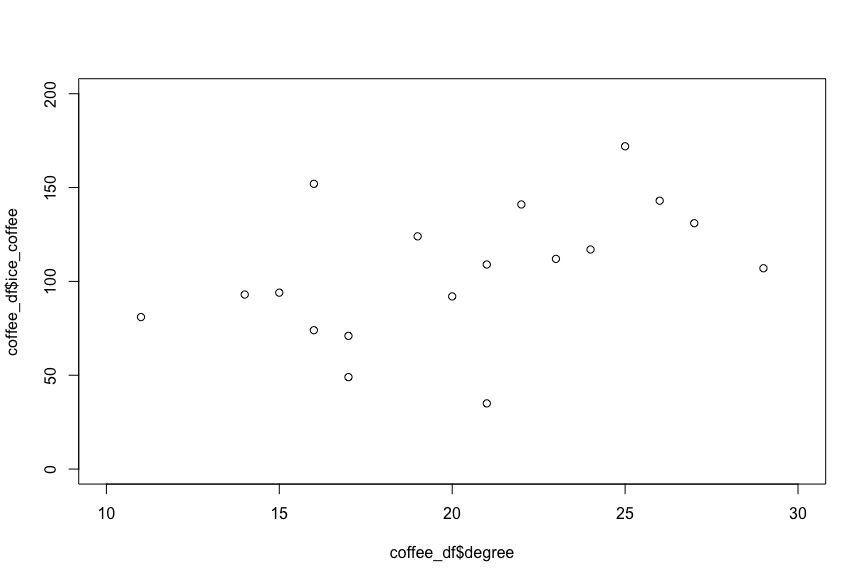

# 2変数データの要約 - 散布図

* 2つの変数を横軸（x軸）と縦軸（y軸）に対応させた図
* 2つの変数の関係を可視化するために使う
* 2つの変数の関係に右上がりの傾向が見られる場合は正の相関、右下がりの傾向が見られる場合は負の相関がある

---

## （例） 気温とコーヒーの売上

| 気温|アイスコーヒー|ホットコーヒー |
|:--:|:--:|:--:|
| 14|93|150 |
| 22|141|73 |
| 27|131|33 |
| 16|74|152 |
| 19|124|106 |
| 15|94|172 |
| 17|71|85 |
| 17|49|116 |
| 16|152|127 |
| 9|13|135 |
| 20|92|65 |
| 21|35|57 |
| 29|107|88 |
| 34|198|32 |
| 11|81|172 |
| 23|112|81 |
| 24|117|116 |
| 26|143|56 |
| 25|172|47 |
| 21|109|115 |

---

## 相関関係

* 2つの変数の関係に右上がりの傾向が見られる場合は「正の相関がある」という
* 2つの変数の関係に右下がりの傾向が見られる場合は「負の相関がある」という
* 2つの変数の関係に正の相関、負の相関が見られない場合を「相関がない」あるいは「無相関」という

### 正の相関 - 気温とアイスコーヒーの売上



### 負の相関 - 気温とホットコーヒーの売上


### 無相関 - 気温とコーヒーの売上


---

## 散布図と平均値の関係

* 散布図は2つの変数の平均値を基準に4つの区画に分けることで相関を把握しやすくなる
* 2つの変数の偏差（平均との差）がともに正の数（あるいは負の数）の場合、2つの偏差の積は正の数となる
* 2つの変数の偏差が片方だけが正の数（もう片方は負の数）の場合、2つの偏差の積はの負の数となる

### 正の相関 - 気温とアイスコーヒーの売上


> 正の相関がある場合は、図の `+` の領域にデータが多く出現する

### 負の相関 - 気温とホットコーヒーの売上


> 負の相関がある場合は、図の `-` の領域にデータが多く出現する

### 無相関 - 気温とコーヒーの売上


> 相関がない（あるいは相関が弱い）場合は、全体にデータが出現する

---


## Rプログラミング

以下のデータを `coffee.csv` という名前で保存しておきます。

```csv
degree,ice_coffee,hot_coffee
14,93,150
22,141,73
27,131,33
16,74,152
19,124,106
15,94,172
17,71,85
17,49,116
16,152,127
9,13,135
20,92,65
21,35,57
29,107,88
34,198,32
11,81,172
23,112,81
24,117,116
26,143,56
25,172,47
21,109,115
```

---

### 散布図の表示 - plot1.R

* 散布図は `plot` 関数で描画できる

```r
coffee_df <- read.csv("coffee.csv")

plot(
  coffee_df$degree,
  coffee_df$ice_coffee,
  xlim = c(10, 30),
  ylim = c(0, 200),
)
```

> `plot` 関数の引数に `xlim` や `ylim` を指定することで、x軸とy軸の下限値と上限値を指定しています。

#### 実行結果


---


### 散布図の表示 - タイトルとx軸、y軸ラベルの表示 - plot2.R

* `plot` 関数の引数でタイトルやラベルを指定できる
* `xlab`、`ylab` 引数でx軸、y軸のラベルを指定できる
* `main` 引数で散布図のタイトルを指定できる

```r
coffee_df <- read.csv("coffee.csv")

plot(
  coffee_df$degree,
  coffee_df$ice_coffee,
  xlim = c(10, 30),
  ylim = c(0, 200),
  xlab = "dregree",
  ylab = "ice coffee",
  main = "ice coffee sales"
)
```

#### 実行結果


---

### 散布図の表示（平均を示す直線の表示） - plot3.R

* `abline` 関数を使うとグラフに直線を描画できる
* グラフに横線を描画するときは `h` 引数を指定する
* グラフに縦線を描画するときは `v` 引数を指定する

```r
coffee_df <- read.csv("coffee.csv")

plot(
  coffee_df$degree,
  coffee_df$ice_coffee,
  xlim = c(10, 30),
  ylim = c(0, 200),
  xlab = "dregree",
  ylab = "ice coffee",
  main = "ice coffee sales"
)
abline(h = mean(coffee_df$ice_coffee))
abline(v = mean(coffee_df$degree))
```

#### 実行結果


### 散布図の表示（テキストの追加） - plot4.R

* `text` 関数を使うとグラフにテキストを描画できる
* `text` 関数は引数に描画位置（x, y座標）と`label` 引数で表示するラベルを受け取る
* `par` 関数に `ps` 引数を指定するとフォントサイズを変更できる

```r
coffee_df <- read.csv("coffee.csv")

par(ps = 12)
plot(
  coffee_df$degree,
  coffee_df$ice_coffee,
  xlim = c(10, 30),
  ylim = c(0, 200),
  xlab = "dregree",
  ylab = "ice coffee",
  main = "ice coffee sales"
)
abline(h = mean(coffee_df$ice_coffee))
abline(v = mean(coffee_df$degree))
par(ps = 36)
text(
  c(15, 15, 25, 25),
  c(150, 50, 150, 50),
  label = c("-", "+", "+", "-"),
)
```

#### 実行結果


---

## エクササイズ

1. 身長と体重を示す以下のデータについて散布図を表示してください。

```
身長：170 164 169 170 169 172 172 163 165 177 171 168 170 170 166 170 168 177 170 179
体重：57 46 58 62 57 64 73 58 51 70 59 58 56 67 55 61 61 71 62 72
```


---

2. 学籍データの中間テストと期末テストについて散布図を作成してください。

| 学籍番号 | 年齢 | 中間レポート | 期末レポート | 中間テスト | 期末テスト |
|:--:|:--:|:--:|:--:|:--:|:--:|
| AI001 | 20 | A | A | 84 | 78 |
| AI002 | 21 | C | B | 72 | 76 |
| AI003 | 23 | A | A | 86 | 80 |
| AI004 | 20 | B | D | 76 | 50 |
| AI005 | 20 | C | B | 68 | 76 |
| AI006 | 21 | D | C | 68 | 70 |
| AI007 | 20 | C | D | 72 | 62 |
| AI008 | 22 | B | B | 66 | 80 |
| AI009 | 21 | A | B | 78 | 84 |
| AI010 | 22 | B | A | 84 | 88 |
| AI011 | 20 | B | B | 74 | 78 |
| AI012 | 20 | C | B | 60 | 78 |
| AI013 | 21 | B | A | 86 | 90 |
| AI014 | 22 | C | C | 76 | 72 |
| AI015 | 20 | D | C | 74 | 68 |
| AI016 | 21 | C | D | 76 | 66 |
| AI017 | 20 | C | D | 70 | 74 |
| AI018 | 24 | A | B | 82 | 86 |
| AI019 | 20 | A | A | 76 | 90 |
| AI020 | 22 | C | B | 78 | 72 |

> 以前に作成したCSVファイル（student.csv）を利用してください。

