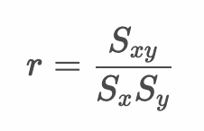
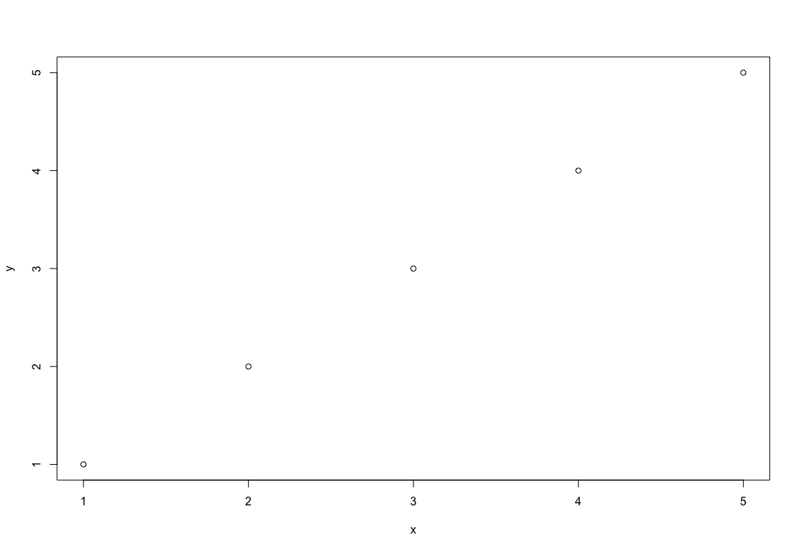
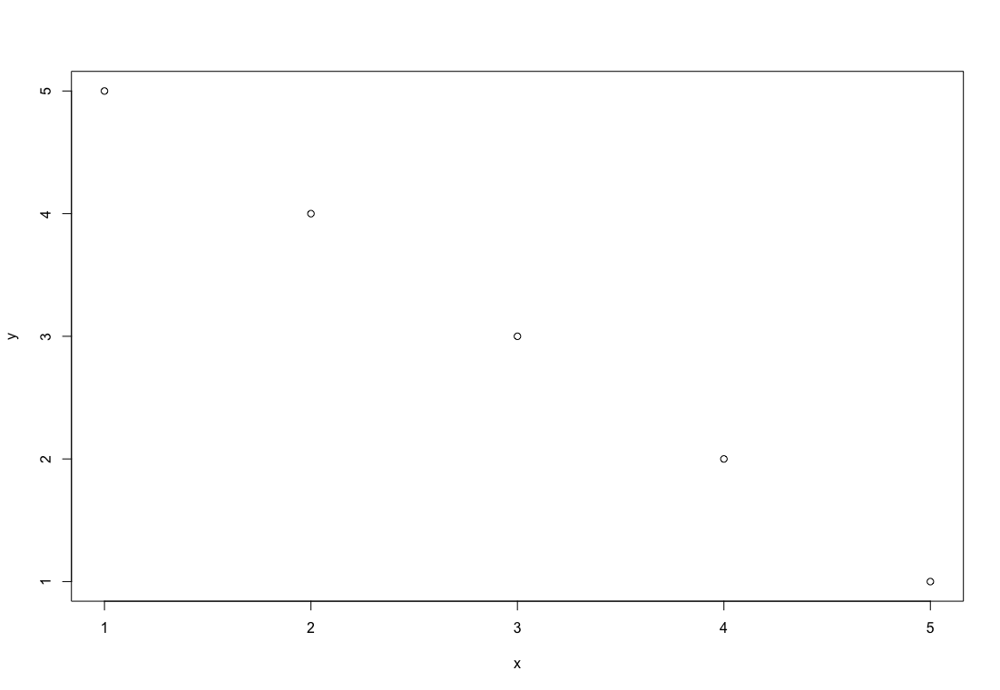
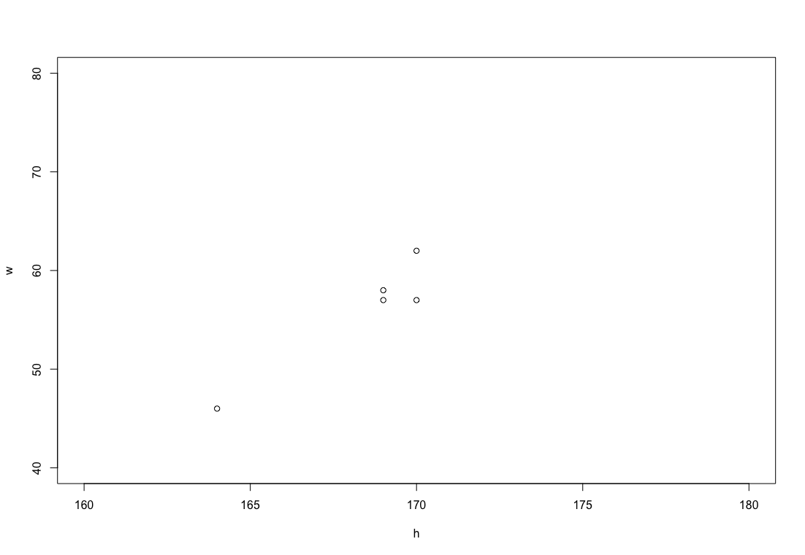

# 2変数データの要約 - 相関係数

* 2つの変数の関係を示す値
* 2つの変数の関係をが強いほど、正の相関であれば1、負の相関であれば-1に近くなる（単位の取り扱いの影響を受けない）
* 共分散を2つの変数の標準偏差の積で除算することで求める

> 

## 相関係数の公式




---

## （例） 気温とコーヒーの売上

| 気温|アイスコーヒー|ホットコーヒー |
|:--:|:--:|:--:|
| 14|93|150 |
| 22|141|73 |
| 27|131|33 |
| 16|74|152 |
| 19|124|106 |
| 15|94|172 |
| 17|71|85 |
| 17|49|116 |
| 16|152|127 |
| 9|13|135 |
| 20|92|65 |
| 21|35|57 |
| 29|107|88 |
| 34|198|32 |
| 11|81|172 |
| 23|112|81 |
| 24|117|116 |
| 26|143|56 |
| 25|172|47 |
| 21|109|115 |


### 気温とコーヒーの平均値

| 気温の平均|アイスコーヒーの平均|ホットコーヒーの平均 |
|:--:|:--:|:--:|
| 20.3 | 105.4 | 98.9 |


### 気温とアイスコーヒーの相関係数

| 気温|アイスコーヒー| 気温の偏差 | アイスコーヒーの偏差 | 気温の偏差 * アイスコーヒーの偏差|
|:--:|:--:|:--:|:--:|:--:|
| 14 | 93 | -6.3 | -12.4 | 78.1 |
| 22 | 141 | 1.7 | 35.6 | 60.5 |
| 27 | 131 | 6.7 | 25.6 | 171.5 |
| 16 | 74 | -4.3 | -31.4 | 135 |
| 19 | 124 | -1.3 | 18.6 | -24.2 |
| 15 | 94 | -5.3 | -11.4 | 60.4 |
| 17 | 71 | -3.3 | -34.4 | 113.5 |
| 17 | 49 | -3.3 | -56.4 | 186.1 |
| 16 | 152 | -4.3 | 46.6 | -200.4 |
| 9 | 13 | -11.3 | -92.4 | 1044.1 |
| 20 | 92 | -0.3 | -13.4 | 4.0 |
| 21 | 35 | 0.7 | -70.4 | -49.3 |
| 29 | 107 | 8.7 | 1.6 | 13.9 |
| 34 | 198 | 13.7 | 92.6 | 1268.6 |
| 11 | 81 | -9.3 | -24.4 | 226.9 |
| 23 | 112 | 2.7 | 6.6 | 17.8 |
| 24 | 117 | 3.7 | 11.6 | 42.9 |
| 26 | 143 | 5.7 | 37.6 | 214.3 |
| 25 | 172 | 4.7 | 66.6 | 313 |
| 21 | 109 | 0.7 | 3.6 | 2.5 |

```
(78.1 + 60.5 + 171.5 + 135.0 + -24.2 
 + 60.4 + 113.5 + 186.1 + -200.4 1044.1
 + 4.0 + -49.3 + 13.9 1268.6 + 226.9 
 + 17.8 + 42.9 + 214.3 + 313.0 + + 2.5) / 20

気温とアイスコーヒーの共分散： 184
気温の標準偏差： 6.04
アイスコーヒーの標準偏差： 44.13
気温とアイスコーヒーの相関係数： 184 / (6.04 * 44.13) = 0.69
```

### 気温とホットコーヒーの共分散

| 気温|ホットコーヒー| 気温の偏差 | ホットコーヒーの偏差 | 気温の偏差 * ホットコーヒーの偏差|
|:--:|:--:|:--:|:--:|:--:|
| 14 | 150 | -6.3 | 51.1 | -321.9 |
| 22 | 73 | 1.7 | -25.9 | -44.0 |
| 27 | 33 | 6.7 | -65.9 | -441.5 |
| 16 | 152 | -4.3 | 53.1 | -228.3 |
| 19 | 106 | -1.3 | 7.1 | -9.2 |
| 15 | 172 | -5.3 | 73.1 | -387.4 |
| 17 | 85 | -3.3 | -13.9 | 45.9 |
| 17 | 116 | -3.3 | 17.1 | -56.4 |
| 16 | 127 | -4.3 | 28.1 | -120.8 |
| 9 | 135 | -11.3 | 36.1 | -407.9 |
| 20 | 65 | -0.3 | -33.9 | 10.2 |
| 21 | 57 | 0.7 | -41.9 | -29.3 |
| 29 | 88 | 8.7 | -10.9 | -94.8 |
| 34 | 32 | 13.7 | -66.9 | -916.5 |
| 11 | 172 | -9.3 | 73.1 | -679.8 |
| 23 | 81 | 2.7 | -17.9 | -48.3 |
| 24 | 116 | 3.7 | 17.1 | 63.3 |
| 26 | 56 | 5.7 | -42.9 | -244.5 |
| 25 | 47 | 4.7 | -51.9 | -243.9 |
| 21 | 115 | 0.7 | 16.1 | 11.3 |

```
(-321.9 + -44.0 + -441.5 + -228.3 + -9.2 
 + -387.4 + 45.9 + -56.4 + -120.8 + -407.9
 + 10.2 + -29.3 + -94.8 + -916.5 + -679.8 
 + -48.3 + 63.3 + -244.5 + -243.9 + 11.3) / 20

気温とホットコーヒーの共分散： -207.22
気温の標準偏差： 6.04
ホットコーヒーの標準偏差： 42.81694
気温とホットコーヒーの相関係数： -207.22 / (6.04 * 42.81694) = -0.80
```

## 相関係数の最大値（最小値）


* 2つの変数に完全な正の相関関係がある場合、相関係数は最大値となる
* 2つの変数に完全な負の相関関係がある場合、相関係数は最小値となる
* 相関係数の最大値は1、最小値は-1となる

> 相関係数（ `r` ）は共分散（ `Sxy` ）を2つの変数の標準偏差の積（ `SxSy` ）で除算することで求めます。また共分散はの最大値、最小値はそれぞれ `SxSy` 、 `-SxSy` であるため、相関係数 `r` の取りうる値は ` -1 < r < 1 ` の範囲となります。


### 2つの変数に完全な正の相関関係がある場合



```
x: 1, 2, 3, 4, 5
y: 1, 2, 3, 4, 5
xの標準偏差： 1.41
yの標準偏差： 1.41
xとyの共分散： 1.41 * 1.41 * 1= 2.0
xとyの相関係数： 1
```


### 2つの変数に完全な負の相関関係がある場合



```
x: 1, 2, 3, 4, 5
y: 5, 4, 3, 2, 1
xの標準偏差： 1.41
yの標準偏差： 1.41
xとyの共分散： 1.41 * 1.41 * -1= -2.0
xとyの相関係数： -1
```

---

## 相関係数と単位の取り扱い

* 相関係数は単位の影響を受けない
* たとえば身長と体重の相関係数を求める場合、身長の単位をcmで表現しても、mで表現しても相関係数の値は同じになる

### 身長の単位をcmで体重kgとの相関係数を求める場合



```
h: 170cm 164cm 169cm 170cm 169cm
w: 57kg 46kg 58kg 62kg 57kg
hの標準偏差： 2.24
wの標準偏差： 5.32
hとwの共分散: 11.4
hとwの相関係数： 11.4 / (2.24 * 5.32) = 0.96
```

### 身長の単位をmで体重kgとの相関係数を求める場合


```
h: 1.70m 1.64m 1.69m 1.70m 1.69m
w: 57kg 46kg 58kg 62kg 57kg
hの標準偏差： 0.0224
wの標準偏差： 5.32
hとwの共分散: 0.114
hとwの相関係数： 0.114 / (0.0224 * 5.32) = 0.96
```

## 相関係数の目安

|相関係数|大きさの評価|
|:--|:--|
|0.7 〜<br>(-0.7 〜 )|強い相関がある|
|0.4 〜 0.7<br>(-0.4 〜 -0.7) |中程度の相関がある|
|0.2 〜 0.4<br>(-0.2 〜 -0.4) |弱い相関がある|
|0 〜 0.2<br>(0 〜 -0.2) |ほとんど相関がない|

> 研究・調査対象によって目安が変わることもあります。また相関係数は外れ値の影響を受けるため、実際に散布図を見て確認することも重要です。

---

## Rプログラミング


以下のデータを `coffee.csv` という名前で保存しておきます。

```csv
degree,ice_coffee,hot_coffee
14,93,150
22,141,73
27,131,33
16,74,152
19,124,106
15,94,172
17,71,85
17,49,116
16,152,127
9,13,135
20,92,65
21,35,57
29,107,88
34,198,32
11,81,172
23,112,81
24,117,116
26,143,56
25,172,47
21,109,115
```

---

### 相関係数の計算 - cor1.R

* 相関係数は共分散を2つの変数の標準偏差の積で除算することで求める

```r
coffee_df <- read.csv("coffee.csv")
degree_dev <- coffee_df$degree - mean(coffee_df$degree)
ice_coffee_dev <- coffee_df$ice_coffee - mean(coffee_df$ice_coffee)
degree_sd <-
  sqrt(var(coffee_df$degree) * (nrow(coffee_df) - 1) / nrow(coffee_df))
ice_coffee_sd <-
  sqrt(var(coffee_df$ice_coffee) * (nrow(coffee_df) - 1) / nrow(coffee_df))
mean(degree_dev * ice_coffee_dev) / (degree_sd * ice_coffee_sd)
```

#### 実行結果

```r
> coffee_df <- read.csv("coffee.csv")
> degree_dev <- coffee_df$degree - mean(coffee_df$degree)
> ice_coffee_dev <- coffee_df$ice_coffee - mean(coffee_df$ice_coffee)
> degree_sd <-
+   sqrt(var(coffee_df$degree) * (nrow(coffee_df) - 1) / nrow(coffee_df))
> ice_coffee_sd <-
+   sqrt(var(coffee_df$ice_coffee) * (nrow(coffee_df) - 1) / nrow(coffee_df))
> mean(degree_dev * ice_coffee_dev) / (degree_sd * ice_coffee_sd)
[1] 0.6898676
```

---

### `cor` 関数による相関係数の計算 - cov2.R

* `cor` 関数の引数に2つの変数を指定することで相関係数を算出できる

```r
coffee_df <- read.csv("coffee.csv")
cor(coffee_df$degree, coffee_df$ice_coffee)
```

#### 実行結果

```r
> cor(coffee_df$degree, coffee_df$ice_coffee)
[1] 0.6898676
```


---

## エクササイズ

1. 身長と体重を示す以下のデータについて相関係数を求めてください。

```
身長：170 164 169 170 169 172 172 163 165 177 171 168 170 170 166 170 168 177 170 179
体重：57 46 58 62 57 64 73 58 51 70 59 58 56 67 55 61 61 71 62 72
```

---

2. 学籍データの中間テストと期末テストについて相関係数を求めてください。

| 学籍番号 | 年齢 | 中間レポート | 期末レポート | 中間テスト | 期末テスト |
|:--:|:--:|:--:|:--:|:--:|:--:|
| AI001 | 20 | A | A | 84 | 78 |
| AI002 | 21 | C | B | 72 | 76 |
| AI003 | 23 | A | A | 86 | 80 |
| AI004 | 20 | B | D | 76 | 50 |
| AI005 | 20 | C | B | 68 | 76 |
| AI006 | 21 | D | C | 68 | 70 |
| AI007 | 20 | C | D | 72 | 62 |
| AI008 | 22 | B | B | 66 | 80 |
| AI009 | 21 | A | B | 78 | 84 |
| AI010 | 22 | B | A | 84 | 88 |
| AI011 | 20 | B | B | 74 | 78 |
| AI012 | 20 | C | B | 60 | 78 |
| AI013 | 21 | B | A | 86 | 90 |
| AI014 | 22 | C | C | 76 | 72 |
| AI015 | 20 | D | C | 74 | 68 |
| AI016 | 21 | C | D | 76 | 66 |
| AI017 | 20 | C | D | 70 | 74 |
| AI018 | 24 | A | B | 82 | 86 |
| AI019 | 20 | A | A | 76 | 90 |
| AI020 | 22 | C | B | 78 | 72 |

> 以前に作成したCSVファイル（student.csv）を利用してください。
