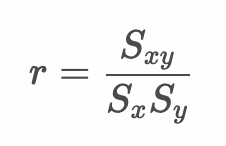

# 2変数データの要約 - クロス集計表


* 質的変数同士の関係は連関と呼ぶ
* 量的変数同士の関係は相関と呼ぶ
* 量的変数同士の関係は散布図で表現できるのに対して、質的変数同士の関係はクロス集計表で表現する

---

## （例）プログラミング言語の学習経験

| R言語の学習経験 | Pythonの学習経験 | PHPの学習経験 |
|:--:|:--:|:--:|
| Yes | Yes | No |
| Yes | Yes | No |
| No | Yes | Yes |
| Yes | No | No |
| Yes | Yes | No |
| Yes | Yes | Yes |
| Yes | Yes | No |
| No | No | Yes |
| Yes | Yes | No |
| Yes | Yes | No |
| Yes | Yes | No |
| No | No | Yes |
| Yes | Yes | No |
| No | No | Yes |
| No | Yes | No |
| Yes | Yes | Yes |
| Yes | No | No |
| Yes | Yes | Yes |
| Yes | Yes | No |
| Yes | No | No |

---

## クロス集計表

* 質的変数を集計した表
* 縦軸を表側、横軸を表頭と呼ぶ
* 2つの質的変数の連関を調べることができる


### RとPythonのクロス集計表

|<br>|Python<br>Yes|Python<br>No|合計|
|:--:|:--:|:--:|:--:|
|R - Yes|12|3|15|
|R - No|2|3|5|
|合計|14|6|20|

### PythonとPHPのクロス集計表

|<br>|PHP<br>Yes|PHP<br>No|合計|
|:--:|:--:|:--:|:--:|
|Python - Yes|4|10|14|
|Python - No|3|3|6|
|合計|7|13|20|

### PHPとRのクロス集計表

|<br>|R<br>Yes|R<br>No|合計|
|:--:|:--:|:--:|:--:|
|PHP - Yes|3|4|7|
|PHP - No|12|1|13|
|合計|15|5|20|

---

## ファイ係数

* 2値変数（0,1のいずれかの値をとる変数）の相関係数



### （例）プログラミング言語の学習経験 - 1,0変換後

| R言語の学習経験 | Pythonの学習経験 | PHPの学習経験 |
|:--:|:--:|:--:|
| 1 | 1 | 0 |
| 1 | 1 | 0 |
| 0 | 1 | 1 |
| 1 | 0 | 0 |
| 1 | 1 | 0 |
| 1 | 1 | 1 |
| 1 | 1 | 0 |
| 0 | 0 | 1 |
| 1 | 1 | 0 |
| 1 | 1 | 0 |
| 1 | 1 | 0 |
| 0 | 0 | 1 |
| 1 | 1 | 0 |
| 0 | 0 | 1 |
| 0 | 1 | 0 |
| 1 | 1 | 1 |
| 1 | 0 | 0 |
| 1 | 1 | 1 |
| 1 | 1 | 0 |
| 1 | 0 | 0 |

> ここでは `Yes` を `1` 、 `No` を `0` に変換しています。

### RとPythonのクロス集計表とファイ係数

|<br>|Python<br>Yes|Python<br>No|合計|
|:--:|:--:|:--:|:--:|
|R - Yes|12|3|15|
|R - No|2|3|5|
|合計|14|6|20|

```
Rの標準偏差： 0.433
Pythonの標準偏差： 0.458
RとPythonの共分散： 0.075
RとPythonのファイ係数： 0.075 / (0.433 * 0.458) = 0.378
```

### PythonとPHPのクロス集計表とファイ係数

|<br>|PHP<br>Yes|PHP<br>No|合計|
|:--:|:--:|:--:|:--:|
|Python - Yes|4|10|14|
|Python - No|3|3|6|
|合計|7|13|20|

```
Pythonの標準偏差： 0.458
PHPの標準偏差： 0.497
PythonとPHPの共分散： -0.015
PythonとPHPのファイ係数： -0.015 / (0.458 * 0.497) = -0.066
```


### PHPとRのクロス集計表とファイ係数

|<br>|R<br>Yes|R<br>No|合計|
|:--:|:--:|:--:|:--:|
|PHP - Yes|3|4|7|
|PHP - No|12|1|13|
|合計|15|5|20|

```
PHPの標準偏差： 0.497
Rの標準偏差： 0.433
PHPとRの共分散： -0.087
PHPとRのファイ係数： -0.087 / (0.497 * 0.433) = -0.406
```

---

## Rプログラミング

以下のデータを `pg.csv` という名前で保存しておきます。

```csv
R,Python,PHP
Yes,Yes,No
Yes,Yes,No
No,Yes,Yes
Yes,No,No
Yes,Yes,No
Yes,Yes,Yes
Yes,Yes,No
No,No,Yes
Yes,Yes,No
Yes,Yes,No
Yes,Yes,No
No,No,Yes
Yes,Yes,No
No,No,Yes
No,Yes,No
Yes,Yes,Yes
Yes,No,No
Yes,Yes,Yes
Yes,Yes,No
Yes,No,No
```

---

### クロス集計表 - tab1.R

* `table` 関数を使ってクロス集計表を表示できる

```r
pg_df <- read.csv("pg.csv")
table(pg_df$R, pg_df$Python)
table(pg_df$Python, pg_df$PHP)
table(pg_df$PHP, pg_df$R)
```

#### 実行結果

```r
> pg_df <- read.csv("pg.csv")
> table(pg_df$R, pg_df$Python)
     
      No Yes
  No   3   2
  Yes  3  12
> table(pg_df$Python, pg_df$PHP)
     
      No Yes
  No   3   3
  Yes 10   4
> table(pg_df$PHP, pg_df$R)
     
      No Yes
  No   1  12
  Yes  4   3
```

> 実行結果は辞書順でソートされるので "No", "Yes" の順で出力されます。`table(pg_df$R, pg_df$Python)[c("Yes", "No"), c("Yes", "No")]` のように行と列を指定して並び替え可能です。

```r
> table(pg_df$R, pg_df$Python)[c("Yes", "No"), c("Yes", "No")]
     
      Yes No
  Yes  12  3
  No    2  3
> table(pg_df$Python, pg_df$PHP)[c("Yes", "No"), c("Yes", "No")]
     
      Yes No
  Yes   4 10
  No    3  3
> table(pg_df$PHP, pg_df$R)[c("Yes", "No"), c("Yes", "No")]
     
      Yes No
  Yes   3  4
  No   12  1
```

---

### ファイ係数 - tab2.R

* `cor` 関数でファイ係数を算出できる

```r
pg_df <- read.csv("pg.csv")
pg_df$R <- ifelse(pg_df$R == "Yes", 1, 0)
pg_df$Python <- ifelse(pg_df$Python == "Yes", 1, 0)
pg_df$PHP <- ifelse(pg_df$PHP == "Yes", 1, 0)
cor(pg_df$R, pg_df$Python)
cor(pg_df$Python, pg_df$PHP)
cor(pg_df$PHP, pg_df$R)
```

#### 実行結果

```r
> pg_df <- read.csv("pg.csv")
> pg_df$R <- ifelse(pg_df$R == "Yes", 1, 0)
> pg_df$Python <- ifelse(pg_df$Python == "Yes", 1, 0)
> pg_df$PHP <- ifelse(pg_df$PHP == "Yes", 1, 0)
> cor(pg_df$R, pg_df$Python)
[1] 0.3779645
> cor(pg_df$Python, pg_df$PHP)
[1] -0.2058791
> cor(pg_df$PHP, pg_df$R)
[1] -0.5447048
```

---

## エクササイズ

1. 学生が1ヶ月に読んだ本の数（ `book` 列）と、試験結果（ `test` 列）をまとめたデータがあります。

```csv
book,test
2,Yes
1,No
0,No
1,Yes
0,No
1,No
3,Yes
2,Yes
5,Yes
1,No
0,No
0,No
1,No
6,Yes
2,Yes
0,No
1,Yes
0,No
0,Yes
0,No
```

上記のデータをbook_test.csvという名前で保存します。

月に1冊以上本を読んだ学生とそうでない学生に分け、試験結果とのクロス集計表を作成してください。またファイ係数を求めてください。

### 期待値 - クロス集計表

|<br>|試験結果<br>Yes|試験結果<br>No|合計|
|:--:|:--:|:--:|:--:|
|月1冊以上本を読む学生 - Yes|8|4|12|
|本読まない学生 - No|1|7|8|
|合計|9|11|20|

> `table` 関数の出力で構いません。

### 期待値 - ファイ係数

```
0.5333965
```


---

2. 学籍データの中間レポートと期末レポートについてクロス集計表（4x4）を作成してください。また各レポートの結果をA,B判定とそれ以外の2値に分割して、ファイ係数を求めてください。

| 学籍番号 | 年齢 | 中間レポート | 期末レポート | 中間テスト | 期末テスト |
|:--:|:--:|:--:|:--:|:--:|:--:|
| AI001 | 20 | A | A | 84 | 78 |
| AI002 | 21 | C | B | 72 | 76 |
| AI003 | 23 | A | A | 86 | 80 |
| AI004 | 20 | B | D | 76 | 50 |
| AI005 | 20 | C | B | 68 | 76 |
| AI006 | 21 | D | C | 68 | 70 |
| AI007 | 20 | C | D | 72 | 62 |
| AI008 | 22 | B | B | 66 | 80 |
| AI009 | 21 | A | B | 78 | 84 |
| AI010 | 22 | B | A | 84 | 88 |
| AI011 | 20 | B | B | 74 | 78 |
| AI012 | 20 | C | B | 60 | 78 |
| AI013 | 21 | B | A | 86 | 90 |
| AI014 | 22 | C | C | 76 | 72 |
| AI015 | 20 | D | C | 74 | 68 |
| AI016 | 21 | C | D | 76 | 66 |
| AI017 | 20 | C | D | 70 | 74 |
| AI018 | 24 | A | B | 82 | 86 |
| AI019 | 20 | A | A | 76 | 90 |
| AI020 | 22 | C | B | 78 | 72 |

> 以前に作成したCSVファイル（student.csv）を利用してください。
