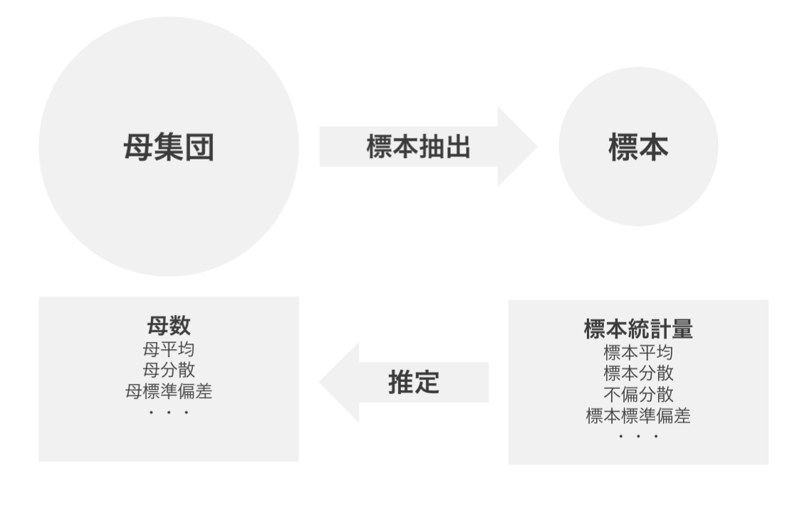
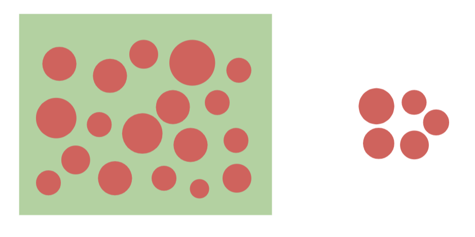
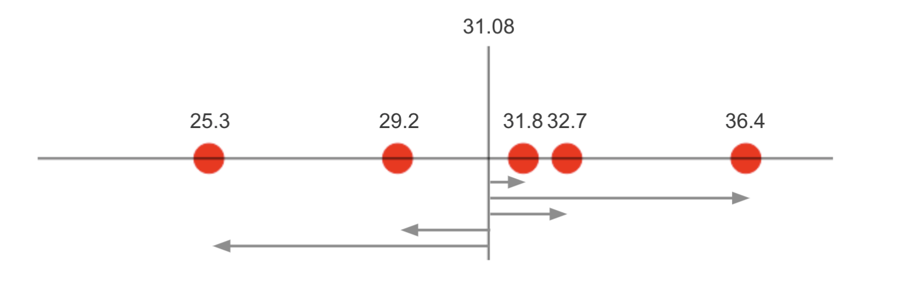
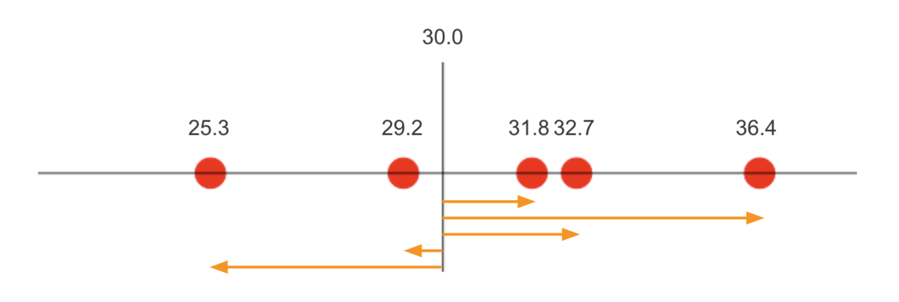

# 点推定



* 点推定では標本統計量を使って母数を1つの値で予測する
* 母平均の点推定には標本平均を使う
* 標本平均は母平均の不偏推定量である

---


## 推定量と推定値

* 母数の推定に使用する標本統計量を推定量と呼ぶ
* 推定量として算出した具体的な値を推定値と呼ぶ
* 推定量は数式（関数）であり、推定値は数式（関数）によって算出された値である

> 推定量の期待値が母数と一致する性質を不偏性と呼びます。また不偏性を持つ推定量のことを不偏推定量と呼びます。

---

## 例題 - ミニトマトのサイズ



ある品種のミニトマトのサイズについて以下の標本を作成しました。

```
31.8 36.4 32.7 29.2 25.3
※単位はmmとする
```

> 標本に含まれるデータの個数をサンプルサイズ（標本サイズ）と呼びます。この場合、サンプルサイズは 5 となります。

* このミニトマトの母平均を点推定してください。
* このミニトマトの母分散を点推定してください。


### 母平均の点推定

* 母平均の点推定には標本平均を使う

```
(31.8 + 36.4 + 32.7 + 29.2 + 25.3) / 5 = 31.08
```

> データの平均は、記述統計の文脈ではデータを要約する代表値であり、推測統計の文脈では母平均の点推定を行うという意味になります。


### 母分散の点推定

* 標本分散は不偏性を持たない
* 母分散の点推定には不偏分散を使う

```
((31.8 - 31.08)**2 + (36.4 - 31.08)**2 + (32.7 - 31.08)**2 + (29.2 - 31.08)**2 + (25.3 - 31.08)**2) / (5 - 1) = 17.097
```

### 参考：標本分散ではなく不偏分散を使う理由

* 標本分散は標本平均との距離を使って算出されるため、母分散をより小さな値となってしまう

```
標本分散（データの個数 n で割る）
((31.8 - 31.08)**2 + (36.4 - 31.08)**2 + (32.7 - 31.08)**2 + (29.2 - 31.08)**2 + (25.3 - 31.08)**2) / 5 = 13.6776
```

<br>

```
母集団における母平均が `30` だった場合
((31.8 - 30.0)**2 + (36.4 - 30.0)**2 + (32.7 - 30.0)**2 + (29.2 - 30.0)**2 + (25.3 - 30.0)**2) / 5 = 14.844
```

<br>


> 不偏分散を使うことで、標本分散の過小評価を補正することになります。

---

## 標本誤差

* 標本から算出した推定量（標本平均や不偏分散など）と、母集団の母数（母平均、母分散など）は完全に一致しない
* 標本抽出に伴う誤差を標本誤差という
* 標本からどのような推定値が得られるのか、 **標本分布** を理解しておく必要がある

> 標本分布とは標本統計量の分布です。標本のデータ（要素）の分布ではありません。標本分布の詳細については後述します。

---

## Rプログラミング

### 点推定 - estimate1.R

* `mean` 関数の引数に標本を与えると標本平均を算出できる
* `var` 関数の引数に標本を与えると不偏分散を算出できる

```r
sample <- c(31.8, 36.4, 32.7, 29.2, 25.3)
mean(sample)
var(sample)
```

#### 実行結果

```r
> sample <- c(31.8, 36.4, 32.7, 29.2, 25.3)
> mean(sample)
[1] 31.08
> var(sample)
[1] 17.097
```

---

## エクササイズ

1. 以下のデータを母集団とみなして、サンプルサイズ5の標本を作成して、母平均を点推定してください。

```
171 173 169 173 161 171 167 167 177 164 178 168 167 166 170 166 169 169 168 162
```

2. 以下のURLから母集団データをダウンロードします。任意のサンプルサイズを指定して標本を作成して、母平均、母分散を点推定してください。

```
https://gist.githubusercontent.com/murayama333/7433f62321fc684330068a5cf96cbc94/raw/4a6ed7d30a53b77540c8ee973520309169eb1aba/my_data.csv
```

> サンプルサイズの指定によって結果にどのような影響があるかを分析してください。
