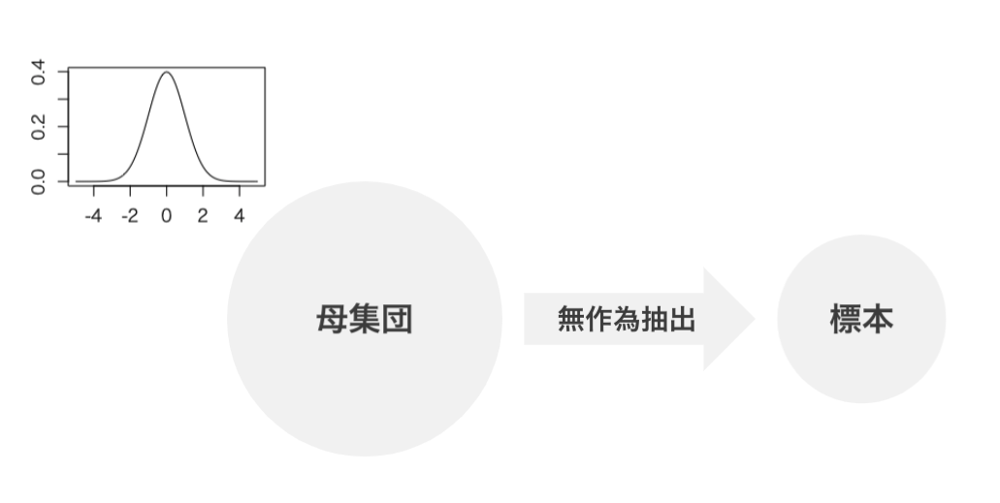
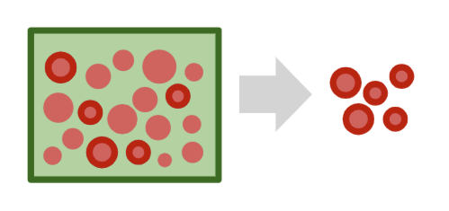
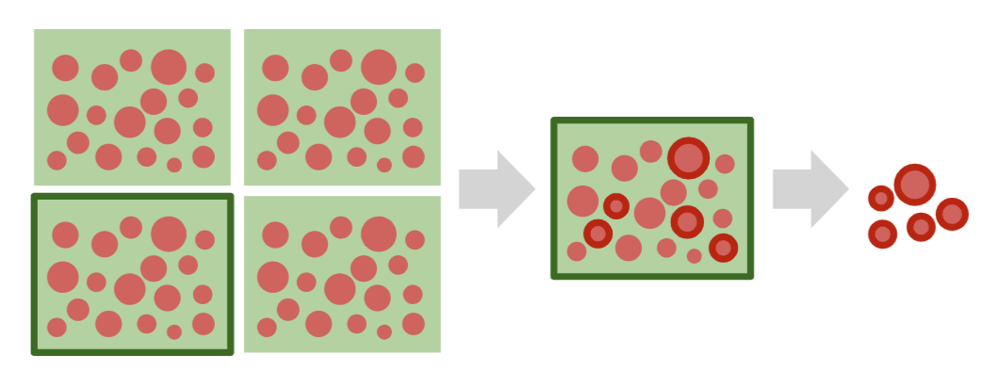
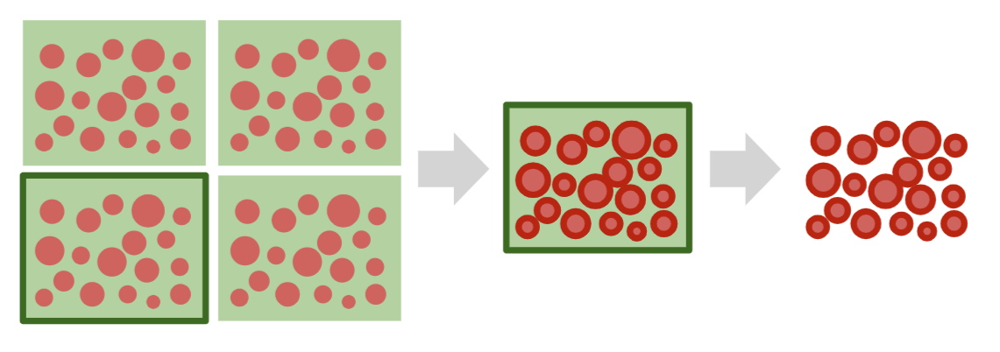
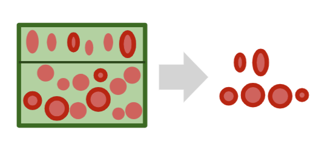
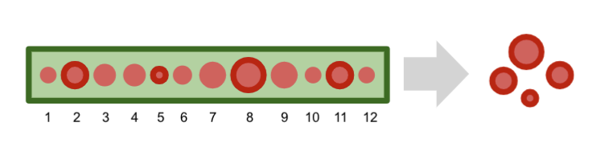

# 標本抽出（サンプリング）

* 母集団から標本を抽出すること
* 標本抽出は、標本をランダムに抽出する無作為抽出が基本となる
* 実際の標本抽出にはコストがかかるため、様々な標本抽出方法がある

---

## 無作為抽出法(Random Sampling)

* 母集団から標本をランダムに抽出すること
* 復元抽出と非復元抽出がある
* 無作為抽出によって取得した1つのデータ（標本を構成する要素）の確率分布は母集団分布と同じになる

---

## 単純無作為抽出法(Simple Random Sampling)

* 母集団のすべての要素を対象として無作為抽出を行う方法

> 単純無作為抽出法は標本抽出の基本となる手法です。 SRS（Simple Random Sampling）と表現されることもあります。

---

## 標本抽出の手法

* 標本抽出は無作為抽出法（単純無作為抽出法）がベースとなる
* 実際の標本抽出はコストのかかる作業である
* 効率良く標本抽出を行うための手法が存在する 
  * 多段抽出法
  * クラスター抽出法
  * 層化抽出法
  * 系統抽出法  

---

### 多段抽出法

* 母集団をグループ（段）に分けて、グループそのものを無作為抽出する。取り出したグループ（段）に対して標本を無作為抽出する

> 上記の図の場合は2段抽出法と呼ぶこともあります。

---

### クラスター抽出法

* 母集団をグループ（段）に分けて、グループそのものを無作為抽出する。取り出したグループのデータすべてを標本とする

---

### 層化抽出法

* 母集団を特性によって層に分けて、層ごとの割合に着目して各層から標本を無作為抽出する

> 上記の図の場合、形状ごとに層に分けて、層ごとの個体数の割合に着目して、無作為抽出を行っています。

---

### 系統抽出法

* 母集団データに番号を割り振り、1つ目のデータをランダムに抽出してから等間隔で標本を抽出する

---

## 母集団から標本をを無作為抽出することの意味

* 標本は母集団から確率的に発生している
* 無作為抽出によって取得した1つのデータ（標本を構成する要素）の確率分布は母集団分布と同じになる
* 標本を確率変数として考える

---
