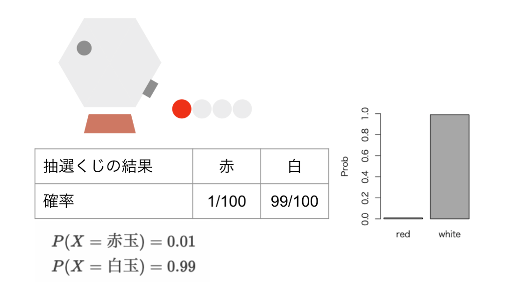
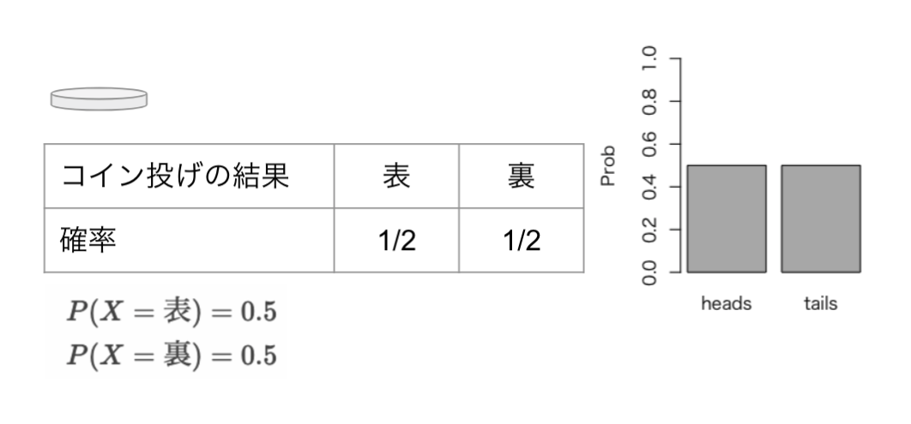
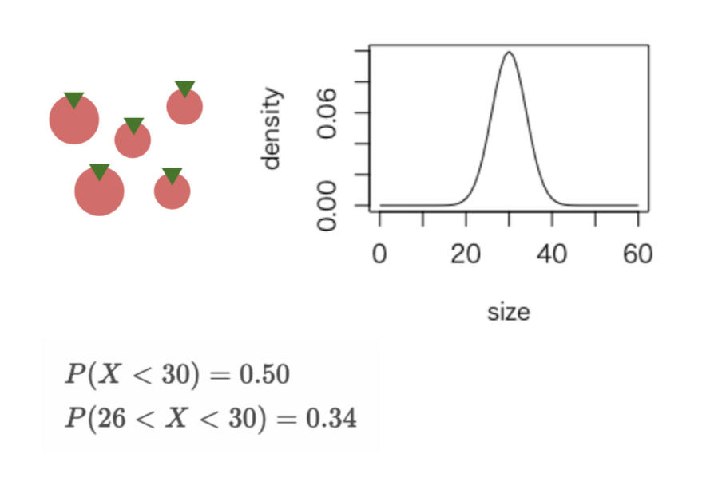
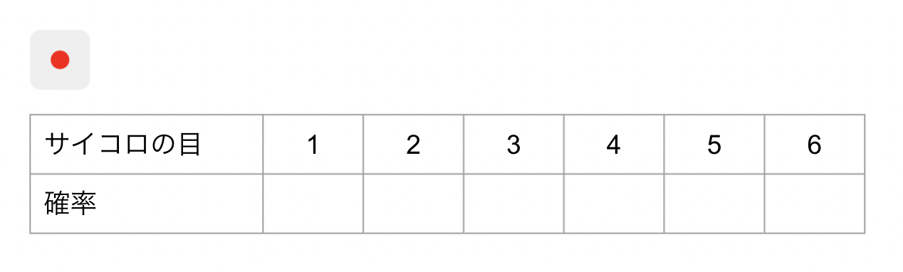
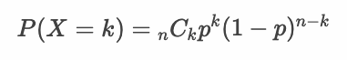
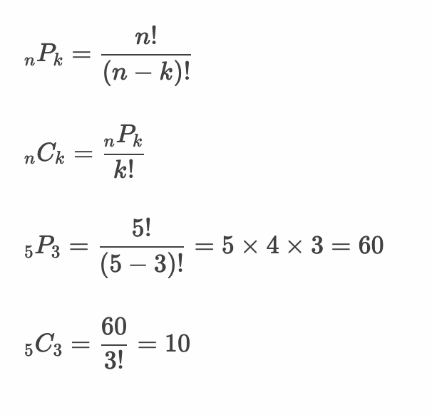

# 確率変数

* 確率変数とは確率によって値の決まる変数
* 母集団から単純無作為抽出した標本を確率変数として考える
* 単純無作為抽出した1つのデータ（標本を構成する要素）の確率分布は母集団分布と同じになる

---

## 確率変数と確率分布

* 確率変数とは確率によって値の決まる変数
* 確率変数には離散型確率変数と連続型確率変数がある
* 確率分布とは確率変数のとりうる値についての確率を表したもの

> 確率分布は表やグラフ、数式（確率質量関数や確率密度関数など）で表現できます。

### 例：抽選くじ

* 抽選くじの中に赤玉1個、白玉99個が存在する場合、確率変数「抽選くじ」は以下のような確率分布となる

---

## 離散型確率変数 - 例：コイン投げ

* 変数の値が離散値をとる確率変数
* 「コイン投げの結果」を確率変数として考えた場合、以下のような確率分布となる

> 「コイン投げの結果」のような2値の確率分布をベルヌーイ分布と呼びます。

---

## 連続型確率変数 - 例：ミニトマトのサイズ

* 変数の値が連続値をとる確率変数
* 連続型確率分布は表で表現することが難しい
* 「ミニトマトのサイズ」を確率変数として考えた場合、以下のような確率分布となる

> 「ミニトマトのサイズ」の例のように平均値の周辺に値が分布することを正規分布（ガウス分布）と呼びます。

---

## エクササイズ

1. 「サイコロの出目」について確率変数として考えた場合、確率分布を求めてください。

2. 「2つのサイコロの出目の和」について確率変数として考えた場合、確率分布を求めてください。

3. 「2枚のコイン投げで表の出る回数」について確率変数として考えた場合、確率分布を求めてください。

4. 「3枚のコイン投げで表の出る回数」について確率変数として考えた場合、確率分布を求めてください。

5. 「4枚のコイン投げで表の出る回数」について確率変数として考えた場合、確率分布を求めてください。

> このような計算は二項分布の確率関数（確率質量関数）で確率を計算できます。`n` は試行回数、`k` は表が出る回数です。

6. 表の出る確率が30%のコインがあるものとする。このコインを使って「4枚のコイン投げで表の出る回数」について確率変数として考えた場合、確率分布を求めてください。

---

### 参考：順列と組み合わせ

<!-- 

1. 「サイコロの出目」について確率変数として考えた場合、確率分布を求めてください。

|X|1|2|3|4|5|6|
|:-:|:-:|:-:|:-:|:-:|:-:|:-:|
|P(X)|1/6|1/6|1/6|1/6|1/6|1/6|

2. 「2つのサイコロの出目の和」について確率変数として考えた場合、確率分布を求めてください。

|X|2|3|4|5|6|7|8|9|10|11|12|
|:-:|:-:|:-:|:-:|:-:|:-:|:-:|:-:|:-:|:-:|:-:|:-:|
|P(X)|1/36|2/36|3/36|4/36|5/36|6/36|5/36|4/36|3/36|2/36|1/36|

3. 「2枚のコイン投げで表の出る回数」について確率変数として考えた場合、確率分布を求めてください。

|X|0|1|2|
|:-:|:-:|:-:|:-:|
|P(X)|1/4|2/4|1/4|

dbinom(0:2, 2, 0.5)

4. 「3枚のコイン投げで表の出る回数」について確率変数として考えた場合、確率分布を求めてください。

|X|0|1|2|3|
|:-:|:-:|:-:|:-:|:-:|
|P(X)|1/8|3/8|3/8|1/8|

dbinom(0:3, 3, 0.5)

5. 「4枚のコイン投げで表の出る回数」について確率変数として考えた場合、確率分布を求めてください。

|X|0|1|2|3|4|
|:-:|:-:|:-:|:-:|:-:|
|P(X)|0.0625|0.2500|0.3750|0.2500|0.0625|

dbinom(0:4, 4, 0.5)

choose(4, 0) * 0.5^0* 0.5^4

-->

