# 正規分布(Normal Distribution)

* 平均を中心に左右対称に分布する釣り鐘型の確率分布
* 連続型の確率分布の一つ
* もっとも自然な確率分布であるため頻繁に利用される

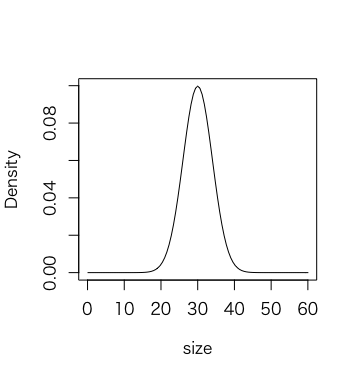

---

## 正規分布の表記

* 正規分布は `N` で表現する
* 正規分布は平均と分散（標準偏差）の2つのパラメータで確率分布が決まる
* 正規分布の表記（ `N` のパラメータ）には標準偏差ではなく分散を記述することが一般的である

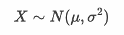

> 「確率変数 X は 平均 μ、分散 σ^2 の正規分布にしたがう」と読みます。

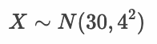

> 「確率変数 X は 平均 30、分散 4^2 の正規分布にしたがう」と読みます。

---

## 確率密度関数

* 正規分布の縦軸は確率（Probability）ではなく確率密度（Probability Density）である
* 正規分布の確率密度は以下の確率密度関数（PDF：Probability Density Function）から算出できる

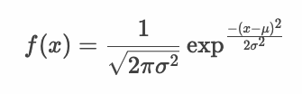

> π と exp は定数です。また μ と σ^2 は正規分布のパラメータとして決まります。


* 連続型確率変数の範囲を指定して確率密度関数の積分を求めることで確率を算出できる

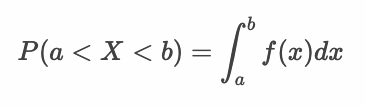

> 密度は体積を掛けることで質量を算出できます。同様に人口密度に面積を掛けると人口を算出できます。確率密度も連続型確率変数のとりうる範囲を指定して面積を求めることで確率を算出できます。Rを使えば簡単に確率を算出できます。

### my_norm.R

* Rで正規分布の確率密度関数を自作する場合、以下のようになる

```r
my_norm <- function(x, mu = 0, sigma = 1) {
  (1 / sqrt(2 * pi * sigma^2)) * exp(-(x - mu)^2 / (2 * sigma^2))
}

my_x <- seq(-3, 3.1, 0.1)
my_y <- my_norm(my_x)
plot(my_x, my_y, type="l")
```

#### 実行結果

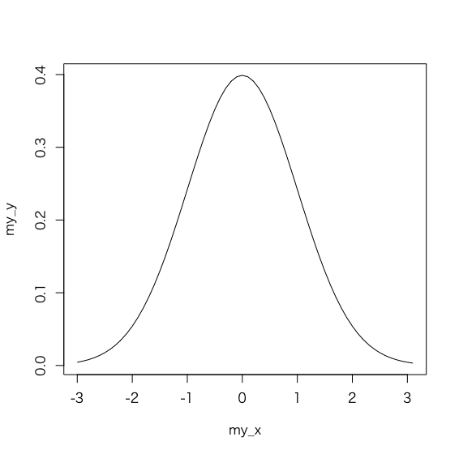

> Rには正規分布を取り扱う関数群が用意されています。これらの使い方については後述します。


---

## 正規分布のパラメータ

### 平均の影響

* 正規分布のパラメータである平均を変化させるとグラフの中心が移動する
* 黒色のグラフ 平均：0 分散：1 の正規分布
* 赤色のグラフ 平均：2 分散：1 の正規分布

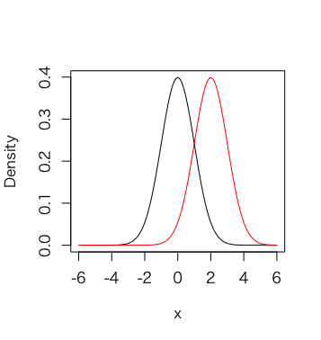

> 黒色のグラフは N(0, 1) の正規分布です。赤色のグラフは N(2, 1) の正規分布です。

### 分散（標準偏差）の影響

* 正規分布のパラメータである分散（標準偏差）を変化させるとグラフのばらつきが変化する
* 黒色のグラフ 平均：0 分散：1 の正規分布
* 青色のグラフ 平均：0 分散：2 の正規分布

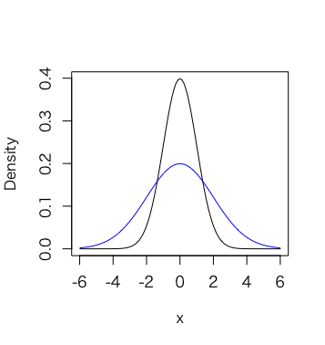

> 黒色のグラフは N(0, 1) の正規分布です。青色のグラフは N(0, 2) の正規分布です。

---

## 標準正規分布

* 平均：0、分散（標準偏差）：1 の正規分布


* データの標準化（z-score）を行うことで標準正規分布に変換できる

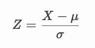

* 標準正規分布の確率密度関数

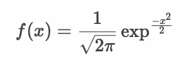

---

## 標準正規分布表

* データを標準化することで標準正規分布に沿って確率を計算できる
* 標準正規分布の確率は標準正規分布表から簡単に算出できる
* 標準正規分布の上側確率は以下のようになる

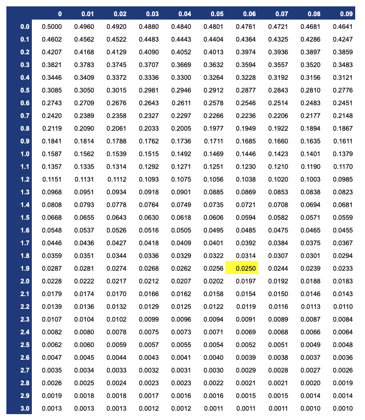

> たとえばデータを標準化した値（z-score）が1.96の場合、上側確率2.5%を意味します。

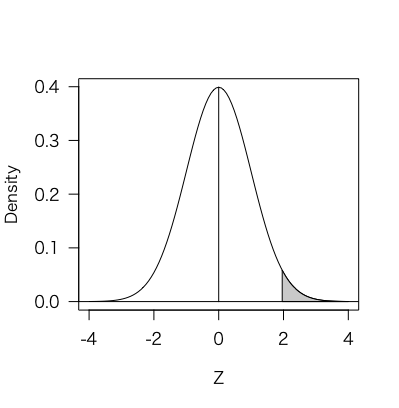

### my_norm2.R

* 正規分布の確率密度関数を積分することで確率を求める

```r
my_norm <- function(x, mu = 0, sigma = 1) {
  (1 / sqrt(2 * pi * sigma^2)) * exp(-(x - mu)^2 / (2 * sigma^2))
}

integrate(my_norm, -Inf, 0)
integrate(my_norm, 1.96, Inf)
```

#### 実行結果

```r
> my_norm <- function(x, mu = 0, sigma = 1) {
+   (1 / sqrt(2 * pi * sigma^2)) * exp(-(x - mu)^2 / (2 * sigma^2))
+ }
> 
> integrate(my_norm, -Inf, 0)
0.5 with absolute error < 4.7e-05
> integrate(my_norm, 1.96, Inf)
0.0249979 with absolute error < 1.9e-05
```

---

## 正規分布における標準偏差の意味

* 平均から±1.64σの範囲にデータの約90%が存在する
* 平均から±1.96σの範囲にデータの約95%が存在する
* 平均から±2.58σの範囲にデータの約99%が存在する

> 大雑把にいえば以下のように捉えることもできます。

* 平均から標準偏差1つ分の範囲（±1σ）にデータの約68%が存在する
* 平均から標準偏差2つ分の範囲（±2σ）にデータの約95%が存在する
* 平均から標準偏差3つ分の範囲（±3σ）にデータの約99.7%が存在する

> このような特性は正規分布であることを条件としています。正規分布にしたがわないケースにおいては、チェビシェフの不等式（平均から±kσ離れたデータは全体の 1/k^2 以下となる）などを考えます。

### my_norm3.R

* 正規分布と標準偏差の関係を確認する

```r
my_norm <- function(x, mu = 0, sigma = 1) {
  (1 / sqrt(2 * pi * sigma^2)) * exp(-(x - mu)^2 / (2 * sigma^2))
}

integrate(my_norm, -1.64, 1.64)
integrate(my_norm, -1.96, 1.96)
integrate(my_norm, -2.58, 2.58)
```

#### 実行結果

```r
> my_norm <- function(x, mu = 0, sigma = 1) {
+   (1 / sqrt(2 * pi * sigma^2)) * exp(-(x - mu)^2 / (2 * sigma^2))
+ }
> 
> integrate(my_norm, -1.64, 1.64)
0.8989948 with absolute error < 6.8e-14
> integrate(my_norm, -1.96, 1.96)
0.9500042 with absolute error < 1e-11
> integrate(my_norm, -2.58, 2.58)
0.99012 with absolute error < 1.9e-08
```

---

## Rプログラミング

### rnorm 関数  - norm1.R

* `rnorm` 関数は正規分布から乱数を生成する
* `rnorm` 関数は第1引数に生成する乱数の数、`mean` 引数、`sd` 引数に正規分布のパラメータである平均値と標準偏差を指定する

```r
x <- rnorm(10000, mean = 0, sd = 1)
hist(x)
```

#### 実行結果

```r
> x <- rnorm(10000, mean = 0, sd = 1)
> hist(x)
```

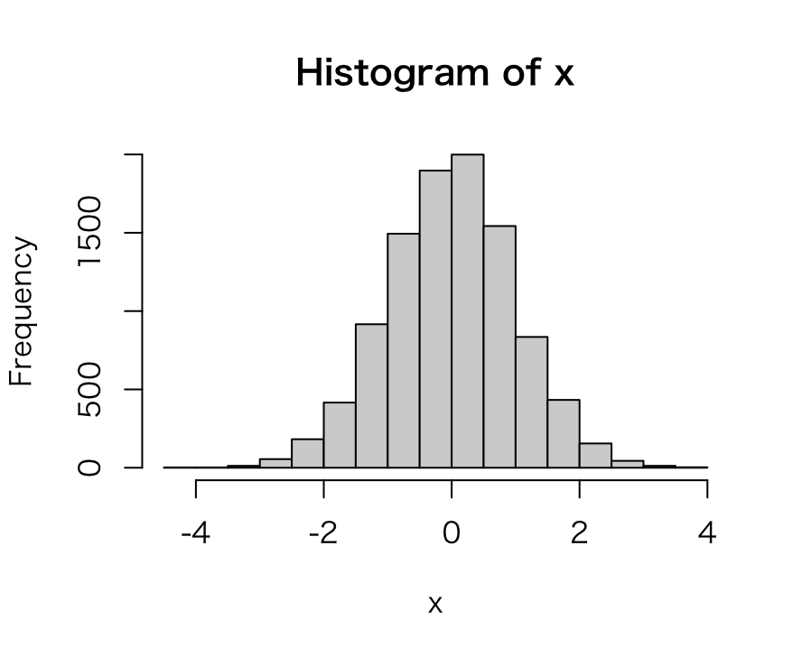


---

### dnorm 関数  - norm2.R

* `dnorm` 関数は正規分布の確率密度関数から確率密度を算出する
* `dnorm` 関数は第1引数に確率密度を求める点（quantile、分位数、確率点）、`mean` 引数、`sd` 引数に正規分布のパラメータである平均値と標準偏差を指定する

```r
x <- seq(-3, 3, 0.01)
y <- dnorm(x, mean = 0, sd = 1)
plot(x, y, type = "l")
```

#### 実行結果

```r
> x <- seq(-3, 3, 0.01)
> y <- dnorm(x, mean = 0, sd = 1)
> plot(x, y, type = "l")
```

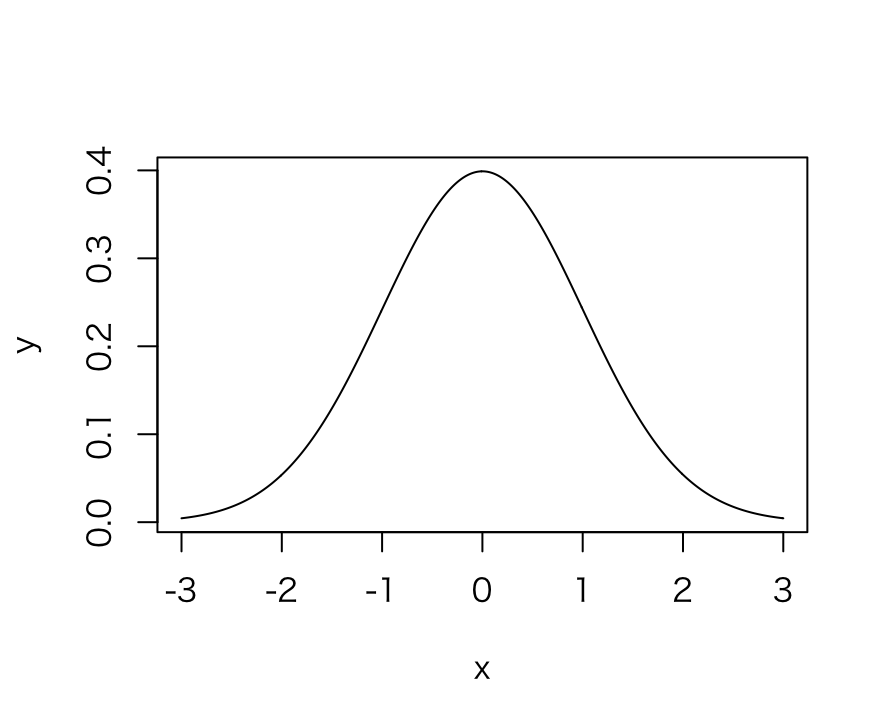

---

### pnorm 関数  - norm3.R

* `pnorm` 関数は正規分布の確率密度関数から確率（デフォルトは下側確率）を算出する
* `pnorm` 関数は第1引数に確率を求める点（quantile、分位数、確率点）、`mean` 引数、`sd` 引数に正規分布のパラメータである平均値と標準偏差を指定する
* `pnorm` 関数は `lower.tail` 引数に `FALSE` を指定することで上側確率を算出できる

```r
pnorm(1.96, mean = 0, sd = 1)
pnorm(1.96, mean = 0, sd = 1, lower.tail = F)
```

#### 実行結果

```r
> pnorm(1.96, mean = 0, sd = 1)
[1] 0.9750021
> pnorm(1.96, mean = 0, sd = 1, lower.tail = F)
[1] 0.0249979
```

---

### qnorm 関数  - norm4.R

* `qnorm` 関数は正規分布の確率から確率点（quantile、分位数）を算出する
* `qnorm` 関数は第1引数に確率、`mean` 引数、`sd` 引数に正規分布のパラメータである平均値と標準偏差を指定する
* `pnorm` 関数は `lower.tail` 引数に `FALSE` を指定することで上側からの確率点を算出できる

```r
qnorm(0.975, mean = 0, sd = 1)
qnorm(0.025, mean = 0, sd = 1, lower.tail = F)
```

#### 実行結果

```r
> qnorm(0.975, mean = 0, sd = 1)
[1] 1.959964
> qnorm(0.025, mean = 0, sd = 1, lower.tail = F)
[1] 1.959964
```

---

## エクササイズ

1. 正規分布（平均：30、分散：16） に従う乱数を10,000件生成して、ヒストグラムを表示してください。

2. 上記の10,000件の乱数を標準化してヒストグラムを表示してください。

3. 正規分布（平均：30、分散：16）において、確率点 34 における上側確率を求めてください。 

4. 正規分布（平均：30、分散：16）において、確率（下側確率） 50% における確率点を求めてください。 

5. 正規分布（平均：30、分散：16） の確率密度関数の出力結果をグラフで表示してください。ただし、x軸の範囲は0〜60までとします。


<!--
# 正規分布（平均：30、分散：16） に従う乱数を10,000件生成して、ヒストグラムを表示してください。
x <- rnorm(10000, 30, 4)
hist(x)

# 上記の10,000件の乱数を標準化してヒストグラムを表示してください。
m <- mean(x)
s <- sqrt(var(x) * (length(x) - 1) / length(x))
z <- (x - m) / s
hist(z)

# 正規分布（平均：30、分散：16）において、確率点 34 における上側確率を求めてください。
pnorm(34, mean = 30, sd = 4, lower.tail = F)

# 正規分布（平均：30、分散：16）において、確率（下側確率） 50% における確率点を求めてください。
qnorm(0.5, mean = 30, sd = 4)

# 正規分布（平均：30、分散：16） の確率密度関数の出力結果をグラフで表示してください。ただし、x軸の範囲は0〜60までとします。
x <- seq(0, 60, 0.1)
y <- dnorm(x, mean = 30, s = 4)
plot(x, y, type = "l")

 -->