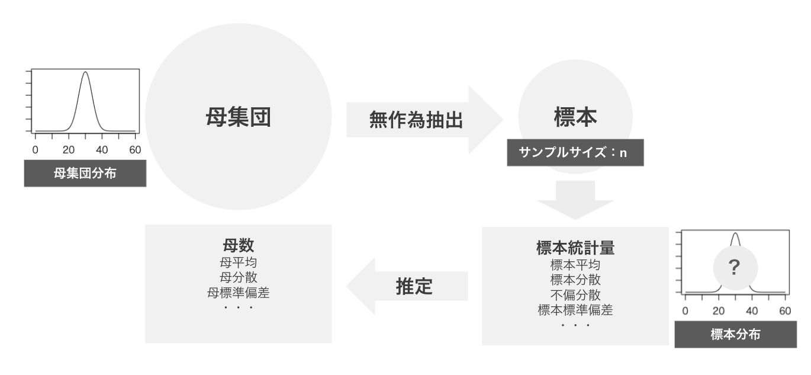
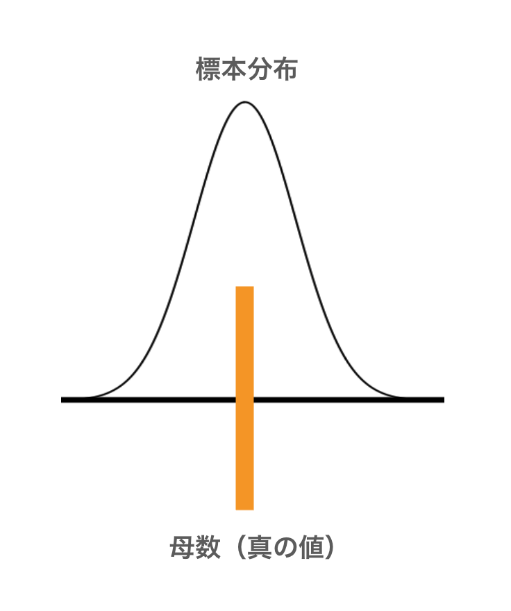
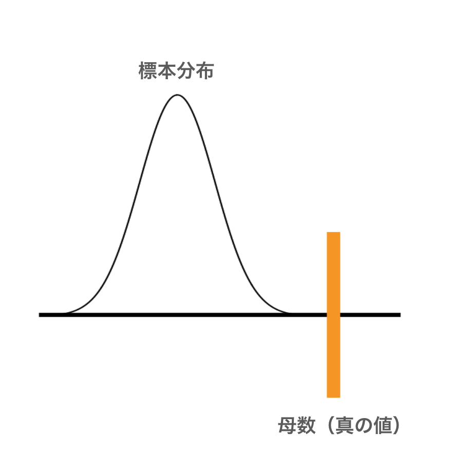
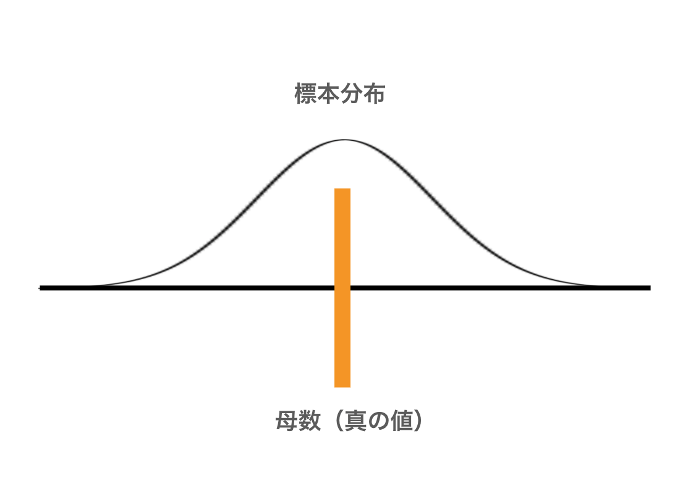
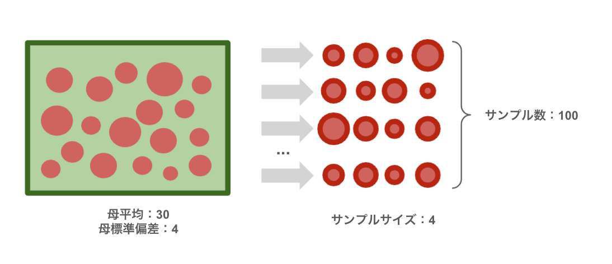
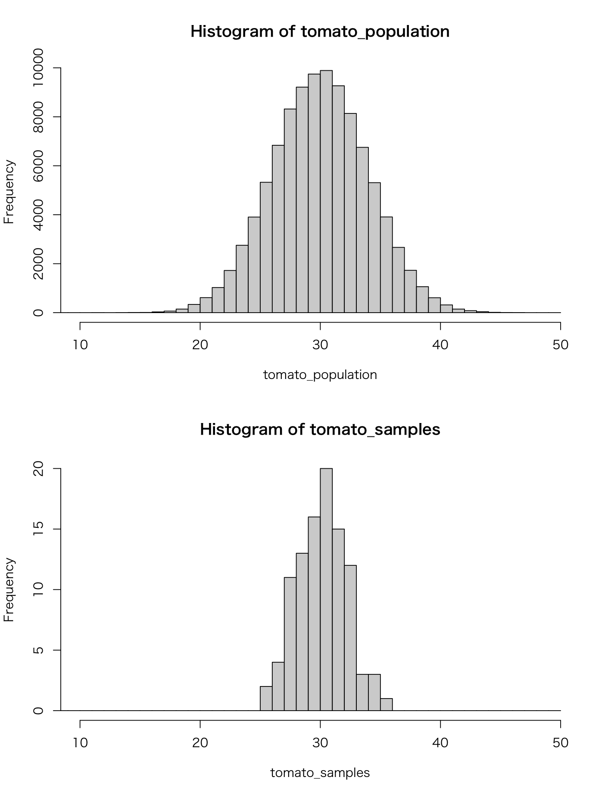
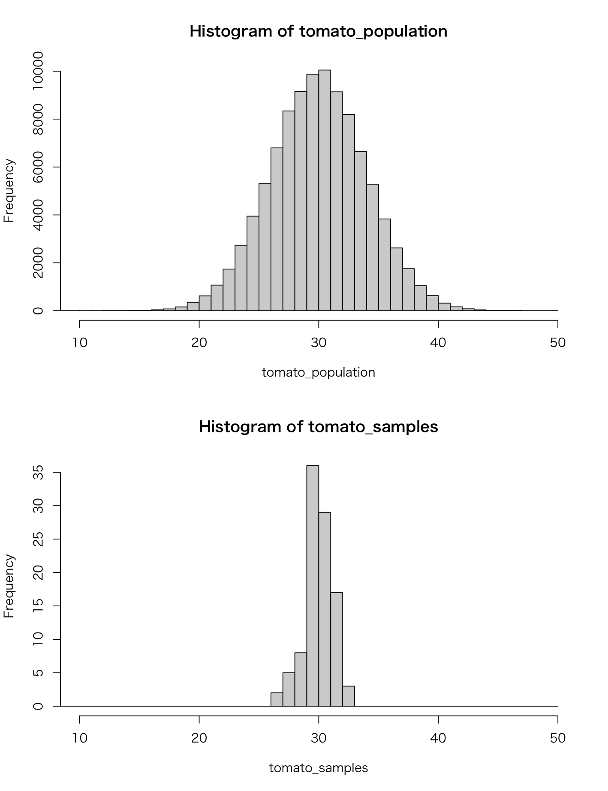
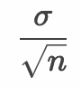

# 母集団分布と標本分布



---

## 母集団分布

* 母集団の持つ分布を母集団分布と呼ぶ
* 正規分布している母集団を正規母集団と呼ぶ
* 正規分布は平均と分散（標準偏差）の2つのパラメータによって分布の形状が決まる


> 以降の学習では「母集団は正規分布している」という前提のもとに連続型確率変数の区間推定や仮説検定について学習していきます。離散型変数や離散型分布については後の章で学習します。

---

## 標本分布

* 標本平均や不偏分散など、標本統計量の分布を標本分布と呼ぶ
* 標本分布は母集団分布、標本統計量の種類、サンプルサイズによって決まる
* 確率変数である標本のデータから計算される標本統計量も確率変数である

> 標本分布は**標本統計量**の確率分布です。**標本に含まれる個別データの分布ではありません。**

---

## 標本分布と母数の関係

* 標本統計量（推定量）の標本分布を使って母数を推定する
* 標本分布は母数を中心にばらつく必要がある（不偏性）
* 標本分布のばらつきが大きいと参考にならない（標準誤差）



> 上記のような標本分布は母数を中心に、狭い範囲でばらつきが確認できるため好ましい状態といえます。



> 上記のような標本分布は母数を中心に捉えていないため推定に利用できません。推定量に不偏性がありません。



> 上記のような標本分布は母数を中心に捉えているがばらつきが大きいため推定の誤差が大きくなります。標本分布のばらつき（標準誤差）を小さくする必要があります。

---

## 不偏性

* 推定量の期待値（標本分布の平均（中心））が母数の値と一致することを不偏性と呼ぶ
* 推定量の中で不偏性のあるものを不偏推定量と呼ぶ
* 標本平均は母平均の不偏推定量であり、不偏分散は母分散の不偏推定量である

> 標本統計量の中で推定に利用するものを推定量と呼びます。

---

## 標準誤差

* 推定量（標本分布）の標準偏差のこと
* 標準誤差が小さいほど母数推定時のばらつきが小さくなる
* 標本誤差はSE（Standard Error）と表現される

---

## 例： ミニトマトの母集団分布と標本分布

ここでは母集団分布と標本分布の関係性について見ていきます。題材としてある品種のミニトマトの大きさについて考えます。ミニトマトの大きさ（単位mm）の母集団の分布は `N(30, 16)` の正規分布に従うものとします。このミニトマトの母集団からサンプルサイズ（標本サイズ）4の標本を100セット作成し、個々の標本から標本平均を算出して、標本平均の分布（標本分布）を確認してみることにします。



> 注意：ここでは母集団分布と標本分布の特性を理解するために100セットの標本を作成しています。実際には標本を100セットも集めることは一般的ではありません。

次のプログラムを作成します。

```r
mu <- 30
sigma <- 4
tomato_population <- rnorm(100000, mean = mu, sd = sigma)
tomato_sample_size <- 4 
tomato_samples <- numeric(100)
for (i in 1:length(tomato_samples)) {
  tomato_samples[i] <- mean(sample(tomato_population, tomato_sample_size))
}
par(mfrow = c(2, 1))
hist(tomato_population, xlim = c(10, 50), breaks = seq(0, 50, 1))
hist(tomato_samples, xlim = c(10, 50), breaks = seq(0, 50, 1))
```

変数 `mu` 、 `sigma` は母集団のパラメータである母平均と母分散を意味します。次に `tomato_population` 変数はミニトマトの母集団を表現しています。この母集団データは正規分布にしたがうものとするため `rnorm` 関数で生成します。

次に `tomato_sample_size` 変数を定義して値を `4` としています。これはサンプルサイズ（標本サイズ）を意味しています。 `tomato_samples` 変数はサンプルサイズ 4 の標本を100セット保持できるように定義しています。実際の無作為抽出は `sample` 関数を使ってサンプルサイズ 4 の標本を抽出しています。

最後に `par` 関数、`hist` 関数を使って母集団分布と標本分布のヒストグラムを並べて表示します。

プログラムを実行すると次のような結果を確認できるでしょう。



### 母集団分布と標本平均の標本分布

母集団分布と標本平均の標本分布の2つを比較してみましょう。以下の2つの点に気づくでしょう。

1. ヒストグラムの中心（平均）はほとんど同じ
1. 標本平均の標本分布は母集団分布に比べてばらつきが小さい

1つ目の中心が同じという点は、標本平均が母集団の母平均を推定する不偏推定量であることを意味しています。

2つ目のばらつきが小さくなるのはなぜなのでしょうか。その原因を確かめるためにさきほどのプログラムのサンプルサイズ（標本サイズ）を変更して見ましょう。

```r
tomato_sample_size <- 16 
```

ここではサンプルサイズを 4 から 16 に変更しました。実際にヒストグラムを並べると次のようになります。



サンプルサイズを `4` から `16` に変更すると標本平均の標本分布のばらつきがさらに小さくなったことがわかります。

実は正規母集団から作成した標本平均の標本分布は次のような正規分布にしたがうことが知られています。


上記の `n` はサンプルサイズを意味します。つまり標本平均の標本分布は母集団分布と平均値は変わらないのですが、その分散はサンプルサイズ `n` が大きくなるほど小さくなるのです。

また標本分布の分散の平方根である標準偏差は標準誤差（SE）と呼びます。標準誤差は以下のように表現できます。 



標本平均を以下のように標準化（z-score）した場合、標準正規分布にしたがいます。


> 標準正規分布に従う確率変数は標準正規分布表によって簡単に確率に変換できます。

ここまでの考察についてまとめましょう。

母集団は平均：30、標準偏差：4 の正規分布にしたがっています。そのためサンプルサイズが 4 の場合、標本平均の標本分布は平均：30、標準偏差（標準誤差）：2 の正規分布となります。

同様にサンプルサイズが 16 の場合、標本平均の標本分布は平均：30、標準偏差（標準誤差）：1 の正規分布となります。

このように標本分布はサンプルサイズによって変化することがわかります。

> このような母集団と標本平均の標本分布の関係性の背景には中心極限定理と呼ばれる定理があります。中心極限定理については後述します。

---

## エクササイズ

正規分布（平均：50、標準偏差：10） に従う乱数を100,000件生成して母集団データとします。その母集団データからサンプルサイズ 10 の標本を1,000セット作成します。

1. 標本の平均値（標本平均）の標本分布をヒストグラムで表示してください。

2. 標本の不偏分散の標本分布をヒストグラムで表示してください。

<!-- 

## エクササイズ

# 正規分布（平均：50、標準偏差：10） に従う乱数を100,000件生成して母集団データとします。
# その母集団データからサンプルサイズ 10 の標本を1,000セット作成します。
population <- rnorm(100000, 50, 10)
mean_samples <- numeric(1000)
median_samples <- numeric(1000)
var_samples <- numeric(1000)
var2_samples <- numeric(1000)
for (i in 1:1000) {
  s <- sample(population, 10)
  mean_samples[i] <- mean(s)
  median_samples[i] <- median(s)
  var_samples[i] <- var(s) * (length(s) - 1) / length(s)
  var2_samples[i] <- var(s)
}
#1. 標本の平均値（標本平均）の標本分布をヒストグラムで表示してください。
hist(mean_samples)

#2. 標本の中央値の標本分布をヒストグラムで表示してください。
hist(median_samples)

#3. 標本の分散（標本分散）の標本分布をヒストグラムで表示してください。
hist(var_samples, breaks=seq(0, 400, 10))
abline(v = 100)

#4. 標本の不偏分散の標本分布をヒストグラムで表示してください。
hist(var2_samples, breaks=seq(0, 400, 10))
abline(v = 100)

-->
