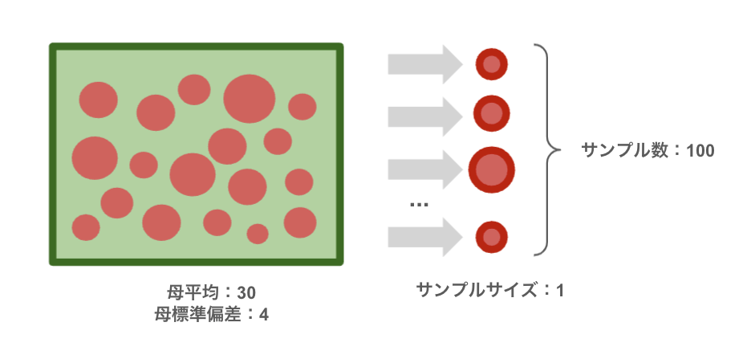
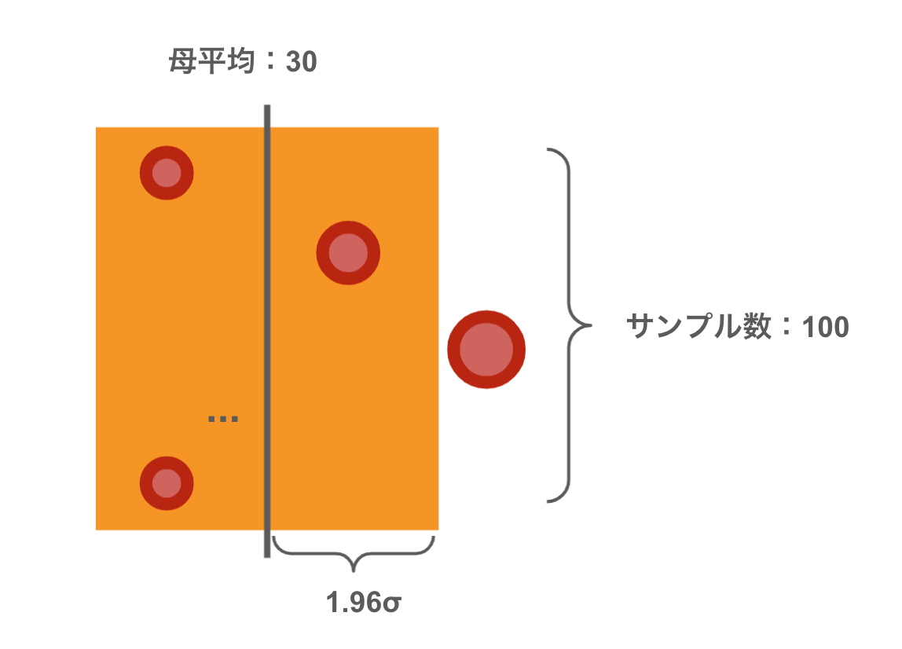
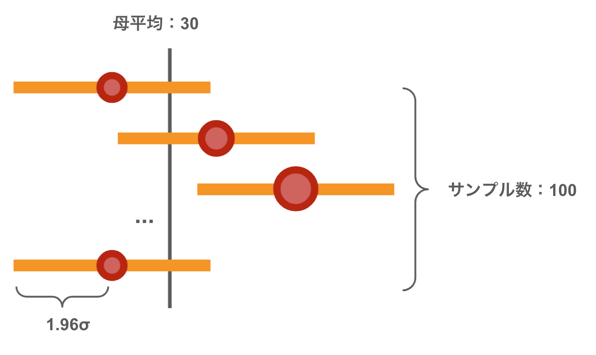
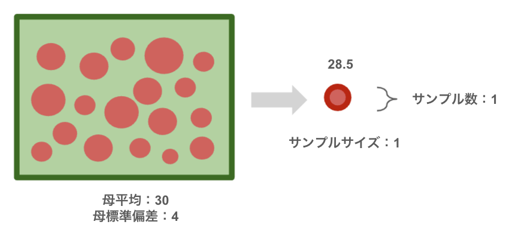
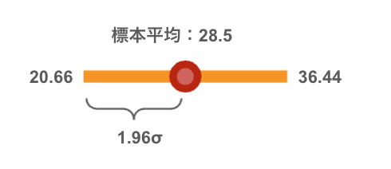
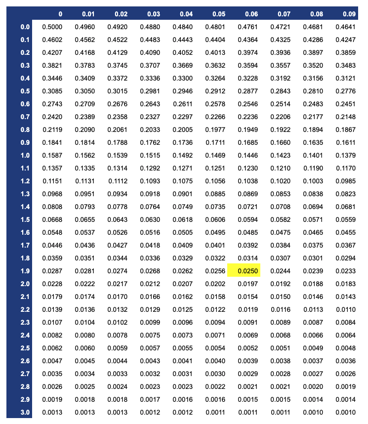

# 母平均の区間推定 - 母分散既知の場合 - 1


* 区間推定とは標本統計量（推定量）を使って母数（母平均など）の区間を推定すること
* 区間推定に利用する区間を**信頼区間**と呼ぶ
* 信頼区間は「**95%信頼区間**」など信頼係数を指定して表現する

> 以降は標本統計量の一つである標本平均を使って母平均を区間推定する様子を学習します。ただし、少し回り道をしてサンプルサイズが1の標本を使って母集団と標本の特性について学習することにします。

---

## 例： ミニトマトの信頼区間

ミニトマトの区間推定について考えます。ミニトマトの大きさ（単位mm）の母集団の分布は `N(30, 16)` の正規分布に従うものとします。ここではRを使ってミニトマトの母集団からサンプルサイズ1の標本を100セット作成する様子をシミュレーションしてみましょう。



> 注意：ここでは母集団と標本の特性を理解するために多くの標本を作成しています。またサンプルサイズが1というのもその特性を学ぶためのものであり、一般的なサンプルサイズではありません。

次のRプログラムを作成します。

```r
mu <- 30
sigma <- 4
tomato_population <- rnorm(100000, mean = mu, sd = sigma)
tomato_sample_size <- 1 
tomato_samples <- numeric(100)
for (i in 1:length(tomato_samples)) {
  tomato_samples[i] <- sample(tomato_population, tomato_sample_size)
}
summary(tomato_samples)
```

変数 `mu` 、 `sigma` は母集団のパラメータである母平均と母分散を意味します。最終的にはこれらのパラメータを区間推定することが狙いですが、ここではパラメータを明示した状態で学習を進めます。次に `tomato_population` 変数はミニトマトの母集団を表現しています。この母集団データは正規分布にしたがうものとするため `rnorm` 関数で生成します。

次に `tomato_sample_size` 変数を定義して値を `1` としています。これはサンプルサイズ（標本サイズ）を意味しています。 `tomato_samples` 変数はサンプルサイズ 1 の標本を100セット保持できるように定義しています。実際の無作為抽出は `sample` 関数を使ってサンプルサイズ 1 の標本を抽出しています。

さいごに `summary` 関数で100セットの標本データを要約しています。

プログラムを実行して結果を確認してみましょう。

```r
   Min. 1st Qu.  Median    Mean 3rd Qu.    Max. 
  20.25   27.29   29.86   29.99   33.04   40.54 
```

実行結果から平均値である30付近に標本を確認できます。

---

### 標本は母平均からどれくらい離れるのか

これまでに学習してきたように正規分布にしたがう確率変数は、平均から±1.96σの範囲に約95%の値をとります。

ここでは実際に母平均から±1.96 * 標準偏差（±1.96σ）の間にいくつの標本が含まれるかを確認してみましょう。さきほどのプログラムに以下のコードを追加します。

```r
min <- mu - 1.96 * sigma
max <- mu + 1.96 * sigma
sum(ifelse(min < tomato_samples & tomato_samples < max, 1, 0))
```

プログラムを実行して結果を確認してみましょう。

```r
[1] 95
```

プログラムの実行都度、結果は異なりますが、概ね100セットの標本のうち95セットの標本が範囲に含まれることを確認できるでしょう。




---

### 95%信頼区間

次に先程の考え方を少し変えて、サンプルサイズ1の100セットの標本から±1.96 * 母標準偏差（±1.96σ）の間に母平均が含まれるかを確認してみましょう。

```r
min <- tomato_samples - 1.96 * sigma 
max <- tomato_samples + 1.96 * sigma
sum(ifelse(min < mu & mu < max, 1, 0))
```

プログラムを実行して結果を確認してみましょう。

```r
[1] 95
```

実行結果から概ね100セットの標本のうち95セット（95%）の区間に母平均が含まれることを確認できるでしょう。



図に示すように100セットの標本のうち、約95セットの標本について、標本データ±1.96σの範囲（オレンジ色の範囲）に母平均が含まれることになります。このように算出した区間を信頼区間と呼びます。今回のように標本平均（サンプルサイズ1の標本平均）から±1.96σの範囲を求める場合は「95%信頼区間」と呼びます。

同様に標本平均から±1.64σの範囲を90%信頼区間、標本平均から±2.58σの範囲を99%信頼区間と呼びます。


> 信頼区間95%とは、仮に標本抽出を100回行った場合、そのうち95回は、標本から計算した範囲に母数が含まれるという意味です。実際には今回のように標本（サンプル数）そのものを100回も集めることは現実的ではありません。

---

## 例： ミニトマトの区間推定 - 母分散が既知でサンプルサイズが1の場合

ここではミニトマトの区間推定について考えます。ただし、ミニトマトの大きさ（単位mm）の母集団の分布は `N(μ, 16)` の正規分布に従うものとし、母分散のみが既知であり、母平均 `μ` について区間推定したいというやや特殊なケースを考えます。

> 母分散が未知の場合の計算については後述します。

このミニトマトの母集団からサンプルサイズ1の標本を1セット作成したところミニトマトの大きさは28.5mmであったとしましょう。



この標本から95%信頼区間を求めると次のようになります。

```r
sigma <- 4
tomato_sample <- 28.5
min <- tomato_sample - 1.96 * sigma
max <- tomato_sample + 1.96 * sigma
paste(min, "-", max)
```

プログラムを実行して結果を確認してみましょう。

```r
[1] "20.66 - 36.34"
```

実行結果からミニトマトの母平均 `μ` の95%信頼区間は 20.66 <= μ <= 36.44 ということがわかります。



ここでは無作為抽出した標本 28.5 から区間推定したことに注目してください。無作為抽出ですから、異なる標本を抽出する可能性もあります。そのような場合も含めて、仮に100回標本抽出を行った場合は95回程度は求めた信頼区間に母平均が存在するという意味になります。

---

### 区間推定の幅を狭めるためには

区間推定の幅を狭めるにはいくつかの方法があります。まず信頼係数を変更するとどうなるか確認しておきましょう。

|信頼係数|信頼区間|
|:--|:--|
|90%|21.94 - 35.06|
|95%|20.66 - 36.34|
|99%|18.18 - 38.82|

上記のように信頼係数を大きくすると信頼区間も大きくなるのがわかります。

> 信頼係数を調整する以外にも区間推定の幅を狭める方法があります。詳細については後述します。

---

## エクササイズ

1. ある植物の花びらの大きさを調べるためにサンプルサイズの1の標本を1つ抽出したところ40mmであった。この植物の母集団データは正規分布しており、また母分散は25mmと仮定できる場合、母平均の95%信頼区間はどの程度になるか計算してください。


2. ある特殊な小さな部品を作る機械がある。機械の使い方を調べるために、前任者に問い合わせたところ、この機械で作成した部品のサイズは、母平均は不明であるが母分散4mmの正規分布にしたがっている、と回答があった。この機械を使って部品を1つ作ってみると大きさは50mmであった。この機械の母平均の90%信頼区間、95%信頼区間、99％信頼区間はどの程度になるか計算してください。



<!--
```r
> sigma <- 5
> x <- 40
> min <- x - 1.96 * sigma
> max <- x + 1.96 * sigma
> paste(min, "-", max)
[1] "30.2 - 49.8"
```

```r
> sigma <- 2
> x <- 50 
> min <- x - 1.64 * sigma
> max <- x + 1.64 * sigma
> print(paste(min, "-", max))
[1] "46.72 - 53.28"
> min <- x - 1.96 * sigma
> max <- x + 1.96 * sigma
> print(paste(min, "-", max))
[1] "46.08 - 53.92"
> min <- x - 2.58 * sigma
> max <- x + 2.58 * sigma
> print(paste(min, "-", max))
[1] "44.84 - 55.16"
```

-->