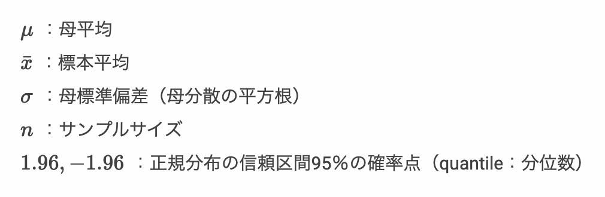

# 母平均の区間推定 - 母分散既知の場合 - 2


* 区間推定時の信頼区間は母分散（ `σ` ）や信頼係数の他、サンプルサイズの影響を受ける
* 正規母集団から無作為抽出した標本平均の標本分布は `N(μ, σ^2/n)` にしたがう
* 標本のサンプルサイズ（ `n` ）を増やすことで母数の信頼区間を狭めることができる


---

## 例： ミニトマトの区間推定 - 母分散が既知でサンプルサイズが4の場合

ここではミニトマトを例に母平均の区間推定について考えます。ただし、ミニトマトの大きさ（単位mm）の母集団の分布は `N(μ, 16)` の正規分布に従うものとし、母分散のみが既知であり、母平均 `μ` について区間推定したいというやや特殊なケースを考えます。

> 母分散が未知の場合の計算については後述します。

このミニトマトの母集団からサンプルサイズ4の標本を1セット作成したところ標本平均は28.5mmであったとしましょう。


この標本から母平均の95%信頼区間を求めると次のようになります。

```r
sigma <- 4
tomato_sample <- c(29.5, 25.8, 25.1, 33.6)
tomato_sample_mean <- mean(tomato_sample)
tomato_sample_size <- length(tomato_sample)
min <- tomato_sample_mean - 1.96 * sigma / sqrt(tomato_sample_size)
max <- tomato_sample_mean + 1.96 * sigma / sqrt(tomato_sample_size)
paste(min, "-", max)
```

`tomato_sample` 変数は標本を意味しており、標本データ（標本の要素）は4つあるのでサンプルサイズ（標本サイズ）は4となります。そのあと `tomato_sample_mean` 変数に標本平均を代入しています。`tomato_sample_size` 変数はサンプルサイズを意味します。

それから信頼区間の範囲である `min` 変数、`max` 変数を算出して、結果を画面に出力しています。

プログラムを実行して結果を確認してみましょう。

```r
[1] "24.58 - 32.42"
```

実行結果からミニトマトの母平均 `μ` の95%信頼区間は 24.58 <= μ <= 32.42 ということがわかります。

以前に学習したサンプルサイズ1の場合の母平均 `μ` の95%信頼区間は 20.66 <= μ <= 36.44 でしたので、サンプルサイズを4にした場合は信頼区間が狭くなっていることがわかります。


---

## 例： ミニトマトの区間推定 - 母分散が既知でサンプルサイズが16の場合

ミニトマトの母集団からサンプルサイズ16の標本を1セット作成したとき、標本平均は28.5mmであったとしましょう。


この標本から母平均の95%信頼区間を求めると次のようになります。

```r
sigma <- 4
tomato_sample <- c(29.5, 25.8, 25.1, 33.6, 
                   25.1, 31.5, 32.7, 27.7, 
                   32.0, 24.0, 25.3, 25.1, 
                   25.2, 33.9, 34.4, 25.1)
tomato_sample_mean <- mean(tomato_sample)
tomato_sample_size <- length(tomato_sample)
min <- tomato_sample_mean - 1.96 * sigma / sqrt(tomato_sample_size)
max <- tomato_sample_mean + 1.96 * sigma / sqrt(tomato_sample_size)
paste(min, "-", max)
```

プログラムを実行して結果を確認してみましょう。

```r
[1] "26.54 - 30.46"
```

実行結果からミニトマトの母平均 `μ` の95%信頼区間は 26.54 <= μ <= 30.46 ということがわかります。

---

## サンプルサイズと信頼区間

これまでの区間推定の結果を整理すると次のようになります。

|サンプルサイズ|標本平均の標本分布|95%信頼区間|
|:--|:--|:--|
|1| `N(μ, 4^2/1)` |20.66 <= μ <= 36.44|
|4| `N(μ, 4^2/4)` |24.58 <= μ <= 32.42|
|16| `N(μ, 4^2/16)` |26.54 <= μ <= 30.46 |

---

## 母平均の区間推定 - 母分散既知の場合

* 95%信頼区間の考え方 


* 母分散が既知である正規母集団から無作為抽出して標本を作成した場合、標本の標本平均から以下の計算式で母平均を95%信頼区間で区間推定できる


> 「母分散が既知である」という前提条件から、計算式の中に `σ`（母標準偏差）を利用しています。次に学習する「母分散が未知である」場合は、計算式の中に `σ` を使う代わりに、標本統計量である不偏分散の標準偏差（ `s` ）を使います。



---

## エクササイズ

1. ある植物の花びらの大きさを調べるためにサンプルサイズの4の標本を1つ抽出したところ以下のとおりであった。

```
34, 44, 43, 42
```

この植物の母集団データは正規分布しており、また母分散は25mmと仮定できる場合、母平均の95%信頼区間はどの程度になるか計算してください。

2. ある特殊な小さな部品を作る機械がある。機械の使い方を調べるために、前任者に問い合わせたところ、この機械で作成した部品のサイズは、母平均は不明であるが母分散4mmの正規分布にしたがっている、と回答があった。この機械を使って部品を10個作ってみると大きさは以下のとおりであった。

```
54, 50, 47, 48, 50, 49, 48, 52, 50, 51
```

この機械の母平均の90%信頼区間、95%信頼区間、99％信頼区間はどの程度になるか計算してください。

<!-- 

```
> sigma <- 5
> x <- c(34, 44, 43, 42)
> x.mean <- mean(x)
> x.size <- length(x)
> min <- x.mean - 1.96 * sigma / sqrt(x.size)
> max <- x.mean + 1.96 * sigma / sqrt(x.size)
> print(paste(min, "-", max))
[1] "35.85 - 45.65"
```

```
> sigma <- 2
> x <- c(54, 50, 47, 48, 50, 49, 48, 52, 50, 51)
> x.mean <- mean(x)
> x.size <- length(x)
> min <- x.mean - 1.64 * sigma / sqrt(x.size)
> max <- x.mean + 1.64 * sigma / sqrt(x.size)
> print(paste(min, "-", max))
[1] "48.8627729274648 - 50.9372270725352"
> min <- x.mean - 1.96 * sigma / sqrt(x.size)
> max <- x.mean + 1.96 * sigma / sqrt(x.size)
> print(paste(min, "-", max))
[1] "48.660387157214 - 51.139612842786"
> min <- x.mean - 2.58 * sigma / sqrt(x.size)
> max <- x.mean + 2.58 * sigma / sqrt(x.size)
> print(paste(min, "-", max))
[1] "48.2682647273531 - 51.5317352726469"
```

-->