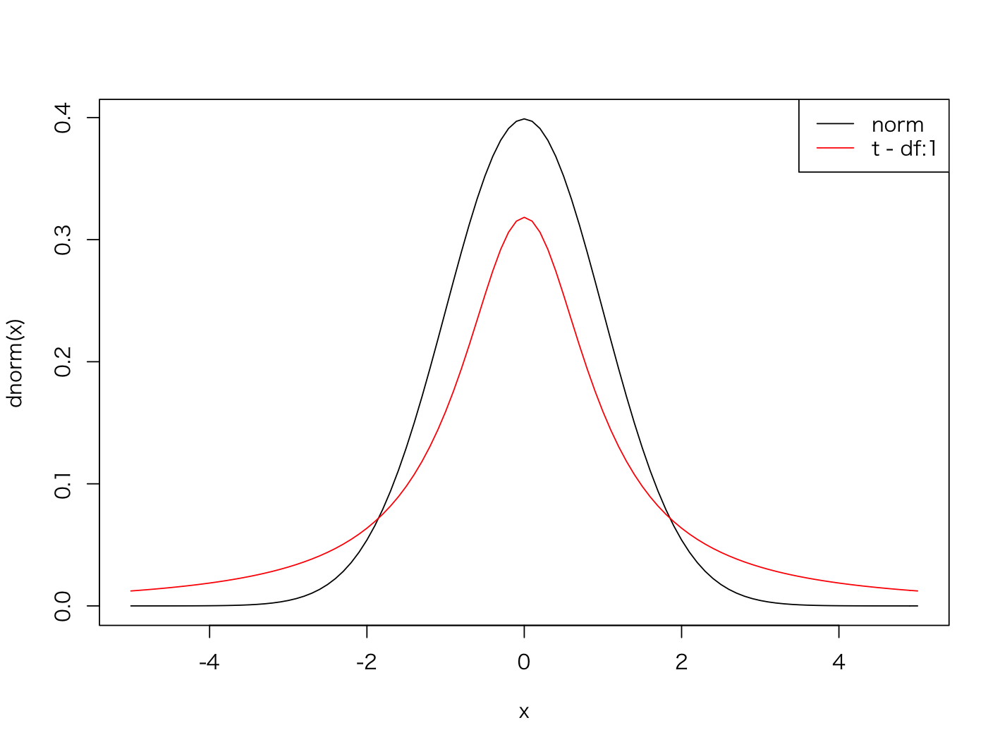

# t分布

* 母分散が未知の場合、母平均の区間推定には正規分布ではなくt分布を使う
* t分布とは正規分布のばらつきを大きくしたようなベル型の分布
* 標本平均、母平均、不偏分散、サンプルサイズから算出した統計量t（t値）はt分布にしたがう



> t分布はパラメータに自由度を受け取ります。パラメータの自由度によって形状が決まります。

--- 

## 統計量t

* 以下の計算式から算出される統計量
* t値は母分散 `σ` を使わずに不偏分散の標準偏差である `s` を使う
* サンプルサイズが `n` の場合、t値は自由度 `n - 1` のt分布にしたがう


> 自由度は以下のように `ν` （ニュー）という記号で表現することもあります。


> 参考：母分散が既知の場合は、以下の計算式で統計量zを算出します。この場合、統計量 z は標準正規分布にしたがいます。


---

## 自由度

* 自由に決めることのできるデータの数
* 標本平均を使って母平均の区間推定を行う場合、サンプルサイズ `n - 1` が自由度となる
* 自由度が大きくなると正規分布に近似する


> 標本サイズが大きくなると（大標本になると）t分布は標準正規分布に近似します。そのため標本サイズが大きい場合はt分布を使わずに標準正規分布を使うこともできます。大きな標本サイズの目安は30以上など文献によって様々です。Rのようなプログラミング言語で分析するのであれば大標本であってもそのままt分布を使って計算すると良いでしょう。

---

## t分布の確率点（quantile）

* 自由度（ν）と確率（上側確率：α）を指定することで確率点を求めることができる
* たとえば自由度10、上側確率2.5%（0.025）の確率点は2.228となる
* R言語でプログラミングする場合は `qt` 関数によって確率点を算出できる


> 上記のグラフは自由度10のt分布です。x軸は確率点（quantile）、y軸は確率密度（density）です。確率点2.228より上側の面積（オレンジ色の部分）は全体の2.5%を意味します。


> 確率αに指定する値は信頼区間（信頼係数）によって決まります。たとえば信頼区間95%で区間推定する場合は、上側確率に2.5%（0.025）を使います。またt分布は確率点0において左右対称となるため下側確率の確率点は、上側確率の確率点に -1 を乗算して求めることができます。

---

## 参考: t分布の確率密度関数

* t分布の確率密度関数は以下のとおり


> 参考までにt分布の確率密度関数を掲載しておきます。νは自由度、Γはガンマ関数です。ここではこの関数を暗記する必要はありません。R言語では後の `dt` 関数などの内部でこのような確率密度関数が実装されていると考えると良いでしょう。

---

## Rプログラミング

### rt 関数  - t1.R

* `rt` 関数はt分布から乱数を生成する
* `rt` 関数は第1引数に生成する乱数の数、`df` 引数にt分布のパラメータである自由度を指定する

```r
x <- rt(1000, df = 10)
hist(x, breaks = seq(-10, 10, 0.5))
```

#### 実行結果

```r
> x <- rt(1000, df = 10)
> hist(x, breaks = seq(-10, 10, 0.5))
```


---

### dt 関数  - t2.R

* `dt` 関数はt分布の確率密度関数から確率密度を算出する
* `dt` 関数は第1引数に確率密度を求める点（quantile、分位数、確率点）、`df` 引数にt分布のパラメータである自由度を指定する

```r
x <- seq(-5, 5, 0.01)
y <- dt(x, df = 10)
plot(x, y, type = "l")
```

#### 実行結果

```r
> x <- seq(-5, 5, 0.01)
> y <- dt(x, df = 10)
> plot(x, y, type = "l")
```


---

### pt 関数  - t3.R

* `pt` 関数はt分布の確率密度関数から確率（デフォルトは下側確率）を算出する
* `pt` 関数は第1引数に確率を求める点（quantile、分位数、確率点）、`df` 引数にt分布のパラメータである自由度を指定する
* `pt` 関数は `lower.tail` 引数に `FALSE` を指定することで上側確率を算出できる

```r
pt(2.228, df = 10)
pt(2.228, df = 10, lower.tail = F)
```

#### 実行結果

```r
> pt(2.228, df = 10)
[1] 0.9749941
> pt(2.228, df = 10, lower.tail = F)
[1] 0.02500589
```

---

### qt 関数  - t4.R

* `qt` 関数はt分布の確率から確率点（quantile、分位数）を算出する
* `qt` 関数は第1引数に確率、`df` 引数にt分布のパラメータである自由度を指定する
* `qt` 関数は `lower.tail` 引数に `FALSE` を指定することで上側からの確率点を算出できる

```r
qt(0.025, df = 10)
qt(0.975, df = 10)
```

#### 実行結果

```r
> qt(0.025, df = 10)
[1] -2.228139
> qt(0.975, df = 10)
[1] 2.228139
```

---

## エクササイズ

1. 自由度5のt分布に従う乱数を1,000件生成して、ヒストグラムを表示してください。

2. 上記で求めた乱数のうち、-2.571より小さいもの、あるいは2.571より大きいものがいくつあるか求めてください。

> `2.571` という数値は自由度5のt分布における上側確率2.5%の確率点です。同様に `-2.571` は自由度5のt分布における下側確率2.5%の確率点です。

3. 自由度5のt分布の確率密度関数の出力結果をグラフで表示してください。

4. 自由度5のt分布の上側確率2.5%の確率点を表示してください。

5. 以下のデータから統計量tを算出してください。
    * 母平均：30
    * 標本：34.2, 29.8, 36.6, 31.4, 36.8, 35.5

> 参考：この場合のt値は `3.452805` となります。このt値が何を意味するのかを考えてみましょう。


<!--
# 自由度5のt分布に従う乱数を1,000件生成して、ヒストグラムを表示してください。
x <- rt(1000, 5)
hist(x)

# 上記で求めた乱数のうち、-2.571より小さいもの、あるいは2.571より大きいものがいくつあるか求めてください。
sum(ifelse(x > 2.571, 1, 0))
sum(ifelse(x < -2.571, 1, 0))

# 自由度5のt分布の確率密度関数の出力結果をグラフで表示してください。
x <- seq(-5, 5, 0.1)
y <- dt(x, 5)
plot(x, y, type = "l")

# 自由度5のt分布の上側確率2.5%の確率点を表示してください。
qt(0.975, 5)

# 以下のデータから統計量tを算出してください。
# 母平均：30
# 標本：34.2, 29.8, 36.6, 31.4, 36.8, 35.5
mu <- 30
x <- c(34.2, 29.8, 36.6, 31.4, 36.8, 35.5)
x.mean <- mean(x)
x.sd <- sd(x)
x.size <- length(x)
(x.mean - mu) / (x.sd / sqrt(x.size))

 -->