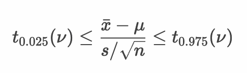
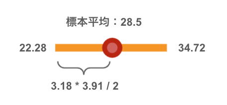
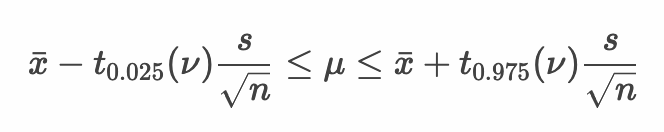
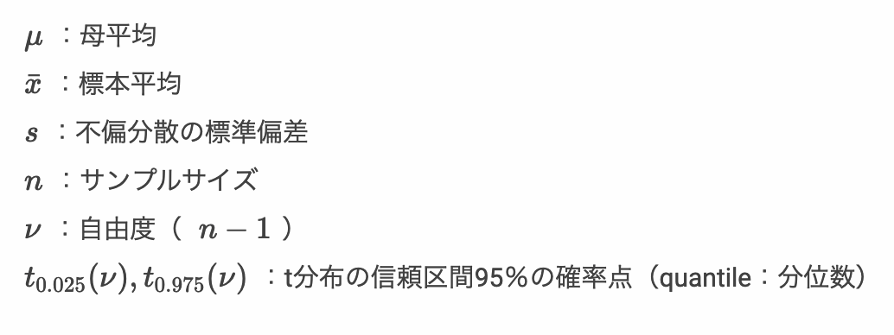

# 母平均の区間推定 - 母分散未知の場合

* 母分散が未知の場合、母平均の区間推定にt分布を使う
* 統計量tは正規分布ではなくt分布にしたがう
* 与えられた信頼区間からt分布における確率点を算出する


> たとえば95%の信頼区間を求める場合は、以下のように式をを変形できます。



--- 

## 例： ミニトマト - 母平均の区間推定 - 母分散が未知でサンプルサイズが4の場合

ここではミニトマトを例に母平均の区間推定について考えます。ミニトマトの大きさ（単位mm）の母集団の分布は `N(μ, σ^2)` の正規分布に従うものとします。ただし、母平均を推定する際に、母分散が未知であるため、以前のように標本平均の標本分布として正規分布 `N(μ, σ^2/n)` を使って区間推定することができません。このような母分散が未知のケースにおいては、不偏分散を使って統計量tを算出します。

このミニトマトの母集団からサンプルサイズ4の標本を1セット作成したところ標本平均は28.5mmであったとしましょう。


この標本から母平均の95%信頼区間を求めると次のようになります。

```r
tomato_sample <- c(29.5, 25.8, 25.1, 33.6)
tomato_sample_mean <- mean(tomato_sample)
tomato_sample_size <- length(tomato_sample)
tomato_sample_df <- tomato_sample_size - 1
tomato_sample_sd <- sd(tomato_sample)
lq <- qt(0.025, tomato_sample_df)
uq <- qt(0.975, tomato_sample_df)
min <- tomato_sample_mean + lq * tomato_sample_sd / sqrt(tomato_sample_size)
max <- tomato_sample_mean + uq * tomato_sample_sd / sqrt(tomato_sample_size)
paste(min, "-", max)
```

`tomato_sample` 変数は標本を意味しており、標本データ（標本の要素）は4つあるのでサンプルサイズ（標本サイズ）は4となります。そのあと `tomato_sample_mean` 変数に標本平均を代入しています。`tomato_sample_size` 変数はサンプルサイズを意味します。

次に `tomato_sample_df` 変数には自由度を代入しています。ここでの自由度はサンプルサイズ `tomato_sample_size - 1` になります。

その後 `sd` 関数を使って `tomato_sample` 変数の不偏分散の標準偏差を `tomato_sample_sd` 変数に代入しています。

> `tomato_sample_sd` 変数には `3.909817` が代入されます。

それから `qt` 関数を使って自由度3のt分布の95%信頼区間である確率点を取得して `lq` 変数、`uq` 変数にそれぞれ代入しています。

> `lq` 変数には `-3.182446` 、 `uq` 変数には `3.182446` が代入されます。

プログラムを実行して結果を確認してみましょう。


```r
[1] "22.2786091364243 - 34.7213908635757"
```

実行結果からミニトマトの母平均 `μ` の95%信頼区間は約 22.28 <= μ <= 34.72 ということがわかります。



---

## 例： ミニトマトの区間推定 - 母分散が未知でサンプルサイズが16の場合

ミニトマトの母集団からサンプルサイズ16の標本を1セット作成したとき、標本平均は28.5mmであったとしましょう。


この標本から母平均の95%信頼区間を求めると次のようになります。

```r
tomato_sample <- c(29.5, 25.8, 25.1, 33.6, 
                   25.1, 31.5, 32.7, 27.7, 
                   32.0, 24.0, 25.3, 25.1, 
                   25.2, 33.9, 34.4, 25.1)
tomato_sample_mean <- mean(tomato_sample)
tomato_sample_size <- length(tomato_sample)
tomato_sample_df <- tomato_sample_size - 1
tomato_sample_sd <- sd(tomato_sample)
lq <- qt(0.025, tomato_sample_df)
uq <- qt(0.975, tomato_sample_df)
min <- tomato_sample_mean + lq * tomato_sample_sd / sqrt(tomato_sample_size)
max <- tomato_sample_mean + uq * tomato_sample_sd / sqrt(tomato_sample_size)
paste(min, "-", max)
```

> 先頭部分の `tomato_sample` 変数のみ修正しています。

プログラムを実行して結果を確認してみましょう。

```r
[1] "26.4343075670669 - 30.5656924329331"
```

実行結果からミニトマトの母平均 `μ` の95%信頼区間は 26.43 <= μ <= 30.57 ということがわかります。

---

## サンプルサイズと信頼区間

これまでの区間推定の結果を整理すると次のようになります。

|サンプルサイズ|t分布|95%信頼区間|
|:--|:--|:--|
|4| `t(3)` |22.28 <= μ <= 34.72|
|16| `t(15)` |26.43 <= μ <= 30.57 |

---

## 母平均の区間推定 - 母分散未知の場合

* 母分散が未知である正規母集団から無作為抽出して標本を作成した場合、標本の標本平均から以下の計算式で母平均を95%信頼区間で区間推定できる


* 以下のように式を変形できる



> 「母分散が未知である」という前提条件から、計算式の中に `s`（不偏分散の標準偏差）を利用しています。ここでは母分散の標準偏差 `σ` を利用せずに区間推定を行っている点を確認しておきましょう。



---

## エクササイズ

1. ある植物の花びらの大きさを調べるためにサンプルサイズの4の標本を1つ抽出したところ以下のとおりであった。

```
34, 44, 43, 42
```

この植物の母集団データは正規分布していると仮定できる場合、母平均の95%信頼区間はどの程度になるか計算してください。

2. ある特殊な小さな部品を作る機械がある。機械の使い方を調べるために、前任者に問い合わせたところ、この機械で作成した部品のサイズは、母平均、母分散については不明であるが正規分布にしたがっている、と回答があった。この機械を使って部品を10個作ってみると大きさは以下のとおりであった。

```
54, 50, 47, 48, 50, 49, 48, 52, 50, 51
```

この機械の母平均の90%信頼区間、95%信頼区間、99％信頼区間はどの程度になるか計算してください。

<!-- 

```
> x <- c(34, 44, 43, 42)
> x_mean <- mean(x)
> x_size <- length(x)
> x_df <- x_size - 1
> x_sd <- sd(x)
> lq <- qt(0.025, x_df)
> uq <- qt(0.975, x_df)
> min <- x_mean + lq * x_sd / sqrt(x_size)
> max <- x_mean + uq * x_sd / sqrt(x_size)
> print(paste(min, "-", max))
[1] "33.4725818938687 - 48.0274181061313"
```

```
> x <- c(54, 50, 47, 48, 50, 49, 48, 52, 50, 51)
> x_mean <- mean(x)
> x_size <- length(x)
> x_df <- x_size - 1
> x_sd <- sd(x)
> lq <- qt(0.050, x_df)
> uq <- qt(0.950, x_df)
> min <- x_mean + lq * x_sd / sqrt(x_size)
> max <- x_mean + uq * x_sd / sqrt(x_size)
> print(paste(min, "-", max))
[1] "48.6948453873806 - 51.1051546126194"
> lq <- qt(0.025, x_df)
> uq <- qt(0.975, x_df)
> min <- x_mean + lq * x_sd / sqrt(x_size)
> max <- x_mean + uq * x_sd / sqrt(x_size)
> print(paste(min, "-", max))
[1] "48.4127762230853 - 51.3872237769147"
> lq <- qt(0.005, x_df)
> uq <- qt(0.995, x_df)
> min <- x_mean + lq * x_sd / sqrt(x_size)
> max <- x_mean + uq * x_sd / sqrt(x_size)
> print(paste(min, "-", max))
[1] "47.7634408042013 - 52.0365591957987"
```

-->