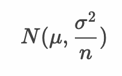
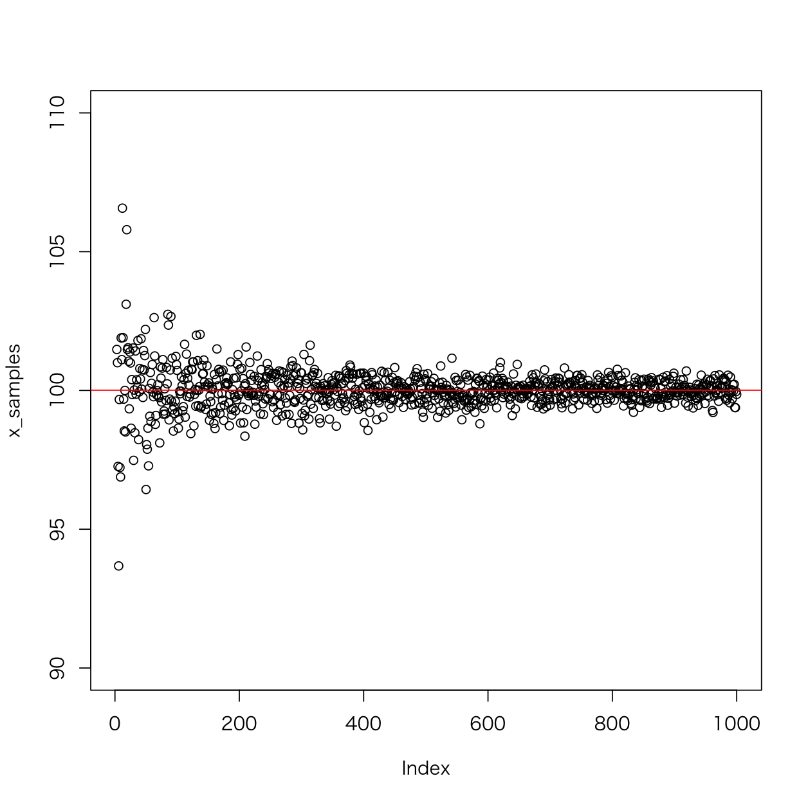
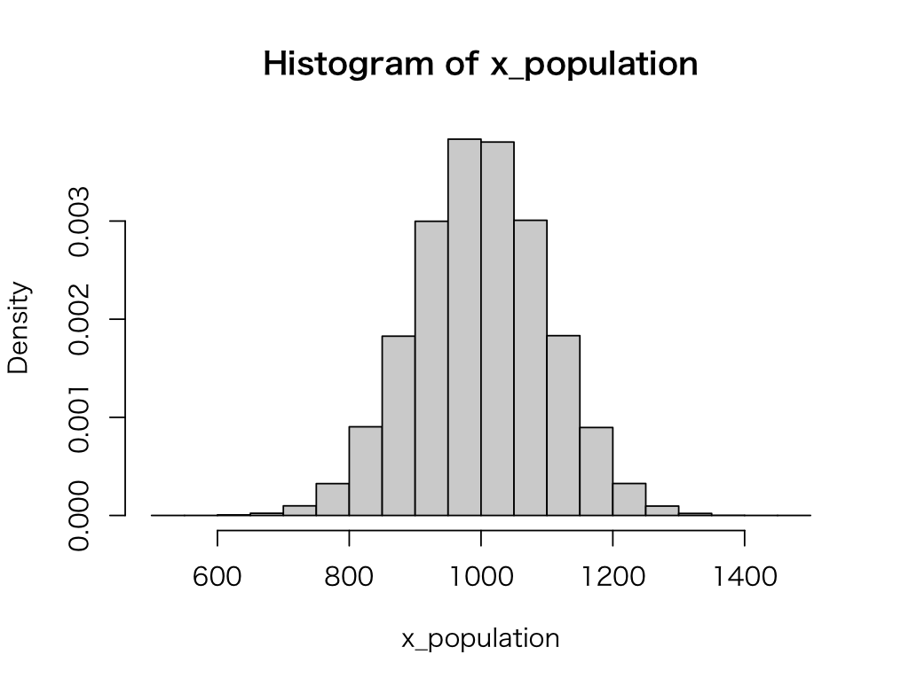
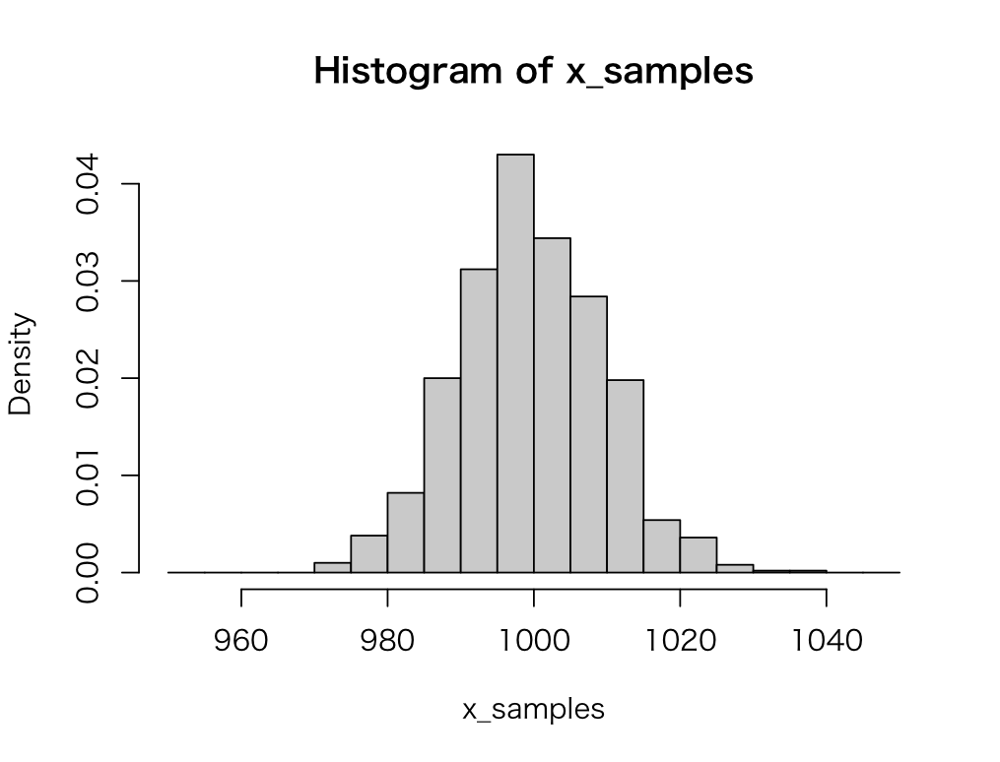
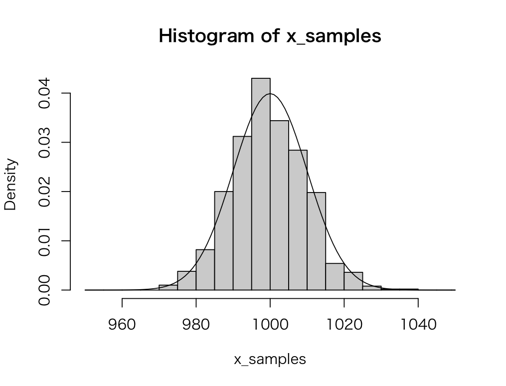

# 大数の法則

* サイコロを何度も投げると出た目の平均値は、サイコロの期待値である3.5に収束する
* 標本サイズ（サンプルサイズ）が大きくなるにつれて、標本平均は母平均に近づく
* 母平均：μ、母分散：σ^2 の正規母集団から標本平均の標本分布を作成すると平均：μ、分散が `σ^2/n` の正規分布になる



> サンプルサイズ `n` が大きくなるとばらつきが小さくなり、平均値 `μ` に近づきます。このような法則は大数の法則（大数の弱法則）と呼ばれます。

---

## 例：サンプルサイズの変動に伴う標本平均のばらつき

ここではサンプルサイズを1〜1000まで変化させることで、標本平均が母平均に収束する様子を確認します。

```r
x_population <- rnorm(100000, mean = 100, sd = 10)
x_samples <- numeric(1000)
for (i in 1:length(x_samples)) {
   x_sample_size <- i 
   x_samples[i] <- mean(sample(x_population, x_sample_size))
}
plot(x_samples, ylim = c(90, 110))
abline(h = mean(x_population), col = "red")
```

`x_population` 変数には正規母集団データを代入しています。このデータは平均：100、標準偏差：10の正規分布にしたがう乱数です。

次に `x_samples` 変数を準備しています。この変数には後の `for` 文の処理において、サンプルサイズ 1〜1000 までの標本平均を代入します。

さいごに `plot` 関数を使って `x_samples` の値をグラフにプロットしています。また `abline` 関数で母平均を赤色の実線で描画しています。

プログラムを実行すると次のような結果を確認できるでしょう。



> x軸は `x_samples` 変数の要素番号、y軸は標本平均です。

プログラムの実行結果からサンプルサイズが大きくなるにつれて、標本平均が母平均に近づく様子を確認できます。

> 大数の法則のように、推定量において、サンプルサイズが大きくなるにつれて、その推定量が母数に近づく性質を一致性と呼びます。

--- 

## エクササイズ

1. 正規分布 `N(1000, 10000)` にしたがう100,000件の乱数を生成してヒストグラムを表示してください。ただし、ヒストグラムの縦軸（y軸）には度数（frequency）ではなく確率密度（density）を表示してください。



> `hist` 関数の引数に `freq = FALSE` を追加するとY軸の値が確率密度（density）となります。


2. 上記のデータを母集団として、サンプルサイズが100の標本を1000セット作成して、標本平均の標本分布をヒストグラムで表示してください。ただし、ヒストグラムの縦軸（y軸）には度数（frequency）ではなく確率密度（density）を表示してください。



3. 標本平均のヒストグラムは正規分布に近似します。正規分布のパラメータ（平均と分散）の理論値を計算してください。

4. 課題2で作成したヒストグラムに、課題3の正規分布の確率密度関数の出力結果を表示してください。



#### ヒント

`hist` 関数によってヒストグラムを描画した後、以下のコードを実行すると正規分布の確率密度関数の結果を表示できます。

```r
curve(dnorm(x, mean = ?, sd = ?), add = T)
```

> `curve` 関数の詳細については `?curve` と入力してヘルプを確認してみましょう。

<!-- 

```
x_population <- rnorm(100000, mean = 1000, sd = 100)
hist(x_population, freq = F)

x_samples <- numeric(1000)
x_sample_size <- 100
for (i in 1:length(x_samples)) {
  x_samples[i] <- mean(sample(x_population, x_sample_size))
}
hist(x_samples, breaks = seq(950, 1050, 5), freq = F)
curve(dnorm(x, mean = 1000, sd = 10), add = T)
```

-->