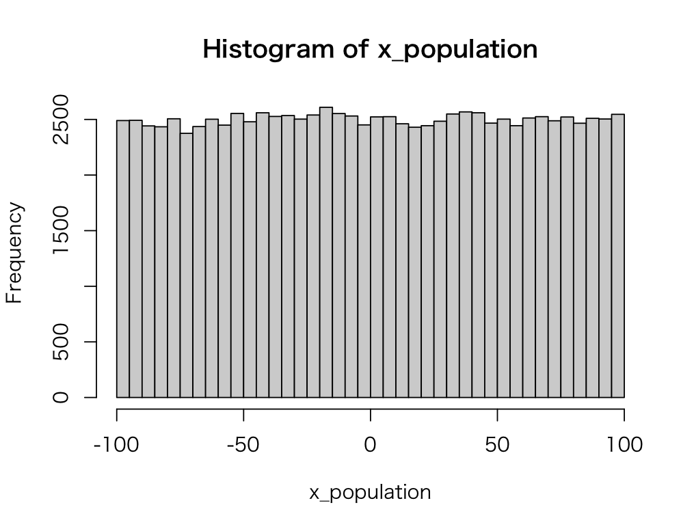
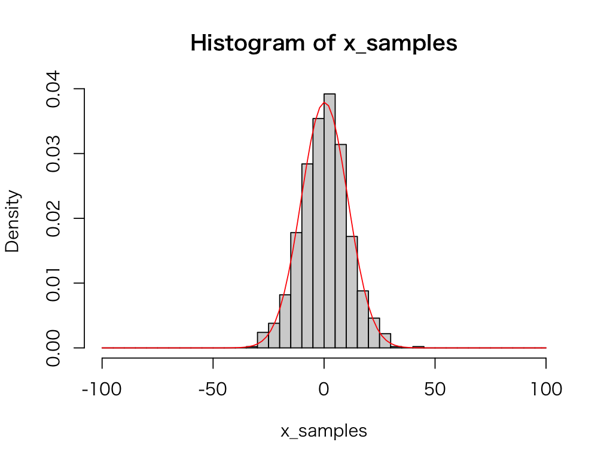
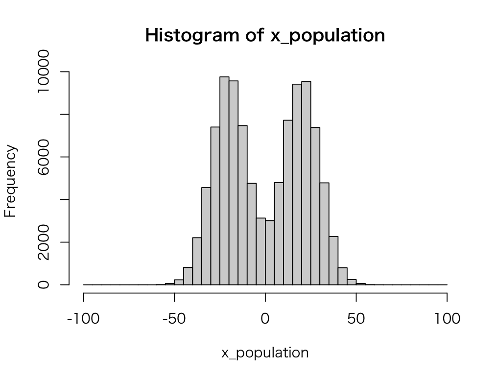

# 中心極限定理

* 母集団分布が平均：μ、標準偏差：σの場合、正規母集団でなくても、サンプルサイズが大きいときは標本平均の標本分布は正規分布 `N(μ, σ^2/n)` になる

---

## 例：母集団分布が正規分布でない場合（一様分布の場合）

ここでは母集団分布が正規分布でないケースの一例として、母集団分布が一様分布にしたがうケースを考えます。母集団分布が一様分布の場合においても、サンプルサイズが大きいとき、標本平均の分布が正規分布にしたがうことを確認します。

> 一様分布とは確率密度関数が常に同じ値（一様）をとる分布です。

次のプログラムを作成します。

```r
x_population <- runif(100000, -100, 100)
mean(x_population)
var(x_population)
hist(x_population, breaks = seq(-100, 100, 5))
```

`x_population` 変数は母集団データです。ここでは `runif` 関数を使って最小値：-100、最大値：100 にしたがう一様分布から乱数を生成しています。それから `x_population` 変数に対して `mean` 関数で平均値、`var` 関数で分散、`hist` 関数でヒストグラムを出力しています。

プログラムを実行すると次のような結果が表示されるでしょう。

```r
> x_population <- runif(100000, -100, 100)
> mean(x_population)
[1] 0.2289583
> var(x_population)
[1] 3320.263
```



実行結果から母集団の母平均、母分散、ヒストグラムを確認できるでしょう。

### 標本の作成

次に母集団からサンプルサイズが30の標本を1000セット作成します。

```r
x_samples <- numeric(1000)
x_sample_size = 30 
for (i in 1:length(x_samples)) {
  x_samples[i] <- mean(sample(x_population, x_sample_size))
}
mean(x_samples)
var(x_samples)
```

`x_samples` 変数には1000セットの標本平均を代入します。また `x_sample_size` 変数にはサンプルサイズである `30` を代入しています。

それから `for` 文を使ってサンプルサイズ 30 の標本から標本平均を1000セット作成した後、標本平均の一覧である `x_samples` 変数の平均値、分散を表示しています。

プログラムを実行すると次のような結果が表示されるでしょう。

```r
> x_samples <- numeric(1000)
> x_sample_size = 30 
> for (i in 1:length(x_samples)) {
+   x_samples[i] <- mean(sample(x_population, x_sample_size))
+ }
> mean(x_samples)
[1] 0.296745
> var(x_samples)
[1] 111.3358
```

実行結果から、平均値は母平均と近似しており、分散は母分散の約1/30となっていることがわかります。

> サンプルサイズが 30 であるため分散は 1/30 になります。標準偏差は 1/√30 となります。

次に標本平均の標本分布についてヒストグラムを表示してみましょう。それから平均：0.2289583、分散：3320.263 / 30 となる正規分布の確率密度関数も重ねて表示してみましょう。

```r
hist(x_samples, breaks = seq(-100, 100, 5), freq = F)
curve(dnorm(x, mean = mean(x_population), 
            sd = sqrt(var(x_population) / x_sample_size)), 
      -100, 100, add = T, col = "red")
```



ヒストグラムの表示も期待する正規分布 `N(μ, σ^2/n)` に近似しているのがわかります。

---

## エクササイズ

1. 以下の2つの正規分布から乱数を10万件生成して、次のようなヒストグラムを作成してください。
  * 正規分布（平均： 20、標準偏差：10）の50,000件
  * 正規分布（平均：-20、標準偏差：10）の50,000件
  * 上記2つのベクトルを連結して、1つのベクトルにする



#### ヒント：ベクトルの連結

ベクトルの連結には `c` 関数を利用できます。

```r
> a <- c(1, 2, 3)
> b <- c(4, 5, 6)
> c(a, b)
[1] 1 2 3 4 5 6
```

> 同様の操作は `append` 関数でも可能です。

2. 上記で作成した二峰性の乱数データの平均値と分散を表示してください。

> 平均：0、分散：500 程度になることを確認します。

3. 二峰性の乱数データから、サンプルサイズ100の標本を1000セット作成して、標本平均の標本分布を考察してください。

> 中心極限定理により、標本平均の標本分布は N(μ, σ^2/n)にしたがうことを確認します。


<!-- 

```r
x_population <- c(rnorm(50000, mean = 20, sd = 10), rnorm(50000, mean = -20, sd = 10))
hist(x_population, breaks = seq(-100, 100, 5))
mean(x_population)
var(x_population)

x_samples <- numeric(1000)
x_sample_size = 100
for (i in 1:length(x_samples)) {
  x_samples[i] <- mean(sample(x_population, x_sample_size))
}

mean(x_samples)
var(x_samples)
hist(x_samples)
```

-->