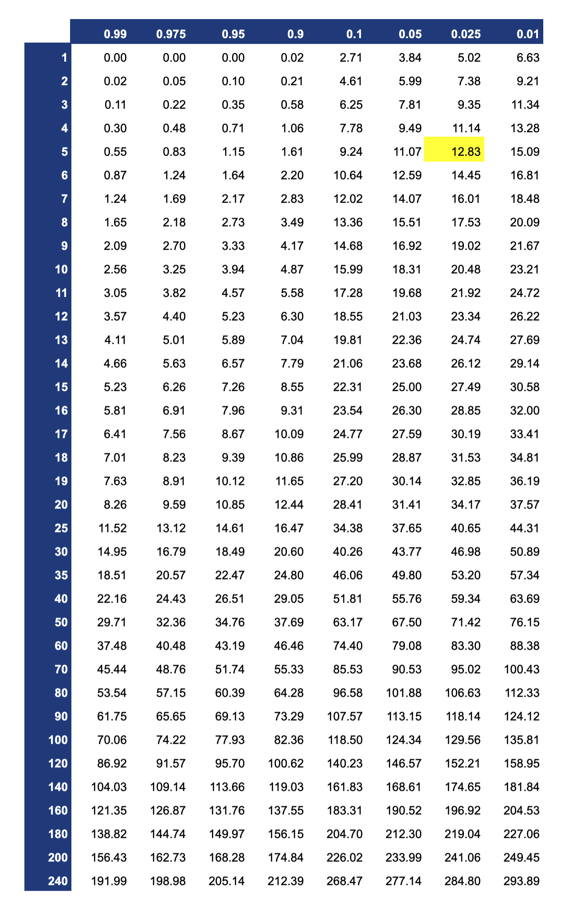

# カイ二乗分布

* カイ二乗分布とは、標準正規分布にしたがう独立した複数の確率変数の二乗和（平方和）がしたがう確率分布
* カイ二乗分布は自由度をパラメータに持つ
* 母分散の区間推定にはカイ二乗分布を使う


>  カイ二乗分布の分布の形状はパラメータ（自由度）によって異なります。横軸（X軸）は常に0以上の値をとります。

--- 

## 統計量χ^2

* カイ二乗値（統計量χ^2）は、標準正規分布にしたがう独立した複数の確率変数の二乗和（平方和）
* 正規分布にしたがう確率変数であっても標準化（z score）することでカイ二乗値を算出できる
* たとえば標準正規分布にしたがう独立した確率変数が5つあるとき、その確率変数の平方和は自由度5のカイ二乗分布にしたがう


### 標準正規分布 `N(0, 1)` にしたがう独立した5つの確率変数のカイ二乗値

|確率変数|値|2乗値|
|:--|:--|:--|
|x1|-1.60|2.5600|
|x2|-0.18|0.0324|
|x3|1.28|1.6384|
|x4|0.60|0.3600|
|x5|-0.45|0.2025|

> カイ二乗値は2乗値の合計であるため 4.7933 となります。

### 正規分布 `N(30, 4)` にしたがう独立した5つの確率変数のカイ二乗値

|確率変数|値|z score|z scoreの2乗値|
|:--|:--|:--|:--|
|x1|29.92|-0.0200|0.0004000|
|x2|23.05|-1.7375|3.0189062|
|x3|25.26|-1.1850|1.4042250|
|x4|31.58|0.3950|0.1560250|
|x5|33.35|0.8375|0.7014063|

> カイ二乗値は2乗値の合計であるため 5.280962 となります。


### カイ二乗分布の期待値と分散

* 上記の2つの例のように求めたカイ二乗値は確率変数であるため値は変動する
* 自由度 ν のカイ二乗分布の期待値 E\[X\] は ν となる
* 自由度 ν の分散 V\[x\] は 2ν となる

---

## カイ二乗分布の確率点（quantile）

* 自由度（ν）と確率（上側確率：α）を指定することで確率点を求めることができる
* たとえば自由度5、上側確率2.5%（0.025）の確率点は12.83となる
* R言語でプログラミングする場合は `qchisq` 関数によって確率点を算出できる


> 上記のグラフは自由度5のカイ二乗分布です。x軸は確率点（quantile）、y軸は確率密度（density）です。確率点12.83より上側の面積（オレンジ色の部分）は全体の2.5%を意味します。



> 確率αに指定する値は信頼区間（信頼係数）によって決まります。たとえば信頼区間95%で区間推定する場合は、上側確率97.5%（0.975）と上側確率2.5%（0.025）の2点を使います。

---

## 参考：カイ二乗分布の確率密度関数

* カイ二乗分布の確率密度関数は以下のとおり

    

> 実際の確率の計算ではカイ二乗分布表を参照したり、Rのようなプログラミング言語では関数が実装されていたりします。関数そのものを暗記する必要はありません。


---

## Rプログラミング

### rchisq 関数  - chisq1.R

* `rchisq` 関数はカイ二乗分布から乱数を生成する
* `rchisq` 関数は第1引数に生成する乱数の数、`df` 引数にカイ二乗分布のパラメータである自由度を指定する

```r
x <- rchisq(1000, df = 5)
hist(x)
```

#### 実行結果

```r
> x <- rchisq(1000, df = 5)
> hist(x)
```


---

### dchisq 関数  - chisq2.R

* `dchisq` 関数はカイ二乗分布の確率密度関数から確率密度を算出する
* `dchisq` 関数は第1引数に確率密度を求める点（quantile、分位数、確率点）、`df` 引数にカイ二乗分布のパラメータである自由度を指定する

```r
x <- seq(0, 20, 0.01)
y <- dchisq(x, df = 5)
plot(x, y, type="l")
```

#### 実行結果

```r
> x <- seq(0, 20, 0.01)
> y <- dchisq(x, df = 5)
> plot(x, y, type="l")
```


---

### pchisq 関数  - chisq3.R

* `pchisq` 関数はカイ二乗分布の確率密度関数から確率（デフォルトは下側確率）を算出する
* `pchisq` 関数は第1引数に確率を求める点（quantile、分位数、確率点）、`df` 引数にカイ二乗分布のパラメータである自由度を指定する
* `pchisq` 関数は `lower.tail` 引数に `FALSE` を指定することで上側確率を算出できる

```r
pchisq(0.83, df = 5)
pchisq(12.83, df = 5)
pchisq(0.83, df = 5, lower.tail = F)
pchisq(12.83, df = 5, lower.tail = F)
```

#### 実行結果

```r
> pchisq(0.83, df = 5)
[1] 0.02491948
> pchisq(12.83, df = 5)
[1] 0.974975
> pchisq(0.83, df = 5, lower.tail = F)
[1] 0.9750805
> pchisq(12.83, df = 5, lower.tail = F)
[1] 0.02502502
```

---

### qchisq 関数  - chisq4.R

* `qchisq` 関数はカイ二乗分布の確率から確率点（quantile、分位数）を算出する
* `qchisq` 関数は第1引数に確率、`df` 引数にカイ二乗分布のパラメータである自由度を指定する
* `qchisq` 関数は `lower.tail` 引数に `FALSE` を指定することで上側からの確率点を算出できる

```r
qchisq(0.025, df = 5)
qchisq(0.975, df = 5)
```

#### 実行結果

```r
> qchisq(0.025, df = 5)
[1] 0.8312116
> qchisq(0.975, df = 5)
[1] 12.8325
```

---

## エクササイズ

1. 自由度10のカイ二乗分布に従う乱数を1,000件生成して、ヒストグラムを表示してください。

2. 上記で求めた乱数のうち 3.25 より小さいもの、あるいは 20.48 より大きいものがいくつあるか求めてください。

> 自由度10のカイ二乗分布における確率点 `3.25` および `20.48` の意味を確認してください。

3. 自由度10のカイ二乗分布の確率密度関数の出力結果をグラフで表示してください。ただしx軸には0〜40の範囲を指定するものとします。

4. 自由度10のカイ二乗分布の上側確率2.5%の確率点を表示してください。

5. 以下のデータからカイ2乗値を算出してください。
    * 母平均：30
    * 母分散：16
    * 標本：34.2, 29.8, 36.6, 31.4, 36.8, 35.5, 33.6, 32.8, 29.2, 30.9

> 参考：この場合のカイ二乗値は `10.12125` となります。このカイ二乗値が何を意味するのかを考えてみましょう。


<!--
x <- rchisq(1000, df = 10)
hist(x)

sum(ifelse(x < 3.25, 1, 0))
sum(ifelse(x > 20.48, 1, 0))

curve(dchisq(x, df = 10), from = 0, to = 40)

qchisq(0.975, df = 10)

mu <- 30 
sigma <- 4 
x <- c(34.2, 29.8, 36.6, 31.4, 36.8, 35.5, 33.6, 32.8, 29.2, 30.9)
x_size <- length(x)
chi <- sum(((x - mu) / sigma)**2)
chi
curve(dchisq(x, df = x_size), from = 0, to = 40)
abline(v = chi)
 -->