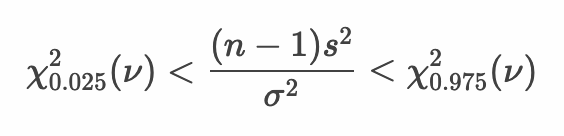

# 母分散の区間推定

* 母分散の区間推定にカイ二乗分布を使う
* 統計量χ^2（カイ二乗値）はカイ二乗分布にしたがう
* 与えられた信頼区間からカイ二乗分布における確率点を算出する


上記の母分散 σ の区間推定を行います。また標本のサンプルサイズを n として、母平均 μ ではなく標本平均 x̄ を使う場合、カイ二乗分布の自由度は n - 1となります。


上記の数式を変形するとカイ二乗値は母分散 σ^2 と不偏分散 s^2で表現できます。


> ここでの数式の変形についての詳細は後述します。

---

### 95%信頼区間

95％信頼区間を求める場合は次のようになります。自由度はサンプルサイズ n - 1になります。



母分散σ^2を算出できるように式を変形します。`(n - 1)s^2` で割ります。


式を変形して分母と分子を入れ替えると次のようになります。


---


### 数式の変形について


上記の数式の変換では `Σ(xi -  x̄)^2` を `(n - 1) s^2` に置き換える点がポイントです。標本の不偏分散 s^2 の数式を再掲します。


上記の数式の両辺に (n - 1) を掛けると次のようになります。


上記の関係から `Σ(xi -  x̄)^2` を `(n - 1) s^2` に置き換えることができます。


--- 

## 例： ミニトマト - 母分散の区間推定 - サンプルサイズが4の場合

ここではミニトマトを例に母分散の区間推定について考えます。ミニトマトの大きさ（単位mm）の母集団の分布は `N(μ, σ^2)` の正規分布に従うものとします。ここでは母集団の正規分布のパラメータである平均値 `μ` も未知であるものとします。母分散の区間推定においては、指定された信頼区間をもとに統計量カイ二乗値を算出します。

このミニトマトの母集団からサンプルサイズ4の標本を1セット作成したところ標本平均は28.5mmであったとしましょう。


この標本から母分散、および母標準偏差の95%信頼区間を求めると次のようになります。

```r
tomato_sample <- c(29.5, 25.8, 25.1, 33.6)
tomato_sample_size <- length(tomato_sample)
tomato_sample_var <- var(tomato_sample)
lq <- qchisq(0.025, df = tomato_sample_size - 1)
uq <- qchisq(0.975, df = tomato_sample_size - 1)
min <- (tomato_sample_size - 1) * tomato_sample_var / uq
max <- (tomato_sample_size - 1) * tomato_sample_var / lq
paste(min, "-", max)
paste(sqrt(min), "-", sqrt(max))
```

`tomato_sample` 変数は標本を意味しており、`tomato_sample_size` 変数にはサンプルサイズ 4 を代入しています。そのあと `var` 関数を使って `tomato_sample` 変数の不偏分散を `tomato_sample_var` 変数に代入しています。

> `tomato_sample_var` 変数には `3.909817^2` である `15.28667` が代入されます。

それから `qchisq` 関数を使って自由度3のカイ分布の95%信頼区間（2.5%、97.5%）である確率点でを取得して `lq` 変数、`uq` 変数にそれぞれ代入しています。

> `lq` 変数には `0.2157953` 、 `uq` 変数には `9.348404` が代入されます。

プログラムを実行して結果を確認してみましょう。

```r
> paste(min, "-", max)
[1] "4.90565041264837 - 212.516230393821"
> paste(sqrt(min), "-", sqrt(max))
[1] "2.21487029251114 - 14.5779364243991"
```

1つ目のpaste関数の出力からミニトマトの母分散 `σ^2` の95%信頼区間は約 4.91 <= σ^2 <= 212.52 ということがわかります。

また2つ目のpaste関数の出力からミニトマトの母標準偏差 `σ` の95%信頼区間は約 2.21 <= σ <= 14.58 ということがわかります。

---

## 例： ミニトマト - 母分散の区間推定 - サンプルサイズが16の場合

ミニトマトの母集団からサンプルサイズ16の標本を1セット作成したとき、標本平均は28.5mmであったとしましょう。


この標本から母分散、および母標準偏差の95%信頼区間を求めると次のようになります。

```r
tomato_sample <- c(29.5, 25.8, 25.1, 33.6, 
                   25.1, 31.5, 32.7, 27.7, 
                   32.0, 24.0, 25.3, 25.1, 
                   25.2, 33.9, 34.4, 25.1)
tomato_sample_size <- length(tomato_sample)
tomato_sample_var <- var(tomato_sample)
lq <- qchisq(0.025, df = tomato_sample_size - 1)
uq <- qchisq(0.975, df = tomato_sample_size - 1)
min <- (tomato_sample_size - 1) * tomato_sample_var / uq
max <- (tomato_sample_size - 1) * tomato_sample_var / lq
paste(min, "-", max)
paste(sqrt(min), "-", sqrt(max))
```

> 先頭部分の `tomato_sample` 変数のみ修正しています。

プログラムを実行して結果を確認してみましょう。

```r
> paste(min, "-", max)
[1] "8.2005521792359 - 35.9972915604683"
> paste(sqrt(min), "-", sqrt(max))
[1] "2.86366062570897 - 5.99977429246037"
```

1つ目のpaste関数の出力からミニトマトの母分散 `σ^2` の95%信頼区間は約 8.20 <= σ^2 <= 36.00 ということがわかります。

また2つ目のpaste関数の出力からミニトマトの母標準偏差 `σ` の95%信頼区間は約 2.86 <= σ <= 6.00 ということがわかります。

---

## サンプルサイズと信頼区間

これまでの区間推定の結果を整理すると次のようになります。

|サンプルサイズ|カイ二乗分布|母分散の<br>95%信頼区間|母標準偏差の<br>95%信頼区間|
|:--|:--|:--|:--|
|4| `χ(3)` | 4.91 <= σ^2 <= 212.52 |2.21 <= σ <= 14.58|
|16| `χ(15)` | 8.20 <= σ^2 <= 36.00 |2.86 <= σ <= 6.00|

---

## 母分散の区間推定

* 正規母集団から無作為抽出して標本を作成した場合、以下の計算式で自由度 n - 1 のカイ二乗分布にしたがう統計量χ^2（カイ二乗値）を算出できる


* カイ二乗分布から以下のように信頼区間を指定（ここでは95%）して区間推定できる


* 母分散 `σ^2` 計算しやすいように式を変形すると次にようになる


<br>


---

## エクササイズ

1. ある植物の花びらの大きさを調べるためにサンプルサイズの4の標本を1つ抽出したところ以下のとおりであった。

```
34, 44, 43, 42
```

この植物の母集団データは正規分布していると仮定できる場合、母標準偏差の95%信頼区間はどの程度になるか計算してください。

2. ある特殊な小さな部品を作る機械がある。機械の使い方を調べるために、前任者に問い合わせたところ、この機械で作成した部品のサイズは、母平均、母分散については不明であるが正規分布にしたがっている、と回答があった。この機械を使って部品を10個作ってみると大きさは以下のとおりであった。

```
54, 50, 47, 48, 50, 49, 48, 52, 50, 51
```

この機械の母標準偏差の90%信頼区間、95%信頼区間、99％信頼区間はどの程度になるか計算してください。

<!-- 

```
x_sample <- c(34, 44, 43, 42)
x_sample_size <- length(x_sample)
x_sample_var <- var(x_sample)
lq <- qchisq(0.025, df = x_sample_size - 1)
uq <- qchisq(0.975, df = x_sample_size - 1)
min <- (x_sample_size - 1) * x_sample_var / uq
max <- (x_sample_size - 1) * x_sample_var / lq
paste(min, "-", max)
paste(sqrt(min), "-", sqrt(max))

x_sample <- c(54, 50, 47, 48, 50, 49, 48, 52, 50, 51)
x_sample_size <- length(x_sample)
x_sample_var <- var(x_sample)
lq <- qchisq(0.05, df = x_sample_size - 1)
uq <- qchisq(0.95, df = x_sample_size - 1)
min <- (x_sample_size - 1) * x_sample_var / uq
max <- (x_sample_size - 1) * x_sample_var / lq
paste(min, "-", max)
paste(sqrt(min), "-", sqrt(max))

lq <- qchisq(0.025, df = x_sample_size - 1)
uq <- qchisq(0.975, df = x_sample_size - 1)
min <- (x_sample_size - 1) * x_sample_var / uq
max <- (x_sample_size - 1) * x_sample_var / lq
paste(min, "-", max)
paste(sqrt(min), "-", sqrt(max))

lq <- qchisq(0.005, df = x_sample_size - 1)
uq <- qchisq(0.995, df = x_sample_size - 1)
min <- (x_sample_size - 1) * x_sample_var / uq
max <- (x_sample_size - 1) * x_sample_var / lq
paste(min, "-", max)
paste(sqrt(min), "-", sqrt(max))
```

-->