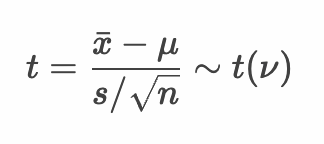

# 仮説検定


* 仮説検定（統計的仮説検定）とは、手元にある標本データを使って母集団に関する仮説を検証すること
* 例1：製薬会社が新薬の効果を検証したい
* 例2：メーカーが製品の規格（サイズなど）について不備がないか検証したい

## 仮説検定の流れ


* 仮説検定の手順は以下のとおり

```
1. 帰無仮説・対立仮説を定義する
2. 検定統計量を定義する
3. 有意水準（α）を定義する
4. 標本から検定統計量の実現値を算出して検証する
```

> 例題：A君は毎日、8H寝ていると主張している。実際にA君の7日間の睡眠データを計測すると以下のとおりであった。8.1, 6.8, 8.0, 7.2, 7.4, 7.0, 8.0 （※単位はH） A君の主張は正しいか。

---

### 1. 帰無仮説・対立仮説を定義する


* 仮説検定では母集団に対する帰無仮説と対立仮説の2つを定義する
* 帰無仮説は「差が0であること」を意味する仮説
* 対立仮説は帰無仮説の反対の意味（差が0でないこと）を意味する仮説

> 分析者の主張したいことが帰無仮説・対立仮説のどちらであっても帰無仮説を軸に考えます。帰無仮説が成立する場合の確率が著しく低い場合（たとえば5%を下回るなど）に、帰無仮説を棄却し、対立仮説を採択します。

#### 例：A君の睡眠時間の場合

* 帰無仮説（H0）： A君は毎日8Hの睡眠をとっている（※8Hとの差が0である）
* 対立仮説（H1）： A君は毎日8Hの睡眠をとっていない

---

### 2. 検定統計量を定義する


> 図は検定統計量に t値 を使う場合の確率分布です。

* 仮説検定に使う標本統計量（t値やχ^2値など）を検定統計量と呼ぶ
* 検定統計量は0から離れるほど対立仮説を支持することになる
* たとえば母平均の平均値を検定する場合（母分散が未知の場合）はt値を選択する

> 選択した検定統計量によって実際に算出された値を検定統計量の実現値と呼びます。検定統計量の実現値は、実際に標本データを集めてから計算することになります。

#### 例：A君の睡眠時間の場合

* 検定統計量： t値

> この場合、母集団分布における母平均が、A君の主張である8Hかどうかを検証したいので、母平均の仮説検定を行います。また母分散については未知であるため検定統計量には t値 を使います。




--- 

### 3. 有意水準（α）を定義する


> 有意水準によって棄却域（オレンジ色の部分）が決定します。t分布の場合は、実際には有意水準と標本サイズによって棄却域が決まります。

* 有意水準とは帰無仮説を棄却する際の基準となる値
* 有意水準は一般的に5%や1%といった値を使うことが多く α という記号で表現する
* たとえば有意水準が5%の場合、標本データから算出した統計検定量の実現値が、帰無仮説の標本分布（帰無分布）において確率5%以下（棄却域に入る現象）となる場合に帰無仮説を棄却する

#### 両側検定と片側検定


<br>


* 仮説検定は分析対象によって両側検定、片側検定を選択できる
* 例題のように睡眠時間が8時間でないこと（睡眠時間 != 8H）を検定する場合は両側検定を選択する
* 睡眠時間が8時間より小さいこと（睡眠時間 < 8H）を検定する場合は片側検定を選択する


#### 第1種の過誤と第2種の過誤

* 有意差は危険率という言葉で利用されることもある
* 有意差（危険率）が5%という意味は、本当は帰無仮説が正しい場合でも5%の確率で誤って対立仮説を採択する可能性がある（第1種の過誤）
* 反対に、本当は対立仮説が正しい場合でも誤って帰無仮説が棄却されないという可能性もある（第2種の過誤）

#### 例：A君の睡眠時間の場合

* 有意水準（α）： 5% 両側検定

> 有意水準には任意の値をとることができます。ここでは5%としています。また検定統計量にt値を選んでいるので、この場合の帰無分布（帰無仮説の標本分布）はt分布となります。

--- 


### 4. 標本から検定統計量の実現値を算出して検証する


* 標本データを収集し、検定統計量の実現値を算出する
* 検定統計量の実現値が棄却域にある場合、帰無仮説を棄却し、対立仮説を採択する
* 検定統計量の実現値が棄却域にない（採択域にある）場合、帰無仮説は棄却されない

> 有意水準5%で帰無仮説が棄却される場合「検定結果は5%水準で有意である」と結論付けます。

#### 帰無仮説が棄却されない場合

* 「帰無仮説が棄却されない」というのは、帰無仮説を棄却するための十分なデータがない、という意味
* 「帰無仮説が棄却されない」＝「帰無仮説を採択する」ではない
* 帰無仮説が棄却されない場合、「何も言えない」や「判断を保留する」といった表現を使うことが好ましい

#### 例：A君の睡眠時間の場合

* 帰無仮説（H0）： A君は毎日8Hの睡眠をとっている
* 対立仮説（H1）： A君は毎日8Hの睡眠をとっていない
* 検定統計量： t値
* 有意水準： 5% 両側検定
* 標本： 8.1, 6.8, 8.0, 7.2, 7.4, 7.0, 8.0
* 帰無分布： 自由度6のt分布
* 臨界値： -2.44, +2.44
* 棄却域： -2.44以下、あるいは、+2.44以上
* t値： -2.4853 ※棄却域にある
* p値： 0.04747
* 検定結果： 検定結果は5%水準で有意である。

以上の結果から、t値は棄却域にあるため帰無仮説は棄却され、対立仮説を採択します。

> p値とは、帰無分布（この場合のt分布）において、検定統計量の実現値（t値）以上の値が発生する確率のことです。p値が有意水準を下回るときに帰無仮説を棄却する、と考えることもできます。

--- 

#### 参考：Rプログラム

```r
sleep_mu <- 8
sleep_sample <- c(8.1, 6.8, 8.0, 7.2, 7.4, 7.0, 8.0)
sleep_sample_mean <- mean(sleep_sample)
sleep_sample_sd <- sd(sleep_sample)
sleep_sample_size <- length(sleep_sample)
sleep_sample_df <- sleep_sample_size - 1
t <- (sleep_sample_mean - sleep_mu) / (sleep_sample_sd / sqrt(sleep_sample_size))
p <- pt(t, sleep_sample_df, lower.tail = t < 0) * 2
lq <- qt(0.025, sleep_sample_df)
uq <- qt(0.975, sleep_sample_df)
paste(lq, "-", uq)
paste("t-value", t)
paste("p-value", p)
```


##### 実行結果

```r
> sleep_mu <- 8
> sleep_sample <- c(8.1, 6.8, 8.0, 7.2, 7.4, 7.0, 8.0)
> sleep_sample_mean <- mean(sleep_sample)
> sleep_sample_sd <- sd(sleep_sample)
> sleep_sample_size <- length(sleep_sample)
> sleep_sample_df <- sleep_sample_size - 1
> t <- (sleep_sample_mean - sleep_mu) / (sleep_sample_sd / sqrt(sleep_sample_size))
> p <- pt(t, sleep_sample_df, lower.tail = t < 0) * 2
> lq <- qt(0.025, sleep_sample_df)
> uq <- qt(0.975, sleep_sample_df)
> paste(lq, "-", uq)
[1] "-2.44691185114497 - 2.44691185114497"
> paste("t-value", t)
[1] "t-value -2.48525060873854"
> paste("p-value", p)
[1] "p-value 0.0474665208592945"
```

> 求めた t値 は -2.485251 であり、下側の2.5%点である -2.446912 よりも小さな値となります。またこの t値 のとる確率が p値 であり、その結果は 0.04746652 と非常に低い確率であることがわかります。 

---

### エクササイズ

1. 「例題：A君の睡眠時間」において、有意水準を1%とした場合、帰無仮説は棄却されるか、確認してください。

2. 「例題：A君の睡眠時間」において、標本が以下の場合、有意水準5%で帰無仮説は棄却されるか、確認してください。

```
8.2, 6.7, 8.1, 7.1, 7.4, 7.0, 8.0
```

3. 「例題：A君の睡眠時間」において、標本が以下の場合、有意水準5%で帰無仮説は棄却されるか、確認してください。

```
7.3, 7.6, 7.5, 7.5, 7.3, 7.7, 7.6
```

<!--
sleep_mu = 8
sleep_sample <- c(8.1, 6.8, 8.0, 7.2, 7.4, 7.0, 8.0)
# sleep_sample <- c(8.2, 6.7, 8.1, 7.1, 7.4, 7.0, 8.0)
# sleep_sample <- c(7.3, 7.6, 7.5, 7.5, 7.3, 7.7, 7.6)
sleep_sample_mean <- mean(sleep_sample)
sleep_sample_sd <- sd(sleep_sample)
sleep_sample_size <- length(sleep_sample)
t <- (sleep_sample_mean - sleep_mu) / (sleep_sample_sd / sqrt(sleep_sample_size))
t

qt(0.025, df = sleep_sample_size - 1)
qt(0.975, df = sleep_sample_size - 1)
p <- pt(t, df = sleep_sample_size - 1) * 2
p
-->

<!--

library(tidyverse)
my_data <- tibble(
  x1 = seq(-5, 5, len = 100),
  x2 = seq(-5, -1.94, len = 100),
  x3 = seq(1.94, 5, len = 100),
  y1 = dt(x1, df = 6),
  y2 = dt(x2, df = 6),
  y3 = dt(x3, df = 6),
)

my_data %>%
  ggplot() +
  geom_line(aes(x1, y1)) +
  geom_ribbon(aes(x3, y3, ymin=0, ymax=y3 ), fill="orange")+
  ylab("y") + 
  xlim(-5, 5) + 
  ylim(0, 0.4)

qt(0.05, df = 6)
qt(0.025, df = 6)

-->