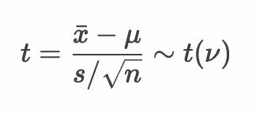
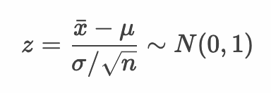

# 仮説検定 - 母平均の仮説検定


* 母平均の仮説検定には t分布を使用する（母分散が未知の場合）
* ただし母分散が既知の場合は、標準正規分布を使うこともできる
* また母分散が未知の場合においてもサンプルサイズが大きな場合は正規分布を使うこともできる


--- 

## 例： ミニトマト - 母平均の仮説検定 - 母分散が未知の場合

ここではミニトマトを例に母平均の仮説検定について考えます。ミニトマトの大きさ（単位mm）の母集団の分布は `N(μ, σ^2)` の正規分布に従うものとします。

このミニトマトの母集団からサンプルサイズ4の標本を1セット作成したところ標本平均は28.5mmであったとしましょう。またこのトマトの生産者はトマトの大きさを30mmと主張しているとしましょう。ここではトマト生産者の主張について有意水準 5%で仮説検定を行うものとします。


### 仮説検定の流れ

仮説検定の手順は以下のとおりです。

```
1. 帰無仮説・対立仮説を定義する
2. 検定統計量を定義する
3. 有意水準（α）を定義する
4. 標本から検定統計量の実現値を算出して検証する
```

### 1. 帰無仮説・対立仮説を定義する

* 帰無仮説（H0）
  * ミニトマトの大きさは30mmである（30mmとの差が0である）
* 対立仮説（H1）
  * ミニトマトの大きさは30mmでない

### 2. 検定統計量を定義する

* 検定統計量： t値



> t分布の自由度νは サンプルサイズ n - 1 となります。

### 3. 有意水準（α）を定義する

* 有意水準（α）： 5% 両側検定

### 4. 標本から検定統計量の実現値を算出して検証する

* 標本

```
29.5, 25.8, 25.1, 33.6
```

#### Rプログラム

```r
tomato_mu <- 30
tomato_sample <- c(29.5, 25.8, 25.1, 33.6)
tomato_sample_mean <- mean(tomato_sample)
tomato_sample_size <- length(tomato_sample)
tomato_sample_df <- tomato_sample_size - 1
tomato_sample_sd <- sd(tomato_sample)
t <- (tomato_sample_mean - tomato_mu) / (tomato_sample_sd / sqrt(tomato_sample_size))
p <- pt(t, tomato_sample_df, lower.tail = t < 0) * 2
lq <- qt(0.025, tomato_sample_df)
uq <- qt(0.975, tomato_sample_df)
paste(lq, "-", uq)
paste("t-value", t)
paste("p-value", p)
```

#### 実行結果

```r
> tomato_mu <- 30
> tomato_sample <- c(29.5, 25.8, 25.1, 33.6)
> tomato_sample_mean <- mean(tomato_sample)
> tomato_sample_size <- length(tomato_sample)
> tomato_sample_df <- tomato_sample_size - 1
> tomato_sample_sd <- sd(tomato_sample)
> t <- (tomato_sample_mean - tomato_mu) / (tomato_sample_sd / sqrt(tomato_sample_size))
> p <- pt(t, tomato_sample_df, lower.tail = t < 0) * 2
> lq <- qt(0.025, tomato_sample_df)
> uq <- qt(0.975, tomato_sample_df)
> paste(lq, "-", uq)
[1] "-3.18244630528371 - 3.18244630528371"
> paste("t-value", t)
[1] "t-value -0.767299396968273"
> paste("p-value", p)
[1] "p-value 0.49876222636919"
```

#### 仮説検定

* 帰無仮説（H0）： ミニトマトの大きさは30mmである（30mmとの差が0である）
* 対立仮説（H1）： ミニトマトの大きさは30mmでない
* 検定統計量： t値
* 有意水準： 5% 両側検定
* 標本： 29.5, 25.8, 25.1, 33.6
* 帰無分布： 自由度3のt分布
* 臨界値： -3.18, +3.18
* 棄却域： -3.18以下 あるいは +3.18以上
* t値： -0.77 ※棄却域にない
* p値： 0.50
* 検定結果： 検定結果は5%水準で有意でない。

以上の結果から、t値は棄却域にないため帰無仮説は棄却されません。

---


## 例： ミニトマト - 母平均の仮説検定 - 母分散が既知の場合

先ほどと同じケースに「母分散が既知である」という条件を追加します。ここではミニトマトの母分散を 16 （母標準偏差を 4） として同様の仮説検定を行います。

> 「母分散が既知である」というケースはあまり現実的ではありません。ここでは仮説検定の考え方を整理するために取り上げます。

### 仮説検定の流れ

仮説検定の手順は以下のとおりです。

```
1. 帰無仮説・対立仮説を定義する
2. 検定統計量を定義する
3. 有意水準（α）を定義する
4. 標本から検定統計量の実現値を算出して検証する
```

### 1. 帰無仮説・対立仮説を定義する

* 帰無仮説（H0）
  * ミニトマトの大きさは30mmである（30mmとの差が0である）
* 対立仮説（H1）
  * ミニトマトの大きさは30mmでない

### 2. 検定統計量を定義する

* 検定統計量： z値




> z値とは以下のように母平均と母分散（母標準偏差）を使って標準化した値です。

### 3. 有意水準（α）を定義する

* 有意水準（α）： 5% 両側検定

### 4. 標本から検定統計量の実現値を算出して検証する

* 標本

```
29.5, 25.8, 25.1, 33.6
```

#### Rプログラム

```r
tomato_mu <- 30
tomato_sigma <- 4
tomato_sample <- c(29.5, 25.8, 25.1, 33.6)
tomato_sample_mean <- mean(tomato_sample)
tomato_sample_size <- length(tomato_sample)
z <- (tomato_sample_mean - tomato_mu) / (tomato_sigma / sqrt(tomato_sample_size))
p <- pnorm(z, mean = 0, sd = 1, lower.tail = z < 0) * 2
lz <- qnorm(0.025, mean = 0, sd = 1)
uz <- qnorm(0.975, mean = 0, sd = 1)
paste(lz, "-", uz)
paste("z-value", z)
paste("p-value", p)
```

#### 実行結果

```r
> tomato_mu <- 30
> tomato_sigma <- 4
> tomato_sample <- c(29.5, 25.8, 25.1, 33.6)
> tomato_sample_mean <- mean(tomato_sample)
> tomato_sample_size <- length(tomato_sample)
> z <- (tomato_sample_mean - tomato_mu) / (tomato_sigma / sqrt(tomato_sample_size))
> p <- pnorm(z, mean = 0, sd = 1, lower.tail = z < 0) * 2
> lz <- qnorm(0.025, mean = 0, sd = 1)
> uz <- qnorm(0.975, mean = 0, sd = 1)
> paste(lz, "-", uz)
[1] "-1.95996398454005 - 1.95996398454005"
> paste("z-value", z)
[1] "z-value -0.75"
> paste("p-value", p)
[1] "p-value 0.453254704753736"
```

#### 仮説検定

* 帰無仮説（H0）： ミニトマトの大きさは30mmである（30mmとの差が0である）
* 対立仮説（H1）： ミニトマトの大きさは30mmでない
* 検定統計量： z値
* 有意水準： 5% 両側検定
* 標本： 29.5, 25.8, 25.1, 33.6
* 帰無分布： 標準正規分布
* 臨界値： -1.96, +1.96
* 棄却域： -1.96以下 あるいは +1.96以上
* z値： -0.75 ※棄却域にない
* p値： 0.45
* 検定結果： 検定結果は5%水準で有意でない。

以上の結果から、z値は棄却域にないため帰無仮説は棄却されません。

---

### エクササイズ

1. ミニトマトの例題について、以下の条件に従って仮説検定をしてください。
  * 帰無仮説（H0）： ミニトマトの大きさは30mmである（30mmとの差が0である）
  * 対立仮説（H1）： ミニトマトの大きさは30mmでない
  * 検定統計量： t値
  * 有意水準： 5% 両側検定

```r
tomato_sample <- c(29.5, 25.8, 25.1, 33.6, 
                   25.1, 31.5, 32.7, 27.7, 
                   32.0, 24.0, 25.3, 25.1, 
                   25.2, 33.9, 34.4, 25.1)
```

2. ある植物の花びらの大きさを調べるためにサンプルサイズの4の標本を1つ抽出したところ以下のとおりであった。

```
34, 44, 43, 42
```

この標本から母平均は 30 より大きいという仮説を立てた。有意水準5%で仮説検定をしてください。ただしこの母集団は正規分布したがっているものとします。

3. ある特殊な小さな部品を作る機械がある。この機械は平均サイズ 50mm の部品を作成することができる。実際にこの機械を使って部品を10個作ってみると大きさは以下のとおりであった。

```
54, 50, 47, 48, 50, 49, 48, 52, 50, 51
```

この機械は平均 50mmの部品を作成していると言えるか。有意水準1％で仮説検定をしてください。ただしこの母集団は正規分布したがっているものとします。


<!-- 

> tomato_mu = 30
> tomato_sample <- c(29.5, 25.8, 25.1, 33.6, 
+                    25.1, 31.5, 32.7, 27.7, 
+                    32.0, 24.0, 25.3, 25.1, 
+                    25.2, 33.9, 34.4, 25.1)
> tomato_sample_mean <- mean(tomato_sample)
> tomato_sample_size <- length(tomato_sample)
> tomato_sample_df <- tomato_sample_size - 1
> tomato_sample_sd <- sd(tomato_sample)
> t <- (tomato_sample_mean - tomato_mu) / (tomato_sample_sd / sqrt(tomato_sample_size))
> p <- pt(t, tomato_sample_df, lower.tail = t < 0) * 2
> lq <- qt(0.025, tomato_sample_df)
> uq <- qt(0.975, tomato_sample_df)
> paste(lq, "-", uq)
[1] "-2.13144954555978 - 2.13144954555978"
> paste("t-value", t)
[1] "t-value -1.54774944583593"
> paste("p-value", p)
[1] "p-value 0.142518902158107"
> 
> t.test(tomato_sample, mu = tomato_mu)

	One Sample t-test

data:  tomato_sample
t = -1.5477, df = 15, p-value = 0.1425
alternative hypothesis: true mean is not equal to 30
95 percent confidence interval:
 26.43431 30.56569
sample estimates:
mean of x 
     28.5 

H0は棄却されない


> mu <- 30
> x <- c(34, 44, 43, 42)
> x_mean <- mean(x)
> x_size <- length(x)
> x_df <- x_size - 1
> x_sd <- sd(x)
> t <- (x_mean - mu) / (x_sd / sqrt(x_size))
> p <- pt(t, x_df, lower.tail = F)
> uq <- qt(0.95, x_df)
> paste("uq", uq)
[1] "uq 2.35336343480182"
> paste("t-value", t)
[1] "t-value 4.70102133515957"
> paste("p-value", p)
[1] "p-value 0.00910507063989156"
> 
> t.test(x, mu = mu, alternative = "greater")

	One Sample t-test

data:  x
t = 4.701, df = 3, p-value = 0.009105
alternative hypothesis: true mean is greater than 30
95 percent confidence interval:
 35.36848      Inf
sample estimates:
mean of x 
    40.75 

H0は棄却される。よって対立仮説を採択する
上側検定のため0.95となる点に注意する


> mu <- 50 
> x <- c(54, 50, 47, 48, 50, 49, 48, 52, 50, 51)
> x_mean <- mean(x)
> x_size <- length(x)
> x_df <- x_size - 1
> x_sd <- sd(x)
> t <- (x_mean - mu) / (x_sd / sqrt(x_size))
> p <- pt(t, x_df, lower.tail = t < 0) * 2
> lq <- qt(0.005, x_df)
> uq <- qt(0.995, x_df)
> paste(lq, "-", uq)
[1] "-3.24983554159213 - 3.24983554159213"
> paste("t-value", t)
[1] "t-value -0.15210603796902"
> paste("p-value", p)
[1] "p-value 0.882458526767673"
> 
> t.test(x, mu = mu)

	One Sample t-test

data:  x
t = -0.15211, df = 9, p-value = 0.8825
alternative hypothesis: true mean is not equal to 50
95 percent confidence interval:
 48.41278 51.38722
sample estimates:
mean of x 
     49.9 

H0は棄却されない

```

-->