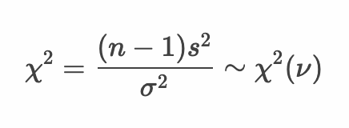

# 仮説検定 - 母分散の仮説検定


* 母分散の仮説検定には カイ二乗分布を使用する
* カイ二乗分布はパラメータに自由度を指定する
* 母分散の仮説検定を行う場合は自由度に 標本サイズ - 1 を指定する

> カイ二乗分布は後述する適合度検定や独立性の検定にも利用されます。

--- 

## 例： ミニトマト - 母分散の仮説検定

ここではミニトマトを例に母分散の仮説検定について考えます。ミニトマトの大きさ（単位mm）の母集団の分布は `N(μ, σ^2)` の正規分布に従うものとします。

このミニトマトの母集団からサンプルサイズ4の標本を1セット作成したところ不偏分散の標準偏差は3.9mmであったとしましょう。またこのトマトの生産者はトマトの大きさのばらつき（母分散）を25mmと主張しているとしましょう。ここではトマト生産者の主張について有意水準 5%で仮説検定を行うものとします。


---

### 仮説検定の流れ

仮説検定の手順は以下のとおりです。

```
1. 帰無仮説・対立仮説を定義する
2. 検定統計量を定義する
3. 有意水準（α）を定義する
4. 標本から検定統計量の実現値を算出して検証する
```

---

### 1. 帰無仮説・対立仮説を定義する

* 帰無仮説（H0）
  * ミニトマトの大きさのばらつき（母分散）は25mmである（25mmとの差が0である）
* 対立仮説（H1）
  * ミニトマトの大きさのばらつき（母分散）は25mmでない

---

### 2. 検定統計量を定義する

* 検定統計量： χ2値



> カイ二乗分布の自由度νは 標本サイズ n - 1 となります。

### 3. 有意水準（α）を定義する

* 有意水準（α）： 5% 両側検定

---

### 4. 標本から検定統計量の実現値を算出して検証する

#### 標本

```
29.5, 25.8, 25.1, 33.6
```


#### Rプログラム

```r
tomato_var <- 25
tomato_sample <- c(29.5, 25.8, 25.1, 33.6)
tomato_sample_var <- var(tomato_sample)
tomato_sample_size <- length(tomato_sample)
tomato_sample_df <- tomato_sample_size - 1
chisq <- (tomato_sample_df * tomato_sample_var) / (tomato_var)
p <- pchisq(chisq, df = tomato_sample_df, 
            lower.tail = chisq < qchisq(0.5, tomato_sample_df)) * 2
lq <- qchisq(0.025, df = tomato_sample_df)
uq <- qchisq(0.975, df = tomato_sample_df)
paste(lq, "-", uq)
paste("chisq-value", chisq)
paste("p-value", p)
```

#### 実行結果

```r
> tomato_var <- 25
> tomato_sample <- c(29.5, 25.8, 25.1, 33.6)
> tomato_sample_var <- var(tomato_sample)
> tomato_sample_size <- length(tomato_sample)
> tomato_sample_df <- tomato_sample_size - 1
> chisq <- (tomato_sample_df * tomato_sample_var) / (tomato_var)
> p <- pchisq(chisq, df = tomato_sample_df, 
+             lower.tail = chisq < qchisq(0.5, tomato_sample_df)) * 2
> lq <- qchisq(0.025, df = tomato_sample_df)
> uq <- qchisq(0.975, df = tomato_sample_df)
> paste(lq, "-", uq)
[1] "0.215795282623898 - 9.34840360449614"
> paste("chisq-value", chisq)
[1] "chisq-value 1.8344"
> paste("p-value", p)
[1] "p-value 0.785044252175719"
```

#### 仮説検定

* 帰無仮説（H0）： ミニトマトの大きさのばらつき（母分散）は25mmである（25mmとの差が0である）
* 帰無仮説（H1）： ミニトマトの大きさのばらつき（母分散）は25mmでない
* 検定統計量： χ2値
* 有意水準： 5% 両側検定
* 標本： 29.5, 25.8, 25.1, 33.6
* 帰無分布： 自由度3のカイ二乗分布
* 臨界値： -0.22, +9.35
* 棄却域： -0.22以下 あるいは +9.34以上
* χ2値： 1.8344 ※棄却域にない
* p値： 0.79
* 検定結果： 検定結果は5%水準で有意でない。

以上の結果から、χ2値は棄却域にないため帰無仮説は棄却されません。

---

### エクササイズ

1. ミニトマトの例題について、以下の条件に従って仮説検定をしてください。
  * 帰無仮説（H0）： ミニトマトの大きさのばらつき（母分散）は4mmである（4mmとの差が0である）
  * 対立仮説（H1）： ミニトマトの大きさのばらつき（母分散）は4mmでない
  * 検定統計量： χ2値
  * 有意水準： 5% 両側検定

```r
tomato_sample <- c(29.5, 25.8, 25.1, 33.6, 
                   25.1, 31.5, 32.7, 27.7, 
                   32.0, 24.0, 25.3, 25.1, 
                   25.2, 33.9, 34.4, 25.1)
```

2. ある植物の花びらの大きさを調べるためにサンプルサイズの4の標本を1つ抽出したところ以下のとおりであった。

```
34, 44, 43, 42
```

この標本から母分散は 4 より大きいという仮説を立てた。有意水準5%で仮説検定をしてください。ただしこの母集団は正規分布したがっているものとします。

3. ある特殊な小さな部品を作る機械がある。この機械の作成する部品のばらつき（母分散） 4mm と記載されている。実際にこの機械を使って部品を10個作ってみると大きさは以下のとおりであった。

```
54, 50, 47, 48, 50, 49, 48, 52, 50, 51
```

この機械のばらつき（母分散） 4mm と差があるか、有意水準1％で仮説検定をしてください。ただしこの母集団は正規分布したがっているものとします。


<!-- 

```
> tomato_var <- 4
> tomato_sample <- c(29.5, 25.8, 25.1, 33.6, 
+                    25.1, 31.5, 32.7, 27.7, 
+                    32.0, 24.0, 25.3, 25.1, 
+                    25.2, 33.9, 34.4, 25.1)
> tomato_sample_var <- var(tomato_sample)
> tomato_sample_size <- length(tomato_sample)
> tomato_sample_df <- tomato_sample_size - 1
> chisq <- (tomato_sample_df * tomato_sample_var) / (tomato_var)
> p <- pchisq(chisq, df = tomato_sample_df, 
+             lower.tail = chisq < qchisq(0.5, tomato_sample_df)) * 2
> lq <- qchisq(0.025, df = tomato_sample_df)
> uq <- qchisq(0.975, df = tomato_sample_df)
> paste(lq, "-", uq)
[1] "6.26213779504325 - 27.488392863443"
> paste("chisq-value", chisq)
[1] "chisq-value 56.355"
> paste("p-value", p)
[1] "p-value 2.11082929132487e-06"
> library(EnvStats)
> varTest(tomato_sample, sigma.squared = tomato_var)

	Chi-Squared Test on Variance

data:  tomato_sample
Chi-Squared = 56.355, df = 15, p-value = 2.111e-06
alternative hypothesis: true variance is not equal to 4
95 percent confidence interval:
  8.200552 35.997292
sample estimates:
variance 
  15.028 

H0: ミニトマトの大きさのばらつき（母分散）は4mmである（4mmとの差が0である）
H1: ミニトマトの大きさのばらつき（母分散）は4mmでない
検定結果は5%水準で有意である。 ※両側検定
H0は棄却される。よってH1を採択する。


> x_var <- 4
> x_sample <- c(34, 44, 43, 42)
> x_sample_var <- var(x_sample)
> x_sample_size <- length(x_sample)
> x_sample_df <- x_sample_size - 1
> chisq <- (x_sample_df * x_sample_var) / (x_var)
> p <- pchisq(chisq, df = x_sample_df, 
+             lower.tail = chisq < qchisq(0.5, x_sample_df))
> uq <- qchisq(0.95, df = x_sample_df)
> paste(uq)
[1] "7.81472790325118"
> paste("chisq-value", chisq)
[1] "chisq-value 15.6875"
> paste("p-value", p)
[1] "p-value 0.00131413943314758"
> varTest(x_sample, sigma.squared = x_var, alternative = "greater")

	Chi-Squared Test on Variance

data:  x_sample
Chi-Squared = 15.688, df = 3, p-value = 0.001314
alternative hypothesis: true variance is greater than 4
95 percent confidence interval:
 8.02971     Inf
sample estimates:
variance 
20.91667 

H0: 花びらの大きさのばらつきは 4 である
H1: 花びらの大きさのばらつきは 4 より大きい
検定結果は5%水準で有意である ※片側検定
H0は棄却される。よって対立仮説を採択する。


> x_var <- 4 
> x_sample <- c(54, 50, 47, 48, 50, 49, 48, 52, 50, 51)
> x_sample_var <- var(x_sample)
> x_sample_size <- length(x_sample)
> x_sample_df <- x_sample_size - 1
> chisq <- (x_sample_df * x_sample_var) / (x_var)
> p <- pchisq(chisq, df = x_sample_df, 
+             lower.tail = chisq < qchisq(0.5, x_sample_df)) * 2
> uq <- qchisq(0.99, df = x_sample_df)
> paste(uq)
[1] "21.6659943334619"
> paste("chisq-value", chisq)
[1] "chisq-value 9.725"
> paste("p-value", p)
[1] "p-value 0.746406720471493"
> varTest(x_sample, sigma.squared = x_var, conf.level = 0.99)

	Chi-Squared Test on Variance

data:  x_sample
Chi-Squared = 9.725, df = 9, p-value = 0.7464
alternative hypothesis: true variance is not equal to 4
99 percent confidence interval:
  1.649049 22.421616
sample estimates:
variance 
4.322222 

H0: 部品の大きさのばらつきは 4 である
H1: 部品の大きさのばらつきは 4 でない
検定結果は1%水準で有意でない ※両側検定
H0は棄却されない。
```

-->