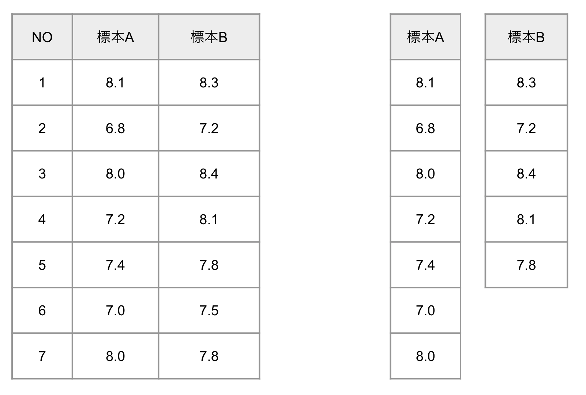
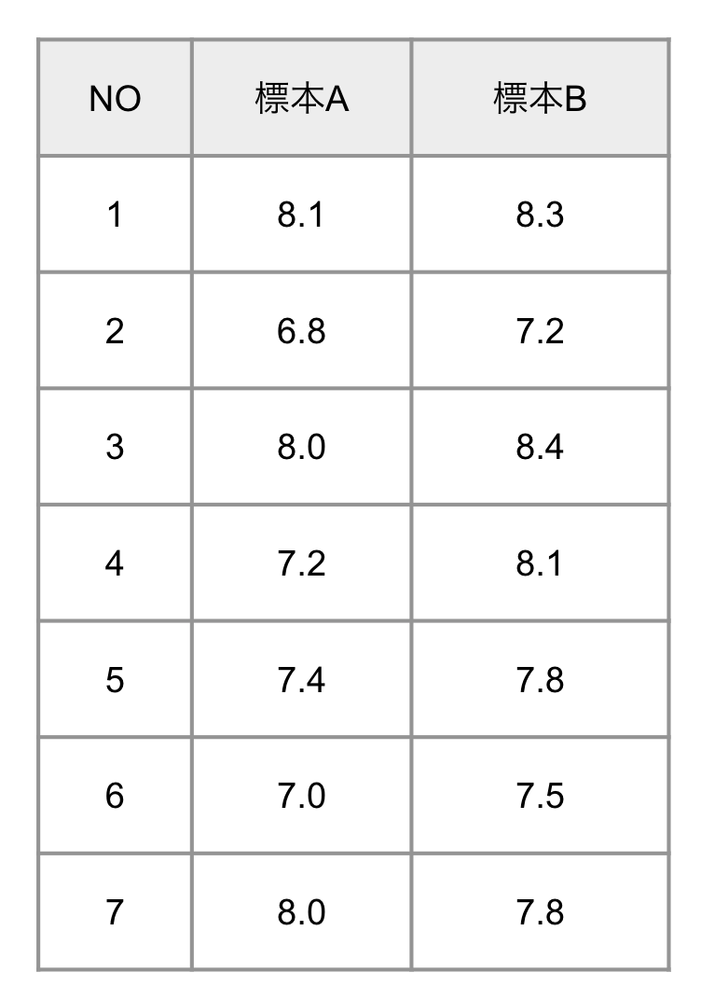
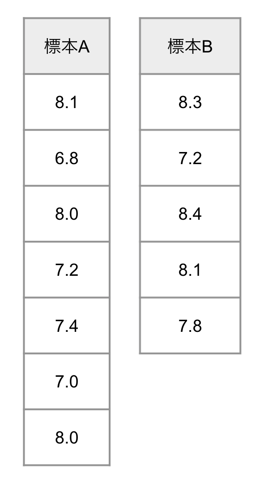
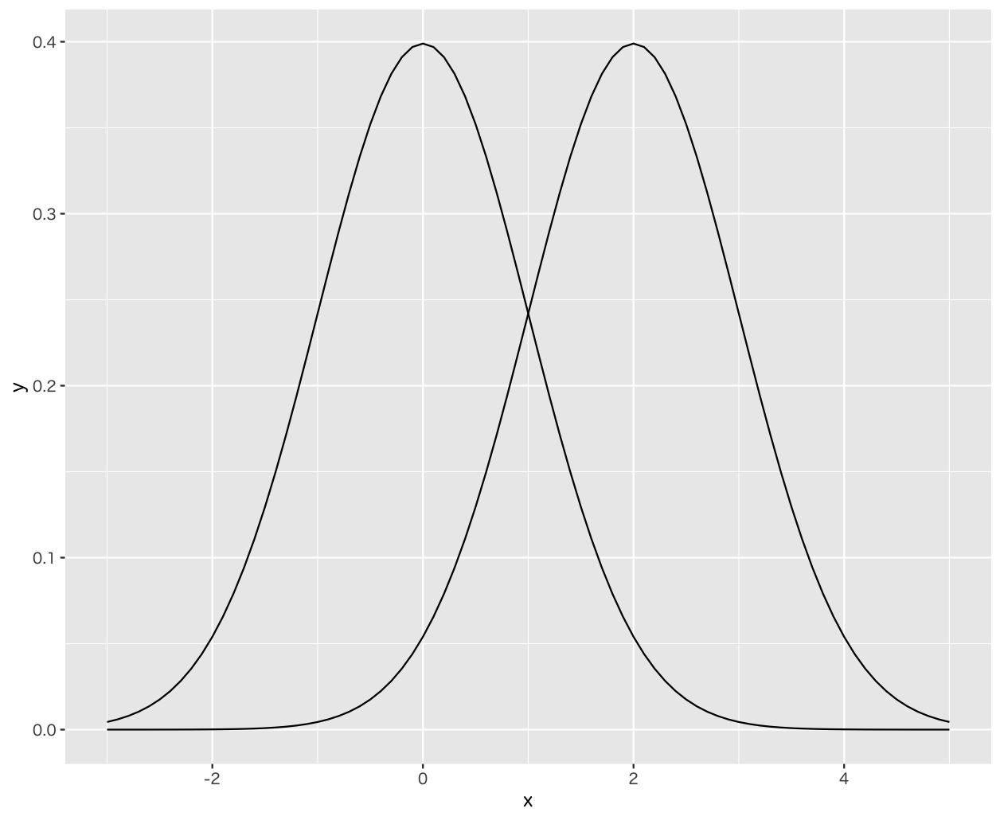
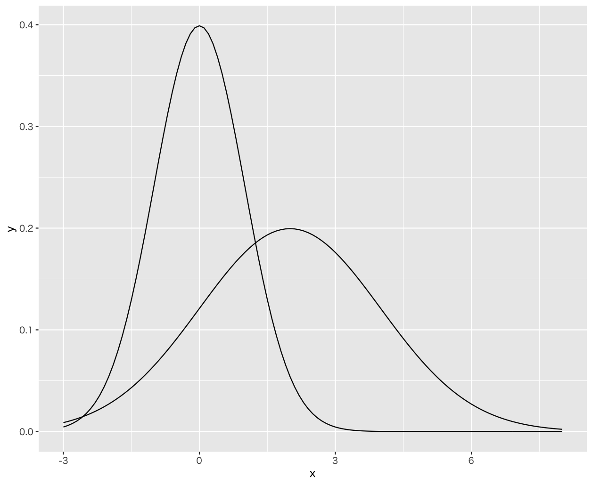

# 仮説検定 - 母平均の差の仮説検定（2標本の仮説検定）

* 2つの標本を比べて母平均の差について仮説検定を行うことができる（2標本の仮説検定）
* 2つの標本に対応がある場合と、そうでない場合とで検定統計量の算出方法が異なる
* 2つの標本に対応がない場合、母分散を等しいと仮定できるか、そうでないかによって検定統計量の算出方法が異なる

--- 

## 母平均の差の仮説検定の分類

* 2つの標本に対応がある場合、そうでない場合で検定統計量の算出方法が異なる

1. 2つの標本に対応がある場合
1. 2つの標本に対応がない場合

---

## 2つの標本に対応がある場合

* 2つの標本に対応がある場合、標本内の各データについて差分を求めることで t検定 を行う

---

## 2つの標本に対応がない場合

* 2つの標本に母分散が等しいと仮定できる場合とそうでない場合で、検定統計量の算出方法が異なる
  1. 2つの標本に対応がない場合（母分散が等しいと仮定できる場合）
  1. 2つの標本に対応がない場合（母分散が等しいと仮定できない場合）

### 母分散が等しいと仮定できる場合

* 2つの標本から **プールされた分散** を算出してt検定を行う

### 母分散が等しいと仮定できない場合

* 2つの標本に対して **Welchのt検定** を行う

---

### 母分散が等しいかどうかの判定について

* F検定によって、2つの標本の母分散が等しいかどうかを検定できる（母分散の比の検定）

> 対応のない2標本の仮説検定において、等分散性を仮定する（仮定しない）については様々な議論があります。母分散が等しい（等しくない）に関わらずに Welchのt検定 を行ってよいという考え方もあります。実際、Rの `t.test` 関数は2標本の仮説検定を行う場合、デフォルトでWelchのt検定となります。

---

## 以降の学習の流れ

母平均の差の仮説検定（2標本の仮説検定）について、以下の3通りの方法について取り上げます。

1. 2つの標本に対応がある場合
1. 2つの標本に対応がない場合（母分散が等しいと仮定できる場合）
1. 2つの標本に対応がない場合（母分散が等しいと仮定できない場合）

