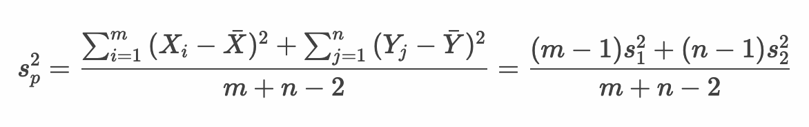
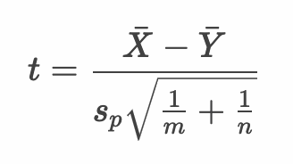

# 仮説検定 - 母平均の差の仮説検定（2標本の仮説検定） - 対応なし（母分散が等しいと仮定できる場合）


* 対応のない2標本は母分散が等しいと仮定できる場合とそうでない場合で検定統計量の算出方法が異なる
* 母分散が等しいと仮定できる場合は、2つの標本から1つの標本分散（不偏分散）を算出する（プールされた分散）
* 母分散が等しいと仮定できない場合は、後述する Welchのt検定 を行う

---

## プールされた分散

* 2つの標本の分散を1つの値にまとめたもの
* 以下の計算式で算出できる



> 2つの標本の分散 s1^2、s2^2 および、2つの標本サイズである m, n から算出できます。

---

## プールされた分散を扱う場合のt値

* 分母にプールされた分散の標準偏差を指定する



> 分母の標本サイズの指定部分にも注意してください。2つの標本サイズ m , n を使います。

## 等分散性の検定

* 2つの標本について、母分散が等しいかどうかを検定する方法にF検定がある

> F分布、F検定については後述します。

---

## 例： 2つの学習塾のスコア比較

1. 2つの学習塾の模擬試験のスコアを評価したい。学習塾Aと学習塾Bのスコアに有意差があるかを分析する。

有意水準は5%とします。

|学習塾Aのスコア|学習塾Bのスコア|
|:--:|:--:|
|62|65|
|67|68|
|70|72|
|65|67|
|56|66|
|64|70|
|68|66|
|61|66|
|72|67|
|66|72|
|68|66|
|63|68|
|61|68|
|74|67|
|65|<br>|

> 対応のない2つの標本です。学習塾Aのスコアは標本サイズ:15、学習塾Bのスコアは標本サイズ：14としています。

---

### 1. 帰無仮説・対立仮説を定義する

* 帰無仮説（H0）
  * 学習塾Aと学習塾Bのスコアに差はない
* 対立仮説（H1）
  * 学習塾Aと学習塾Bのスコアに差はある

---

### 2. 検定統計量を定義する

* 検定統計量： t値
  * プールされた分散 s^2 を算出する


<br>


---

### 3. 有意水準（α）を定義する

* 有意水準（α）： 5% 両側検定

---

### 4. 標本から検定統計量の実現値を算出して検証する

#### 標本

* 学習塾A（15件）

```
62, 67, 70, 65, 56, 64, 68, 61, 72, 66, 68, 63, 61, 74, 65
```

* 学習塾B（14件）

```
65, 68, 72, 67, 66, 70, 66, 66, 67, 72, 66, 68, 68, 67
```

#### Rプログラム

```r
schoolA_score <- c(62, 67, 70, 65, 56, 64, 68, 61, 72, 66, 68, 63, 61, 74, 65)
schoolB_score <- c(65, 68, 72, 67, 66, 70, 66, 66, 67, 72, 66, 68, 68, 67)
schoolA_score_mean <- mean(schoolA_score)
schoolA_score_var <- var(schoolA_score)
schoolA_score_size <- length(schoolA_score)
schoolB_score_mean <- mean(schoolB_score)
schoolB_score_var <- var(schoolB_score)
schoolB_score_size <- length(schoolB_score)
pooled_var <- ((schoolA_score_size - 1) * schoolA_score_var +
               (schoolB_score_size - 1) * schoolB_score_var) /
               (schoolA_score_size + schoolB_score_size - 2)
t <- (schoolA_score_mean - schoolB_score_mean) / 
     (sqrt(pooled_var) * 
      sqrt((1 / schoolA_score_size) + (1 / schoolB_score_size)))
p <- pt(t, schoolA_score_size + schoolB_score_size - 2, lower.tail = t < 0) * 2
lq <- qt(0.025, schoolA_score_size + schoolB_score_size - 2)
uq <- qt(0.975, schoolA_score_size + schoolB_score_size - 2)
paste(lq, "-", uq)
paste("t-value", t)
paste("p-value", p)
```

#### 実行結果

```r
> schoolA_score <- c(62, 67, 70, 65, 56, 64, 68, 61, 72, 66, 68, 63, 61, 74, 65)
> schoolB_score <- c(65, 68, 72, 67, 66, 70, 66, 66, 67, 72, 66, 68, 68, 67)
> schoolA_score_mean <- mean(schoolA_score)
> schoolA_score_var <- var(schoolA_score)
> schoolA_score_size <- length(schoolA_score)
> schoolB_score_mean <- mean(schoolB_score)
> schoolB_score_var <- var(schoolB_score)
> schoolB_score_size <- length(schoolB_score)
> pooled_var <- ((schoolA_score_size - 1) * schoolA_score_var +
+                  (schoolB_score_size - 1) * schoolB_score_var) /
+   (schoolA_score_size + schoolB_score_size - 2)
> t <- (schoolA_score_mean - schoolB_score_mean) / 
+   (sqrt(pooled_var) * 
+      sqrt((1 / schoolA_score_size) + (1 / schoolB_score_size)))
> p <- pt(t, schoolA_score_size + schoolB_score_size - 2, lower.tail = t < 0) * 2
> lq <- qt(0.025, schoolA_score_size + schoolB_score_size - 2)
> uq <- qt(0.975, schoolA_score_size + schoolB_score_size - 2)
> paste(lq, "-", uq)
[1] "-2.05183051648029 - 2.05183051648029"
> paste("t-value", t)
[1] "t-value -1.64593459857012"
> paste("p-value", p)
[1] "p-value 0.11137017319496"
```

#### 仮説検定

* 帰無仮説（H0）：学習塾Aと学習塾Bのスコアに差はない
* 対立仮説（H1）： 学習塾Aと学習塾Bのスコアに差はある
* 検定統計量： t値
* 有意水準： 5% 両側検定
* 標本： 
  * 標本1： 
    * 62, 67, 70, 65, 56, 64, 68, 61, 72, 66, 68, 63, 61, 74, 65
  * 標本2： 
    * 65, 68, 72, 67, 66, 70, 66, 66, 67, 72, 66, 68, 68, 67
* 帰無分布： 自由度27のt分布
* 臨界値： -2.051, +2.051
* 棄却域： -2.051以下 あるいは +2.051以上
* t値： -1.65 ※棄却域にない
* p値： 0.11
* 検定結果： 検定結果は5%水準で有意でない

以上の結果から、t値は棄却域にないため帰無仮説は棄却されない。

---

### 参考： t.test関数

* `t.test` 関数に `var.equal = T` 引数を指定することで、対応のない2標本（母分散が等しい場合）について、母平均の差の仮説検定を行うことができる

```r
t.test(schoolA_score, schoolB_score, var.equal = T)
```

#### 実行結果

```r
> t.test(sleep2_sample, sleep1_sample, paired = T, alternative = "greater")

	Paired t-test

data:  sleep2_sample and sleep1_sample
t = 2.9759, df = 6, p-value = 0.01238
alternative hypothesis: true difference in means is greater than 0
95 percent confidence interval:
 0.1288948       Inf
sample estimates:
mean of the differences 
              0.3714286 

```

---

## エクササイズ

1. ある品種の植物の花びらの大きさを調査しています。A地点で観測された植物の花びらの大きさと、B地点で観測された植物の花びらの大きさに差があるかを調べます。有意水準5%で検定してください。

```
A地点の標本： 6.10, 5.48, 7.61,  4.69, 6.76, 2.30, 6.98, 1.29
B地点の標本： 4.98, 7.28, 5.95, 10.88, 6.77, 4.72, 7.22, 8.25
```


2. ある飲食チェーン点の売上を調査しています。A支店とB支店の売上に差があるかを調べます。有意水準5%で検定してください。

```
A支店の売上： 99.35, 96.69, 101.09, 100.48, 101.21, 101.49, 100.42
B支店の売上： 111.83, 111.12, 114.09, 108.24, 111.39, 110.19, 108.93
```

<!--

> a <- c(6.10, 5.48, 7.61, 4.69, 6.76, 2.30, 6.98, 1.29)
> b <- c(4.98, 7.28, 5.95, 10.88, 6.77, 4.72, 7.22, 8.25)
> t.test(a, b, var.equal = T)

	Two Sample t-test

data:  a and b
t = -1.7432, df = 14, p-value = 0.1032
alternative hypothesis: true difference in means is not equal to 0
95 percent confidence interval:
 -4.1373752  0.4273752
sample estimates:
mean of x mean of y 
  5.15125   7.00625 

> sampleA <- c(6.10, 5.48, 7.61, 4.69, 6.76, 2.30, 6.98, 1.29)
> sampleB <- c(4.98, 7.28, 5.95, 10.88, 6.77, 4.72, 7.22, 8.25)
> sampleA_mean <- mean(sampleA)
> sampleA_var <- var(sampleA)
> sampleA_size <- length(sampleA)
> sampleB_mean <- mean(sampleB)
> sampleB_var <- var(sampleB)
> sampleB_size <- length(sampleB)
> pooled_var <- ((sampleA_size - 1) * sampleA_var +
+                  (sampleB_size - 1) * sampleB_var) /
+   (sampleA_size + sampleB_size - 2)
> t <- (sampleA_mean - sampleB_mean) / 
+   (sqrt(pooled_var) * 
+      sqrt((1 / sampleA_size) + (1 / sampleB_size)))
> p <- pt(t, sampleA_size + sampleB_size - 2, lower.tail = t < 0) * 2
> lq <- qt(0.025, sampleA_size + sampleA_size - 2)
> uq <- qt(0.975, sampleA_size + sampleA_size - 2)
> paste(lq, "-", uq)
[1] "-2.1447866879178 - 2.1447866879178"
> paste("t-value", t)
[1] "t-value -1.74317499444075"
> paste("p-value", p)
[1] "p-value 0.103212657092782"


* 帰無仮説（H0）： A地点の花びらの大きさとB地点の花びらの大きさに差はない
* 対立仮説（H1）： A地点の花びらの大きさとB地点の花びらの大きさに差はある
* 検定統計量： t値
* 有意水準： 5% 両側検定
* 標本： 
  * 標本1： 
    * 6.10, 5.48, 7.61, 4.69, 6.76, 2.30, 6.98, 1.29 
  * 標本2： 
    * 4.98, 7.28, 5.95, 10.88, 6.77, 4.72, 7.22, 8.25 
* 帰無分布： 自由度14のt分布
* 臨界値： -2.145, +2.145
* 棄却域： -2.145以下 あるいは +2.145以上
* t値： -1.743 ※棄却域にない
* p値： 0.103
* 検定結果： 検定結果は5%水準で有意でない


> a <- c(99.35, 96.69, 101.09, 100.48, 101.21, 101.49, 100.42)
> b <- c(111.83, 111.12, 114.09, 108.24, 111.39, 110.19, 108.93)
> t.test(a, b, var.equal = T)

	Two Sample t-test

data:  a and b
t = -11.08, df = 12, p-value = 1.17e-07
alternative hypothesis: true difference in means is not equal to 0
95 percent confidence interval:
 -12.831399  -8.614316
sample estimates:
mean of x mean of y 
 100.1043  110.8271

> sampleA <- c(99.35, 96.69, 101.09, 100.48, 101.21, 101.49, 100.42)
> sampleB <- c(111.83, 111.12, 114.09, 108.24, 111.39, 110.19, 108.93)
> sampleA_mean <- mean(sampleA)
> sampleA_var <- var(sampleA)
> sampleA_size <- length(sampleA)
> sampleB_mean <- mean(sampleB)
> sampleB_var <- var(sampleB)
> sampleB_size <- length(sampleB)
> pooled_var <- ((sampleA_size - 1) * sampleA_var +
+                  (sampleB_size - 1) * sampleB_var) /
+   (sampleA_size + sampleB_size - 2)
> t <- (sampleA_mean - sampleB_mean) / 
+   (sqrt(pooled_var) * 
+      sqrt((1 / sampleA_size) + (1 / sampleB_size)))
> p <- pt(t, sampleA_size + sampleB_size - 2, lower.tail = t < 0) * 2
> lq <- qt(0.025, sampleA_size + sampleA_size - 2)
> uq <- qt(0.975, sampleA_size + sampleA_size - 2)
> paste(lq, "-", uq)
[1] "-2.17881282966723 - 2.17881282966723"
> paste("t-value", t)
[1] "t-value -11.0802170891779"
> paste("p-value", p)
[1] "p-value 1.16971156914903e-07"


* 帰無仮説（H0）： A支店の売上とB支店の売上に差はない
* 対立仮説（H1）： A支店の売上とB支店の売上に差はある
* 検定統計量： t値
* 有意水準： 5% 両側検定
* 標本： 
  * 標本1： 
    * 99.35, 96.69, 101.09, 100.48, 101.21, 101.49, 100.42
  * 標本2： 
    * 111.83, 111.12, 114.09, 108.24, 111.39, 110.19, 108.93
* 帰無分布： 自由度12のt分布
* 臨界値： -2.179, +2.179
* 棄却域： -2.179以下 あるいは +2.179以上 
* t値： -11.08 ※棄却域にある
* p値： 1.17e-07
* 検定結果： 検定結果は5%水準で有意である
-->