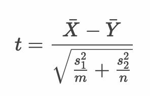
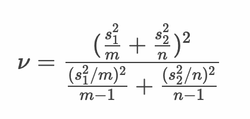

# 仮説検定 - 母平均の差の仮説検定（2標本の仮説検定） - 対応なし（母分散が等しいと仮定できない場合）


* 対応のない2標本において、母分散が等しいと仮定できない場合は Welchのt検定 を行う

> 母分散が等しい場合においても Welchのt検定 を使っても良いという考え方もあります。

---

## Welchのt検定

* 2つの標本から以下のとおり t 値を算出する



> t値の計算式の分母においては、プールされた分散ではなく標本ごとの分散を使います。 m, n は2つの標本のサイズです。

* 自由度は以下のとおり算出する



> Welchのt検定における自由度の算出はやや複雑です。R言語の場合は `t.test` 関数を使えば自動的に自由度も算出されます。


---

## 例： ミニトマトの大きさの比較

* 生産者Aの育てたミニトマトと生産者Bの育てたミニトマトについて、その大きさに有意差があるか検定したい。

* 生産者Aの育てたミニトマト

```
29.68, 30.09, 32.28, 28.53, 35.06, 33.95, 27.65, 23.98, 28.60, 29.63, 29.36, 29.61
```


* 生産者Bの育てたミニトマト

```
38.73, 36.49, 39.27, 39.95, 44.24, 23.92, 30.40, 28.35, 32.12, 40.65, 22.57, 45.64
```

---

### 1. 帰無仮説・対立仮説を定義する

* 帰無仮説（H0）
  * 生産者Aと生産者Bのミニトマトの大きさに差はない
* 対立仮説（H1）
  * 生産者Aと生産者Bのミニトマトの大きさに差はある

---

### 2. 検定統計量を定義する

* 検定統計量： t値
  * 自由度の算出方法に注意する


<br>


---

### 3. 有意水準（α）を定義する

* 有意水準（α）： 5% 両側検定

---

### 4. 標本から検定統計量の実現値を算出して検証する

#### 標本

* 生産者Aの育てたミニトマト

```
29.68, 30.09, 32.28, 28.53, 35.06, 33.95, 27.65, 23.98, 28.60, 29.63, 29.36, 29.61
```

* 生産者Bの育てたミニトマト

```
38.73, 36.49, 39.27, 39.95, 44.24, 23.92, 30.40, 28.35, 32.12, 40.65, 22.57, 45.64
```

#### Rプログラム

```r
tomato_a <- c(29.68, 30.09, 32.28, 28.53, 35.06, 33.95,  
              27.65, 23.98, 28.60, 29.63, 29.36, 29.61)
tomato_b <- c(38.73, 36.49, 39.27, 39.95, 44.24, 23.92, 
              30.40, 28.35, 32.12, 40.65, 22.57, 45.64)
tomato_a_mean <- mean(tomato_a)
tomato_a_var <- var(tomato_a)
tomato_a_size <- length(tomato_a)
tomato_b_mean <- mean(tomato_b)
tomato_b_var <- var(tomato_b)
tomato_b_size <- length(tomato_b)
t <- (tomato_a_mean - tomato_b_mean) / 
    sqrt((tomato_a_var / tomato_a_size) + (tomato_b_var / tomato_b_size))
df <- ((tomato_a_var / tomato_a_size) + (tomato_b_var / tomato_b_size)) ** 2 /
      (((tomato_a_var / tomato_a_size) ** 2) / (tomato_a_size - 1) +
       ((tomato_b_var / tomato_b_size) ** 2) / (tomato_b_size - 1))
p <- pt(t, df, lower.tail = t < 0) * 2
lq <- qt(0.025, df)
uq <- qt(0.975, df)
paste("df", df)
paste(lq, "-", uq)
paste("t-value", t)
paste("p-value", p)
```

#### 実行結果

```r
> tomato_a <- c(29.68, 30.09, 32.28, 28.53, 35.06, 33.95,  
+               27.65, 23.98, 28.60, 29.63, 29.36, 29.61)
> tomato_b <- c(38.73, 36.49, 39.27, 39.95, 44.24, 23.92, 
+               30.40, 28.35, 32.12, 40.65, 22.57, 45.64)
> tomato_a_mean <- mean(tomato_a)
> tomato_a_var <- var(tomato_a)
> tomato_a_size <- length(tomato_a)
> tomato_b_mean <- mean(tomato_b)
> tomato_b_var <- var(tomato_b)
> tomato_b_size <- length(tomato_b)
> t <- (tomato_a_mean - tomato_b_mean) / 
+   sqrt((tomato_a_var / tomato_a_size) + (tomato_b_var / tomato_b_size))
> df <- ((tomato_a_var / tomato_a_size) + (tomato_b_var / tomato_b_size)) ** 2 /
+   (((tomato_a_var / tomato_a_size) ** 2) / (tomato_a_size - 1) +
+      ((tomato_b_var / tomato_b_size) ** 2) / (tomato_b_size - 1))
> p <- pt(t, df, lower.tail = t < 0) * 2
> lq <- qt(0.025, df)
> uq <- qt(0.975, df)
> paste("df", df)
[1] "df 14.1277868688009"
> paste(lq, "-", uq)
[1] "-2.14296810127829 - 2.14296810127829"
> paste("t-value", t)
[1] "t-value -2.2604384942865"
> paste("p-value", p)
[1] "p-value 0.0400958002760635"
```

#### 仮説検定

* 帰無仮説（H0）： 生産者Aと生産者Bのミニトマトの大きさに差はない
* 対立仮説（H1）： 生産者Aと生産者Bのミニトマトの大きさに差はある
* 検定統計量： t値
* 有意水準： 5% 両側検定
* 標本： 
  * 標本1： 
    * 29.68, 30.09, 32.28, 28.53, 35.06, 33.95, 27.65, 23.98, 28.60, 29.63, 29.36, 29.61
  * 標本2： 
    * 38.73, 36.49, 39.27, 39.95, 44.24, 23.92, 30.40, 28.35, 32.12, 40.65, 22.57, 45.64 
* 帰無分布： 自由度14.128のt分布
* 臨界値： -2.143, +2.143
* 棄却域： -2.143以下 あるいは +2.143以上
* t値： -2.26 ※棄却域にある
* p値： 0.04
* 検定結果： 検定結果は5%水準で有意である

以上の結果から、t値は棄却域にあるため帰無仮説は棄却される。よって対立仮説を採択する

---

### 参考： t.test関数

* `t.test` 関数に `var.equal = F` 引数を指定することで、対応のない2標本（母分散が等しくない場合）について、母平均の差の仮説検定を行うことができる（Welchのt検定となる）

```r
t.test(schoolA_score, schoolB_score, var.equal = F)
```

> `var.equal` 引数を省略した場合も `FALSE` となります。つまり `t.test` 関数に2つの標本を指定した場合のデフォルトの挙動はWelchのt検定です。

#### 実行結果

```r
> t.test(tomato_a, tomato_b, var.equal = F)

	Welch Two Sample t-test

data:  tomato_a and tomato_b
t = -2.2604, df = 14.128, p-value = 0.0401
alternative hypothesis: true difference in means is not equal to 0
95 percent confidence interval:
 -10.3748939  -0.2767727
sample estimates:
mean of x mean of y 
 29.86833  35.19417 

```

---

## エクササイズ

1. 一人暮らしをするためにワンルームマンションの家賃を調べています。A駅周辺の家賃とB駅周辺の家賃に差があるかを調べます。有意水準5%で検定してください。

```
A駅周辺の家賃： 65000, 64800, 65200, 65800, 63300, 64100, 66200
B駅周辺の家賃： 65600, 66100, 66500, 66000, 66000, 66100, 66100
```

2. A君とB君は最近、運動不足だと話しています。A君とB君がアプリで測定した歩数の差について、有意水準5%で検定してください。


```
A君の歩数：6731, 6043, 6691, 7816, 6674, 8287, 7500, 6422, 7361, 6258
B君の歩数：8574, 5025, 7584, 7451, 6342, 10714, 8773, 7667, 8653, 7765, 8317, 6535
```

<!-- 
> a <- c(65000, 64800, 65200, 65800, 63300, 64100, 66200)
> b <- c(65600, 66100, 66500, 66000, 66000, 66100, 66100)
> t.test(a, b, var.equal = F)

	Welch Two Sample t-test

data:  a and b
t = -2.9684, df = 6.8574, p-value = 0.02136
alternative hypothesis: true difference in means is not equal to 0
95 percent confidence interval:
 -2057.1099  -228.6044
sample estimates:
mean of x mean of y 
 64914.29  66057.14 

> sampleA <- c(65000, 64800, 65200, 65800, 63300, 64100, 66200)
> sampleB <- c(65600, 66100, 66500, 66000, 66000, 66100, 66100)
> sampleA_mean <- mean(sampleA)
> sampleA_var <- var(sampleA)
> sampleA_size <- length(sampleA)
> sampleB_mean <- mean(sampleB)
> sampleB_var <- var(sampleB)
> sampleB_size <- length(sampleB)
> t <- (sampleA_mean - sampleB_mean) / 
+   sqrt((sampleA_var / sampleA_size) + (sampleB_var / sampleB_size))
> df <- ((sampleA_var / sampleA_size) + (sampleB_var / sampleB_size)) ** 2 /
+   (((sampleA_var / sampleA_size) ** 2) / (sampleA_size - 1) +
+      ((sampleB_var / sampleB_size) ** 2) / (sampleB_size - 1))
> p <- pt(t, df, lower.tail = t < 0) * 2
> lq <- qt(0.025, df)
> uq <- qt(0.975, df)
> paste("df", df)
[1] "df 6.85735887569941"
> paste(lq, "-", uq)
[1] "-2.37463196718432 - 2.37463196718432"
> paste("t-value", t)
[1] "t-value -2.96839710409503"
> paste("p-value", p)
[1] "p-value 0.0213595450564007"

* 帰無仮説（H0）： A駅周辺の家賃とB駅周辺の家賃に差はない
* 対立仮説（H1）： A駅周辺の家賃とB駅周辺の家賃に差はある
* 検定統計量： t値
* 有意水準： 5% 両側検定
* 標本： 
  * 標本1： 
    * 65000, 64800, 65200, 65800, 63300, 64100, 66200
  * 標本2： 
    * 65600, 66100, 66500, 66000, 66000, 66100, 66100
* 帰無分布： 自由度6.857のt分布
* 臨界値： -2.375, +2.375
* 棄却域： -2.375以下 あるいは +2.375以上
* t値： -2.968 ※棄却域にある
* p値： 0.021
* 検定結果： 検定結果は5%水準で有意である


> a <- c(6731, 6043, 6691, 7816, 6674, 8287, 7500, 6422, 7361, 6258)
> b <- c(8574, 5025, 7584, 7451, 6342, 10714, 8773, 7667, 8653, 7765, 8317, 6535)
> t.test(a, b, var.equal = F)

	Welch Two Sample t-test

data:  a and b
t = -1.6988, df = 16.88, p-value = 0.1077
alternative hypothesis: true difference in means is not equal to 0
95 percent confidence interval:
 -1805.3745   195.3078
sample estimates:
mean of x mean of y 
 6978.300  7783.333 

> sampleA <- c(6731, 6043, 6691, 7816, 6674, 8287, 7500, 6422, 7361, 6258)
> sampleB <- c(8574, 5025, 7584, 7451, 6342, 10714, 8773, 7667, 8653, 7765, 8317, 6535)
> sampleA_mean <- mean(sampleA)
> sampleA_var <- var(sampleA)
> sampleA_size <- length(sampleA)
> sampleB_mean <- mean(sampleB)
> sampleB_var <- var(sampleB)
> sampleB_size <- length(sampleB)
> t <- (sampleA_mean - sampleB_mean) / 
+   sqrt((sampleA_var / sampleA_size) + (sampleB_var / sampleB_size))
> df <- ((sampleA_var / sampleA_size) + (sampleB_var / sampleB_size)) ** 2 /
+   (((sampleA_var / sampleA_size) ** 2) / (sampleA_size - 1) +
+      ((sampleB_var / sampleB_size) ** 2) / (sampleB_size - 1))
> p <- pt(t, df, lower.tail = t < 0) * 2
> lq <- qt(0.025, df)
> uq <- qt(0.975, df)
> paste("df", df)
[1] "df 16.880473096956"
> paste(lq, "-", uq)
[1] "-2.11095415892086 - 2.11095415892086"
> paste("t-value", t)
[1] "t-value -1.69880892809918"
> paste("p-value", p)
[1] "p-value 0.107708684906727"

* 帰無仮説（H0）： A君とB君の歩数に差はない
* 対立仮説（H1）： A君とB君の歩数に差はある
* 検定統計量： t値
* 有意水準： 5% 両側検定
* 標本： 
  * 標本1： 
    * 6731, 6043, 6691, 7816, 6674, 8287, 7500, 6422, 7361, 6258
  * 標本2： 
    * 8574, 5025, 7584, 7451, 6342, 10714, 8773, 7667, 8653, 7765, 8317, 6535
* 帰無分布： 自由度16.880のt分布
* 臨界値： -2.111, +2.111
* 棄却域： -2.111以下 あるいは +2.111以上
* t値： -1.699 ※棄却域にない
* p値： 0.108
* 検定結果： 検定結果は5%水準で有意でない

-->