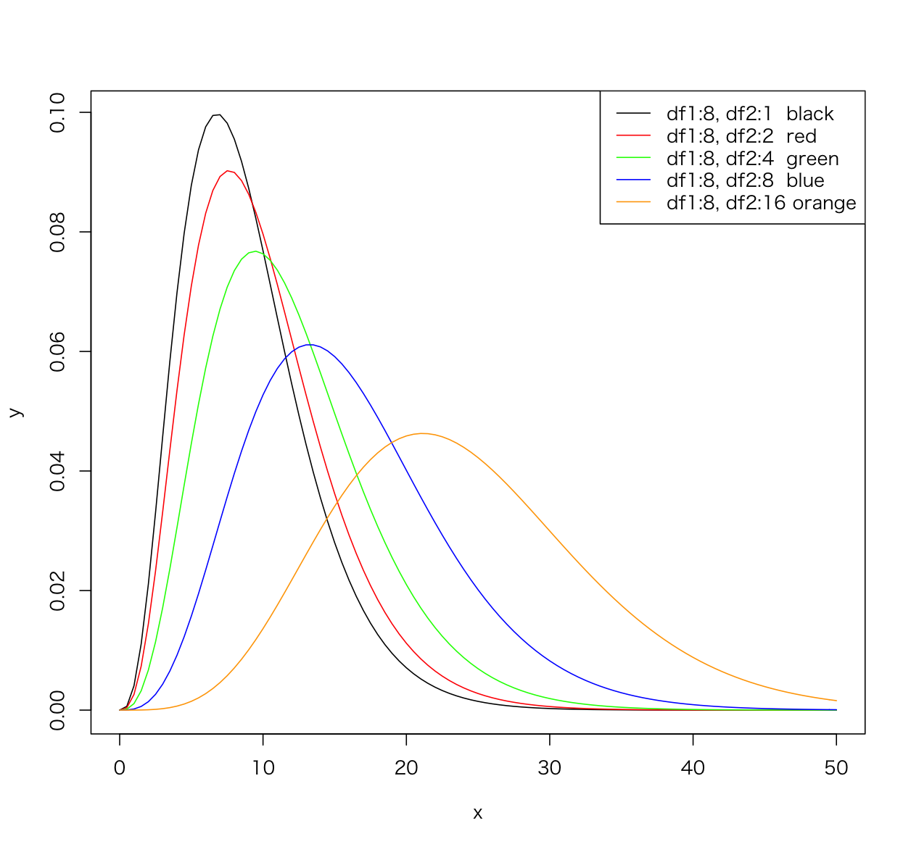
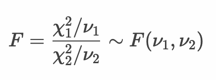
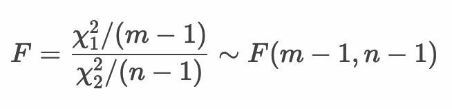
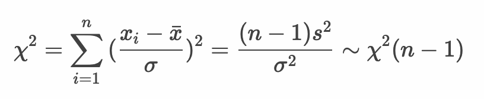
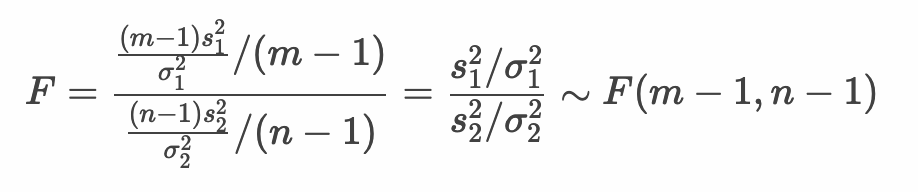
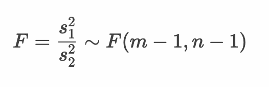
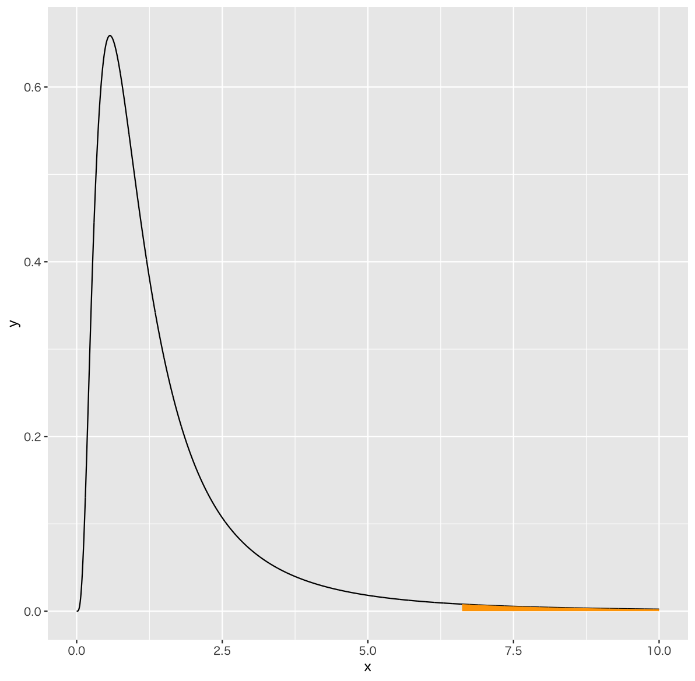
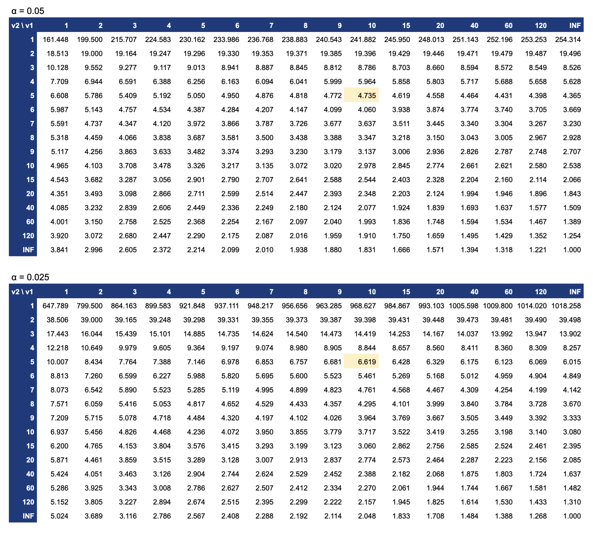
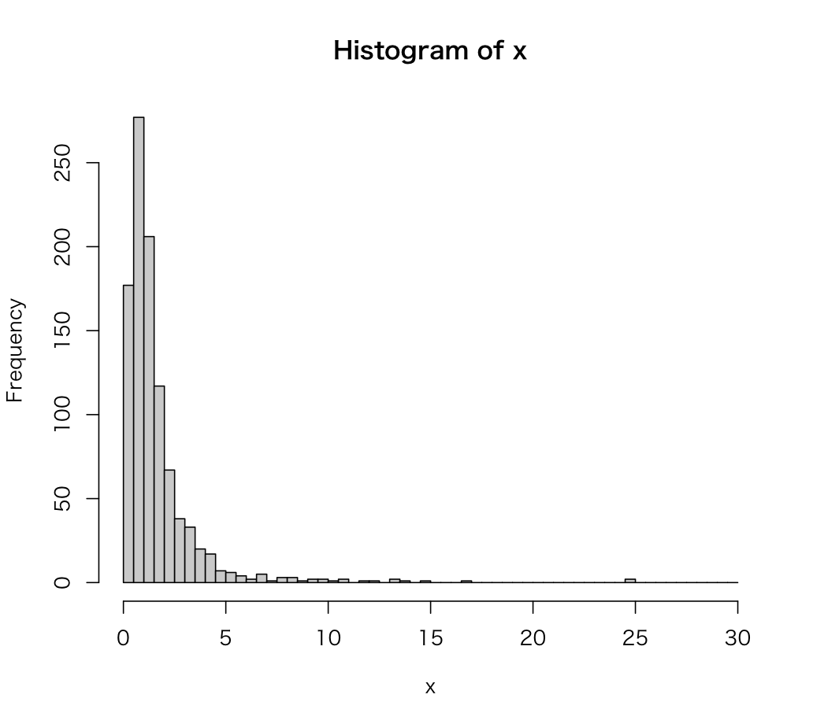
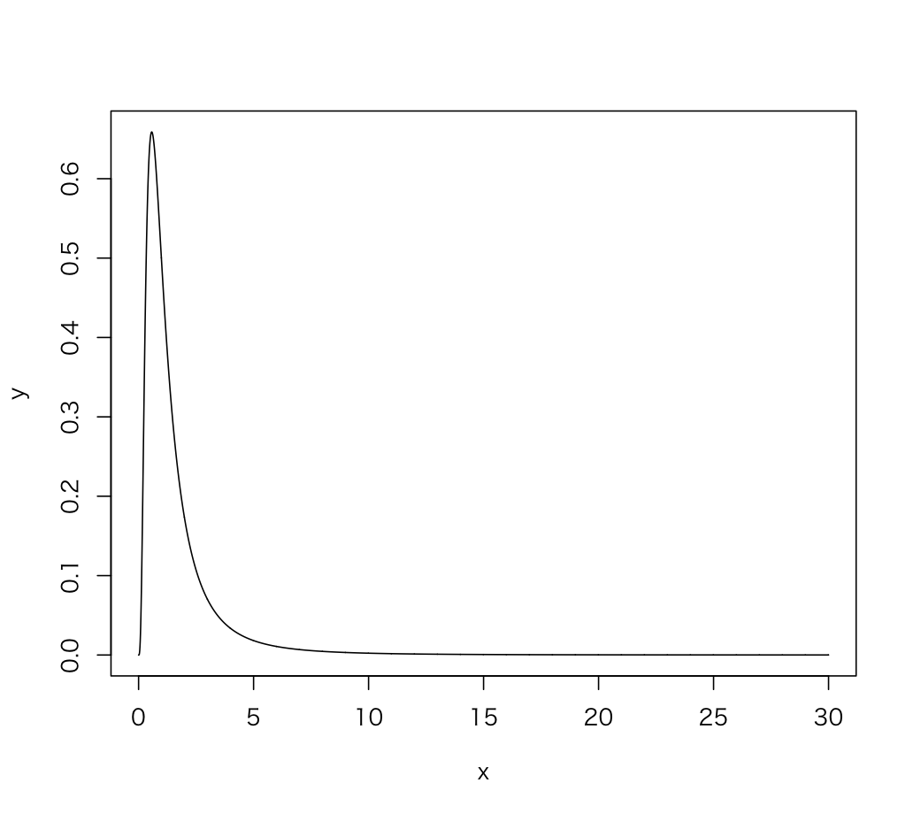

# F分布

* F分布とは、カイ二乗分布にしたがう独立した2つの確率変数の比がしたがう確率分布
* F分布は2つの自由度をパラメータに持つ
* 2つの確率変数の等分散性の検定などにF分布を使う



>  F分布の分布の形状はパラメータ（2つの自由度）によって異なります。横軸（X軸）は常に0以上の値をとります。

--- 

## 統計量F

* 統計量Fはカイ二乗分布にしたがう独立した2つの確率変数の比



* 自由度ν1, ν2 を2標本のサイズ m , n で置き換えると以下のようになる




* 統計量 χ2値 は以下のとおり



* 統計量Fは以下のように表現できる



### 参考：等分散性の検定

> 次節で学習する等分散性の検定の場合、上記の式の分子・分母にある σ1^2、σ2^2 の値が等しいという帰無仮説のもと仮説検定を行います。その場合は分子・分母にある σ1^2、σ2^2が約分されるので、次のように統計量Fを算出できます。



---

### 例：母分散の等しい2つの標本の例

* 母分散の等しい2つの標本x, y がある場合 

```
x: 29.92 34.81 26.78 27.90 29.94
y: 32.37 30.24 34.97 34.26 29.89 31.40
```

* 以下の数式から統計量F値を算出できる


```
x: 29.92 34.81 26.78 27.90 29.94
y: 32.37 30.24 34.97 34.26 29.89 31.40
s1^2: 9.46 
s2^2: 4.35
F: 9.46 / 4.35 = 2.17
```

---

## F分布の確率点（quantile）

* 2つの自由度（ν1、ν2）と確率（上側確率：α）を指定することで確率点を求めることができる
* たとえば自由度（10, 5）、上側確率2.5%（0.025）の確率点は 6.619 となる
* R言語でプログラミングする場合は `qf` 関数によって確率点を算出できる




> 上記のグラフは自由度（10, 5）のF分布です。x軸は確率点（quantile）、y軸は確率密度（density）です。確率点 6.619 より上側の面積（オレンジ色の部分）は全体の2.5%を意味します。



> 有意水準0.05のものと0.025の2つの表を記載しています。

---

## Rプログラミング

### rf 関数  - f1.R

* `rf` 関数はF分布から乱数を生成する
* `rf` 関数は第1引数に生成する乱数の数、`df1`、`df2` 引数にF分布のパラメータである2つの自由度を指定する

```r
set.seed(1)
x <- rf(1000, df1 = 10, df2 = 5)
hist(x, breaks = seq(0, 50, 0.5))
```

> `set.seed` 関数で乱数のシードを指定しています。これによって生成される乱数を固定できます。

#### 実行結果

```r
> set.seed(1)
> x <- rf(1000, df1 = 10, df2 = 5)
> hist(x, breaks = seq(0, 30, 0.5))
```



---

### df 関数  - f2.R

* `df` 関数はF分布の確率密度関数から確率密度を算出する
* `df` 関数は第1引数に確率密度を求める点（quantile、分位数、確率点）、`df1` 引数、`df2` 引数にF分布のパラメータである2つの自由度を指定する

```r
x <- seq(0, 30, 0.01)
y <- df(x, df1 = 10, df2 = 5)
plot(x, y, type="l")
```

#### 実行結果

```r
> x <- seq(0, 30, 0.01)
> y <- df(x, df1 = 10, df2 = 5)
> plot(x, y, type="l")
```



---

### pf 関数  - f3.R

* `pf` 関数はF分布の確率密度関数から確率（デフォルトは下側確率）を算出する
* `pf` 関数は第1引数に確率を求める点（quantile、分位数、確率点）、`df1` 引数、`df2` 引数にF分布のパラメータである2つの自由度を指定する
* `pf` 関数は `lower.tail` 引数に `FALSE` を指定することで上側確率を算出できる

```r
pf(4.735, df1 = 10, df2 = 5)
pf(6.619, df1 = 10, df2 = 5)
pf(4.735, df1 = 10, df2 = 5, lower.tail = F)
pf(6.619, df1 = 10, df2 = 5, lower.tail = F)
```

#### 実行結果

```r
> pf(4.735, df1 = 10, df2 = 5)
[1] 0.9499987
> pf(6.619, df1 = 10, df2 = 5)
[1] 0.9749988
> pf(4.735, df1 = 10, df2 = 5, lower.tail = F)
[1] 0.05000133
> pf(6.619, df1 = 10, df2 = 5, lower.tail = F)
[1] 0.02500124
```

---

### qf 関数  - f4.R

* `qf` 関数はF分布の確率から確率点（quantile、分位数）を算出する
* `qf` 関数は第1引数に確率、`df1` 引数、`df2` 引数にF分布のパラメータである2つの自由度を指定する
* `qf` 関数は `lower.tail` 引数に `FALSE` を指定することで上側からの確率点を算出できる

```r
qf(0.95, df1 = 10, df2 = 5)
qf(0.975, df1 = 10, df2 = 5)
```

#### 実行結果

```r
> qf(0.95, df1 = 10, df2 = 5)
[1] 4.735063
> qf(0.975, df1 = 10, df2 = 5)
[1] 6.619154
```

---

## エクササイズ

1. 自由度（10, 10）のF分布に従う乱数を1,000件生成して、ヒストグラムを表示してください。

2. 自由度（10, 10）のF分布の下側確率2.5%の確率点、上側確率2.5%の確率点を表示してください。

> それぞれ 0.2690492、3.716792 となります。

3. 課題1で求めた乱数のうち 0.2690492 より小さいものがいくつあるか表示してください。同様に 3.716792 より大きいものがいくつあるか表示してください。

4. 自由度（10, 10）のF分布の確率密度関数の出力結果をグラフで表示してください。ただしx軸には0〜20の範囲を指定するものとします。

5. 以下の2つの標本があります。2つの標本の母分散が等しいと仮定した場合の統計量Fを算出してください。

```
x: 48.60 45.97 47.83 50.87 54.57 48.86 51.95 47.01 49.58 51.05 50.71
y: 71.84 71.12 69.13 70.78 70.84 71.55 69.17 72.27 71.40 71.04 68.58
```


> 参考：この場合の統計量Fは `4.0807` となります。この統計量Fが何を意味するのかを考えてみましょう。


<!--
# 1
x <- rf(1000, df1 = 10, df2 = 10)
hist(x)

# 2
qf(0.025, df1 = 10, df2 = 10)
qf(0.975, df1 = 10, df2 = 10)

# 3
lq <- 0.2690492
uq <- 3.716792
sum(ifelse(x < lq, 1, 0))
sum(ifelse(x > uq, 1, 0))

# 4
curve(df(x, df1 = 10, df2 = 10), from = 0, to = 20)

# 5
x <- c(48.60, 45.97, 47.83, 50.87, 54.57, 48.86, 51.95, 47.01, 49.58, 51.05, 50.71)
y <- c(71.84, 71.12, 69.13, 70.78, 70.84, 71.55, 69.17, 72.27, 71.40, 71.04, 68.58)
var(x) / var(y)
var.test(x, y)
 -->