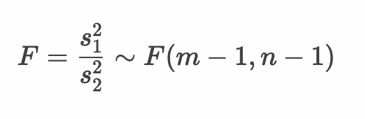

# 仮説検定 - 母分散の比の仮説検定


* 母分散の比の仮説検定にはF分布を使用する
* 対応のない2標本について母平均の差の仮説検定を行う場合は、2つの標本の分散が等しいかどうかによって手法が分かれる
* 母分散の比の仮説検定は等分散性の検定とも呼ばれる 

--- 

## 例： ミニトマトにおける母分散の比の検定

* 生産者Aの育てたミニトマトと生産者Bの育てたミニトマトについて、その大きさのばらつきに有意差があるか検定したい。2つの標本について、有意水準5%で等分散性の検定を行う。

* 生産者Aの育てたミニトマト

```
29.68, 30.09, 32.28, 28.53, 35.06, 33.95, 27.65, 23.98, 28.60, 29.63, 29.36, 29.61
```


* 生産者Bの育てたミニトマト

```
38.73, 36.49, 39.27, 39.95, 44.24, 23.92, 30.40, 28.35, 32.12, 40.65, 22.57, 45.64
```

---


### 1. 帰無仮説・対立仮説を定義する

* 帰無仮説（H0）
  * 生産者Aのミニトマトと生産者Bのミニトマトについて、母分散の比率に差はない
* 対立仮説（H1）
  * 生産者Aのミニトマトと生産者Bのミニトマトについて、母分散の比率に差はある

---  

### 2. 検定統計量を定義する

* 検定統計量： F値


* また帰無仮説において、母分散の比率に差はないと仮定している（σ1^2 == σ2^2）ので、以下のように式を変形できる



---

### 3. 有意水準（α）を定義する

* 有意水準（α）： 5% 両側検定

---

### 4. 標本から検定統計量の実現値を算出して検証する

#### 標本

* 生産者Aの育てたミニトマト

```
29.68, 30.09, 32.28, 28.53, 35.06, 33.95, 27.65, 23.98, 28.60, 29.63, 29.36, 29.61
```

* 生産者Bの育てたミニトマト

```
38.73, 36.49, 39.27, 39.95, 44.24, 23.92, 30.40, 28.35, 32.12, 40.65, 22.57, 45.64
```

#### Rプログラム

```r
tomato_sampleA <- c(29.68, 30.09, 32.28, 28.53, 35.06, 33.95, 
                    27.65, 23.98, 28.60, 29.63, 29.36, 29.61)
tomato_sampleB <- c(38.73, 36.49, 39.27, 39.95, 44.24, 23.92, 
                    30.40, 28.35, 32.12, 40.65, 22.57, 45.64)
tomato_sampleA_var <- var(tomato_sampleA)
tomato_sampleA_df <- length(tomato_sampleA) - 1
tomato_sampleB_var <- var(tomato_sampleB)
tomato_sampleB_df <- length(tomato_sampleB) - 1
f <- tomato_sampleA_var / tomato_sampleB_var
p <- pf(f, df1 = tomato_sampleA_df, df2 = tomato_sampleB_df,
        lower.tail = f < qf(0.5, df1 = tomato_sampleA_df, df2 = tomato_sampleA_df)) * 2
lq <- qf(0.025, df1 = tomato_sampleA_df, df2 = tomato_sampleB_df)
uq <- qf(0.975, df1 = tomato_sampleA_df, df2 = tomato_sampleB_df)
paste(lq, "-", uq)
paste("f-value", f)
paste("p-value", p)
```

#### 実行結果

```r
> tomato_sampleA <- c(29.68, 30.09, 32.28, 28.53, 35.06, 33.95, 
+                     27.65, 23.98, 28.60, 29.63, 29.36, 29.61)
> tomato_sampleB <- c(38.73, 36.49, 39.27, 39.95, 44.24, 23.92, 
+                     30.40, 28.35, 32.12, 40.65, 22.57, 45.64)
> tomato_sampleA_var <- var(tomato_sampleA)
> tomato_sampleA_df <- length(tomato_sampleA) - 1
> tomato_sampleB_var <- var(tomato_sampleB)
> tomato_sampleB_df <- length(tomato_sampleB) - 1
> f <- tomato_sampleA_var / tomato_sampleB_var
> p <- pf(f, df1 = tomato_sampleA_df, df2 = tomato_sampleB_df,
+         lower.tail = f < qf(0.5, df1 = tomato_sampleA_df, df2 = tomato_sampleA_df)) * 2
> lq <- qf(0.025, df1 = tomato_sampleA_df, df2 = tomato_sampleB_df)
> uq <- qf(0.975, df1 = tomato_sampleA_df, df2 = tomato_sampleB_df)
> paste(lq, "-", uq)
[1] "0.287877557984599 - 3.47369905108581"
> paste("f-value", f)
[1] "f-value 0.145168239986663"
> paste("p-value", p)
[1] "p-value 0.00337834032541522"
```

#### 仮説検定

* 帰無仮説（H0）： 生産者Aのミニトマトと生産者Bのミニトマトについて、母分散の比率に差はない
* 対立仮説（H1）： 生産者Aのミニトマトと生産者Bのミニトマトについて、母分散の比率に差はある
* 検定統計量： F値
* 有意水準： 5% 両側検定
* 標本
    * 標本1： 29.68, 30.09, 32.28, 28.53, 35.06, 33.95, 27.65, 23.98, 28.60, 29.63, 29.36, 29.61
    * 標本2： 38.73, 36.49, 39.27, 39.95, 44.24, 23.92, 30.40, 28.35, 32.12, 40.65, 22.57, 45.64
* 帰無分布： 自由度（11, 11）のF分布
* 臨界値： 0.288, 3.474
* 棄却域： 0.288以下 あるいは 3.373以上
* F値： 0.145 ※棄却域にある
* p値： 0.003
* 検定結果： 検定結果は5%水準で有意ある

以上の結果から、F値は棄却域にあるため帰無仮説は棄却されます。よって対立仮説を採択します。

> 「母分散の比率に差がある」という検定結果から、母平均の差を検定する場合は Welchのt検定 を使うと考えることができます。

---

### 参考： var.test関数

* `var.test` 関数を使うことで2つの標本の母分散の比の検定を行うことができる

```r
var.test(tomato_sampleA, tomato_sampleB)
```

#### 実行結果

```r
> var.test(tomato_sampleA, tomato_sampleB)

	F test to compare two variances

data:  tomato_sampleA and tomato_sampleB
F = 0.14517, num df = 11, denom df = 11, p-value = 0.003378
alternative hypothesis: true ratio of variances is not equal to 1
95 percent confidence interval:
 0.04179068 0.50427078
sample estimates:
ratio of variances 
         0.1451682 
```

---


## エクササイズ

1. ある品種の植物の花びらの大きさを調査しています。A地点で観測された植物の花びらの大きさと、B地点で観測された植物の花びらの大きさとの母分散の比に差があるかを調べます。有意水準5%で検定してください。

```
A地点の標本： 6.10, 5.48, 7.61,  4.69, 6.76, 2.30, 6.98, 1.29
B地点の標本： 4.98, 7.28, 5.95, 10.88, 6.77, 4.72, 7.22, 8.25
```

2. 一人暮らしをするためにワンルームマンションの家賃を調べています。A駅周辺の家賃とB駅周辺の家賃との母分散の比に差があるかを調べます。有意水準5%で検定してください。

```
A駅周辺の家賃： 65000, 64800, 65200, 65800, 63300, 64100, 66200
B駅周辺の家賃： 65600, 66100, 66500, 66000, 66000, 66100, 66100
```


<!-- 

```
> sample_a <- c(6.10, 5.48, 7.61, 4.69, 6.76, 2.30, 6.98, 1.29)
> sample_b <- c(4.98, 7.28, 5.95, 10.88, 6.77, 4.72, 7.22, 8.25)
> sample_a_var <- var(sample_a)
> sample_a_df <- length(sample_a) - 1
> sample_b_var <- var(sample_b)
> sample_b_df <- length(sample_b) - 1
> f <- sample_a_var / sample_b_var
> p <- pf(f, df1 = sample_a_df, df2 = sample_b_df,
+         lower.tail = f < qf(0.5, df1 = sample_a_df, df2 = sample_a_df)) * 2
> lq <- qf(0.025, df1 = sample_a_df, df2 = sample_b_df)
> uq <- qf(0.975, df1 = sample_a_df, df2 = sample_b_df)
> paste(lq, "-", uq)
[1] "0.200203838777183 - 4.99490921906324"
> paste("f-value", f)
[1] "f-value 1.33336660216805"
> paste("p-value", p)
[1] "p-value 0.713854254434292"
> var.test(sample_a, sample_b)

	F test to compare two variances

data:  sample_a and sample_b
F = 1.3334, num df = 7, denom df = 7, p-value = 0.7139
alternative hypothesis: true ratio of variances is not equal to 1
95 percent confidence interval:
 0.2669451 6.6600451
sample estimates:
ratio of variances 
          1.333367 

* 帰無仮説（H0）： A地点の花びらの大きさとB地点の花びらの大きさとの母分散の比に差はない
* 対立仮説（H1）： A地点の花びらの大きさとB地点の花びらの大きさとの母分散の比に差はない
* 検定統計量： F値
* 有意水準： 5% 両側検定
* 標本： 
  * 標本1： 
    * 6.10, 5.48, 7.61, 4.69, 6.76, 2.30, 6.98, 1.29 
  * 標本2： 
    * 4.98, 7.28, 5.95, 10.88, 6.77, 4.72, 7.22, 8.25 
* 帰無分布： 自由度（7, 7）のt分布
* 臨界値： 0.200, 4.995
* 棄却域： 0.200以下 あるいは 4.995以上
* F値： 1.333 ※棄却域にない
* p値： 0.714
* 検定結果： 検定結果は5%水準で有意でない


> sample_a <- c(65000, 64800, 65200, 65800, 63300, 64100, 66200)
> sample_b <- c(65600, 66100, 66500, 66000, 66000, 66100, 66100)
> sample_a_var <- var(sample_a)
> sample_a_df <- length(sample_a) - 1
> sample_b_var <- var(sample_b)
> sample_b_df <- length(sample_b) - 1
> f <- sample_a_var / sample_b_var
> p <- pf(f, df1 = sample_a_df, df2 = sample_b_df,
+         lower.tail = f < qf(0.5, df1 = sample_a_df, df2 = sample_a_df)) * 2
> lq <- qf(0.025, df1 = sample_a_df, df2 = sample_b_df)
> uq <- qf(0.975, df1 = sample_a_df, df2 = sample_b_df)
> paste(lq, "-", uq)
[1] "0.171828492555022 - 5.81975657896078"
> paste("f-value", f)
[1] "f-value 13.9246575342466"
> paste("p-value", p)
[1] "p-value 0.00542768109551179"
> var.test(sample_a, sample_b)

	F test to compare two variances

data:  sample_a and sample_b
F = 13.925, num df = 6, denom df = 6, p-value = 0.005428
alternative hypothesis: true ratio of variances is not equal to 1
95 percent confidence interval:
  2.392653 81.038117
sample estimates:
ratio of variances 
          13.92466 

* 帰無仮説（H0）： A駅周辺の家賃とB駅周辺の家賃の母分散の比に差はない
* 対立仮説（H1）： A駅周辺の家賃とB駅周辺の家賃の母分散の比に差はある
* 検定統計量： F値
* 有意水準： 5% 両側検定
* 標本： 
  * 標本1： 
    * 65000, 64800, 65200, 65800, 63300, 64100, 66200
  * 標本2： 
    * 65600, 66100, 66500, 66000, 66000, 66100, 66100
* 帰無分布： 自由度（6, 6）のF分布
* 臨界値： 0.172, 5.820
* 棄却域： 0.172以下 あるいは 5.820以上
* F値： 13.925 ※棄却域にある
* p値： 0.005
* 検定結果： 検定結果は5%水準で有意である

```

-->