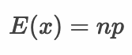
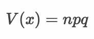
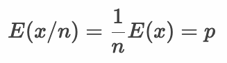
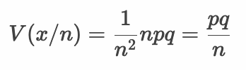
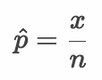
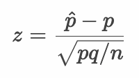
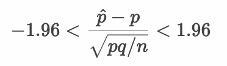
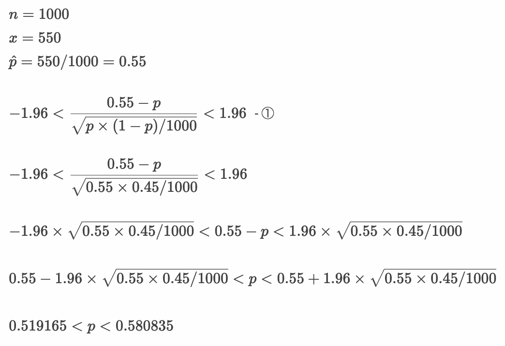

# 母比率の区間推定

* 二項分布を活用することで母集団の比率について信頼区間の推定や仮説検定を行うことができる
* 母比率の推定を行うことで政府の支持率やテレビ番組の視聴率、製品の故障率などを分析できる
* 二項分布は試行回数 `n` が大きくなると正規分布に近似する（さらに標準化することで標準正規分布に置き換える）

---

## 母比率

* 政府の支持率のような母集団のもつ比率を母比率と呼ぶ
* 母集団をすべて調査することは現実的ではないので標本から母比率を推定する
* 母比率は `π` 記号や `p` 記号で表現することが多い

> 母比率は `π` はベルヌーイ分布にしたがうと考えることもできます。

---

## 標本比率

* 母集団から作成した標本の比率を標本比率と呼ぶ
* 政府の支持率のような問題を考えるとき、母集団からサンプルサイズ `n` の標本を作成し、そのうち政府を支持するものが `x` 件だった場合、標本比率は `x/n` となる
* 標本として `400` 人の回答を得たとして `220` 人が政府を支持する場合、`220/400 = 0.55` が標本比率となる

> 中心極限定理によって、サンプルサイズ `n` が大きくなると母集団分布がどのような分布であっても標本平均（標本比率）の分布は正規分布にしたがいます。また比率は2値変数の平均と考えることができます。

---

## 二項分布の期待値と分散

* 標本における発生回数（政府を支持する件数） `x` は二項分布にしたがう
* 二項分布の期待値と分散は以下のとおり

  

  

* 標本比率( `x/n` )の期待値と分散は以下のようになる

  

  

> 標本比率は発生回数 `x` を試行回数 `n` で割り算しているところがポイントです。期待値と分散それぞれの性質により、期待値は `1/n` となり、分散は `1/n^2` となります。


---

## 二項分布と正規分布の関係

* 二項分布は試行回数 `n` が大きくなると正規分布に近似できる
* 標本比率（ `x/n` ）のサンプルサイズ `n` が大きければ正規分布 `N(p, pq/n)` に置き換えて考えることができる
* 標本比率（ `x/n` ）は以下のように標準化できる

  

  > `p^` は標本比率です。

  

  > `p` は母比率です。`q` は `(1 - p)` と同じです。

  

  > 95%の信頼区間を求める場合は上記のように計算します。

---

## 例：政府の支持率 - 母比率の区間推定

* 政府の支持率について調査している。手元に以下の標本がある
  * 回答数: 1000
  * 支持数: 550
* この標本から母比率について95%信頼区間を求めたい



> ①の部分で分母の母比率 `p` に標本比率である `0.55` を代入しています。標本比率はサンプルサイズが大きくなると母比率に一致するという特性があります（一致性）。そのため分母の母比率 `p` に標本比率 `0.55` を代入して近似計算を行なっています。

---

### Rプログラム

```r
n <- 1000
x <- 550
sp <- x/n
min <- sp - 1.96 * sqrt(sp * (1 - sp) / n)
max <- sp + 1.96 * sqrt(sp * (1 - sp) / n)
paste(min, "-", max)
```

### 実行結果

```r
> n <- 1000
> x <- 550
> sp <- x/n
> min <- sp - 1.96 * sqrt(sp * (1 - sp) / n)
> max <- sp + 1.96 * sqrt(sp * (1 - sp) / n)
> paste(min, "-", max)
[1] "0.519165019863798 - 0.580834980136202"
```

### Rプログラム - 参考： `binom.test` 関数

```r
n <- 1000
x <- 550
binom.test(x, n)
```

> `binom.test` 関数は二項分布を使った検定（二項検定）です。

### 実行結果

```r
> n <- 1000
> x <- 550
> binom.test(x, n)

	Exact binomial test

data:  x and n
number of successes = 550, number of trials = 1000, p-value = 0.001731
alternative hypothesis: true probability of success is not equal to 0.5
95 percent confidence interval:
 0.5185565 0.5811483
sample estimates:
probability of success 
                  0.55 
```

> 1つ前のRプログラムと結果が近似しているのがわかります。1つ前のRプログラムでは、正規分布に近似したり、分母の計算で近似計算したりしているので、このように微小な差が発生します。

---

## エクササイズ

1. 不正なサイコロが手元にあります。このサイコロを1000回振った結果を計測すると、1の目が500回出ました。このサイコロの母比率（1の目が出る確率）について、95%信頼区間を求めてください。

2. ある番組の視聴率を調査した結果、以下のようになりました。この番組の視聴率について95%信頼区間を求めてください。

    * 回答数：400
    * 視聴数：48

3. ある番組の視聴率についてさらに調査を続けると、以下の回答を得ることができた。この番組の視聴率について95%信頼区間を求めてください。

    * 回答数：800
    * 視聴数：96

<!-- 

#1
> n <- 1000
> x <- 500
> sp <- x / n
> min <- sp - 1.96 * sqrt(sp * (1 - sp) / n)
> max <- sp + 1.96 * sqrt(sp * (1 - sp) / n)
> paste(min, "-", max)
[1] "0.46900967893035 - 0.53099032106965"
> 
> binom.test(500, 1000)

	Exact binomial test

data:  500 and 1000
number of successes = 500, number of trials = 1000, p-value = 1
alternative hypothesis: true probability of success is not equal to 0.5
95 percent confidence interval:
 0.4685492 0.5314508
sample estimates:
probability of success 
                   0.5 


#2
> n <- 400
> x <- 48
> sp <- x / n
> min <- sp - 1.96 * sqrt(sp * (1 - sp) / n)
> max <- sp + 1.96 * sqrt(sp * (1 - sp) / n)
> paste(min, "-", max)
[1] "0.088153769453827 - 0.151846230546173"
> 
> binom.test(x, n)

	Exact binomial test

data:  x and n
number of successes = 48, number of trials = 400, p-value < 2.2e-16
alternative hypothesis: true probability of success is not equal to 0.5
95 percent confidence interval:
 0.0898182 0.1559394
sample estimates:
probability of success 
                  0.12 


# 3

> n <- 800
> x <- 96
> sp <- x / n
> min <- sp - 1.96 * sqrt(sp * (1 - sp) / n)
> max <- sp + 1.96 * sqrt(sp * (1 - sp) / n)
> paste(min, "-", max)
[1] "0.0974813144255709 - 0.142518685574429"
> binom.test(x, n)

	Exact binomial test

data:  x and n
number of successes = 96, number of trials = 800, p-value < 2.2e-16
alternative hypothesis: true probability of success is not equal to 0.5
95 percent confidence interval:
 0.09829015 0.14455387
sample estimates:
probability of success 
                  0.12 
-->