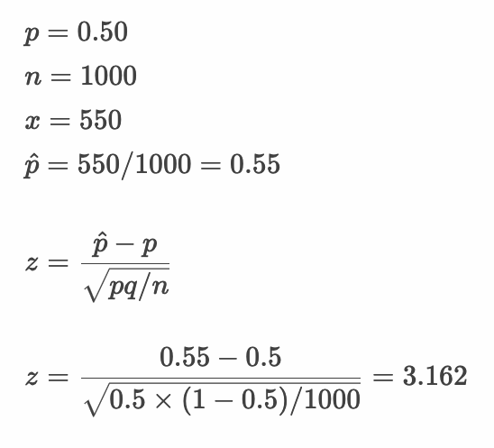

# 仮説検定 - 母比率の仮説検定


* 二項分布を活用することで母集団の比率について信頼区間の推定や仮説検定を行うことができる
* 母比率の推定を行うことで政府の支持率やテレビ番組の視聴率、製品の故障率などを分析できる
* 二項分布は試行回数 `n` が大きくなると正規分布に近似する（さらに標準化することで標準正規分布に置き換える）

---

## 二項分布と正規分布の関係

* 二項分布は試行回数 `n` が大きくなると正規分布に近似できる
* 標本比率（ `x/n` ）のサンプルサイズ `n` が大きければ正規分布 `N(p, pq/n)` に置き換えて考えることができる
* 標本比率（ `x/n` ）は以下のように標準化できる


> `p^` は標本比率です。


> `p` は母比率です。`q` は `(1 - p)` と同じです。


> 95%の信頼区間を求める場合は上記のように計算します。

---

## 例：政府の支持率 - 母比率の仮説検定

* 政府の支持率について調査している。手元に以下の標本がある
  * 回答数: 1000
  * 支持数: 550
* この標本から政府の支持率（母比率）は50%より高いといえるか。有意水準5%で仮説検定を行う。



---

## 例：母比率の仮説検定

仮説検定の手順は以下のとおりです。

```
1. 帰無仮説・対立仮説を定義する
2. 検定統計量を定義する
3. 有意水準（α）を定義する
4. 標本から検定統計量の実現値を算出して検証する
```

### 1. 帰無仮説・対立仮説を定義する

* 帰無仮説（H0）
  * 政府の支持率は50%である（50%と差がない）
* 対立仮説（H1）
  * 政府の支持率は50%より高い

### 2. 検定統計量を定義する

* 検定統計量： z値


### 3. 有意水準（α）を定義する

* 有意水準（α）： 5% 片側検定（上側検定）

### 4. 標本から検定統計量の実現値を算出して検証する

* 標本

```
回答数: 1000
支持数: 550
```

#### Rプログラム

```r
pp <- 0.5
n <- 1000
x <- 550
sp <- x/n
z <- (sp - pp) / sqrt(pp * (1 - pp) / n)
paste("z-value", z)
paste("p-value", pnorm(z, lower.tail = F))
```

#### 実行結果

```r
> pp <- 0.5
> n <- 1000
> x <- 550
> sp <- x/n
> z <- (sp - pp) / sqrt(pp * (1 - pp) / n)
> paste("z-value", z)
[1] "z-value 3.16227766016838"
> paste("p-value", pnorm(z, lower.tail = F))
[1] "p-value 0.000782701129001267"
```

#### 仮説検定

* 帰無仮説（H0）： 政府の支持率は50%である（50%と差がない）
* 対立仮説（H1）： 政府の支持率は50%より高い
* 検定統計量： z値
* 有意水準： 5% 片側検定
* 標本： 回答数: 1000、支持数: 550
* 帰無分布： 標準正規分布
* 臨界値： +1.64
* 棄却域： +1.64以上
* z値： 3.16 ※棄却域にある
* p値： 0.0007
* 検定結果： 検定結果は5%水準で有意である

以上の結果から、z値は棄却域にある（p値は有意水準5%を下回る）ため帰無仮説は棄却されます。よって対立仮説を採択します。

---

#### Rプログラム - 参考 `binom.test` 関数

```r
pp <- 0.5
n <- 1000
x <- 550
binom.test(x, n, pp, alternative = "greater")
```

#### 実行結果

```r
> pp <- 0.5
> n <- 1000
> x <- 550
> binom.test(x, n, pp, alternative = "greater")

	Exact binomial test

data:  x and n
number of successes = 550, number of trials = 1000, p-value = 0.0008653
alternative hypothesis: true probability of success is greater than 0.5
95 percent confidence interval:
 0.5235385 1.0000000
sample estimates:
probability of success 
                  0.55 
```

> `binom.test` 関数の場合も `p` 値は `0.0008` となり有意水準5%を下回るため、帰無仮説は棄却されます。

---

### 参考：binom.testの確率について

* binom.testの確率は以下のように求めることもできます。

```r
pp <- 0.5
n <- 1000
x <- 550
d <- dbinom(0:1000, n, pp)
d[(x + 1):(n + 1)] |> sum() # [1] 0.000865268
# barplot(d, names.arg = 0:n)
```


---

## エクササイズ

1. あるサイコロを1000回振った結果を計測すると1の目が200回出ました。このサイコロの1の目が出る確率は1/6ではないと言えるか。有意水準5%で検定してください。

2. ある番組の視聴率を調査した結果、以下のようになりました。この番組の視聴率は10%より高いと言えるか。有意水準5%で検定してください。

    * 回答数：400
    * 視聴数：48

3. ある番組の視聴率についてさらに調査を続けると、以下の回答を得ることができた。この番組の視聴率は10%より高いと言えるか。有意水準5%で検定してください。

    * 回答数：800
    * 視聴数：96

<!--
# 1
> pp <- 1/6
> n <- 1000
> x <- 200
> sp <- x / n
> z <- (sp - pp) / sqrt(pp * (1 - pp) / n)
> paste("z-value", z)
[1] "z-value 2.82842712474619"
> paste("p-value", pnorm(z, lower.tail = F) * 2)
[1] "p-value 0.00467773498104724"
> binom.test(x, n, pp)

	Exact binomial test

data:  x and n
number of successes = 200, number of trials = 1000, p-value = 0.00577
alternative hypothesis: true probability of success is not equal to 0.1666667
95 percent confidence interval:
 0.1756206 0.2261594
sample estimates:
probability of success 
                   0.2 

# 2
> pp <- 0.10
> n <- 400
> x <- 48
> sp <- x / n
> z <- (sp - pp) / sqrt(pp * (1 - pp) / n)
> paste("z-value", z)
[1] "z-value 1.33333333333333"
> paste("p-value", pnorm(z, lower.tail = F))
[1] "p-value 0.091211219725868"
> binom.test(x, n, pp, alternative = "greater")

	Exact binomial test

data:  x and n
number of successes = 48, number of trials = 400, p-value = 0.1076
alternative hypothesis: true probability of success is greater than 0.1
95 percent confidence interval:
 0.09418792 1.00000000
sample estimates:
probability of success 
                  0.12 

# 3
> pp <- 0.10
> n <- 800
> x <- 96
> sp <- x / n
> z <- (sp - pp) / sqrt(pp * (1 - pp) / n)
> paste("z-value", z)
[1] "z-value 1.88561808316413"
> paste("p-value", pnorm(z, lower.tail = F))
[1] "p-value 0.02967321939596"
> binom.test(x, n, pp, alternative = "greater")

	Exact binomial test

data:  x and n
number of successes = 96, number of trials = 800, p-value = 0.03646
alternative hypothesis: true probability of success is greater than 0.1
95 percent confidence interval:
 0.1015395 1.0000000
sample estimates:
probability of success 
                  0.12 

-->