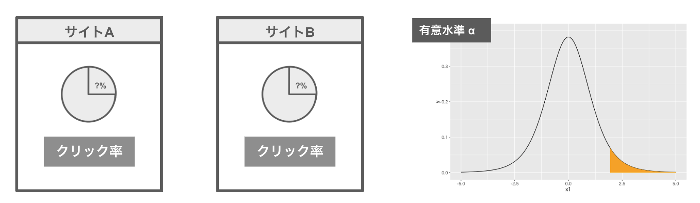
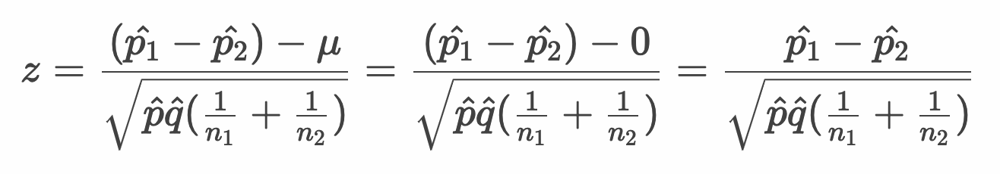
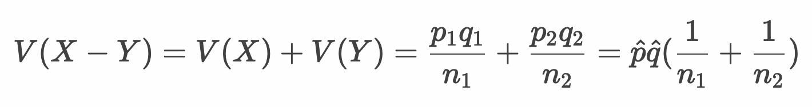
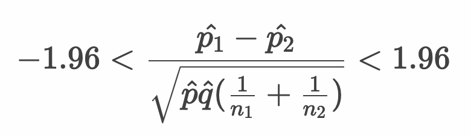
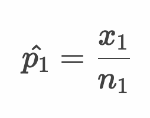
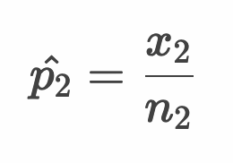
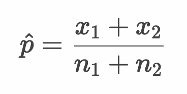
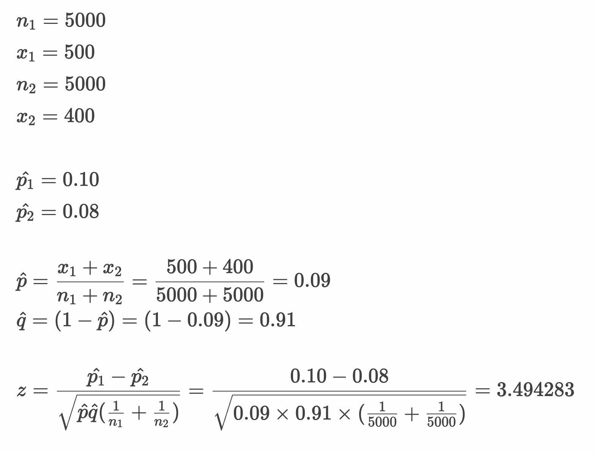
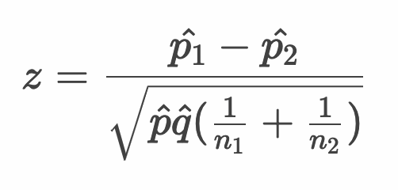

# 仮説検定 - 母比率の差の仮説検定（2標本の仮説検定）



* あるWebサービスの改善前のクリック率と改善後のクリック率の差について分析したい
* 2つの標本の母比率の差について仮説検定を行うことで上記のような問題を分析できる
* 2標本の母比率の差の仮説検定においては、2つの標本比率からプールした標本比率を算出する

---

## 例：Webサービスのクリック率

自社の運営するWebサービスをリニューアルしたことで、Aページのクリック数が以下のように改善された。

||訪問数|クリック数|
|:--|:--|:--|
|リニューアル後|5000|500|
|リニューアル前|5000|400|

> クリック率は 8% から 10% に向上しています。

このクリック率の変化に有意な差はあるか。有意水準5%で仮説検定を行う。

---


## 標本統計量 z

* 2つの標本の標本比率 p^1 と p^2 の差は0と考える

  


* 補足：分母は独立した2つの確率変数の分散の和として考える

   

  > p^ および q^ についてはあとのプールされた標本比率を使います

  
* 有意水準 5% で仮説検定（両側検定）を行う場合、以下のように計算する

  

> 求めた z 値が ±1.96 を超える場合、帰無仮説を棄却します。

---

## プールした標本比率 p^

* 母集団1から抽出した標本の標本比率

  

* 母集団2から抽出した標本の標本比率

  

* 2つの標本比率をプールした標本比率

  

---

## 例：Webサービスのクリック率 - 2標本 - 母比率の差の仮説検定

||訪問数|クリック数|
|:--|:--|:--|
|リニューアル後|5000|500|
|リニューアル前|5000|400|

* このクリック率の変化に有意な差はあるか。有意水準5%で仮説検定を行う。

  

---

### z 値の算出の流れ



## 例：2標本 - 母比率の差の仮説検定

仮説検定の手順は以下のとおりです。

```
1. 帰無仮説・対立仮説を定義する
2. 検定統計量を定義する
3. 有意水準（α）を定義する
4. 標本から検定統計量の実現値を算出して検証する
```

### 1. 帰無仮説・対立仮説を定義する

* 帰無仮説（H0）
  * リニューアル後のクリック率とリニューアル前のクリック率に差はない
* 対立仮説（H1）
  * リニューアル後のクリック率はリニューアル前のクリック率より高い

### 2. 検定統計量を定義する

* 検定統計量： z値




### 3. 有意水準（α）を定義する

* 有意水準（α）： 5% 片側検定（上側検定）

### 4. 標本から検定統計量の実現値を算出して検証する

* 標本

```
リニューアル後 - 訪問数：5000
リニューアル後 - クリック数：500
リニューアル前 - 訪問数：5000
リニューアル前 - クリック数：400
```

#### Rプログラム

```r
n1 <- 5000
x1 <- 500
n2 <- 5000
x2 <- 400
p1 <- x1 / n1
p2 <- x2 / n2
p <- (x1 + x2) / (n1 + n2)
q <- (1 - p)
z <- (p1 - p2) / sqrt(p * q * (1 / n1 + 1 / n2) )
paste("z-value", z)
paste("p-value", pnorm(z, lower.tail = F))
```

#### 実行結果

```r
> n1 <- 5000
> x1 <- 500
> n2 <- 5000
> x2 <- 400
> p1 <- x1 / n1
> p2 <- x2 / n2
> p <- (x1 + x2) / (n1 + n2)
> q <- (1 - p)
> z <- (p1 - p2) / sqrt(p * q * (1 / n1 + 1 / n2) )
> paste("z-value", z)
[1] "z-value 3.49428278907306"
> paste("p-value", pnorm(z, lower.tail = F))
[1] "p-value 0.000237668615768814"
```

#### 仮説検定

* 帰無仮説（H0）： リニューアル後のクリック率とリニューアル前のクリック率に差はない
* 対立仮説（H1）： リニューアル後のクリック率はリニューアル前のクリック率より高い
* 検定統計量： z値
* 有意水準： 5% 片側検定
* 標本： 
  * リニューアル後 - 訪問数：5000
  * リニューアル後 - クリック数：500
  * リニューアル前 - 訪問数：5000
  * リニューアル前 - クリック数：400
* 帰無分布： 標準正規分布
* 臨界値： +1.64
* 棄却域： +1.64以上
* z値： 3.49 ※棄却域にある
* p値： 0.0002
* 検定結果： 検定結果は5%水準で有意である

以上の結果から、z値は棄却域にある（p値は有意水準5%を下回る）ため帰無仮説は棄却されます。よって対立仮説を採択します。

---

#### Rプログラム - 参考 `prop.test` 関数

* `prop.test` 関数は、複数のグループの比率が同じかどうかの検定に使用する

> `prop.test` 関数の内部ではカイ二乗分布を使っているので、ここで学習した計算の流れとは厳密には異なります。

```r
n1 <- 5000
x1 <- 500
n2 <- 5000
x2 <- 400
prop.test(x = c(x1, x2), n = c(n1, n2), alternative = "greater", correct = F)
```

> `correct = F` は離散型変数の連続型変数への補正処理を無効としています。

#### 実行結果

```r
> n1 <- 5000
> x1 <- 500
> n2 <- 5000
> x2 <- 400
> prop.test(x = c(x1, x2), n = c(n1, n2), alternative = "greater", correct = F)

	2-sample test for equality of proportions without continuity correction

data:  c(x1, x2) out of c(n1, n2)
X-squared = 12.21, df = 1, p-value = 0.0002377
alternative hypothesis: greater
95 percent confidence interval:
 0.01059121 1.00000000
sample estimates:
prop 1 prop 2 
  0.10   0.08 
```

> 2標本の母比率の差の仮説検定については χ2乗検定（独立性の検定）などを用いることもあります。

---

## エクササイズ

1. あるECサイトでは優良顧客にダイレクトメールを送っています。ダイレクトメールの文面を改善して送信したところ開封率が以下のように変化した。この改善には有意な差があると言えるか。有意水準5%で検定してください。

||DM送付数|開封数|
|:--|:--|:--|
|改善後|1000|120|
|改善前|1000|100|

2. ある番組の視聴率について関西地区と関東地区で調査した結果、以下のようになりました。関西地区と関東地区でこの番組の視聴率に差はあると言えるか。有意水準5%で検定してください。

||関西地区|関東地区|
|:--|:--|:--|
|回答数|200|300|
|視聴数|40|45|

3. ある番組の視聴率についてさらに調査を続けると、以下の回答を得ることができた。関西地区と関東地区でこの番組の視聴率に差はあると言えるか。有意水準5%で検定してください。

||関西地区|関東地区|
|:--|:--|:--|
|回答数|2000|3000|
|視聴数|400|450|

<!--
# 1
> n1 <- 1000
> x1 <- 120
> n2 <- 1000
> x2 <- 100
> p1 <- x1 / n1
> p2 <- x2 / n2
> p <- (x1 + x2) / (n1 + n2)
> q <- (1 - p)
> z <- (p1 - p2) / sqrt(p * q * (1 / n1 + 1 / n2) )
> paste("z-value", z)
[1] "z-value 1.42930084982323"
> paste("p-value", pnorm(z, lower.tail = F))
[1] "p-value 0.0764588909319731"
> prop.test(x = c(x1, x2), n = c(n1, n2), alternative = "greater", correct = F)

	2-sample test for equality of proportions without continuity correction

data:  c(x1, x2) out of c(n1, n2)
X-squared = 2.0429, df = 1, p-value = 0.07646
alternative hypothesis: greater
95 percent confidence interval:
 -0.003004441  1.000000000
sample estimates:
prop 1 prop 2 
  0.12   0.10 


# 2
> n1 <- 200
> x1 <- 40
> n2 <- 300
> x2 <- 45
> p1 <- x1 / n1
> p2 <- x2 / n2
> p <- (x1 + x2) / (n1 + n2)
> q <- (1 - p)
> z <- (p1 - p2) / sqrt(p * q * (1 / n1 + 1 / n2) )
> paste("z-value", z)
[1] "z-value 1.45813293820744"
> paste("p-value", pnorm(z, lower.tail = F) * 2)
[1] "p-value 0.144803903982903"

> prop.test(c(x1, x2), c(n1, n2), p = NULL, correct = F)

	2-sample test for equality of proportions without
	continuity correction

data:  c(x1, x2) out of c(n1, n2)
X-squared = 2.1262, df = 1, p-value = 0.1448
alternative hypothesis: two.sided
95 percent confidence interval:
 -0.01859874  0.11859874
sample estimates:
prop 1 prop 2 
  0.20   0.15 

# 3
> n1 <- 2000
> x1 <- 400
> n2 <- 3000
> x2 <- 450
> p1 <- x1 / n1
> p2 <- x2 / n2
> p <- (x1 + x2) / (n1 + n2)
> q <- (1 - p)
> z <- (p1 - p2) / sqrt(p * q * (1 / n1 + 1 / n2) )
> paste("z-value", z)
[1] "z-value 4.61102121604908"
> paste("p-value", pnorm(z, lower.tail = F) * 2)
[1] "p-value 4.00695635810827e-06"
> 
> prop.test(c(x1, x2), c(n1, n2), p = NULL, correct = F)

	2-sample test for equality of proportions without
	continuity correction

data:  c(x1, x2) out of c(n1, n2)
X-squared = 21.262, df = 1, p-value = 4.007e-06
alternative hypothesis: two.sided
95 percent confidence interval:
 0.02830717 0.07169283
sample estimates:
prop 1 prop 2 
  0.20   0.15 

-->