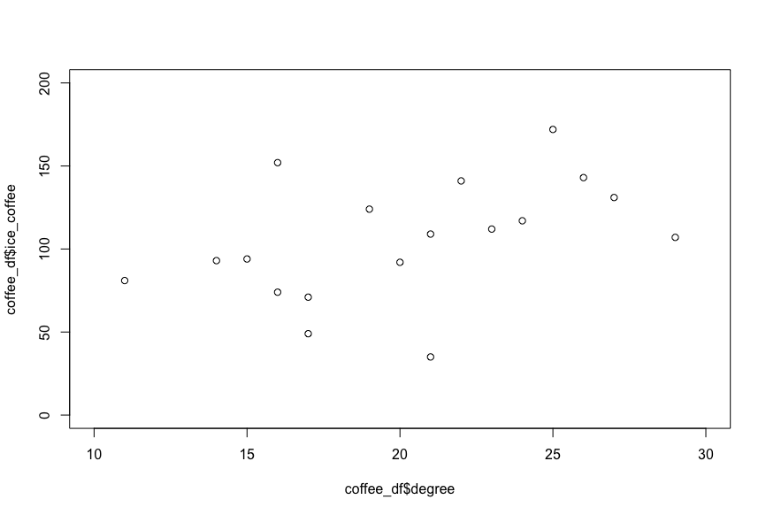
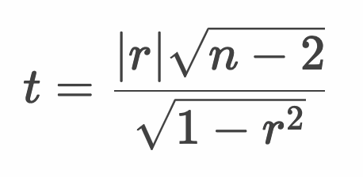

# 相関係数の仮説検定



* 2変数の相関係数について仮説検定を行う
* 母集団の相関係数（母相関係数）を0とした帰無仮説について仮説検定を行う
* 相関係数の仮説検定にはt分布を使う

> 帰無仮説が棄却されたとき（母相関係数が0ではないとき）、手元にある相関係数は偶然ではない意味のあるもの考えることができます。

---

## t値の求め方

* 相関係数 `r` 、サンプルデータサイズ（個数） `n` より、以下のように t値を算出できる



> ここで計算した `t` 値は自由度 `n - 2` のt分布にしたがいます。

---

## （例） 気温とコーヒーの売上 - 相関係数の仮説検定

| 気温|アイスコーヒー|ホットコーヒー |
|:--:|:--:|:--:|
| 14|93|150 |
| 22|141|73 |
| 27|131|33 |
| 16|74|152 |
| 19|124|106 |
| 15|94|172 |
| 17|71|85 |
| 17|49|116 |
| 16|152|127 |
| 9|13|135 |
| 20|92|65 |
| 21|35|57 |
| 29|107|88 |
| 34|198|32 |
| 11|81|172 |
| 23|112|81 |
| 24|117|116 |
| 26|143|56 |
| 25|172|47 |
| 21|109|115 |

> ここでは気温とアイスコーヒーの相関係数について、仮説検定を行うものとします。

---

## 例：気温とアイスコーヒーの相関係数の仮説検定

仮説検定の手順は以下のとおりです。

```
1. 帰無仮説・対立仮説を定義する
2. 検定統計量を定義する
3. 有意水準（α）を定義する
4. 標本から検定統計量の実現値を算出して検証する
```

### 1. 帰無仮説・対立仮説を定義する

* 帰無仮説（H0）
  * 母相関係数は 0 である（0と差がない）
* 対立仮説（H1）
  * 母相関係数は 0 でない

### 2. 検定統計量を定義する

* 検定統計量： t値

  

### 3. 有意水準（α）を定義する

* 有意水準（α）： 5% 両側検定

### 4. 標本から検定統計量の実現値を算出して検証する

* 標本データ（coffee.csv）は以下のとおり（hot_coffeeは使わない）

```csv
degree,ice_coffee,hot_coffee
14,93,150
22,141,73
27,131,33
16,74,152
19,124,106
15,94,172
17,71,85
17,49,116
16,152,127
9,13,135
20,92,65
21,35,57
29,107,88
34,198,32
11,81,172
23,112,81
24,117,116
26,143,56
25,172,47
21,109,115
```

> 上記のデータを `coffee.csv` という名前でファイルに保存します。

#### Rプログラム

```r
df <- read.csv("~/Desktop/coffee.csv")
r <- cor(df$degree, df$ice_coffee)
n <- length(df$degree)
t <- r * sqrt(n - 2) / sqrt(1 - r^2)
p <- pt(t, df = n - 2, lower.tail = F) * 2
paste("t:", t)
paste("p-value:", p)
```

#### 実行結果

```r
> df <- read.csv("~/Desktop/coffee.csv")
> r <- cor(df$degree, df$ice_coffee)
> n <- length(df$degree)
> t <- r * sqrt(n - 2) / sqrt(1 - r^2)
> p <- pt(t, df = n - 2, lower.tail = F) * 2
> paste("t:", t)
[1] "t: 4.04298489651839"
> paste("p-value:", p)
[1] "p-value: 0.000763170014249765"
```

#### 仮説検定

* 帰無仮説（H0）： 母相関係数は 0 である（0と差がない）
* 対立仮説（H1）： 母相関係数は 0 でない
* 検定統計量： t値
* 有意水準： 5% 両側検定
* 標本： coffee.csv ファイル
* 帰無分布： t分布
* 臨界値： -2.10、+2.10
* 棄却域： -2.10以下、+2.10以上
* t値： 4.04 ※棄却域にある
* p値： 0.00076
* 検定結果： 検定結果は5%水準で有意である

以上の結果から、t値は棄却域にある（p値は有意水準5%を下回る）ため帰無仮説は棄却されます。よって対立仮説を採択します。

---

#### Rプログラム - 参考 `cor.test` 関数

* `cor.test` 関数は相関係数の仮説検定を行う

```r
df <- read.csv("~/Desktop/coffee.csv")
cor.test(df$degree, df$ice_coffee)
```

#### 実行結果

```r
> df <- read.csv("~/Desktop/coffee.csv")
> cor.test(df$degree, df$ice_coffee)

	Pearson's product-moment correlation

data:  df$degree and df$ice_coffee
t = 4.043, df = 18, p-value = 0.0007632
alternative hypothesis: true correlation is not equal to 0
95 percent confidence interval:
 0.3560386 0.8675439
sample estimates:
      cor 
0.6898676 
```

---

## エクササイズ

### 設問1

`coffee.csv` ファイルの気温とホットコーヒーの相関について、以下のとおり分析してください。

* 散布図を表示してください。
* 相関係数を求めてください。
* 相関係数について有意水準5%で仮説検定してください。

### 設問2

Rの `cars` データセットの `speed` と `dist` の相関について、以下のとおり分析してください。

* 散布図を表示してください。
* 相関係数を求めてください。
* 相関係数について有意水準5%で仮説検定してください。

<!--
設問1

df <- read.csv("~/Desktop/coffee.csv")
plot(df$degree, df$hot_coffee)
cor.test(df$degree, df$hot_coffee)

> df <- read.csv("~/Desktop/coffee.csv")
> plot(df$degree, df$hot_coffee)
> cor.test(df$degree, df$hot_coffee)

	Pearson's product-moment correlation

data:  df$degree and df$hot_coffee
t = -5.6757, df = 18, p-value = 2.204e-05
alternative hypothesis: true correlation is not equal to 0
95 percent confidence interval:
 -0.9180759 -0.5552365
sample estimates:
       cor 
-0.8009588 


設問2
plot(cars$speed, cars$dist)
cor.test(cars$speed, cars$dist)

> plot(cars$speed, cars$dist)
> cor.test(cars$speed, cars$dist)

	Pearson's product-moment correlation

data:  cars$speed and cars$dist
t = 9.464, df = 48, p-value = 1.49e-12
alternative hypothesis: true correlation is not equal to 0
95 percent confidence interval:
 0.6816422 0.8862036
sample estimates:
      cor 
0.8068949 


-->