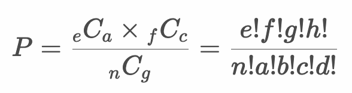

# 参考：仮説検定 - フィッシャーの正確確率検定

||R - 経験あり|R - 経験なし
|:--|:--:|:--:|
|PHP - 経験あり|1|9|
|PHP - 経験なし|6|4|

* 2x2のクロス集計表（分割表）において、カテゴリAとカテゴリBにおいて独立性があるかを検定する
* 独立性の検定と同様にフィッシャーの正確確率検定を使うこともできる
* 帰無仮説（H0）はカテゴリーAとカテゴリーBは独立であること（関連がないこと）

> 分割表の中の度数（期待値）が少ない場合、カイ二乗検定では無視できない誤差が発生するケースがあります。そのようなケースでフィッシャーの正確確率検定を使うことができます。

---

## フィッシャーの正確確率検定

* 分割表の各セルの値を以下のように定義する

  ||R - 経験あり|R - 経験なし|合計|
  |:--|:--:|:--:|:--:|
  |PHP - 経験あり|a|b|e|
  |PHP - 経験なし|c|d|f|
  |合計|g|h|n|

* このとき確率を以下のように計算できる - 計算式①

  

  > p値を算出するためには「観測値よりも極端なケース」も考慮する必要があります。詳細な計算方法については後述します。

---

## 例： PHP言語とR言語

* 学生20人に対して、PHP言語の利用経験、R言語の利用経験を調査したところ以下のようになった。

  ||R - 経験あり|R - 経験なし
  |:--|:--:|:--:|
  |PHP - 経験あり|1|9|
  |PHP - 経験なし|6|4|

  > PHPの経験とR言語の経験が独立しているか仮説検定します。

* フィッシャーの正確確率検定においてもまずは行・列ごとの合計値を求めます。

  ||R - 経験あり|R - 経験なし|合計|
  |:--|:--:|:--:|:--:|
  |PHP - 経験あり|1|9|10|
  |PHP - 経験なし|6|4|10|
  |合計|7|13|20|

* 計算式①を使って確率（P1）を算出します。

  ```
  P1 = (1 + 9)! * (6 + 4)! * (1 + 6)! * (9 + 4)! / 20! * 1! * 9! * 6! * 4! = 0.0271
  ```

* ここでは「観測値よりも極端なケース」を考えるので「PHP - 経験あり、かつ、R - 経験あり」の度数が1ですが、0の場合の確率（P0）も計算します。

  ||R - 経験あり|R - 経験なし|合計|
  |:--|:--:|:--:|:--:|
  |PHP - 経験あり|0|10|10|
  |PHP - 経験なし|7|3|10|
  |合計|7|13|20|
  
  > 「PHP - 経験あり、かつ、R - 経験あり」を0に変更し、行の合計、列の合計は変化しないように度数の内訳を計算します。

  ||R - 経験あり|R - 経験なし|合計|
  |:--|:--:|:--:|:--:|
  |PHP - 経験あり|a|10 - a|10|
  |PHP - 経験なし|7 - a|3 + a|10|
  |合計|7|13|20|
  
  ```
  P0 = (0 + 10)! * (7 + 3)! * (0 + 7)! * (10 + 3)! / 20! * 0! * 10! * 7! * 3! = 0.0015
  ```

* 2つの確率P1とP0を合計して確率を求めます。 

  ```
  P = P1 + P0 = 0.0286
  ```

* 以降は仮説検定を行います。仮説検定の手順は以下のとおりです。

  ```
  1. 帰無仮説・対立仮説を定義する
  2. 検定統計量を定義する
  3. 有意水準（α）を定義する
  4. 標本から検定統計量の実現値を算出して検証する
  ```

### 1. 帰無仮説・対立仮説を定義する

* 帰無仮説（H0）
  * PHPの経験とRの経験は独立である（関連がないこと）
* 対立仮説（H1）
  * PHPの経験とRの経験は独立でない（関連があること）

### 2. 検定統計量を定義する

* 検定統計量： フィッシャーの正確確率

  

  > フィッシャーの正確確率検定（Fisher's exact test）では確率を直接求めます。そのため直接確率検定と呼ばれることもあります。

### 3. 有意水準（α）を定義する

* 有意水準（α）： 5% 片側検定（下側検定）

### 4. 標本から検定統計量の実現値を算出して検証する

* フィッシャーの正確確率は0.286となる

#### Rプログラム

```r
data_frame <- data.frame(
  PHP_yes = c(1, 9), 
  PHP_no = c(6, 4)
)
e <- colSums(data_frame)[1]
f <- colSums(data_frame)[2]
g <- rowSums(data_frame)[1]
h <- rowSums(data_frame)[2]
n <- sum(data_frame)
a <-  c(1, 0)
b <- e - a
c <- g - a
d <- h - b
p <- choose(e, a) * choose(f, c) / choose(n, g)
sum(p)
```

#### 実行結果

```r
> data_frame <- data.frame(
+   PHP_yes = c(1, 9), 
+   PHP_no = c(6, 4)
+ )
> e <- colSums(data_frame)[1]
> f <- colSums(data_frame)[2]
> g <- rowSums(data_frame)[1]
> h <- rowSums(data_frame)[2]
> n <- sum(data_frame)
> a <-  c(1, 0)
> b <- e - a
> c <- g - a
> d <- h - b
> p <- choose(e, a) * choose(f, c) / choose(n, g)
> sum(p)
[1] 0.02863777
```

#### 仮説検定

* 帰無仮説（H0）： PHPの経験とRの経験は独立である（関連がないこと）
* 対立仮説（H1）： PHPの経験とRの経験は独立でない（関連があること）
* 検定統計量： フィッシャーの正確確率
* 有意水準： 5% 片側検定
* 標本：
  ||R - 経験あり|R - 経験なし|合計|
  |:--|:--:|:--:|:--:|
  |PHP - 経験あり|1|9|10|
  |PHP - 経験なし|6|4|10|
  |合計|7|13|20|
  > 上記に加えて極端なケースも考慮する
* p値： 0.0286
* 検定結果： 検定結果は5%水準で有意でない

以上の結果から、p値は有意水準5%を上回るため帰無仮説は棄却されない。

---

#### Rプログラム - 参考 `fisher.test` 関数

* `fisher.test` 関数はフィッシャーの正確確率検定を行う
* `fisher.test` 関数は第1引数に標本データを指定する
* `fisher.test` 関数の引数に `alternative = "less"` を指定することで片側検定（下側）となる

```r
data_frame <- data.frame(
  PHP_yes = c(1, 9), 
  PHP_no = c(6, 4)
)
fisher.test(data_frame, alternative = "less")
```

#### 実行結果

```r
> data_frame <- data.frame(
+   PHP_yes = c(1, 9), 
+   PHP_no = c(6, 4)
+ )
> fisher.test(data_frame, alternative = "less")

	Fisher's Exact Test for Count Data

data:  data_frame
p-value = 0.02864
alternative hypothesis: true odds ratio is less than 1
95 percent confidence interval:
 0.0000000 0.7945302
sample estimates:
odds ratio 
0.08593504
```

---

## エクササイズ

### 設問1

コーヒーの睡眠時間の関係について調査したところ以下の結果となった。

||8時間以上|8時間未満|合計
|:--|:--:|:--:|:--:|
|コーヒー - 飲む|4|8|12|
|コーヒー - 飲むない|12|10|22|
|合計|16|18|34|

2つのカテゴリ変数（コーヒー摂取と睡眠時間）は独立しているといえるか。有意水準5%で仮説検定（片側検定：下側）してください。

---

<!--

設問1

> data_frame <- data.frame(
+   coffee_yes = c(4, 8), 
+   coffee_no = c(12, 10)
+ )
> fisher.test(data_frame, alternative = "less")

	Fisher's Exact Test for Count Data

data:  data_frame
p-value = 0.2054
alternative hypothesis: true odds ratio is less than 1
95 percent confidence interval:
 0.000000 1.767761
sample estimates:
odds ratio 
 0.4276817 

-->