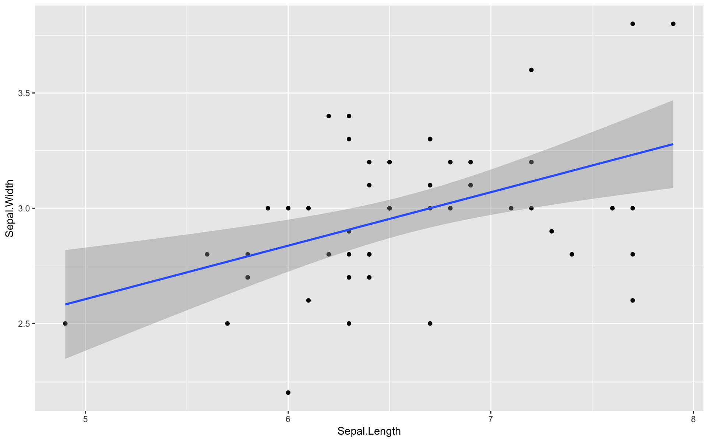

# Tidyverse

* データサイエンス用に設計されたRパッケージ集
* データの前処理や可視化を効率よく実装できる
* パイプ演算子（ `%>%` ）によって、データの出力を後の処理につなぎ合わせる

https://www.tidyverse.org/

## Tidyverseを構成するパッケージ

|パッケージ|概要|
|:--|:--|
| tibble | データフレームの操作を拡張する |
| dplyr | データ操作の文法を拡張する |
| ggplot2 | グラフ描画を拡張する |
| readr | 入出力を拡張する |
| tidyr | 整然データ(Tidy data)の操作を拡張する |
| stringr |　文字列操作を拡張する |
| forcats | 因子操作を拡張する |
| purrr | 関数型プログラミングを拡張する |


## Tidyverseのインストール

```R
install.packages("tidyverse")
```

## Tidyverseの参照

```
library(tidyverse)
```

> `library(dplyr)` のように個別にパッケージを参照することもできます。

## サンプルコード - tidy.R


```R
library(tidyverse)

as_tibble(iris) %>%
  filter(Species == "virginica") %>%
  ggplot(aes(Sepal.Length, Sepal.Width)) +
  geom_point() +
  geom_smooth(method = "lm", formula = y ~ x)
```

### 実行結果


