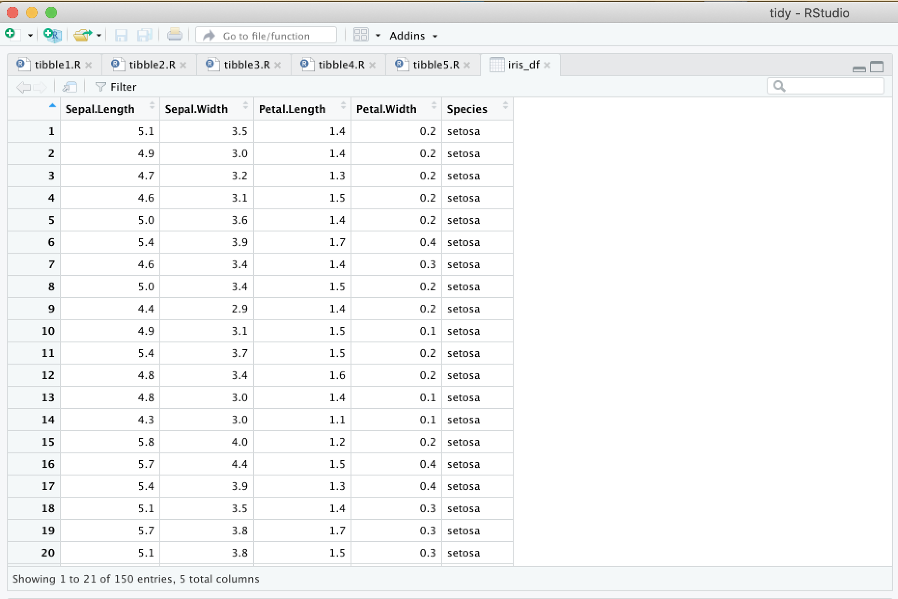

# Tidyverse - tibble

* データフレームの操作を拡張するパッケージ
* tibbleのデータフレームを使うことでデータフレームの出力が扱いやすくなる
* `tibble` 関数や `as_tibble` 関数によって拡張されたデータフレーム（ `tibble` オブジェクト）を生成できる

https://tibble.tidyverse.org/

> 以下のサンプルコードは `library(tidyverse)`  あるいは `library(tibble)` を実行した後に記述します。

---

## `tibble` 関数 - tibble1.R

* `tibble` 関数によって拡張されたデータフレーム（ `tibble` オブジェクト）を作成できる
* tibble データフレームはコンソールに出力したときに整形されて表示される
* tibble データフレームは標準のデータフレームの代替として使用できる

```
df <- tibble(x = 1:100,
             y = 2 * x + 1,
             z = rep(c("A", "B"), 50))
df
```

### 実行結果

```R
> df <- tibble(x = 1:100,
+              y = 2 * x + 1,
+              z = rep(c("A", "B"), 50))
> df
# A tibble: 100 x 3
       x     y z    
   <int> <dbl> <chr>
 1     1     3 A    
 2     2     5 B    
 3     3     7 A    
 4     4     9 B    
 5     5    11 A    
 6     6    13 B    
 7     7    15 A    
 8     8    17 B    
 9     9    19 A    
10    10    21 B    
# … with 90 more rows
```

> tibbleのデータフレームフレームはデフォルトで先頭から10行のレコードを表示します。大量のデータを扱う際に、コンソールのスクロールを防ぐことができます。また出力がコンソールの横幅を超えた場合も、折り返さずに項目を非表示にします。

---

## `as_tibble` 関数 - tibble2.R

* `as_tibble` 関数によって既存のデータフレームを拡張されたデータフレーム（ `tibble` オブジェクト）に変換できる

```r
as_tibble(iris)
```

> 標準のデータセットである `iris` をtibbleのデータフレームに変換しています。

### 実行結果

```R
> as_tibble(iris)
# A tibble: 150 x 5
   Sepal.Length Sepal.Width Petal.Length Petal.Width Species
          <dbl>       <dbl>        <dbl>       <dbl> <fct>  
 1          5.1         3.5          1.4         0.2 setosa 
 2          4.9         3            1.4         0.2 setosa 
 3          4.7         3.2          1.3         0.2 setosa 
 4          4.6         3.1          1.5         0.2 setosa 
 5          5           3.6          1.4         0.2 setosa 
 6          5.4         3.9          1.7         0.4 setosa 
 7          4.6         3.4          1.4         0.3 setosa 
 8          5           3.4          1.5         0.2 setosa 
 9          4.4         2.9          1.4         0.2 setosa 
10          4.9         3.1          1.5         0.1 setosa 
# … with 140 more rows
```

> RStudionのコンソールの横幅を狭くして出力してみましょう。一部の項目が非表示になります。

---

## `tribble` 関数 - tibble3.R

* `tribble` 関数は入力データを行ごとに受け取る

> `transposed tibble` （転地された tibble ）の略語です。

```r
df <- tribble(
  ~x, ~y, ~z,
  "A", 1, T,
  "B", 2, F,
  "C", 3, T,
  "D", 4, F
)
df
```

### 実行結果

```R
> df <- tribble(
+   ~x, ~y, ~z,
+   "A", 1, T,
+   "B", 2, F,
+   "C", 3, T,
+   "D", 4, F
+ )
> df 
# A tibble: 4 x 3
  x         y z    
  <chr> <dbl> <lgl>
1 A         1 TRUE 
2 B         2 FALSE
3 C         3 TRUE 
4 D         4 FALSE
```

---

## tibble データフレームの出力 - `print` 関数による行数の指定 - tibble4.R

* tibbleのデータフレームの出力行数を変更するにはいくつかの方法がある
* `print`関数の引数 `n` を指定して出力行数を変更できる
* `print`関数の引数 `n` に `Inf` 定数を指定するとすべての行を出力できる

```r
iris_df <- as_tibble(iris)
print(iris_df, n = 5)
```

### 実行結果

```r
> iris_df <- as_tibble(iris)
> print(iris_df, n = 5)
# A tibble: 150 x 5
  Sepal.Length Sepal.Width Petal.Length Petal.Width Species
         <dbl>       <dbl>        <dbl>       <dbl> <fct>  
1          5.1         3.5          1.4         0.2 setosa 
2          4.9         3            1.4         0.2 setosa 
3          4.7         3.2          1.3         0.2 setosa 
4          4.6         3.1          1.5         0.2 setosa 
5          5           3.6          1.4         0.2 setosa 
# … with 145 more rows
```

> `print` 関数はRの組み込み関数です。tibble データフレームを処理する際に `n` 引数を指定できます。

---

## tibble データフレームの出力 - `View` 関数による表示 - tibble5.R

* `View` 関数を使って tibble データフレームを表示できる

```r
iris_df <- as_tibble(iris)
View(iris_df)
```

### 実行結果



> View 関数はRStudioのデータフレームビューワを起動します。データフレームビューワが存在しない環境においては利用できません。

---

## tibble データフレームの出力 - `options` 関数による表示行数の変更 - tibbl6.R

* `option` 関数の `tibble.print_max` 引数、`tibble.print_min` 引数を使ってデフォルトの表示行数を変更する
* `tibble.print_max`に指定した値を超えた場合、`tibble.print_min`関数に指定した行数まで出力する
* たとえば `options(tibble.print_max = 10, tibble.print_min = 5)` と指定した場合、出力が10行を超えるときは先頭の5行を出力する

```r
options(tibble.print_max = 10, tibble.print_min = 5)
irid_df <- as_tibble(iris)
iris_df
```

### 実行結果

```r
> options(tibble.print_max = 10, tibble.print_min = 5)
> irid_df <- as_tibble(iris)
> iris_df
# A tibble: 150 x 5
  Sepal.Length Sepal.Width Petal.Length Petal.Width Species
         <dbl>       <dbl>        <dbl>       <dbl> <fct>  
1          5.1         3.5          1.4         0.2 setosa 
2          4.9         3            1.4         0.2 setosa 
3          4.7         3.2          1.3         0.2 setosa 
4          4.6         3.1          1.5         0.2 setosa 
5          5           3.6          1.4         0.2 setosa 
# … with 145 more rows
```
