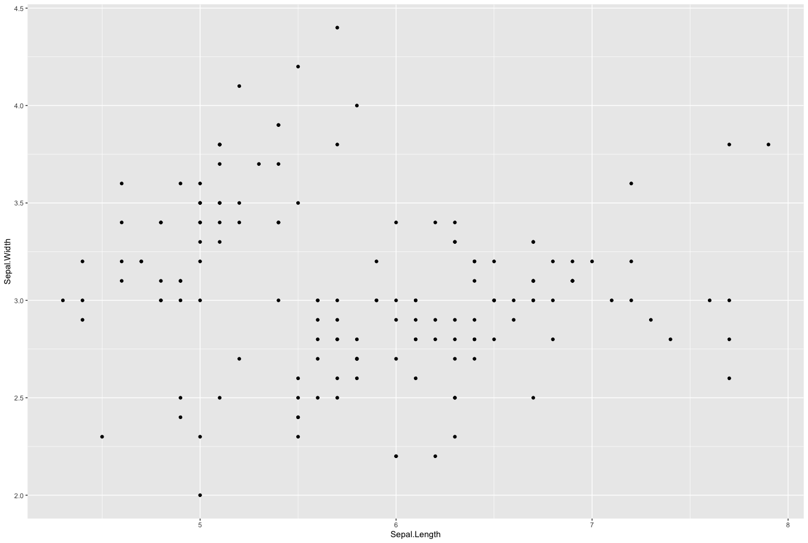
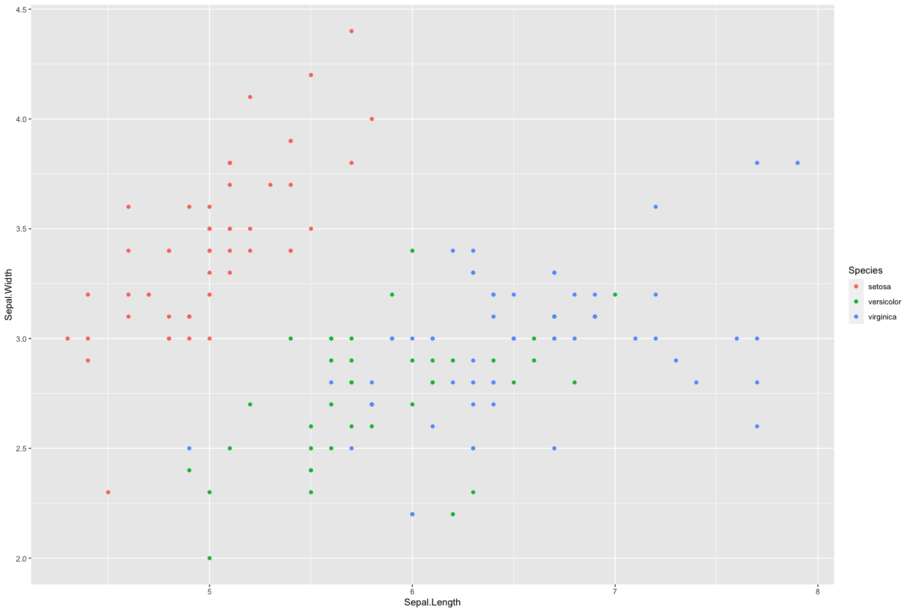
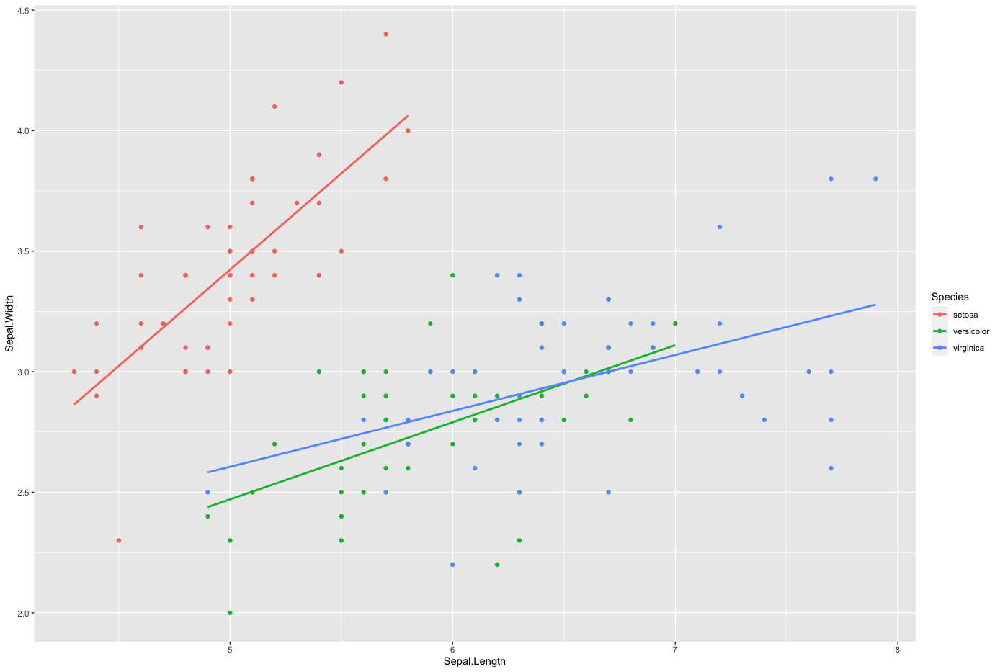
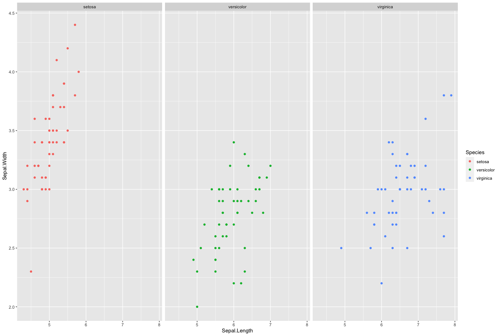
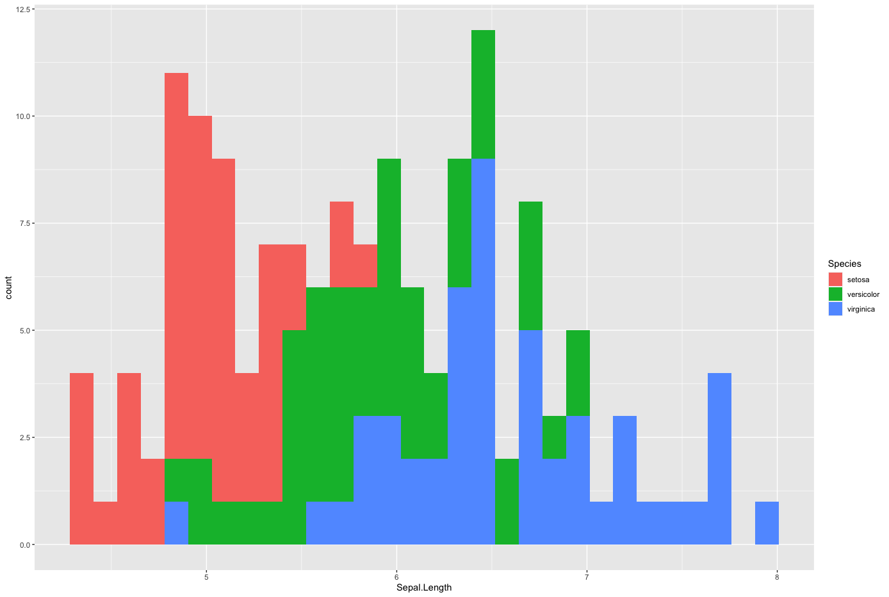
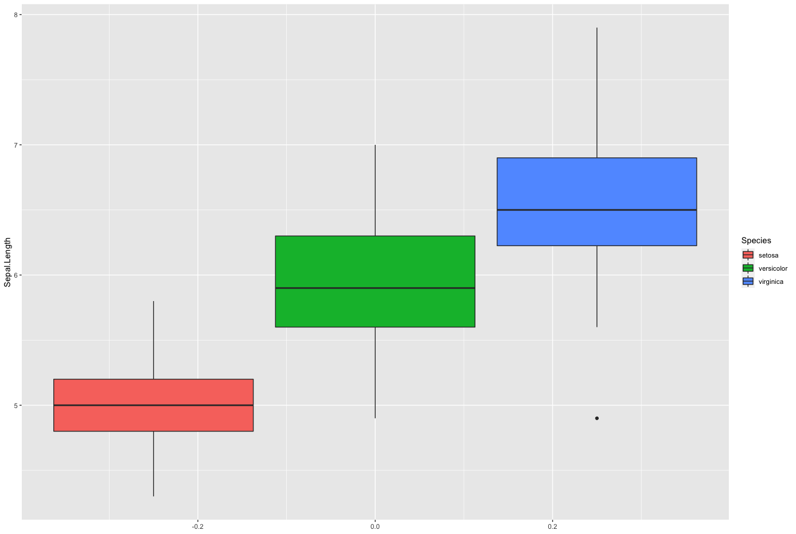
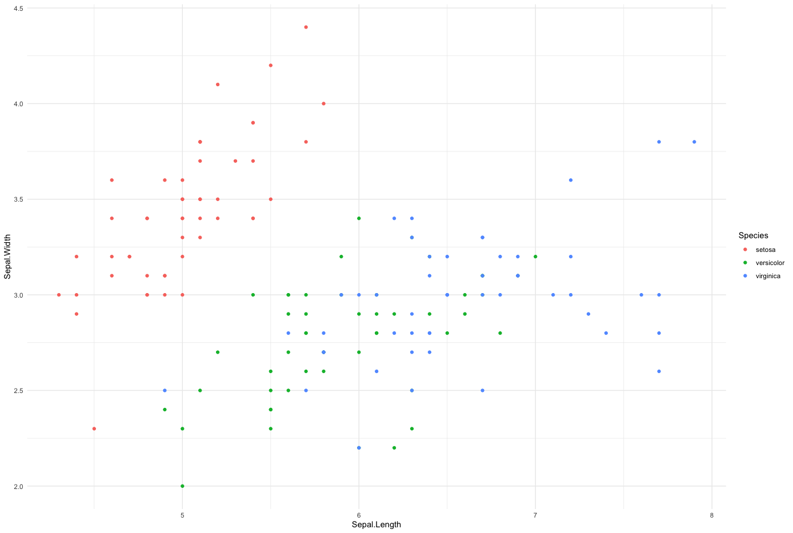

# Tidyverse - ggplot2

* データを可視化するパッケージ
* グラフィックス文法（ The Grammar of Graphics ）を実装している
* `+` 演算子でレイヤーを重ねるようにプログラミングする

https://ggplot2.tidyverse.org/

> 以下のサンプルコードは `library(tidyverse)` あるいは `library(ggplot2)` を実行した後に記述します。

---

## グラフィックス文法

* Themes
  * テーマ
* Coorinates
  * 座標系
* Statistics
  * 統計変換
* Facets
  * グラフの分割表示（ファセットの設定）
* Geometries
  * 幾何オブジェクト
* Aesthetics
  * エステティック属性
* Data
  * 表示データの設定

---

## ggplot2の基本的な使い方

### Data - 表示データの設定

* `ggplot` 関数で出力するデータを受け取る
* `+` 演算子でレイヤーを重ねる
* `geom_point` 関数で散布図を出力する

```r
ggplot(data = iris) +
  geom_point(mapping = aes(x = Sepal.Length, y = Sepal.Width))
```

#### 実行結果




#### 参考：名前付き引数の省略

> Rの引数の名前を省略すると以下のように実装できます。

```r
ggplot(iris) +
  geom_point(aes(Sepal.Length, Sepal.Width))
```

---
### エステティック属性 - Aesthetics

* `aes` 関数でx軸、y軸に表示するデータをマッピングできる
* プロットのカラーやサイズ、スタイルなどをカスタマイズできる
* `aes` 関数の引数 `color` に指定した列の値によって色付けされる

```r
ggplot(iris) +
  geom_point(aes(Sepal.Length, Sepal.Width, color = Species))
```

#### 実行結果



---

### 幾何オブジェクト - Geometries

* `geom_` で始まる関数で幾何オブジェクト（グラフ）を表示できる
* `geom_point` 関数は散布図を表示する 
* `geom_smooth` 関数は回帰直線を表示できる

```r
ggplot(iris) +
  geom_point(aes(Sepal.Length, Sepal.Width, color = Species)) +
  geom_smooth(aes(Sepal.Length, Sepal.Width, color = Species),
              method = "lm",
              se = F)
```

#### 実行結果




#### 参考 - ggplot関数にaes関数を利用する

> `ggplot` 関数の引数に `aes` 関数を指定するとグラフ全体に対してエステティック属性を定義できます。

```r
ggplot(iris, aes(Sepal.Length, Sepal.Width, color = Species)) +
  geom_point() +
  geom_smooth(method = "lm", se = F)
```

---

### グラフの分割（ファセットの指定） - Facets

* `facet_wrap` 関数を使えばプロット（グラフの表示）を分割できる
* `facet_wrap` 関数の引数に分割対象とする列を指定する
* `facet_wrap` 関数の引数には `~` formulaを指定する

> `~` はRの特有の演算子です。後で学習する回帰式の定義などに利用します。

```r
ggplot(iris, aes(Sepal.Length, Sepal.Width, color = Species)) +
  geom_point() +
  facet_wrap( ~ Species)
```

#### 実行結果



---

### 統計変換 - Statistics

* ヒストグラムや棒グラフではデータの個数を算出する必要がある
* グラフ表示のために新たな値を算出することを統計変換という
* `geom_` 関数は `stat` 引数を受け取ることで統計変換を指定できる


```r
ggplot(iris, aes(Sepal.Length, fill = Species)) +
  geom_histogram(stat = "bin")
```

> `geom_histogram` 関数において `stat = "bin"` によって階級に含まれるデータ数がカウントされます。`geom_histogram` 関数の引数 `stat = "bin"` はデフォルトであるため省略可能です。


#### 実行結果



#### 参考 - stat引数の変更

> `geom_histogram` 関数において `stat = "count"` とすると同じ値のデータ数がカウントされます。

```r
ggplot(iris, aes(Sepal.Length, fill = Species)) +
  geom_histogram(stat = "count")
```

---

### 座標系 - Coorinates

* `coord_flip` 関数でx軸とy軸を入れ替えることができる

```r
ggplot(iris, aes(Sepal.Length, fill = Species)) +
  geom_boxplot() + 
  coord_flip()
```

#### 実行結果



> `coord_flip()` を削除すると横向きの箱ひげ図が表示されます。

---


### テーマ - Themes

* `theme_` 関数によってグラフのテーマを変更できる
* `theme_minimal` 関数は最小限のテーマを設定する
* 他にも`theme_gray` 、`theme_classic` 関数など様々な関数が用意されている

```r
ggplot(iris, aes(Sepal.Length, Sepal.Width, color = Species)) +
  geom_point() +
  theme_minimal()
```

#### 実行結果



---

### その他の設定

* `labs` 関数によってグラフのラベルを指定できる
* `xlabs` 関数、 `ylabs` 関数によってx軸、y軸のラベルを指定できる
* `xlim` 関数、 `ylim` 関数にx軸、y軸に表示する範囲を指定できる

```r
ggplot(iris, aes(Sepal.Length, Sepal.Width, color = Species)) +
  geom_point() +
  labs(title = "Iris scatter plot") +
  xlab("sepal - length") +
  ylab("sepal - width") +
  xlim(0, 10) +
  ylim(0, 10)
```

#### 実行結果


