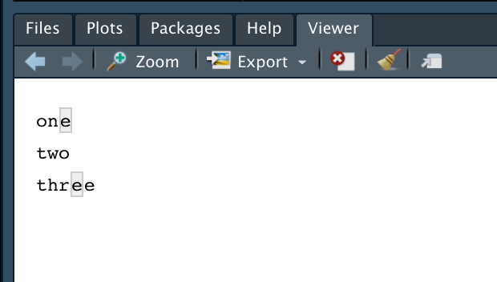

# Tidyverse - stringr

* 文字列操作を拡張するパッケージ
* `str_` で始まる文字列関数を提供する
* 高速な文字列操作ライブラリである `stringi` パッケージのラッパーとして動作する

https://stringr.tidyverse.org/

> 以下のサンプルコードは `library(tidyverse)` あるいは `library(stringr)` を実行した後に記述します。

---

## 主要な文字列操作

|カテゴリー|関数名|処理内容|
|:--|:--|:--|
|文字列桁数|str_length|文字列の長さを取得する|
|部分文字列|str_sub|部分文字列を取得する|
|パターン検出|str_detect|文字列パターンを検出する|
|文字列変換|str_replace|文字列を変換する|
|文字列結合・分割|str_c|文字列を連結する|
|文字列ソート|str_sort|文字列ベクトルをソートする|
|ヘルパー|str_view|文字列パターンマッチングを可視化する|

> 参考： https://github.com/rstudio/cheatsheets/blob/master/strings.pdf

---

## 文字列桁数

### str_length - 文字列の長さを取得する

* `str_length` 関数は第1引数で受け取った文字列ベクトルの要素について、文字列桁数を返却する

```r
x <- c("one", "two", "three")
str_length(x)
```

#### 実行結果

```r
> x <- c("one", "two", "three")
> str_length(x)
[1] 3 3 5
```

---

### 参考：文字列桁数を制御する関数

* str_pad - 文字列の桁数を埋める
* str_trim - 文字列からホワイトスペース（空白、タブ文字、改行コードなど）を削除する

```r
x <- c("one", "two", "three")
str_pad(x, 5, side = "right", pad="_")
x <- c("one ", " two", " three ")
str_trim(x)
```

#### 実行結果

```r
> x <- c("one", "two", "three")
> str_pad(x, 5, side = "right", pad="_")
[1] "one__" "two__" "three"
> x <- c("one ", " two", " three ")
> str_trim(x)
[1] "one"   "two"   "three"
```

---

## 部分文字列

### str_sub - 部分文字列を取得する

* `str_sub` 関数は第1引数に文字列ベクトル、第2引数に開始文字位置、第3引数に終了文字位置を指定する
* 第3引数を省略した場合は、後続の文字列すべてが対象となる
* 第2引数にマイナス値を指定すると開始文字位置を後ろから指定できる

```r
x <- c("one", "two", "three")
str_sub(x, 2, 3)
str_sub(x, 2)
str_sub(x, -2)
```

#### 実行結果

```r
> x <- c("one", "two", "three")
> str_sub(x, 2, 3)
[1] "ne" "wo" "hr"
> str_sub(x, 2)
[1] "ne"   "wo"   "hree"
> str_sub(x, -2)
[1] "ne" "wo" "ee"
```

---

## パターン検出

### str_detect - 文字列パターンを検出する

* `str_detect` 関数は第1引数に文字列ベクトル、第2引数に探索対象の文字列パターンを指定する
* 第2引数には正規表現パターンを指定できる

```r
x <- c("one", "two", "three")
str_detect(x, "e")
str_detect(x, "^o")
str_detect(x, "o$")
str_detect(x, "e{2}")
```

#### 実行結果

```r
> x <- c("one", "two", "three")
> str_detect(x, "e")
[1]  TRUE FALSE  TRUE
> str_detect(x, "^o")
[1]  TRUE FALSE FALSE
> str_detect(x, "o$")
[1] FALSE  TRUE FALSE
> str_detect(x, "e{2}")
[1] FALSE FALSE  TRUE
```

### 参考：パターン検出を制御する関数

* `str_which` 関数は対象文字列ベクトルの要素について、指定した文字列パターンを含むものの要素番号を返却する
* `str_count` 関数は対象文字列ベクトルの要素について、指定した文字列パターンの登場回数を返却する

```r
str_which(x, "e")
str_count(x, "e")
```

#### 実行結果

```r
> str_which(x, "e")
[1] 1 3
> str_count(x, "e")
[1] 1 0 2
```

---

## 文字列変換

### str_replace - 文字列を変換する

* `str_replace` 関数は第1引数に文字列ベクトル、第2引数に変換前文字列、第3引数に変換後文字列を指定する
* 第2引数、第3引数に正規表現パターンを指定できる

```r
x <- c("one", "two", "three")
str_replace(x, "e", "E")
str_replace(x, "^.", "X")
```

#### 実行結果

```r
> x <- c("one", "two", "three")
> str_replace(x, "e", "E")
[1] "onE"   "two"   "thrEe"
> str_replace(x, "^.", "X")
[1] "Xne"   "Xwo"   "Xhree"
```

---

### 参考：文字列変換を制御する関数

* `str_replace_all` 関数は第2引数に指定した文字列パターンに合致するすべての文字を変換する

```r
x <- c("one", "two", "three")
str_replace_all(x, "e", "E")
```

#### 実行結果

```r
> x <- c("one", "two", "three")
> str_replace_all(x, "e", "E")
[1] "onE"   "two"   "thrEE"
```

> `str_replace_all` 関数による `three` の変換結果が `thrEE` となっている点を確認しておきましょう。 `str_replace` 関数の場合は `thrEe` となります。

---

## 文字列結合・分割

### str_c - 文字列を連結する

* `str_c` 関数は1つ以上の文字列ベクトルを受け取り、1つの文字列に連結して返却する
* `sep` 引数に区切り文字を指定する
* `collapse` 引数を指定するとベクトルを平坦化（フラット化）できる

```r
str_c("one", "two")
str_c("one", "two", sep = ",")
str_c(c("one", "two"), "three")
str_c(c("one", "two"), c("three", "four"))
str_c(c("one", "two"), c("three", "four"), sep = ",", collapse = "-")
```

#### 実行結果

```r
> str_c("one", "two")
[1] "onetwo"
> str_c("one", "two", sep = ",")
[1] "one,two"
> str_c(c("one", "two"), "three")
[1] "onethree" "twothree"
> str_c(c("one", "two"), c("three", "four"))
[1] "onethree" "twofour" 
> str_c(c("one", "two"), c("three", "four"), sep = ",", collapse = "-")
[1] "one,three-two,four"
```

---

### 参考：文字列を分割する関数

* `str_split` 関数は1つ以上の文字列ベクトルを受け取り、指定された文字列パターンでベクトルを分解する
* `pattern` 引数に文字列パターンを指定する
* `simplify `引数にTRUEを指定すると戻り値がmatrix型になる（デフォルトのFALSEの場合、戻り値はlist型となる）

```r
str_split(c("one,two", "three,four"), pattern = ",")
str_split(c("one,two", "three,four"), pattern = ",", simplify = T)
```

#### 実行結果

```r
> str_split(c("one,two", "three,four"), pattern = ",")
[[1]]
[1] "one" "two"

[[2]]
[1] "three" "four" 

> str_split(c("one,two", "three,four"), pattern = ",", simplify = T)
     [,1]    [,2]  
[1,] "one"   "two" 
[2,] "three" "four"
```

---

## 文字列ソート

### str_sort - 文字列ベクトルをソートする

* `str_sort` 関数は文字列ベクトルをソートする
* `descreasing` 引数に `TRUE` を指定すると降順にソートできる
* `numeric` 引数に `TRUE` を指定すると数値の大小でソートできる（デフォルトは辞書順）

```r
x <- c("B", "A", "C")
str_sort(x)
str_sort(x, decreasing = T)
x <- c("10", "2", "3")
str_sort(x)
str_sort(x, numeric = T)
```

#### 実行結果

```r
> x <- c("B", "A", "C")
> str_sort(x)
[1] "A" "B" "C"
> str_sort(x, decreasing = T)
[1] "C" "B" "A"
> x <- c("10", "2", "3")
> str_sort(x)
[1] "10" "2"  "3" 
> str_sort(x, numeric = T)
[1] "2"  "3"  "10"
```

---


### 参考：文字列ベクトルのソートを制御する関数

* `str_order` 関数は文字列ベクトルのソート順序を返却する

```r
x <- c("B", "A", "C")
str_order(x)
str_order(x, decreasing = T)
x <- c("10", "2", "3")
str_order(x)
str_order(x, numeric = T)
```

#### 実行結果

```r
> x <- c("B", "A", "C")
> str_order(x)
[1] 2 1 3
> str_order(x, decreasing = T)
[1] 3 1 2
> x <- c("10", "2", "3")
> str_order(x)
[1] 1 2 3
> str_order(x, numeric = T)
[1] 2 3 1
```

---

## ヘルパー

### str_view - 文字列パターンマッチングを可視化する

* `str_view` 関数は文字列パターンマッチングの結果をビューワで表示する

```r
x <- c("one", "two", "three")
str_view(x, "e")
```

#### 実行結果

```r
> x <- c("one", "two", "three")
> str_view(x, "e")
```



> `str_view_all` 関数を使えばすべてのパターンマッチを表示できます。


---
