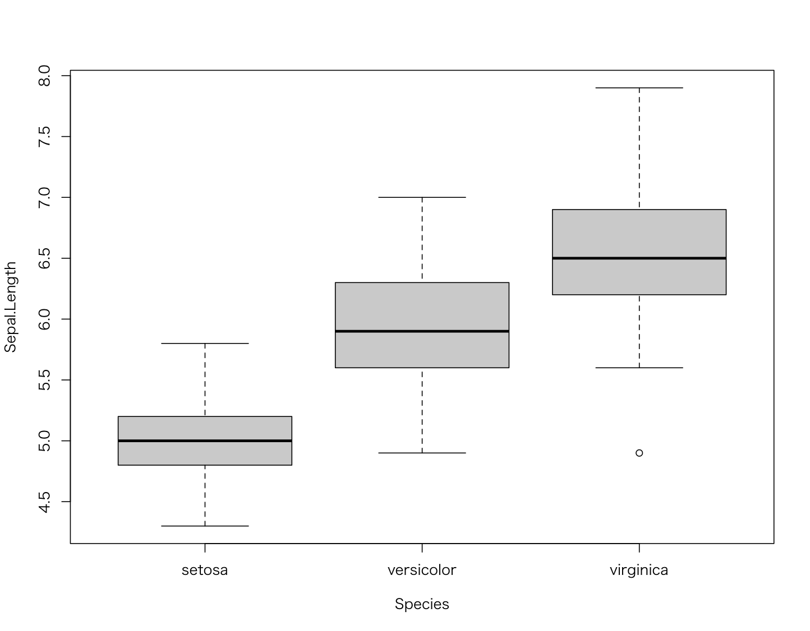
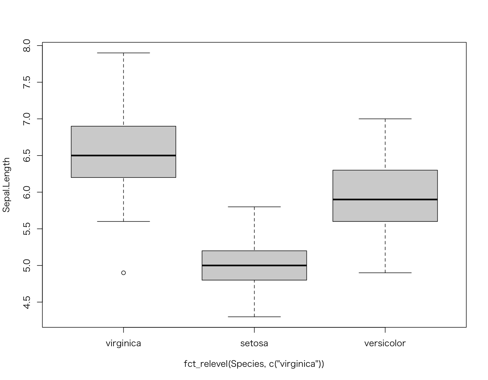

# Tidyverse - forcats

* ファクターの操作を拡張するパッケージ
* `fct_` で始まるファクター操作関数を提供する
* グラフ描画時にカテゴリカルデータの表示順を変更する場合などに利用する

https://forcats.tidyverse.org/

> 以下のサンプルコードは `library(tidyverse)` あるいは `library(forcats)` を実行した後に記述します。

---

## 主要なファクター操作

|カテゴリー|関数名|処理内容|
|:--|:--|:--|
|`levels` の変更 |fct_relevel|`levels` を明示的に変更する|
|`levels` の変更 |fct_infreq|`levels` を頻度（出現回数）順に変更する|
|`levels` の変更 |fct_inorder|`levels` を登場順に変更する|
|`levels` の変更 |fct_rev|`levels` を逆順に変更する|
|`levels` の変更 |fct_shift|`levels` をシフトする（左右にずらす）|
|`levels` の変更 |fct_shuffle|`levels` をシャッフルする|
|`levels` の追加 |fct_expand|`levels`に新たな値を追加する|
|未使用`levels`の削除 |fct_drop|未使用の`levels`を削除する|
| ファクター表示ラベルの変更 |fct_recode|ファクターの表示ラベルを変更する|
| ファクターの連結|fct_c|2つのファクターを連結する|
| ファクター要素のカウント |fct_count|ファクターの要素の頻度（出現回数）を表示する|
| ファクター要素の探索 |fct_match|指定した値でファクターの要素の探索する|
| ファクター要素の重複排除 |fct_unique|重複のないファクターを取得する|

> 参考： https://raw.githubusercontent.com/rstudio/cheatsheets/master/pngs/thumbnails/forcats-cheatsheet-thumbs.png

---

## `levels` の変更

### fct_relevel - `levels` を明示的に変更する

* `fct_relevel` 関数は第1引数にファクター、第2引数に `levels` を指定する
* 第2引数の `levels` にはすべての値を指定せずに、先頭に表示したい値だけを指定することもできる
* 既存のファクターの `levels` を明示的に変更したい場合に利用する

```r
color <- factor(c("red", "yellow", "yellow", "red", "green")
                  , levels = c("red", "green", "yellow"))
color
fct_relevel(color, c("yellow", "green", "red"))
```

#### 実行結果

```r
> color <- factor(c("red", "yellow", "yellow", "red", "green")
+                   , levels = c("red", "green", "yellow"))
> color
[1] red    yellow yellow red    green 
Levels: red green yellow
> fct_relevel(color, c("yellow", "green", "red"))
[1] red    yellow yellow red    green 
Levels: yellow green red
```

---

### fct_infreq - `levels` を頻度（出現回数）順に変更する

* `fct_infreq` 関数は第1引数に指定したファクターの `levels` を頻度（出現回数）順に変更する

```r
fct_infreq(color)
```

#### 実行結果

```r
> fct_infreq(color)
[1] red    yellow yellow red    green 
Levels: red yellow green
```

> `red` は2回、`yellow` も2回、`green` は1回だけ出現しているため、上記のような並び順になります。

---

### fct_inorder - `levels` を登場順に変更する

* `fct_inorder` 関数は第1引数に指定したファクターの `levels` を登場順に変更する

```r
fct_inorder(color)
```

#### 実行結果

```r
> fct_inorder(color)
[1] red    yellow yellow red    green 
Levels: red yellow green
```

---

### fct_rev - `levels` を逆順に変更する

* `fct_rev` 関数は第1引数に指定したファクターの `levels` を逆順に変更する

```r
fct_rev(color)
```

#### 実行結果

```r
> fct_rev(color)
[1] red    yellow yellow red    green 
Levels: yellow green red
```

---

### fct_shift- `levels` をシフトする

* `fct_shift` 関数は第1引数に指定したファクターの `levels` をシフトする（左に1つずらす）
* `fct_shift` 関数は第2引数（`n`）にシフトする要素数を指定できる
* `fct_shift` 関数は第2引数（`n`）にマイナス値を指定すると右にシフトできる

```r
fct_shift(color)
fct_shift(color, n = 2)
fct_shift(color, n = -1)
```

#### 実行結果

```r
> fct_shift(color)
[1] red    yellow yellow red    green 
Levels: green yellow red
> fct_shift(color, n = 2)
[1] red    yellow yellow red    green 
Levels: yellow red green
> fct_shift(color, n = -1)
[1] red    yellow yellow red    green 
Levels: yellow red green
```

> `red`、`green`、`yellow` のファクターをシフトしている様子を確認できます。

---

### fct_shuffle - `levels` をシャッフルする

* `fct_shuffle` 関数は第1引数に指定したファクターの `levels` をシャッフルする

```r
fct_shuffle(color)
```

#### 実行結果

```r
> fct_shuffle(color)
[1] red    yellow yellow red    green 
Levels: yellow red green
```

> 実行するごとに結果は変化します。

---

## `levels` の追加

### fct_expand - `levels` に新たな値を追加する

* `fct_expand` 関数は第1引数に指定したファクターの `levels` に第2引数で指定した値を追加する

```r
color2 <- fct_expand(color, "blue")
color2
```

#### 実行結果

```r
> color2 <- fct_expand(color, "blue")
> color2
[1] red    yellow yellow red    green 
Levels: red green yellow blue
```

> `fct_expand(color, "blue", "purple")` のように複数の値を追加することもできます。

---

## 未使用`levels` の削除

### fct_drop - 未使用のファクター要素を削除する

* `fct_drop` 関数は第1引数に指定したファクターから未使用の `levels` を削除する

```r
fct_drop(color2)
```

#### 実行結果

```r
> fct_drop(color2)
[1] red    yellow yellow red    green 
Levels: red green yellow
```

> 以前に追加した `blue` が削除されていることを確認します。

---

## ファクター表示ラベルの変更

### fct_recode - ファクターの表示ラベルを変更する

* `fct_decode` 関数は第1引数に指定したファクターについて、第2引数以降に指定した名前付き引数で表示ラベルを変更する

```r
fct_recode(color,
           r = "red",
           g = "green",
           y = "yellow")
```

#### 実行結果

```r
> fct_recode(color,
+            r = "red",
+            g = "green",
+            y = "yellow")
[1] r y y r g
Levels: r g y
```

---

## ファクターの連結

### fct_c - 2つのファクターを連結する

* `fct_c` 関数は第1引数に指定したファクターに第2引数で指定したファクターを連結する

```r
color3 <- factor(c("red", "green"))
color4 <- factor(c("red", "yellow"))
fct_c(color3, color4)
```

#### 実行結果

```r
> color3 <- factor(c("red", "green"))
> color4 <- factor(c("red", "yellow"))
> fct_c(color3, color4)
[1] red    green  red    yellow
Levels: green red yellow
```

---

## ファクター要素のカウント

### fct_count - ファクターの要素の頻度（出現回数）を表示する

* `fct_count` 関数は第1引数に指定したファクターの要素の頻度を表示する
* `fct_count` 関数は戻り値をtibbleオブジェクトで返す

```r
fct_count(color)
```

#### 実行結果

```r
> fct_count(color)
# A tibble: 3 x 2
  f          n
  <fct>  <int>
1 red        2
2 green      1
3 yellow     2
```

---

## ファクター要素の探索

### fct_match - 指定した値でファクターの要素の探索する

* `fct_match` 関数は第1引数に指定したファクターについて、第2引数で指定した値を探索する
* `fct_match` 関数は戻り値に論理値ベクトルを返す（該当するデータはTRUE）

```r
fct_match(color, "red")
```

#### 実行結果

```r
> fct_match(color, "red")
[1]  TRUE FALSE FALSE  TRUE FALSE
```

---

## ファクター要素の重複排除

### fct_unique - 重複のないファクターを取得する

* `fct_unique` 関数は第1引数に指定したファクターについて、重複を排除した結果を返す

```r
fct_unique(color)
```

#### 実行結果

```r
> fct_unique(color)
[1] red    green  yellow
Levels: red green yellow
```

---

## ファクター変更の利用例

### irisデータ

* irisデータの `Species` 列はファクター型で定義されている
* Speciesを基準にグラフを描画するとファクターの `levels` の順で表示される

```r
str(iris)
boxplot(data = iris, Sepal.Length ~ Species)
```

> `boxplot` 関数の第2引数では `~` 演算子を利用しています。`~` 演算子は左右に値をとります。ここでは左側にY軸の項目、右側にX軸の項目を指定しています。

#### 実行結果

```r
> str(iris)
'data.frame':	150 obs. of  5 variables:
 $ Sepal.Length: num  5.1 4.9 4.7 4.6 5 5.4 4.6 5 4.4 4.9 ...
 $ Sepal.Width : num  3.5 3 3.2 3.1 3.6 3.9 3.4 3.4 2.9 3.1 ...
 $ Petal.Length: num  1.4 1.4 1.3 1.5 1.4 1.7 1.4 1.5 1.4 1.5 ...
 $ Petal.Width : num  0.2 0.2 0.2 0.2 0.2 0.4 0.3 0.2 0.2 0.1 ...
 $ Species     : Factor w/ 3 levels "setosa","versicolor",..: 1 1 1 1 1 1 1 1 1 1 ...
> boxplot(data = iris, Sepal.Length ~ Species)
```

> `Species` はファクターであり `setosa`、`versicolor`、`virginica` の順になっています。そのためグラフは以下のように表示されます。



### ファクター（ `levels` ）の変更

* `fct_relevel` 関数等を使ってファクターの `levels` をカスタマイズするとグラフの表示順序が変化する

```r
boxplot(data = iris, Sepal.Length ~ fct_relevel(Species, c("virginica")))
```


#### 実行結果

```
> boxplot(data = iris, Sepal.Length ~ fct_relevel(Species, c("virginica")))
```

