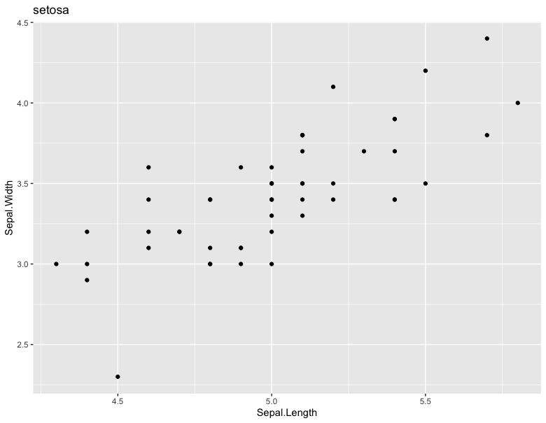
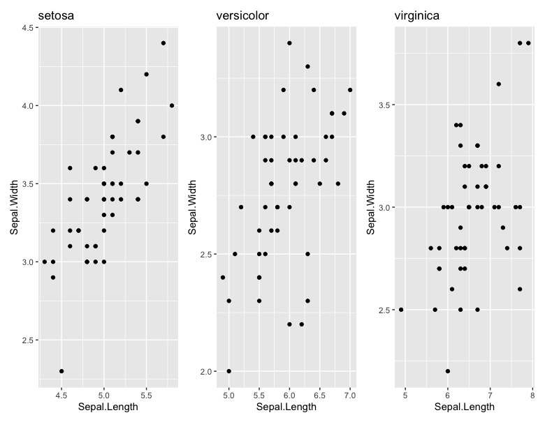
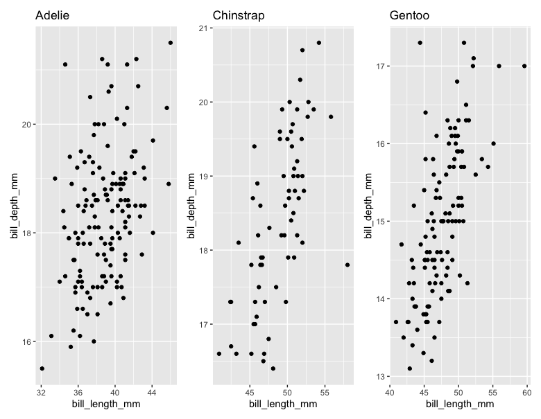

# エクササイズ - Tidyverseの実践2

## No.1

+ iris データセットから Sepal.Length、Speal.Width列の平均値を出したい

```r
iris %>% 
  as_tibble() %>% 
  select(1, 2) %>% 
  mutate(
    sl_mean = mean(Sepal.Length),
    sw_mean = mean(Sepal.Width)
  )
```

### 実行結果

```r
> iris %>% 
+   as_tibble() %>% 
+   select(1, 2) %>% 
+   mutate(
+     sl_mean = mean(Sepal.Length),
+     sw_mean = mean(Sepal.Width)
+   )
# A tibble: 150 × 4
   Sepal.Length Sepal.Width sl_mean sw_mean
          <dbl>       <dbl>   <dbl>   <dbl>
 1          5.1         3.5    5.84    3.06
 2          4.9         3      5.84    3.06
 3          4.7         3.2    5.84    3.06
 4          4.6         3.1    5.84    3.06
 5          5           3.6    5.84    3.06
 6          5.4         3.9    5.84    3.06
 7          4.6         3.4    5.84    3.06
 8          5           3.4    5.84    3.06
 9          4.4         2.9    5.84    3.06
10          4.9         3.1    5.84    3.06
# … with 140 more rows
```

> Sepal.Length列の平均値は5.84、Speal.Width列の平均値は3.06であることがわかります。

---

## No.2

+ iris データセットから 行単位で Sepal.Length、Speal.Width列の平均値を出したい
+ たとえば、先頭行は (5.1 + 3.5) / 2 = 4.3 のように出力したい
+ 以下は失敗するケース

```r
iris %>% 
  as_tibble() %>% 
  select(1, 2) %>% 
  mutate(
    s_mean = mean(c(Sepal.Length, Sepal.Width)),
  )
```

### 実行結果

```r
> iris %>% 
+   as_tibble() %>% 
+   select(1, 2) %>% 
+   mutate(
+     s_mean = mean(c(Sepal.Length, Sepal.Width)),
+   )
# A tibble: 150 × 3
   Sepal.Length Sepal.Width s_mean
          <dbl>       <dbl>  <dbl>
 1          5.1         3.5   4.45
 2          4.9         3     4.45
 3          4.7         3.2   4.45
 4          4.6         3.1   4.45
 5          5           3.6   4.45
 6          5.4         3.9   4.45
 7          4.6         3.4   4.45
 8          5           3.4   4.45
 9          4.4         2.9   4.45
10          4.9         3.1   4.45
# … with 140 more rows
```

> s_mean 列には `4.45` と繰り返し出力されてしまうのがわかります。そうではなく、行単位で平均値を求める場合は次のように実装します。

---

## No.3

+ iris データセットから 行単位で Sepal.Length、Speal.Width列の平均値を出したい
+ たとえば、先頭行は (5.1 + 3.5) / 2 = 4.3 のように出力したい
+ 以下は mean 関数を使わずに Sepal.Lengthベクトル、Sepal.Widthベクトルを演算子で解く方法

```r
iris %>% 
  as_tibble() %>% 
  select(1, 2) %>% 
  mutate(
    s_mean = (Sepal.Length + Sepal.Width) / 2
  )
```

### 実行結果

```r
> iris %>% 
+   as_tibble() %>% 
+   select(1, 2) %>% 
+   mutate(
+     s_mean = (Sepal.Length + Sepal.Width) / 2
+   )
# A tibble: 150 × 3
   Sepal.Length Sepal.Width s_mean
          <dbl>       <dbl>  <dbl>
 1          5.1         3.5   4.3 
 2          4.9         3     3.95
 3          4.7         3.2   3.95
 4          4.6         3.1   3.85
 5          5           3.6   4.3 
 6          5.4         3.9   4.65
 7          4.6         3.4   4   
 8          5           3.4   4.2 
 9          4.4         2.9   3.65
10          4.9         3.1   4   
# … with 140 more rows
```

> 期待値どおり出力されているが、次は mean 関数を使って処理したい

---

## No.4

+ dplyr::rowwise関数によって、行単位での処理が可能となる
+ rowwiseを実行すると実行結果に「# Rowwise:」と表示される

```r
iris %>% 
  as_tibble() %>% 
  select(1, 2) %>% 
  rowwise() %>% 
  mutate(
    s_mean = mean(c(Sepal.Length, Sepal.Width))
  )
```

### 実行結果

```r
> iris %>% 
+   as_tibble() %>% 
+   select(1, 2) %>% 
+   rowwise() %>% 
+   mutate(
+     s_mean = mean(c(Sepal.Length, Sepal.Width))
+   )
# A tibble: 150 × 3
# Rowwise: 
   Sepal.Length Sepal.Width s_mean
          <dbl>       <dbl>  <dbl>
 1          5.1         3.5   4.3 
 2          4.9         3     3.95
 3          4.7         3.2   3.95
 4          4.6         3.1   3.85
 5          5           3.6   4.3 
 6          5.4         3.9   4.65
 7          4.6         3.4   4   
 8          5           3.4   4.2 
 9          4.4         2.9   3.65
10          4.9         3.1   4   
# … with 140 more rows
```

> 実行結果に「# Rowwise: 」を確認できます。

---

## No.5

+ dplyr::group_nest関数はデータセット（表データ）をネストできる
+ group_nest関数はグループ化する列を引数にとる
+ 後述するdplyr::nest_byとよく似ているが、group_nest関数はデータセットをネストするだけのシンプルな関数（nest_by関数は group_nest関数の結果にrowwiseを適用する）

```r
iris %>% 
  as_tibble() %>% 
  group_nest(Species)
```

### 実行結果

```r
> iris %>% 
+   as_tibble() %>% 
+   group_nest(Species)
# A tibble: 3 × 2
  Species                  data
  <fct>      <list<tibble[,4]>>
1 setosa               [50 × 4]
2 versicolor           [50 × 4]
3 virginica            [50 × 4]
```

> 実行結果にdata列が追加されており、data列の各項目にネストした表が生成されています。

---

## No.6

+ dplyr::pluck 関数の第1引数に列名を指定して、データセットから列を指定して取り出す
+ pluck関数は第2引数にインデックス（行番号）を指定できる（ネストしたデータセットにアクセスできる）
+ 以下のプログラムはネストしたデータセット（Speciesが "setosa"）にアクセスしている

```r
iris %>% 
  as_tibble() %>% 
  group_nest(Species) %>% 
  pluck("data", 1)
```

### 実行結果

```r
> iris %>% 
+   as_tibble() %>% 
+   group_nest(Species) %>% 
+   pluck("data", 1)
# A tibble: 50 × 4
   Sepal.Length Sepal.Width Petal.Length Petal.Width
          <dbl>       <dbl>        <dbl>       <dbl>
 1          5.1         3.5          1.4         0.2
 2          4.9         3            1.4         0.2
 3          4.7         3.2          1.3         0.2
 4          4.6         3.1          1.5         0.2
 5          5           3.6          1.4         0.2
 6          5.4         3.9          1.7         0.4
 7          4.6         3.4          1.4         0.3
 8          5           3.4          1.5         0.2
 9          4.4         2.9          1.4         0.2
10          4.9         3.1          1.5         0.1
# … with 40 more rows
```

> 実行結果には Speciesが "setosa"に該当する 50x4のデータセットが出力されています。

---

## No.7

+ ネストしたデータセットは rowwise関数を使うことで効率よく処理できる
+ 以下のプログラムでは data 列を参照して、ネストしたデータセットのSepal.Length列、Sepal.Width列にアクセスしている

```r
iris %>% 
  as_tibble() %>% 
  group_nest(Species) %>% 
  rowwise() %>% 
  mutate(
    sl_mean = mean(data$Sepal.Length),
    sw_mean = mean(data$Sepal.Width)
  )
```

### 実行結果

```r
> iris %>% 
+   as_tibble() %>% 
+   group_nest(Species) %>% 
+   rowwise() %>% 
+   mutate(
+     sl_mean = mean(data$Sepal.Length),
+     sw_mean = mean(data$Sepal.Width)
+   )
# A tibble: 3 × 4
# Rowwise: 
  Species                  data sl_mean sw_mean
  <fct>      <list<tibble[,4]>>   <dbl>   <dbl>
1 setosa               [50 × 4]    5.01    3.43
2 versicolor           [50 × 4]    5.94    2.77
3 virginica            [50 × 4]    6.59    2.97
```

> irisデータセットの Species ごとに Sepal.Length列、Sepal.Width列の平均値を出力しています。

---

## No.8

+ group_nest関数とrowwise関数を組み合わせることで、ネストしたデータセットを効率よく処理できる
+ nest_by関数を使えば、group_nest関数とrowwise関数をの呼び出しをまとめることができる

```r
iris %>% 
  as_tibble() %>% 
  nest_by(Species) %>% 
  mutate(
    sl_mean = mean(data$Sepal.Length),
    sw_mean = mean(data$Sepal.Width)
  )
```

### 実行結果

```r
> iris %>% 
+   as_tibble() %>% 
+   nest_by(Species) %>% 
+   mutate(
+     sl_mean = mean(data$Sepal.Length),
+     sw_mean = mean(data$Sepal.Width)
+   )
# A tibble: 3 × 4
# Rowwise:  Species
  Species                  data sl_mean sw_mean
  <fct>      <list<tibble[,4]>>   <dbl>   <dbl>
1 setosa               [50 × 4]    5.01    3.43
2 versicolor           [50 × 4]    5.94    2.77
3 virginica            [50 × 4]    6.59    2.97
```

> 実行結果は No.7 と同じです。

---

## No.9

+ データセットであるtibbleオブジェクトにはグラフを格納することもできる
+ ただし関数オブジェクトのような特殊なオブジェクトは、listオブジェクトで包含する必要がある
+ 以下のコードでは ネストしたデータセットのSepal.Length列、Sepal.Width列を使って散布図を作成している

```r
iris %>% 
  as_tibble() %>% 
  nest_by(Species) %>% 
  mutate(
    sl_mean = mean(data$Sepal.Length),
    sw_mean = mean(data$Sepal.Width),
    scatter = list((function(df, title) {
      df %>% ggplot(aes(Sepal.Length, Sepal.Width)) +
        geom_point() +
        labs(title = title)
    })(data, Species))
  )
```

> function キーワードを使ってグラフを描画する無名関数を定義して、即時実行しています。

### 実行結果

```r
> iris %>% 
+   as_tibble() %>% 
+   nest_by(Species) %>% 
+   mutate(
+     sl_mean = mean(data$Sepal.Length),
+     sw_mean = mean(data$Sepal.Width),
+     scatter = list((function(df, title) {
+       df %>% ggplot(aes(Sepal.Length, Sepal.Width)) +
+         geom_point() +
+         labs(title = title)
+     })(data, Species))
+   )
# A tibble: 3 × 5
# Rowwise:  Species
  Species                  data sl_mean sw_mean scatter
  <fct>      <list<tibble[,4]>>   <dbl>   <dbl> <list> 
1 setosa               [50 × 4]    5.01    3.43 <gg>   
2 versicolor           [50 × 4]    5.94    2.77 <gg>   
3 virginica            [50 × 4]    6.59    2.97 <gg>   
```

> グラフを格納した scatter列 が格納されています。

---

## No.10

+ ネストしたグラフにはpluck関数でアクセスできる
+ 以下のコードは Speciesが `setosa` の散布図を表示する

```r
iris %>% 
  as_tibble() %>% 
  nest_by(Species) %>% 
  mutate(
    sl_mean = mean(data$Sepal.Length),
    sw_mean = mean(data$Sepal.Width),
    scatter = list((function(df, title) {
      df %>% ggplot(aes(Sepal.Length, Sepal.Width)) +
        geom_point() +
        labs(title = title)
    })(data, Species))
  ) %>% 
  pluck("scatter", 1)
```

### 実行結果

```r
> iris %>% 
+   as_tibble() %>% 
+   nest_by(Species) %>% 
+   mutate(
+     sl_mean = mean(data$Sepal.Length),
+     sw_mean = mean(data$Sepal.Width),
+     scatter = list((function(df, title) {
+       df %>% ggplot(aes(Sepal.Length, Sepal.Width)) +
+         geom_point() +
+         labs(title = title)
+     })(data, Species))
+   ) %>% 
+   pluck("scatter", 1)
```



> 品種（Species）が `setosa` のデータについて、Sepal.Length、Sepal.Widthの散布図を出力しています。


---

## No.11

+ `patchwork` パッケージを使うと複数のグラフをまとめて出力できる
+ patchwork:::wrap_plots関数は引数で受け取ったグラフオブジェクトのベクトルを順に描画する

```r
# install.packages("patchwork")
library(patchwork)
iris %>% 
  as_tibble() %>% 
  nest_by(Species) %>% 
  mutate(
    sl_mean = mean(data$Sepal.Length),
    sw_mean = mean(data$Sepal.Width),
    scatter = list((function(df, title) {
      df %>% ggplot(aes(Sepal.Length, Sepal.Width)) +
        geom_point() +
        labs(title = title)
    })(data, Species))
  ) %>% 
  pluck("scatter") %>% wrap_plots()
```

### 実行結果

```r
> # install.packages("patchwork")
> library(patchwork)
> iris %>% 
+   as_tibble() %>% 
+   nest_by(Species) %>% 
+   mutate(
+     sl_mean = mean(data$Sepal.Length),
+     sw_mean = mean(data$Sepal.Width),
+     scatter = list((function(df, title) {
+       df %>% ggplot(aes(Sepal.Length, Sepal.Width)) +
+         geom_point() +
+         labs(title = title)
+     })(data, Species))
+   ) %>% 
+   pluck("scatter") %>% wrap_plots()
```



> patchworkパッケージを使って品種（Species）ごとの散布図を出力しています。

---

## エクササイズ

+ 以下の手順で `palmerpenguins` データセットを準備します。

```r
install.packages("palmerpenguins")
library(palmerpenguins)
pgs <- na.omit(penguins)
pgs
```

### Ex1

* Tidyverseを使って次の実行結果のとおり出力してください。

```
# A tibble: 333 × 3
# Rowwise: 
   bill_length_mm bill_depth_mm bill_mean
            <dbl>         <dbl>     <dbl>
 1           39.1          18.7      28.9
 2           39.5          17.4      28.4
 3           40.3          18        29.2
 4           36.7          19.3      28  
 5           39.3          20.6      30.0
 6           38.9          17.8      28.4
 7           39.2          19.6      29.4
 8           41.1          17.6      29.4
 9           38.6          21.2      29.9
10           34.6          21.1      27.8
# … with 323 more rows
```

> pgs データセットのbill_length_mmとbill_depth_mm 列の平均値を出力しています。

---

### Ex2

* Tidyverseを使って次の実行結果のとおり出力してください。

```r
# A tibble: 3 × 6
# Rowwise:  species
  species                 data bill_length_mean bill_depth_mean bill_length_sd bill_depth_sd
  <fct>     <list<tibble[,7]>>            <dbl>           <dbl>          <dbl>         <dbl>
1 Adelie             [146 × 7]             38.8            18.3           2.66         1.22 
2 Chinstrap           [68 × 7]             48.8            18.4           3.34         1.14 
3 Gentoo             [119 × 7]             47.6            15.0           3.11         0.986
```

> 品種（species）ごとにネストした表を作成して、それぞれの表から、bill_length_mm、bill_depth_mmの平均値と標準偏差を出力しています。

---

### Ex3

* Tidyverseを使って次の実行結果のとおり出力してください。



> 品種（species）ごとにネストした表を作成して、それぞれの表から、bill_length_mm、bill_depth_mmの散布図を出力しています。グラフはpatchworkを使って出力します。

---

<!-- 

library(palmerpenguins)
pgs <- na.omit(penguins)
pgs

# 1
pgs %>% 
  select(bill_length_mm, bill_depth_mm) %>% 
  rowwise() %>% 
  mutate(
    bill_mean = mean(c(bill_length_mm, bill_depth_mm))
  )

# 2
pgs %>% 
  nest_by(species) %>% 
  mutate(
    bill_length_mean = mean(data$bill_length_mm),
    bill_depth_mean = mean(data$bill_depth_mm),
    bill_length_sd = sd(data$bill_length_mm),
    bill_depth_sd = sd(data$bill_depth_mm)
  )

# 3
pgs %>% 
  nest_by(species) %>% 
  mutate(
    bill_length_mean = mean(data$bill_length_mm),
    bill_depth_mean = mean(data$bill_depth_mm),
    bill_length_sd = sd(data$bill_length_mm),
    bill_depth_sd = sd(data$bill_depth_mm),
    scatter = list(
      (function(df, title) {
        df %>% ggplot(aes(bill_length_mm, bill_depth_mm)) +
          geom_point() +
          labs(title = title)
      })(data, species)
    )
  ) %>% 
  pluck("scatter") %>% wrap_plots()

-->