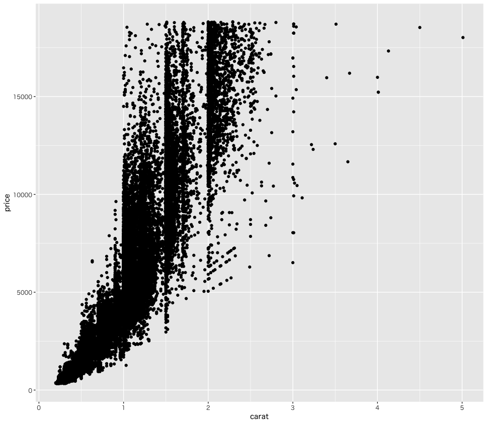

# エクササイズ - Tidyverseの実践3

## diamonds データセット

https://ggplot2.tidyverse.org/reference/diamonds.html

```r
> diamonds
# A tibble: 53,940 × 10
   carat cut       color clarity depth table price     x     y     z
   <dbl> <ord>     <ord> <ord>   <dbl> <dbl> <int> <dbl> <dbl> <dbl>
 1  0.23 Ideal     E     SI2      61.5    55   326  3.95  3.98  2.43
 2  0.21 Premium   E     SI1      59.8    61   326  3.89  3.84  2.31
 3  0.23 Good      E     VS1      56.9    65   327  4.05  4.07  2.31
 4  0.29 Premium   I     VS2      62.4    58   334  4.2   4.23  2.63
 5  0.31 Good      J     SI2      63.3    58   335  4.34  4.35  2.75
 6  0.24 Very Good J     VVS2     62.8    57   336  3.94  3.96  2.48
 7  0.24 Very Good I     VVS1     62.3    57   336  3.95  3.98  2.47
 8  0.26 Very Good H     SI1      61.9    55   337  4.07  4.11  2.53
 9  0.22 Fair      E     VS2      65.1    61   337  3.87  3.78  2.49
10  0.23 Very Good H     VS1      59.4    61   338  4     4.05  2.39
# … with 53,930 more rows
> str(diamonds)
tibble [53,940 × 10] (S3: tbl_df/tbl/data.frame)
 $ carat  : num [1:53940] 0.23 0.21 0.23 0.29 0.31 0.24 0.24 0.26 0.22 0.23 ...
 $ cut    : Ord.factor w/ 5 levels "Fair"<"Good"<..: 5 4 2 4 2 3 3 3 1 3 ...
 $ color  : Ord.factor w/ 7 levels "D"<"E"<"F"<"G"<..: 2 2 2 6 7 7 6 5 2 5 ...
 $ clarity: Ord.factor w/ 8 levels "I1"<"SI2"<"SI1"<..: 2 3 5 4 2 6 7 3 4 5 ...
 $ depth  : num [1:53940] 61.5 59.8 56.9 62.4 63.3 62.8 62.3 61.9 65.1 59.4 ...
 $ table  : num [1:53940] 55 61 65 58 58 57 57 55 61 61 ...
 $ price  : int [1:53940] 326 326 327 334 335 336 336 337 337 338 ...
 $ x      : num [1:53940] 3.95 3.89 4.05 4.2 4.34 3.94 3.95 4.07 3.87 4 ...
 $ y      : num [1:53940] 3.98 3.84 4.07 4.23 4.35 3.96 3.98 4.11 3.78 4.05 ...
 $ z      : num [1:53940] 2.43 2.31 2.31 2.63 2.75 2.48 2.47 2.53 2.49 2.39 ...
```

---

## No.1

以下の要件にしたがってグラフを出力してください。

* `price` 列のヒストグラムを出力します。ヒストグラムのビン数は30（ggplotのデフォルト）とします。


### 実行結果


---

## No.2

以下の要件にしたがってグラフを出力してください。

* `0.5 carat` 未満のデータを抽出します。
* `price` 列のヒストグラムを出力します。ヒストグラムのビン数は30（ggplotのデフォルト）とします。

### 実行結果


---

## No.3

以下の要件にしたがってグラフを出力してください。

* `0.5 carat` 未満のデータを抽出します。
* `clarity` 列ごとの `price` 列の箱ひげ図を出力します。

### 実行結果


---

## No.4

以下の要件にしたがってグラフを出力してください。

* `0.5 carat` 未満のデータを抽出します。
* `clarity` 列ごとの `price` 列の箱ひげ図を出力します。
  * `clarity` の表示順序を No.3 と逆順にします。

### 実行結果


---

## No.5

以下の要件にしたがってグラフを出力してください。

* `0.5 carat` 未満のデータを抽出します。
* `clarity` 列ごとの `price` 列の箱ひげ図を出力します。
  * `clarity` の表示順序の先頭を `IF` とします。以降はデフォルトの順序とします。

### 実行結果


---

## No.6

以下の要件にしたがってグラフを出力してください。

* `carat` 列と `price` 列の散布図を出力します。

### 実行結果



---

## No.7

以下の要件にしたがってグラフを出力してください。

* `carat` 列と `price` 列の散布図を出力します。
  * `cut` 列によって色を変更します。

### 実行結果


> ヒント： `aes` 関数の引数に `color = cut` を追加します。

---

## No.8

以下の要件にしたがってグラフを出力してください。

* `cut` 列の値を `Fair` あるいは `Premium` に限定します。
* `carat` 列と `price` 列の散布図を出力します。
  * `cut` 列によって色を変更します。

### 実行結果


---

## No.9

以下の要件にしたがってグラフを出力してください。

* `carat` 列と `price` 列の散布図を出力します。
  * `cut` 列によってグラフを分けて出力します。

> グラフは `patchwork` パッケージを使って出力します。

### 実行結果


### ヒント

```r
library(patchwork)

diamonds %>% 
  nest_by(cut) %>% 
  mutate(
    glaph = list((function(df, title) {
      # TODO
    })(data, cut))
  ) %>% 
  pluck("glaph") %>% 
  wrap_plots()
```

> `nest_by` 関数によってデータセットをネストしてから処理します。

---

<!-- 

# 0
diamonds
str(diamonds)

# 1
diamonds %>% 
  ggplot(aes(price)) +
  geom_histogram(bins = 30)

# 2
diamonds %>% 
  filter(carat < 0.5) %>% 
  ggplot(aes(price)) +
  geom_histogram(bins = 30)

# 3
diamonds %>% 
  filter(carat < 0.5) %>% 
  ggplot(aes(clarity, price)) +
  geom_boxplot()

# 4
diamonds %>% 
  filter(carat < 0.5) %>% 
  ggplot(aes(fct_rev(clarity), price)) +
  geom_boxplot()

# 5
diamonds %>% 
  filter(carat < 0.5) %>% 
  ggplot(aes(fct_relevel(clarity, c("IF")), price)) +
  geom_boxplot()

# 6
diamonds %>% 
  ggplot(aes(carat, price)) +
  geom_point()
  
# 7
diamonds %>% 
  ggplot(aes(carat, price, color = cut)) +
  geom_point()

# 8
diamonds %>% 
  filter(cut == "Fair" | cut == "Premium") %>% 
  ggplot(aes(carat, price, color = cut)) +
  geom_point()

# 9
library(patchwork)
diamonds %>% 
  nest_by(cut) %>% 
  mutate(
    glaph = list((function(df, title) {
      df %>% 
        ggplot(aes(carat, price)) +
        geom_point() +
        labs(title = title)
    })(data, cut))
  ) %>% 
  pluck("glaph") %>% 
  wrap_plots()

# 10
diamonds %>% 
  filter(carat < 0.5) %>% 
  nest_by(cut) %>% 
  mutate(
    glaph = list((function(df, title) {
      df %>% 
        ggplot(aes(clarity, price)) +
        geom_boxplot() + 
        labs(title = title)
    })(data, cut))
  ) %>% 
  pluck("glaph") %>% 
  wrap_plots()

-->