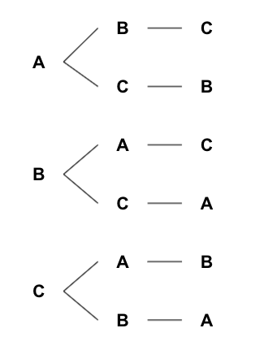
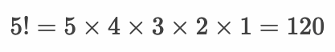
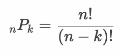
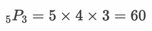
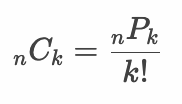
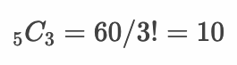

# 場合の数

* 「サイコロの出目は6通り」のように、ある事柄の起こりうるケースの総数を場合の数という
* 場合の数は数え上げることが基本となる
* 階乗・順列・組み合わせについて理解する

---

## 樹形図

* 場合の数を考えるときの基本的な考え方は数え上げること
* 実際に樹形図に書き出すと良い

### 例：Aさん、Bさん、Cさんの並べ方は何通りあるか



---

## 階乗（Factorial）

* ある正の整数 n について、nから1までの値の積（n\*(n-1)\*(n-2)..\*2\*1）を階乗という
* 階乗は ! 記号を使って記述する
* 階乗によって n 個のデータの並び順が何通りあるかを計算できる

> 3! = 3 * 2 * 1 = 6 となります。また 0! は 1 として考えます。

### 例：1〜5までの5枚のカードがある。カードの並べ方は全部で何通りあるか。




---

## 順列（Permutation）

* 異なる n 個のデータから r 個 取り出して1列に並べたもの（その総数）を順列という
* 順列は P 記号を使って記述する



### 例：1〜5までの5枚のカードがある。3枚のカードを取り出す場合、カードの並べ方は全部で何通りあるか。

```
5P3 = 5 * 4 * 3 = 60とおり
```



---

## 組み合わせ(Combination)

* 異なる n 個のデータから r 個 取り出したものを組み合わせという
* 組み合わせは順列とは異なり、並び順は考慮しない
* 組み合わせは C 記号を使って記述する



### 例：1〜5までの5枚のカードがある。3枚のカードを取り出す場合、カードの並べ方は全部で何通りあるか。ただし、カードの並び順は考慮しないものとする。



---

## Rプログラミング

### 階乗

* `factorial` 関数によって階乗を算出できる

```r
n <- 5
factorial(n)
```

#### 実行結果

```r
> n <- 5
> factorial(n)
[1] 120
```

---

### 順列

* Rの標準には順列を求める関数は用意されていないが `factorial` 関数を使って解くことができる

```r
n <- 5
k <- 3
factorial(n) / factorial(n - k)
```

#### 実行結果

```r
> n <- 5
> k <- 3
> factorial(n) / factorial(n - k)
[1] 60
```

* 総乗 を求める `prod` 関数で順列を求めることもできる 

```r
n <- 5
k <- 3
x <- (n - k + 1):n
prod(x)
```

> 総乗とはΣのようにベクトルの要素すべてを掛け算したものです。

#### 実行結果

```r
> n <- 5
> k <- 3
> x <- (n - k + 1):n
> prod(x)
[1] 60
```
---

### 組み合わせ

* `choose` 関数によって組み合わせの総数を算出できる

```r
n <- 5
k <- 3
choose(n, k)
```

#### 実行結果

```r
> n <- 5
> k <- 3
> choose(n, k)
[1] 10
```

* `combn` 関数によって組み合わせそのものを算出できる

```r
combn(1:5, 3)
```

#### 実行結果

```r
> combn(1:5, 3)
     [,1] [,2] [,3] [,4] [,5] [,6] [,7] [,8] [,9] [,10]
[1,]    1    1    1    1    1    1    2    2    2     3
[2,]    2    2    2    3    3    4    3    3    4     4
[3,]    3    4    5    4    5    5    4    5    5     5
```

* `factorial` 関数によって組み合わせの総数を求める場合は以下のようになる

```r
n <- 5
k <- 3
(factorial(n) / factorial(n - k)) / factorial(k)
```

#### 実行結果

```r
> n <- 5
> k <- 3
> (factorial(n) / factorial(n - k)) / factorial(k)
[1] 
```


---

## エクササイズ

1. 「ABCD」の4文字を並び替えるとき、全部で何通りの並び方が存在するか調べてください。

1. 「ABCD」の4文字から2文字を選んで並び替えるとき、全部で何通りの並び方が存在するか調べてください。

1. 「ABCD」の4文字から2文字を選ぶとき、全部で何通り取り出し方が存在するか調べてください。ただし、文字の並び順は考慮しないものとします。

1. トランプでスペードのカード13枚を用意します。用意した13枚のカードを1枚ずつ順に取り出した場合、何通りの並び方が存在するか調べてください。

1. トランプのカード（ジョーカーを除く52枚）から5枚のカードを取り出す。取り出したカードの並び順は何通りあるか調べてください。

1. トランプのカード（ジョーカーを除く52枚）から5枚のカードを取り出す。取り出したカードの組み合わせは何通りあるか調べてください。

1. サイコロを3回振り、1回目のサイコロの出た目を100の位、2回目のサイコロの出た目を10の位、3回目のサイコロの出た目を1の位としたとき、全部で何通りの数値が存在するか調べてください。

1. トランプのカード（ジョーカーを除く52枚）から5枚のカードを取り出す。取り出したカードの並び順は何通りあるか調べてください。ただし、カードを1枚取り出す度に、取り出したカードをトランプの山に戻して、シャッフルするもとします。

1. 「ABCC」の4文字を並び替えるとき、全部で何通りの並び方が存在するか調べてください。


<!--


1. 「ABCD」の4文字を並び替えるとき、全部で何通りの並び方が存在するか調べてください。

factorial(4)
24とおり

1. 「ABCD」の4文字から2文字を選んで並び替えるとき、全部で何通りの並び方が存在するか調べてください。

n <- 4
k <- 2
factorial(n) / factorial(n - k)
12とおり

1. 「ABCD」の4文字から2文字を選ぶとき、全部で何通り取り出し方が存在するか調べてください。ただし、文字の並び順は考慮しないものとします。

n <- 4
k <- 2
choose(n, k)
6とおり

1. トランプでスペードのカード13枚を用意します。用意した13枚のカードを1枚ずつ順に取り出した場合、何通りの並び方が存在するか調べてください。

> factorial(13)
[1] 6227020800

1. トランプのカード（ジョーカーを除く52枚）から5枚のカードを取り出す。取り出したカードの並び順は何通りあるか。

> n <- 52
> k <- 5
> factorial(n) / factorial(n - k)
[1] 311875200

1. トランプのカード（ジョーカーを除く52枚）から5枚のカードを取り出す。取り出したカードの組み合わせは何通りあるか。

> n <- 52
> k <- 5
> choose(n, k)
[1] 2598960

1. サイコロを3回振り、1回目のサイコロの出た目を100の位、2回目のサイコロの出た目を10の位、3回目のサイコロの出た目を1の位としたとき、全部で何通りの数値が存在するか調べてください。

6^3
216通り

1. トランプのカード（ジョーカーを除く52枚）から5枚のカードを取り出す。取り出したカードの並び順は何通りあるか調べてください。ただし、カードを1枚取り出す度に、取り出したカードをトランプの山に戻して、シャッフルするもとします。

> 52^5
[1] 380204032

1. 「ABCC」の4文字を並び替えるとき、全部で何通りの並び方が存在するか調べてください。

樹形図を考えると良い
12とおり
あるいは以下のように計算することもできる
4!/1!*1!*2! = 12

-->