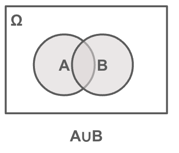
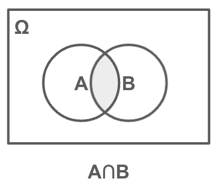
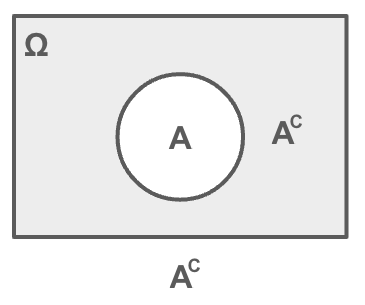
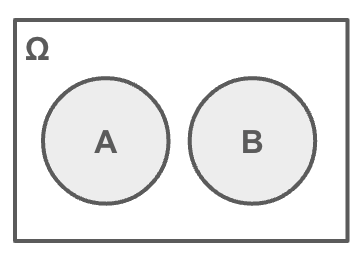
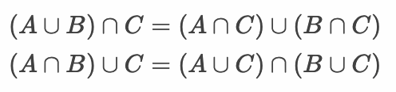
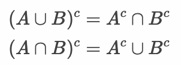

# 標本空間と事象

* 確率の考え方を理解するために試行や事象といった専門用語を理解する

> コイン投げやサイコロといった簡単なゲームを通じて確率の解説します。

---

## 試行と標本空間

* 試行(trial)
    * ランダムな状況下での実験（手順・操作）
* 標本点(sample point): ω
    * 試行によって得られる結果
* 標本空間(sample space): Ω
    * 標本点の全体の集合

> 標本点をω、標本空間をΩで表現することもあります。また標本空間は事象空間（event space）と呼ばれることもあります。

### 具体例

例：サイコロを1回振る場合

* 試行
    * サイコロを1回降る
* 標本空間
    * 1, 2, 3, 4, 5, 6
* 上記の結果の一つひとつが標本点となる

---

## 事象

* 事象(event)
    * 標本空間の部分集合
* 空事象(empty event)：Φ
    * 空の事象（標本点を1つも持たない）
* 全事象：Ω
    * すべての事象（標本空間）

> 事象は複数の標本点で構成されるとも言えます。事象は `{}` の中に標本点を定義します。

### 具体例

* サイコロを1回振って奇数がでる事象
    * {1, 3, 5}
* サイコロを1回振って3以下の数値がでる事象
    * {1, 2, 3}
* サイコロを1回振って奇数かつ、3以下の数値がでる事象
    * {1, 3}

---

## 根元事象と複合事象

* 根元事象(elementary event)
    * 1つの標本点からなる分割不可能な事象
* 複合事象(composit event)
    * 複数の標本点からなる分割可能な事象

### 具体例

* サイコロを1回振って1が出る事象（根元事象）
    * {1}
* サイコロを1回振って3以下の数値がでる事象（複合事象）
    * {1, 2, 3}

---

## 事象の演算とベン図

### 和事象(union of events)



#### 具体例

* サイコロを1回振って
    * 偶数がでる事象A =  {2, 4, 6}
    * 3以下の数値がでる事象B = {1, 2, 3}
    * A∪B = {1, 2, 3, 4, 6}

### 積事象(intersection of events)



#### 具体例

* サイコロを1回振って
    * 偶数がでる事象A =  {2, 4, 6}
    * 3以下の数値がでる事象B = {1, 2, 3}
    * A∩B = {2}

### 補事象(complementary event)



#### 具体例

* サイコロを1回振って
    * 偶数がでる事象A =  {2, 4, 6}
    * Aの補事象 = {1, 3, 5}

### 排反事象(disjoint event)



#### 具体例

* サイコロを1回振って
    * 1が出る事象A = {1}
    * 2が出る事象B = {2}
    * 事象Aと事象Bは排反事象である
        * A∩B = Φ
        * A∪B = A + B

---

## 分配法則

3つの事象A、B、Cにおいて以下の分配法則が成立する



---


## ドモルガンの法則

事象A、Bの和事象、事象A、Bの積事象については以下のドモルガンの法則が成立する



---

## エクササイズ

### 設問1

 「2枚のコイン投げ」という試行において表をT、裏をFとしたとき、標本空間を以下のように定義しました。

```
Ω = {(T, T), (T, F), (F, T), (F, F)}
```

このとき、少なくとも1回は表が出る事象Aを以下のように定義します。

```
A = {(T, T), (T, F), (F, T)}
```

以下の設問に答えてください。

* 少なくとも1回は裏が出る事象Bを求めてください。
* 表が2回でる事象Cを求めてください。
* 事象A、B、Cの中から2つを選んだとき、排反事象となる組み合わせはどれか。
* 事象Aの補事象を求めてください。
* 同様に「3枚のコイン投げ」において表をT、裏をFとしたときの標本空間を定義してください。

---

### 設問2

「2つのサイコロを投げる」という試行の標本空間Ωを以下のように定義しました。

```
(1, 1) (1, 2) (1, 3) (1, 4) (1, 5) (1, 6)
(2, 1) (2, 2) (2, 3) (2, 4) (2, 5) (2, 6)
(3, 1) (3, 2) (3, 3) (3, 4) (3, 5) (3, 6)
(4, 1) (4, 2) (4, 3) (4, 4) (4, 5) (4, 6)
(5, 1) (5, 2) (5, 3) (5, 4) (5, 5) (5, 6)
(6, 1) (6, 2) (6, 3) (6, 4) (6, 5) (6, 6)
```

このとき、少なくとも1回は1が出る事象Aを以下のように定義します。

```
A = {(1, 1) (1, 2) (1, 3) (1, 4) (1, 5) (1, 6), (2, 1), (3, 1), (4, 1), (5, 1), (6, 1)}
```

以下の設問に答えてください。

1. 2つのサイコロを投げた結果の合計が7になる事象Bを求めてください。
2. 事象Aと事象Bの積事象（A∩B）を求めてください。
3. 事象Aと事象Bの和事象（A∪B）を求めてください。
4. "事象Aの補事象"と"事象Bの補事象"の積事象（Ac∩Bc）を求めてください。
5. "事象Aの補事象"と"事象Bの補事象"の和事象（Ac∪Bc）を求めてください。

> 4, 5 についてはドモルガンの法則を使って考えてみましょう。


<!-- 

* 少なくとも1回は裏が出る事象Bを求めてください。

```
B = {(T, F), (F, T), (F, F)}
```

* 表が2回でる事象Cを求めてください。

```
C = {(T, T)}
```

* 事象A、B、Cの中から2つを選んだとき、排反事象となる組み合わせはどれか。

BとC

* 事象Aの補事象を求めてください。

```
A = {(F, F)}
```

* 同様に「3枚のコイン投げ」において表をT、裏をFとしたときの標本空間を定義してください。

```
Ω = {(T, T, T), (T, T, F), (T, F, T), (T, F, F), (F, T, T), (F, T, F), (F, F, T), (F, F, F)}
```


* 2つのサイコロを投げた結果の合計が7になる事象Bを求めてください。

```
B = {(1, 6), (2, 5), (3, 4), (4, 3), (5, 2), (6, 1)}
```

* 事象Aと事象Bの積集合（A∩B）を求めてください。

```
A∩B = {(1, 6), (6, 1)}
```

* 事象Aと事象Bの和集合（A∪B）を求めてください。

```
A∪B = {(1, 1) (1, 2) (1, 3) (1, 4) (1, 5) (1, 6), (2, 1), (3, 1), (4, 1), (5, 1), (6, 1), (2, 5), (3, 4), (4, 3), (5, 2)}
```

* "事象Aの補集合"と"事象Bの補集合"の積集合（Ac∩Bc）を求めてください。

```
Ac∩Bc = (A∪B)c = 
(2, 2) (2, 3) (2, 4) (2, 6)
(3, 2) (3, 3) (3, 5) (3, 6)
(4, 2) (4, 4) (4, 5) (4, 6)
(5, 3) (5, 4) (5, 5) (5, 6)
(6, 2) (6, 3) (6, 4) (6, 5) (6, 6)
```

* "事象Aの補集合"と"事象Bの補集合"の和集合（Ac∪Bc）を求めてください。

```
Ac∪Bc = (A∩B)c = 
(1, 1) (1, 2) (1, 3) (1, 4) (1, 5)
(2, 1) (2, 2) (2, 3) (2, 4) (2, 5) (2, 6)
(3, 1) (3, 2) (3, 3) (3, 4) (3, 5) (3, 6)
(4, 1) (4, 2) (4, 3) (4, 4) (4, 5) (4, 6)
(5, 1) (5, 2) (5, 3) (5, 4) (5, 5) (5, 6)
(6, 2) (6, 3) (6, 4) (6, 5) (6, 6)
```

-->