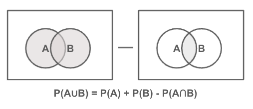
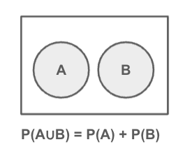

# 加法定理

* 複数の異なる事象について確率を求めることができる
* ここでは和事象の確率 P(A∪B) に関する加法定理について取り上げる
* 加法定理では2つの事象A、Bが排反であるかどうかに注意する

---

## 加法定理

```
事象Aと事象Bが排反事象でない（A∩B ≠ Φ）とき
P(A∪B) = P(A) + P(B) - P(A∩B)
が成り立つ
```



### 具体例

* サイコロを振って3以下の数値が出る事象A
* サイコロを振って奇数が出る事象B

```
事象
A = {1, 2, 3}
B = {1, 3, 5}
```

```
確率
P(A) = 3/6
P(B) = 3/6
P(A∩B) = 2/6
P(A∪B) = 3/6 + 3/6 - 2/6 = 4/6 = 2/3
```

---

### 加法定理 - 事象AとBが排反であるとき

```
事象Aと事象Bが排反事象である（A∩B = Φ）とき 
P(A∪B) = P(A) + P(B)
が成り立つ
```



### 具体例

* サイコロを振って1が出る事象A
* サイコロを振って2が出る事象B

```
事象
A = {1}
B = {2}
```

```
確率
P(A) = 1/6
P(B) = 1/6
P(A∪B) = 1/3
```

---

## エクササイズ

### 設問1 

サイコロ投げの事象A、Bを以下のとおり定義します。

* A: 偶数がでる
* B: 5以上の値である

以下の確率を求めてください。

* P(A)
* P(B)
* P(A∪B)

---

### 設問2 

2つのサイコロ投げの事象A、Bを以下のとおり定義します。

* A: 2つの出目の和が6である
* B: 2つの出目の和が12である

以下の確率を求めてください。

* P(A)
* P(B)
* P(A∪B)

--- 

### 設問3

ジョーカーを除く52枚のトランプから1枚のカードを引いたときの事象A、Bを以下のとおり定義します。

* A: カードの数値が3以下である
* B: カードの種類がハートである

以下の確率を求めてください。

* P(A)
* P(B)
* P(A∪B)

---

### 設問4

ジョーカーを除く52枚のトランプから1枚のカードを引いたときの事象A、Bを以下のとおり定義します。

* A: カードの種類がハートであり、かつ数値が偶数である
* B: カードの種類がクローバーであり、かつ数値が奇数である

以下の確率を求めてください。

* P(A)
* P(B)
* P(A∪B)

<!-- 
### 設問1 

* P(A)
    3/6
* P(B)
    2/6
* P(A∪B)
    4/6
    A∪B = {2,4,5,6}

### 設問2 

* P(A)
    5/36

* P(B)
    1/36
* P(A∪B)
    6/36

### 設問3

* P(A)
    12/52
* P(B)
    13/52
* P(A∪B)
   12/52 + 13/52 - 3/52 = 22/52

### 設問4

* P(A)
    6/52
* P(B)
    7/52
* P(A∪B)
    13/52


-->