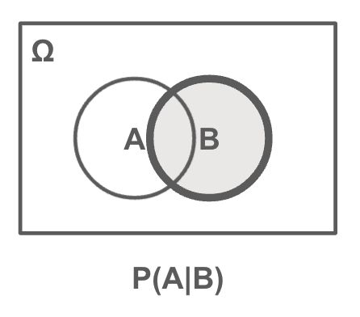

# 条件付き確率と乗法定理

* 和事象の確率を加法定理で導くには積事象の確率を考える必要がある
* ここでは積事象の確率 P(A∩B) に関する乗法定理について取り上げる
* 乗法定理を扱う前に条件付き確率を理解する必要がある

---

## 条件付き確率



```
事象Bが起きたという条件のもとに事象Aが起こる確率を条件付き確率という
P(A|B) = P(A∩B) / P(B)
```

> 条件付き確率は、| を使って表現します。例えば事象Xが起きたという条件のもとに事象Yが起こる確率は `P(Y|X)` と表現します。XとYの書き方の順序に注意してください。

### 具体例

* 事象A: サイコロを振って3以下の数値が出る
* 事象B: サイコロを振って奇数が出る
* A∩B: サイコロを振って3以下の奇数が出る

```
A = {1, 2, 3}
B = {1, 3, 5}
A∩B = {1, 3}

P(A) = 3/6 = 1/2
P(B) = 3/6 = 1/2
P(A∩B) = 2/6 = 1/3

事象Bを条件とした事象Aの条件付き確率
（サイコロを振って奇数が出たことを知ったときの、サイコロの出目が3以下である確率）
P(A|B) = P(A∩B) / P(B) = (1/3) / (1/2) = 2/3
```

---

## 乗法定理

* 条件付き確率は以下のように変形できる（乗法定理） 

```
条件付き確率
P(A|B) = P(A∩B) / P(B)

乗法定理
P(A∩B) = P(B)P(A|B)
```

> `P(A∩B)` は同時確率とも呼ばれます。乗法定理は事象Bの起こる確率 `P(B)` と事象Bを条件とする事象Aの条件付き確率 `P(A|B)` の積で表現できます。

### 具体例

* サイコロを振って3以下の数値が出る(事象A)の確率：P(A)
* サイコロを振って奇数が出る（事象B）の確率：P(B)
* 事象Bを条件とする事象Aの条件付き確率：P(A|B)

```
P(A) = 3/6 = 1/2
P(B) = 3/6 = 1/2
P(A|B) = 2/3 
P(A∩B) = P(B)P(A|B) = 1/2 * 2/3 = 1/3
```

---

## 独立(independent)

* 一部の条件付き確率においては、事象Aの起こる確率が、事象Bの起こる条件に依存しないことがある
* このとき「事象Aと事象Bは独立である」という
* 事象Aと事象Bが独立であるとき、以下の関係が成り立つ

```
P(A|B) = P(A)
```

* また事象Aと事象Bが独立であるとき乗法定理は以下のようになる

```
P(A∩B) = P(B)P(A)
```

> 事象Aと事象Bが独立であるとき、条件付き確率を考える必要がないため、乗法定理はシンプルに確率の積で表現されます。

### 具体例

* サイコロを2回振って、1回目のサイコロが2以下（事象A）であり、2回目のサイコロが5以上（事象B）となる確率

```
A = {1, 2}
B = {5, 6}
P(A) = 2/6 = 1/3
P(B) = 2/6 = 1/3
P(A∩B) = 1/3 * 1/3 = 1/9
```

---

## エクササイズ

### 設問1 

2つのサイコロを振った結果、出た目の合計が4以下になる確率を求めてください。

---

### 設問2 

2つのサイコロを振った結果、出た目の合計が4以下になる確率を求めたい。このとき1つ目のサイコロの出た目が2であった場合の条件付き確率を求めてください。

--- 

### 設問3

ジョーカーを除く52枚のトランプから1枚のカードを引いたとき、以下の事象A、B、A|B の確率を求めてください。

* A: カードの種類がハートである
* B: カードの色が赤色である
* A|B: カードの色が赤色であったとき、そのカードの種類がハートである

> ただし、カードの色とはハートとダイヤは赤色、スペードとクローバーは黒色とします。

---

### 設問4

ジョーカーを除く52枚のトランプから1枚のカードを引いたとき、以下の事象A、B、A|B の確率を求めてください。

* A: カードの数値が3以下である
* B: カードの色が赤色である
* A|B: カードの色が赤色であったとき、そのカードの数値が3以下である

---

<!--

設問1
2つのサイコロの出た目の標本空間（36個の標本点）
(1, 1) (1, 2) (1, 3) (1, 4) (1, 5) (1, 6)
(2, 1) (2, 2) (2, 3) (2, 4) (2, 5) (2, 6)
(3, 1) (3, 2) (3, 3) (3, 4) (3, 5) (3, 6)
(4, 1) (4, 2) (4, 3) (4, 4) (4, 5) (4, 6)
(5, 1) (5, 2) (5, 3) (5, 4) (5, 5) (5, 6)
(6, 1) (6, 2) (6, 3) (6, 4) (6, 5) (6, 6)

2つのサイコロの出た目の合計が4以下になるものは6通り（事象Aとする）
(1, 1) (1, 2) (1, 3) 
(2, 1) (2, 2) 
(3, 1) 

P(A) = 6/36 = 1/6


設問2

1つ目のサイコロの出た目が2（事象Bとする）
(2, 1) (2, 2) (2, 3) (2, 4) (2, 5) (2, 6)
P(B) = 6/36 = 1/6

事象Aと事象Bの積事象（A∩B）
(2, 1) (2, 2)
P(A∩B) = 2/36

事象Bを条件とする事象Aの条件付き確率
P(A|B) = P(A∩B) / P(B) = (2/36) / (1/6) = 12/36 = 1/3


設問3

P(A) = 13/52 = 1/4
P(B) = 26/52 = 1/2
P(A∩B) = 1/4
P(A|B) = (1/4) / (1/2) = 1/2


設問4

P(A) = 12/52 
P(B) = 26/52 = 1/2
P(A∩B) = 6/52
P(A|B) = (6/52) / (1/2) = 12/52 = P(A)
つまり、事象Aと事象Bは独立である
-->
