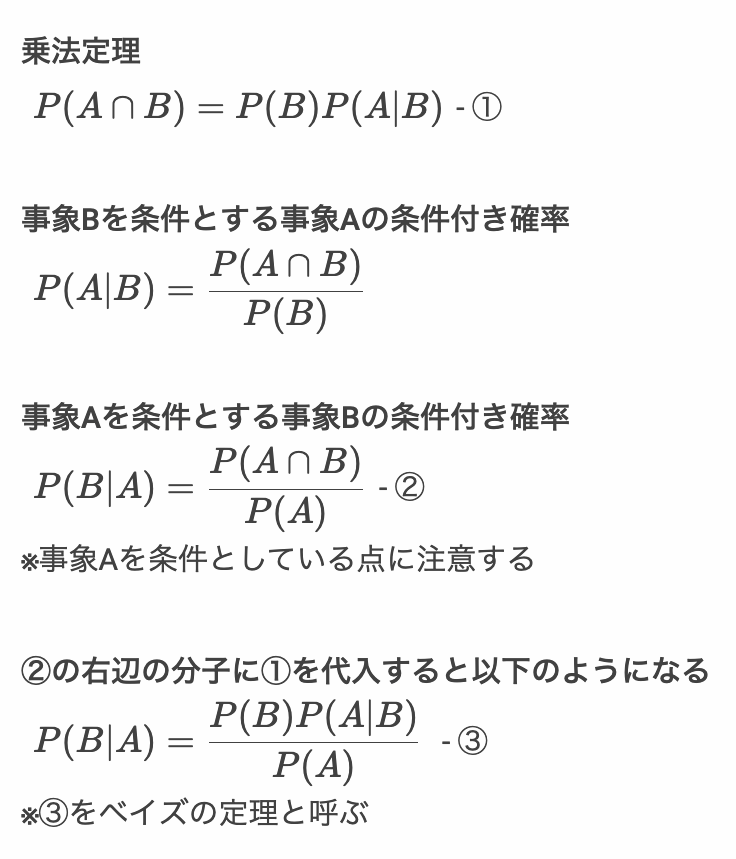
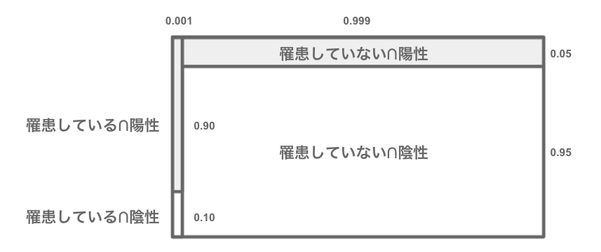
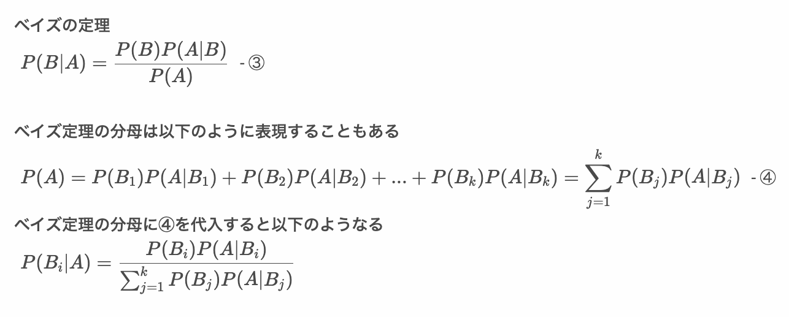
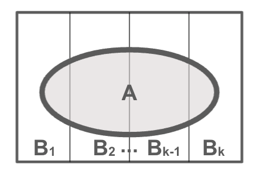
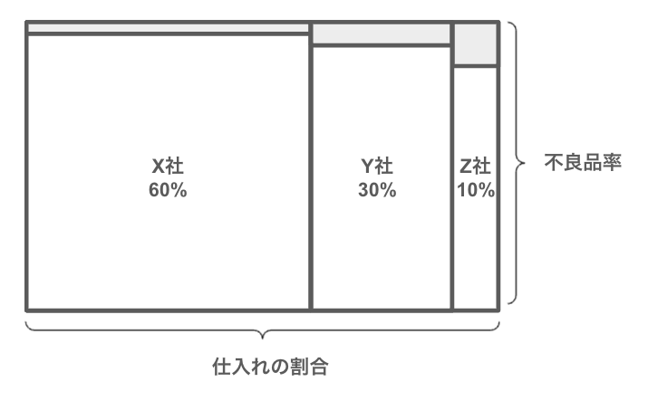

# ベイズの定理

* 事象Bを条件とする事象Aの条件付き確率を P(A|B)とする
* 反対に事象Aが起きたときの原因が事象Bとなる条件付き確率 P(B|A) を知りたいこともある
* 条件付き確率、乗法定理からベイズの定理を導くことができる

> 事象Aを結果、事象Bを原因と考えると、ベイズの定理によって結果から原因の確率を計算できます。

---

## ベイズの定理

* ベイズの定理によって結果から原因の確率を求めることができる



> ③の式は、結果である事象Aを条件に原因となる事象Bの起こる確率を求めています。このとき、右辺には 原因から結果となる確率を求める P(A|B)という条件付き確率が出現します。

> ベイズの定理では③の P(B) を事前確率、 P(B|A) を事後確率と呼びます。

---

### 具体例：ある病気の検査で陽性と判断されたとき、実際に罹患している確率

* ある病気Xにかかる人の確率（罹患率）は0.1%（0.001）とする
* この病気の検査キットは以下の確率で陽性を陰性を判別する

|条件|陽性|陰性|
|:--|--:|--:|
|罹患者|90%|10%|
|非罹患者|5%|95%|

> 病気にかかっている人（罹患者）に検査キットを適用すると90%の確率で陽性と判定されます。この場合、誤って陰性と判定する確率は10%です。同様に、病気にかかっていない人（非罹患者）に検査キットを適用すると95%の確率で陰性と判定されます。この場合、誤って陽性と判定される確率は5%です。

* この検査キットを使って陽性と判定された場合、本当に罹患している確率は以下のとおり

```
事象A：陽性と判定される
事象B：罹患している

陽性と判定される（事象A）の確率 （表より）
P(A) = 0.001 * 0.9 + (1 - 0.001) * 0.05 =  0.05085
罹患している（事象B）の確率 （問題文より）
P(B) = 0.001

罹患している人が陽性と判定される確率 （表より）
P(A|B) = 0.90

（ベイズの定理より）
事象Aという条件のもとで事象Bが発生する確率
（陽性と判断されたという条件のもと、罹患している確率）
P(B|A) = P(B)P(A|B) / P(A) = 0.001 * 0.90 / 0.05085 = 0.017 = 1.7%
```

> ベイズの定理は以下のように図に整理すると考えやすいです。陽性と判定された場合も「罹患している∩陽性」のケースと「罹患していない∩陽性」のケースが存在します。ベイズの定理では分母のP(A)が図の灰色の部分に相当します。同様に分子の部分は「罹患している∩陽性」の部分です。



#### （参考）事前確率と事後確率について

* ベイズの定理では P(B) を事前確率、P(B|A) を事後確率と呼ぶ
* 事前確率とは事象Aが起こる前の確率で、事後確率とは事象Aが起こった後の確率を意味する
* この問題では、事前確率である罹患率は `P(B) = 0.001` であったが、そこに陽性である（`P(A)`）というデータが与えれたことによって確率が更新され、事後確率は `P(B|A) = 0.017` となる

> ベイズの定理では、新たに発生したデータによって事前確率が事後確率に更新されます。

---

## ベイズの定理の分母について

* ベイズの定理は以下のように表現することもある



> ④の式は結果である事象Aの確率です。事象Aの条件であるB1〜Bkまでの条件付き確率の総和です。



---

### 具体例：ある部品が不良品であった場合、その仕入元を予測する確率

* 電子機器Bを生産しているメーカーAでは、必要な部品CをX社、Y社、Z社3つの部品メーカーから仕入れている
* 各社の部品Cの仕入れの割合と不良品率を以下の表に示す
* 手元にある部品Cが不良品であることがわかったとき、その部品がZ社のものである確率を求めよ

|<br>|X社|Y社|Z社|
|:--|:--:|:--:|:--:|
|仕入れの割合|60%|30%|10%|
|不良品率|0.1%|0.5%|1.0%|




```
事象A：不良品である
事象Bx：X社から仕入れた部品Cである
事象By：Y社から仕入れた部品Cである
事象Bz：Z社から仕入れた部品Cである

各社からの仕入れの割合（確率）
P(Bx) = 0.6
P(By) = 0.3
P(Bz) = 0.1

各社の不良品率（確率）
P(A|Bx) = 0.001
P(A|By) = 0.005
P(A|Bz) = 0.010

不良品である確率
P(A) = ΣP(Bj)P(A|Bj) = 0.6 * 0.001 + 0.3 * 0.005 + 0.1 * 0.010 = 0.0031

ベイズの定理より
不良品がZ社のものである確率
P(Bz|A) = P(Bz)P(A|Bz) / P(A) = (0.1 * 0.010) / 0.0031 = 0.3225806
```


---

## エクササイズ

### 設問1

* 迷惑メールをフィルタリングするアルゴリズムを考えている
* 過去のデータから通常のメールと迷惑メールの割合は 9:1 だということがわかっている
* 通常のメールと迷惑メールに、URLが含まれる割合を調査すると以下のようになった

|<br>|URLを含む|URLを含まない|
|:--|:--:|:--:|
|通常のメール|30%|70%|
|迷惑メール|90%|10%|

* また以下のように事象A、事象Bを定義する
  * 事象A：URLを含んでいる
  * 事象B：迷惑メールである

* 問題
  1. P(A)を求めてください。
  1. P(B)を求めてください。
  1. P(A|B)を求めてください。
  1. あるメールがURLを含んでいる場合、そのメールが迷惑メールである確率を求めてください。

--- 

### 設問2

* 引き続き迷惑メールをフィルタリングするアルゴリズムを考えている
* 過去のデータから通常のメールと迷惑メールの割合は 9:1 だということがわかっている
* 通常のメールと迷惑メールに「危険」というキーワードが含まれる割合を調査すると以下のようになった

|<br>|「危険」を含む|「危険」を含まない|
|:--|:--:|:--:|
|通常のメール|2%|98%|
|迷惑メール|60%|40%|

* また以下のように事象A、事象Bを定義する
  * 事象A：「危険」キーワードを含んでいる
  * 事象B：迷惑メールである

* 問題
  1. あるメールが「危険」というキーワードを含んでいる場合、そのメールが迷惑メールである確率を求めてください。

---

### 設問3

* 設問1と設問2の条件から、あるメールがURLと「危険」というキーワードの両方を含んでいる場合、そのメールが迷惑メールである確率を求めてください。

<!--
設問1

P(A) = 0.9 * 0.3 + 0.1 * 0.9 = 0.36
P(B) = 0.1
P(A|B) = 0.9

P(B|A) = P(B)P(A|B) / P(A) = 0.1 * 0.9 / 0.36 = 0.25

設問2
P(A) = 0.9 * 0.02 + 0.1 * 0.6 = 0.078
P(B) = 0.1
P(A|B) = 0.6
P(B|A) = P(B)P(A|B) / P(A) = 0.1 * 0.6 / 0.078 = 0.7692308

設問3
P(A) = 0.75 * 0.02 + 0.25 * 0.6 = 0.165
P(B) = 0.25
P(A|B) = 0.6
P(B|A) = P(B)P(A|B) / P(A) = 0.25 * 0.6 / 0.165 = 0.9090909


# bayes sample code.
bayes <- function (prior_prob, likelihood, marginal_prob) {
  # P(B|A) = P(B)P(A|B) / P(A)
  prior_prob * likelihood / marginal_prob
}

# P(B)
ubnormal_mail_ratio <- 0.1
normal_mail_ratio <- (1 - ubnormal_mail_ratio)

normal_mail_prob <- 0.3
ubnormal_mail_prob <- 0.9

# 事前確率P(B)
prior_prob <- ubnormal_mail_ratio
# 尤度 P(A|B)
likelihood <- ubnormal_mail_prob 
# 周辺確率P(A)
marginal_prob <- normal_mail_ratio * normal_mail_prob + ubnormal_mail_ratio * ubnormal_mail_prob 
# 事後確率P(B|A)
posterior_prob <- bayes(prior_prob, likelihood, marginal_prob)
ubnormal_mail_ratio = posterior_prob
normal_mail_ratio <- (1 - ubnormal_mail_ratio)

normal_mail_prob <- 0.02
ubnormal_mail_prob <- 0.6

# 事前確率P(B)
prior_prob <- ubnormal_mail_ratio
# 尤度 P(A|B)
likelihood <- ubnormal_mail_prob 
# 周辺確率P(A)
marginal_prob <- normal_mail_ratio * normal_mail_prob + ubnormal_mail_ratio * ubnormal_mail_prob 
# 事後確率P(B|A)
posterior_prob <- bayes(prior_prob, likelihood, marginal_prob)
posterior_prob

-->